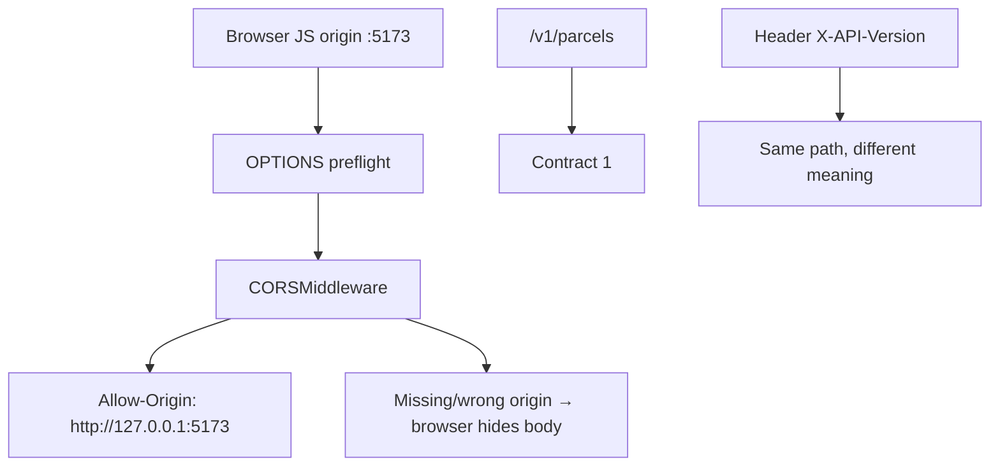

# Month 9 · Week 4 · Day 2
# CORS for Vite, and API Versioning Trade-offs

**Program:** Full-Stack Mastery · 18 months  
**Phase:** 3 — Python and backend  
**Month index:** [../../README.md](../../README.md)  
**Week 4:** [1](day-01.md) · Day 2 (today) · [3](day-03.md) · [4](day-04.md) · [5](day-05.md) · [6](day-06.md) · [7](day-07.md)  
**Week rhythm today:** Learn + type-along  
**Student state:** List queries work. A browser app on **port 5173** will call you on **8000**. That is a **different origin**. Versioning is how you change JSON later without lying to old clients.  
**Study time:** 3–4 focused hours

Labs: `~\fullstack-lab\month-09\week-04\day-02\`.

---

## How to use this textbook

1. Read CORS until you can say why `curl.exe` cannot grade it.  
2. Type CORSMiddleware with **one** origin.  
3. Write the versioning trade-off in your own words **before** mounting `/v1`.  
4. Optional review links are for later rechecking.

---

## How to read this chapter

**Origin** = scheme + host + port. `http://127.0.0.1:5173` ≠ `http://127.0.0.1:8000`. Browsers ask your API: “may this origin read you?” Your **`Access-Control-Allow-Origin`** answers.

**Versioning** = naming a contract so `/parcels` today can become incompatible tomorrow without silently breaking last month’s React.



**Wrong belief:** “I’ll `allow_origins=['*']` so I never think about this.”  
**Correct:** Month 9 gate: *CORS explained; enabled only as much as a local React origin needs.* The exam debug includes **CORS ***.

---

## Today's contract

By the end of this day you will be able to:

1. Define **origin** and **preflight**.  
2. Enable **CORSMiddleware** for `http://127.0.0.1:5173` (and maybe `http://localhost:5173` if you document both — they are **different**).  
3. List methods you actually use.  
4. Explain **path versioning** (`/v1`) vs **header versioning**.  
5. Mount today’s API under `/v1` **or** write why you postpone it until Project 6A — but you must **choose in writing**.  
6. Not confuse CORS with auth.

**Today's gate.** Closed-book:

> Different ports are different origins. CORS is a browser check. I allow 5173 explicitly. Path `/v1` is simple and visible; headers keep URLs pretty and make caches and proxies harder. I can name one cost of each.

---

## Time box

| Block | Minutes | Work |
|---|---|---|
| A | 50 | Theory |
| B | 55 | Type-along: CORS + OPTIONS |
| C | 70 | Independent: /v1 mount + VERSION.md |
| D | 20 | Git |
| E | 15 | Recall |

---

# Block A — Theory

## 1. Same-origin policy (what you need)

A script on origin A fetching origin B is **cross-origin**. The **browser** will expose the response to JS only if B’s headers permit A.

`curl.exe`, httpx, TestClient, PowerShell: **no such check**. They always see the body. Students “fix CORS” by testing with curl and shipping `*`.

**Simple requests** vs **preflight:** some GET/POST with certain content types go without OPTIONS. `application/json` POST typically **preflights**: browser sends `OPTIONS` with `Access-Control-Request-Method` and `Access-Control-Request-Headers`. FastAPI CORSMiddleware handles OPTIONS if added.

---

## 2. CORSMiddleware settings

```python
from fastapi.middleware.cors import CORSMiddleware

origins = [
    "http://127.0.0.1:5173",
    "http://localhost:5173",
]

app.add_middleware(
    CORSMiddleware,
    allow_origins=origins,
    allow_credentials=False,
    allow_methods=["GET", "POST", "PUT", "PATCH", "DELETE", "OPTIONS"],
    allow_headers=["*"],
)
```

| Knob | This course |
|---|---|
| `allow_origins` | Explicit local Vite. Not `*` |
| `allow_credentials` | False unless you know cookies; then **cannot** use `*` |
| `allow_methods` | The verbs you implement, plus OPTIONS |
| `allow_headers` | `*` is common in lab; you can list `Content-Type`, `Authorization` |

`localhost` vs `127.0.0.1`: if Vite is on `localhost` and you only allow `127.0.0.1`, the browser **fails**. Put **both** in the list if you use both, or pick one in README (“always open Vite as 127.0.0.1”).

**Wrong belief:** “I’ll allow `http://localhost:5173/**` wildcards.”  
**Correct:** CORSMiddleware takes **origins**, not path globs. No trailing slash on the origin.

---

## 3. Seeing CORS without a full React app

You do not need Project 4 running. Two options:

1. A 5-line `index.html` served somehow on 5173 — heavy.  
2. Inspect **headers** on a real response:

```powershell
curl.exe -s -D - -H "Origin: http://127.0.0.1:5173" -H "Access-Control-Request-Method: POST" -X OPTIONS http://127.0.0.1:8000/v1/health -o NUL
```

Look for `Access-Control-Allow-Origin: http://127.0.0.1:5173`. Repeat with `Origin: http://evil.example` — should **not** echo evil if you did not allow it.

TestClient can send the same headers; it **will not** hide the body. You still assert the **Allow-Origin** header. That is an HTTP test of middleware, not a browser test.

---

## 4. Versioning: why bother

You will change JSON. Without a version, every client must update **atomically**. With a version, `/v1/parcels` can stay while `/v2/parcels` adds a required field.

This month you may only have **v1**. The skill is **the trade-off**, not running two complete APIs.

---

## 5. Path prefix `/v1`

```python
app.include_router(parcels_router, prefix="/v1")
```

If the router already has `prefix="/parcels"`, public path is `/v1/parcels`.

| Pros | Cons |
|---|---|
| Visible in logs, bookmarks, OpenAPI | URLs change; “which version?” is obvious |
| Easy routing | Copy-paste v2 later or share routers with care |
| Caches key on URL | Ugly to some tastes |

Health: `/health` unversioned (load balancers) **and/or** `/v1/health`. Document.

---

## 6. Header versioning

Example: `Accept: application/json; version=1` or `X-API-Version: 1`. Same path `/parcels`.

| Pros | Cons |
|---|---|
| Stable URLs | Invisible in the address bar |
| | Proxies and CDNs may strip headers |
| | OpenAPI / Try-it is clumsier |
| | Forgetting the header → surprise default |

**Wrong belief:** “I’ll support both `/v1` and headers for professionalism.”  
**Correct:** two schemes is **two** bugs. Pick **path `/v1`** for Project 6A unless you write a strong reason otherwise.

---

## 7. What you will not do

- No `/latest` alias that moves.  
- No unversioned **and** `/v1` duplicate of every route without documenting which is canonical.  
- No version in the JSON body (`{"version":1, "data":...}`) as the **only** scheme — it fights HTTP.

---

## 8. Security start

- CORS is not auth.  
- Reflecting `Origin` blindly = allow everyone.  
- `allow_credentials=True` + specific origin is for cookies; you have no cookie auth this month — keep credentials **False**.  
- Versioning is not hiding admin routes.

---

# Block B — Type-along

```powershell
cd ~\fullstack-lab
mkdir month-09\week-04\day-02 -Force
cd ~\fullstack-lab\month-09\week-04\day-02
uv init --name lab-cors
uv add fastapi uvicorn
uv add --dev pytest httpx
```

Tiny app: `GET /health`, CORSMiddleware as specified. Optional one resource.

```powershell
uv run uvicorn main:app --reload --host 127.0.0.1 --port 8000
```

```powershell
curl.exe -s -D - -H "Origin: http://127.0.0.1:5173" http://127.0.0.1:8000/health -o NUL
curl.exe -s -D - -H "Origin: http://127.0.0.1:5173" -H "Access-Control-Request-Method: GET" -X OPTIONS http://127.0.0.1:8000/health -o NUL
curl.exe -s -D - -H "Origin: http://evil.example" http://127.0.0.1:8000/health -o NUL
```

Write `CORS-HEADERS.txt` with the three Allow-Origin results (present/absent).

Test: GET with Origin 5173 → header equals that origin.

---

# Block C — Independent

1. `VERSION.md`: table path vs header vs “do nothing.” Your Project 6A choice (**path `/v1`** unless you argue).  
2. Mount health or a list under `/v1`.  
3. README: “open Vite as 127.0.0.1 or also allow localhost.”  
4. Explicitly **do not** commit `allow_origins=["*"]`.

```powershell
cd ~\fullstack-lab
git add month-09
git commit -m "Month 9 Week 4 Day 2: CORS 5173 and versioning notes."
```

---

# Block E — Recall

1. Origin components.  
2. Why curl is a liar for CORS.  
3. localhost vs 127.0.0.1.  
4. One cost of header versioning.  
5. CORS vs API keys.

## Office hours — CORS and versions

**Vite on `http://localhost:5173`, allow list only `127.0.0.1`.** The console shows a CORS error; curl still 200. Add both origins or standardize the README.

**OPTIONS 400.** CORSMiddleware not added, or added after a catch-all route that eats OPTIONS. Add middleware on `app`.

**`/v1` and unversioned duplicate routers.** Two contracts. Pick canonical `/v1` for resources; keep `/health` unversioned if you want.

**Header versioning “and” path.** Do not. VERSION.md is a **choice**.

**TestClient Origin test fails because header is `Access-Control-Allow-Origin` vs lowercase.** Use `.get("access-control-allow-origin")`.

Preflight curl is in Block B. If Allow-Origin is missing on GET with Origin header, middleware is not running.

## VERSION.md table (fill, do not leave blank)

| Scheme | Example | You will use on 6A? |
|---|---|---|
| Path | `/v1/parcels` | yes/no |
| Header | `X-API-Version: 1` | yes/no |
| None | `/parcels` forever | yes/no |

This course default is **path yes**. If you choose none, write the cost: every breaking JSON change is a silent break.

**localhost vs 127.0.0.1** is not versioning. It is CORS. List both origins if you use both hosts.

Health: unversioned `GET /health` plus `GET /v1/health` that returns the same JSON is fine. Do not only put health under `/v1` if a load balancer later expects `/health` — document.

## OPTIONS expected headers (names)

You hope to see something like:

- `Access-Control-Allow-Origin: http://127.0.0.1:5173`  
- `Access-Control-Allow-Methods` including `GET` and `POST`  
- `Access-Control-Allow-Headers` present on preflight  

Evil origin: **no** echoing of `http://evil.example`. A missing header is the deny.

**Wrong belief:** “I’ll allow `http://127.0.0.1:5173/` with a trailing slash.”  
**Correct:** origin has **no** path. The slash makes it a different string; browsers will not match.

`curl.exe -H "Origin: ..."` is in Block B. If you skipped it, do it before git commit.

---

## Definition of done

- [ ] CORSMiddleware for 5173  
- [ ] OPTIONS/Origin experiments recorded  
- [ ] evil origin not allowed  
- [ ] VERSION.md with a choice  
- [ ] No `*` policy  
- [ ] Commit exists  

---

## Check yourself before git

CORSMiddleware allows `http://127.0.0.1:5173`. Evil origin not echoed. VERSION.md chooses **path `/v1`** unless you argued. No `allow_origins=["*"]`. `curl.exe` Origin experiments are in `CORS-HEADERS.txt`.

```powershell
uv run uvicorn main:app --reload --host 127.0.0.1 --port 8000
```

If `localhost:5173` is how you open Vite, add that origin too — it is not the same string as `127.0.0.1`.

Preflight without CORSMiddleware is often 405 or 400. After middleware, OPTIONS should 200 with Allow-Origin.

Do not version with `/latest`.

---

## Optional review links

CORS and versioning trade-offs are explained in this chapter.

- [FastAPI: CORS](https://fastapi.tiangolo.com/tutorial/cors/)
- [MDN: CORS](https://developer.mozilla.org/en-US/docs/Web/HTTP/CORS)
- [MDN: Same-origin policy](https://developer.mozilla.org/en-US/docs/Web/Security/Same-origin_policy)

---

## If pytest fails (this day)

| Symptom | Likely cause |
|---|---|
| Allow-Origin missing | middleware not added |
| evil origin echoed | you reflected Origin or used `*` |
| Vite CORS error, curl 200 | different ports; curl does not enforce CORS |
| `/v1` 404 | forgot `include_router(..., prefix="/v1")` |
| localhost vs 127.0.0.1 | list both origins or pick one in README |

---

## Security reminder

CORS is a browser rule, not a login. `allow_credentials=False` this month. Do not reflect arbitrary `Origin`. Path `/v1` is the default versioning choice for 6A.

---

## Tomorrow

**Memory day:** list query + CORS origin + `/v1` from spec. Then uploads and background tasks.
