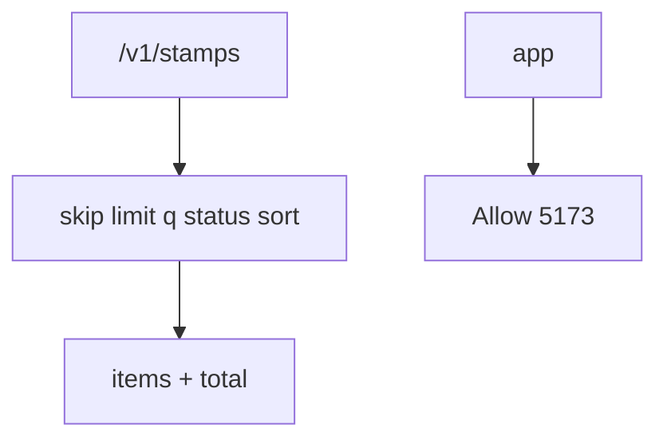
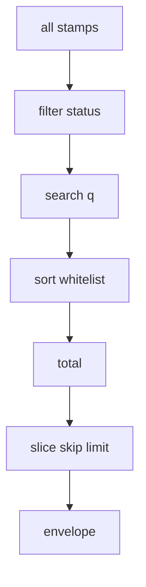

# Month 9 · Week 4 · Day 3
# Implement From Memory: List Queries, CORS, /v1

**Program:** Full-Stack Mastery · 18 months  
**Phase:** 3 — Python and backend  
**Month index:** [../../README.md](../../README.md)  
**Week 4:** [1](day-01.md) · [2](day-02.md) · Day 3 (today) · [4](day-04.md) · [5](day-05.md) · [6](day-06.md) · [7](day-07.md)  
**Week rhythm today:** Implement from memory  
**Student state:** Days 1–2 of this week passed. Today pagination/CORS/versioning must still live in your head — from **this file**.  
**Study time:** 3–4 focused hours

Labs: `~\fullstack-lab\month-09\week-04\day-03\`. Not Project 6A. Not a template. Do not paste `~/ops-api/`. Collectible stamps are the noun.

---

## How Day 3 works

Week 4 Days 1–2 **closed** during the build. This recap is the teacher. Stuck > 25 minutes: open only the matching section. `lookups.txt`.

No complete API in this file.

---

## How to read this chapter



**Wrong belief:** “I’ll skip CORS because TestClient passes.”  
**Correct:** assert `Access-Control-Allow-Origin` with an `Origin` header.

---

## Complete explanation (features you must still own)

**List:** `Query(ge=, le=)` on skip/limit (or page/size, 1-based). Clamp max limit. Filter AND search AND sort whitelist, **then** `total`, **then** slice. Envelope `{items, total, skip, limit}`. Skip past end: **200** empty items. Sort unknown: **422**. `q` substring casefold on a whitelist field. Enum/Literal for status filter.

Order is the whole lesson. If you slice first, `total` becomes `len(items)` and the UI cannot know there are 15 stamps when `limit=5`. Filter, then search, then sort, then count, then slice. Skip past the end is not 404. 404 is get-one missing. An empty page is still a successful list.

**CORS:** origin = scheme+host+port. Middleware `allow_origins=["http://127.0.0.1:5173"]` (add localhost if documented). Not `*`. Not auth. curl and TestClient always see bodies; still test the header. OPTIONS preflight for JSON POST.

`http://127.0.0.1:5173` and `http://localhost:5173` are **different origins**. Vite may use one; you must allow the one your UI actually sends. `http://127.0.0.1:8000` is the API, not an allowed UI origin unless you said so. An `Origin: http://evil.example` request must **not** receive `Access-Control-Allow-Origin: *` or that evil origin.

**Versioning:** path `/v1` via `include_router(..., prefix="/v1")` is the default choice. Header versioning costs proxies and OpenAPI. Do not run both. `/health` may sit outside `/v1`.

Router `prefix="/stamps"` plus `include_router(..., prefix="/v1")` is public `/v1/stamps`. `@router.get("/stamps")` on top of that becomes `/v1/stamps/stamps`. Same doubled-prefix bug as Week 3.

**Still true:** Pydantic Out on items, `model_dump` not `.dict()`, routers, Depends, in-memory dict, 404 on get-one, `HTTPException`, TestClient, `curl.exe`, `uv run uvicorn main:app --reload --host 127.0.0.1 --port 8000`. No SQLAlchemy. No Redis. No PostgreSQL. Reload still wipes RAM.

**Wrong belief:** “total is len(items) after slice.”  
**Correct:** total is the count **after filter/search, before skip/limit**.

**Wrong belief:** “CORS tests need a browser.”  
**Correct:** you assert the header. The browser is why the header exists; TestClient is how you regression-test it.

---

## Today's contract

**Today's gate.** Closed-book:

> I shipped `/v1/stamps` with a list envelope, query 422s, CORS for 5173, and tests — from this recap.

---

## Time box

| Block | Minutes | Work |
|---|---|---|
| A | 20 | Speak |
| B | 35 | Paper: example URLs + CORS header |
| C | 95 | Spec |
| D | 30 | Defect hunt |
| E | 15 | lookups |

---

# Block A — Speak

1. Order filter → search → sort → total → slice.  
2. 200 empty vs 404.  
3. Why 5173 and 8000 differ.  
4. localhost vs 127.0.0.1.  
5. Path vs header versioning — one cost each.

If (3) is “they are the same host,” re-read CORS. Origin includes the port.

---

# Block B — Paper

Write five URLs you will test (happy list, q, status, bad sort, skip past end). Write the Allow-Origin you expect for Origin 5173 and for evil.

---

# Block C — Spec

```powershell
cd ~\fullstack-lab
mkdir month-09\week-04\day-03 -Force
cd ~\fullstack-lab\month-09\week-04\day-03
uv init --name lab-stamps
uv add fastapi uvicorn
uv add --dev pytest httpx
```

**Stamps** (collectible — not Project 6A): `code` unique, `title`, `status` `owned|wanted`. Seed ≥ 15 in tests.

| Method | Path |
|---|---|
| GET | `/health` |
| GET | `/v1/stamps` list envelope |
| POST | `/v1/stamps` 201 |
| GET | `/v1/stamps/{id}` 200/404 |

Query: skip, limit (max 50), q on title, status, sort `id|title|-id|-title`.

CORS 5173. Tests include Origin header assertion. CONTRACT.md first.

## List algorithm you must write from this recap

```python
def apply_list(
    rows: list[dict],
    *,
    q: str | None,
    status: str | None,
    sort: str,
    skip: int,
    limit: int,
) -> tuple[list[dict], int]:
    if status is not None:
        rows = [r for r in rows if r["status"] == status]
    if q:
        needle = q.casefold().strip()
        rows = [r for r in rows if needle in r["title"].casefold()]
    descending = sort.startswith("-")
    key = sort[1:] if descending else sort
    allowed = {"id", "title"}
    if key not in allowed:
        raise HTTPException(status_code=422, detail="Invalid sort")
    rows = sorted(rows, key=lambda r: r[key], reverse=descending)
    total = len(rows)
    return rows[skip : skip + limit], total
```

`Query(0, ge=0)` on skip; `Query(10, ge=1, le=50)` on limit. Envelope model: `items`, `total`, `skip`, `limit`. `response_model` on the list route. `limit=0` is 422 because `ge=1`.

**CORS:**

```python
app.add_middleware(
    CORSMiddleware,
    allow_origins=["http://127.0.0.1:5173"],
    allow_credentials=False,
    allow_methods=["GET", "POST", "OPTIONS"],
    allow_headers=["*"],
)
```

Test:

```python
r = client.get("/v1/stamps", headers={"Origin": "http://127.0.0.1:5173"})
assert r.headers.get("access-control-allow-origin") == "http://127.0.0.1:5173"
r2 = client.get("/v1/stamps", headers={"Origin": "http://evil.example"})
assert r2.headers.get("access-control-allow-origin") not in {
    "*",
    "http://evil.example",
}
```

Header names may be lowercased. Compare case-insensitively if needed.

**Version:** `app.include_router(stamps_router, prefix="/v1")` with router `prefix="/stamps"` → `/v1/stamps`.

POST still 201 with Create/Out. Unique `code` → 409. Missing get-one → 404. Blank title → 422. In-memory dict. Fixture seed ≥ 15 so pagination is visible.

---

# Block D

1. `total` vs `len(items)` mismatch — fix.  
2. `/stamps` without `/v1` — 404 unless you intended otherwise.  
3. Origin evil — no allow header.  
4. `limit=0` 422.

## CORS + list traces

1. `GET /v1/stamps?limit=5` → `items` length ≤ 5, `total` ≥ that.  
2. `GET /stamps` without v1 → 404 (if you only mounted `/v1`).  
3. Origin 5173 on GET `/v1/stamps` → Allow-Origin that origin.  
4. `sort=-title` → ordered.  
5. `q` matches one seeded title.

Write predictions in `PREDICT.txt` before you run them. Spot-check with `curl.exe` if you like; pytest is the claim.

`curl.exe` does not send Origin unless you add `-H "Origin: http://127.0.0.1:5173"`. Without that header there is nothing for CORS middleware to echo. That is why the test sets Origin.

---

# Block E

```powershell
cd ~\fullstack-lab
git add month-09
git commit -m "Month 9 Week 4 Day 3: stamps list CORS v1 from memory."
```

---

# Lecture: total before slice, origin including port, path /v1

**List order.** Filter by status. Search `q` on a whitelist field (title). Sort on a whitelist (`id`, `title`, with `-` for descending). **Then** `total = len(rows)`. **Then** `rows[skip:skip+limit]`. Envelope `{items, total, skip, limit}`. Skip past the end: **200**, `items` empty, `total` still the filtered count. That is not 404. 404 is get-one.

If `total` is `len(items)`, a UI that shows “page 1 of N” cannot compute N. Fix the algorithm, not the UI.

**Query 422.** `limit=0` fails `ge=1`. Unknown `sort` fails your whitelist (raise 422). Invalid `status` fails Literal/Enum (framework 422). Tests name these.

**CORS.** Origin = scheme + host + port. `http://127.0.0.1:5173` ≠ `http://localhost:5173` ≠ `http://127.0.0.1:8000`. Allow the Vite origin you actually use. Not `*`. Not auth. TestClient: send `Origin` header; assert `access-control-allow-origin`. Evil origin must not be echoed and must not get `*`. curl without Origin proves nothing about CORS.

**Version.** `include_router(..., prefix="/v1")` + router `prefix="/stamps"` = `/v1/stamps`. Decorator `"/stamps"` on top doubles. `/health` may sit outside `/v1`. Header versioning costs proxies and OpenAPI; do not run both.

**Still true.** Create/Out, `model_dump`, 201, 404, 409, in-memory dict, TestClient, `curl.exe`, reload wipes. No SQLAlchemy. No Redis. No PostgreSQL. Stamps, not ops-api. Seed ≥ 15 so `limit=5` is visible.

PREDICT.txt before traces. CONTRACT.md first. Lookups after 25 minutes only.

---

## Definition of done

- [ ] Envelope + four query axes  
- [ ] `/v1`  
- [ ] CORS tests  
- [ ] lookups.txt  
- [ ] Commit exists  

---

# Worked session — stamps envelope + CORS 5173

Seed ≥ 15. `GET /v1/stamps` envelope `items`, `total`, `skip`, `limit`. Filter status, search `q` on title, sort whitelist, **then** total, **then** slice. POST `/v1/stamps` 201. GET one 200/404. CORS `allow_origins=["http://127.0.0.1:5173"]` not `*`. Test Origin 5173 allow header; evil origin not echoed.

`limit=0` 422. Unknown sort 422. Skip past end 200 empty items. `/stamps` without `/v1` 404 if you only mounted v1. `model_dump` not `.dict()`. In-memory. No SQL. Stamps, not ops-api.

PREDICT.txt then run. CONTRACT.md first. `curl.exe` optional; TestClient is the claim. `uv run uvicorn main:app --reload --host 127.0.0.1 --port 8000`.

If `total == len(items)` on `limit=5`, you sliced first. If CORS tests pass without an Origin header, you did not test CORS. `localhost` and `127.0.0.1` are different origins — allow the one Vite sends, or both if you documented both.



---

## Optional review links

Repair from this recap first. These pages are for later checking, not for first learning.

- [Query validations](https://fastapi.tiangolo.com/tutorial/query-params-str-validations/)
- [CORS](https://fastapi.tiangolo.com/tutorial/cors/)

---

## Tomorrow

**UploadFile** (small files) and **BackgroundTasks** (fake email — print, do not SMTP).

---

# Closing lecture — count then slice, origin includes port

Filter. Search. Sort whitelist. **Then** `total = len(rows)`.
**Then** `rows[skip:skip+limit]`. Envelope `items` plus `total`.
If `total` is `len(items)`, page math is a lie.
Skip past the end is 200 with empty `items`, not 404.
404 is get-one. 422 is bad `limit` or bad `sort`.

`allow_origins=["http://127.0.0.1:5173"]`. Not `*`.
`localhost` is a different origin. Allow what Vite actually sends.
TestClient must set `Origin`. curl without Origin is not a CORS test.
Evil origin must not be echoed.

`include_router(..., prefix="/v1")` plus router `/stamps` → `/v1/stamps`.
Do not write `/stamps` again on the decorator.
Seed ≥ 15. In-memory. `model_dump`. No SQL. Stamps, not ops-api.
CONTRACT.md first. PREDICT.txt then traces. `uv run pytest -q`.
Tomorrow is UploadFile and BackgroundTasks — still in memory, still not ops-api.
CORS is not authentication. A browser without the header still sends the request;
the header tells the browser whether JavaScript on 5173 may read the response.
`allow_credentials=False` in this lab. `*` plus credentials is invalid in browsers.
Path versioning is the default in this course. Header versioning costs proxies.
Do not run both. `/health` may sit outside `/v1`. List items still use Out models.


## Recite-back checklist (close the editor, then tick)

Write `RECITE.txt` with one honest sentence per line.
If a line is mush, re-read the matching section in **this** file only.

- [ ] filter → search → sort → total → slice
- [ ] `total` is not `len(items)` after slice
- [ ] skip past end is 200 empty
- [ ] CORS 5173 not `*`
- [ ] Origin header in the CORS test
- [ ] `/v1/stamps` not doubled path
- [ ] seed ≥ 15
- [ ] stamps not ops-api; no SQL

PREDICT then run. CONTRACT.md first. `uv run pytest -q`.
