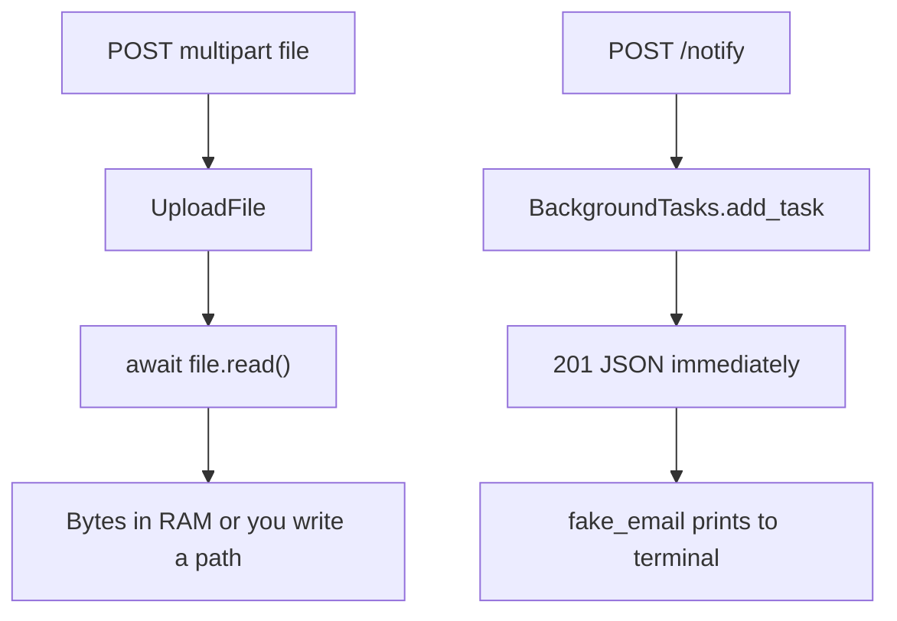

# Month 9 · Week 4 · Day 4
# UploadFile Basics and BackgroundTasks (Fake Email)

**Program:** Full-Stack Mastery · 18 months  
**Phase:** 3 — Python and backend  
**Month index:** [../../README.md](../../README.md)  
**Week 4:** [1](day-01.md) · [2](day-02.md) · [3](day-03.md) · Day 4 (today) · [5](day-05.md) · [6](day-06.md) · [7](day-07.md)  
**Week rhythm today:** Learn + type-along  
**Student state:** JSON APIs are familiar. Today a request can carry a **file** and work can run **after** the response is sent — still in-process, still fake.  
**Study time:** 3–4 focused hours

Labs: `~\fullstack-lab\month-09\week-04\day-04\`.

---

## How to use this textbook

1. Read a section. Close it. Say it.  
2. Type upload and a fake email function. Do not configure Gmail.  
3. Optional review links are for later rechecking.

---

## How to read this chapter

**JSON bodies** are not files. Browsers and `curl.exe` send **multipart/form-data** for uploads. FastAPI gives you **`UploadFile`**. **`BackgroundTasks`** queues a callable to run **after** the response is ready — same process, not Redis, not Celery.



**Wrong belief:** “BackgroundTasks is a job queue.”  
**Correct:** if the process dies, the task dies. It is for **short** leftover work (logging, a fake send). Project 6A may use it for a pretend notification. Month 10+ still no Redis this month.

---

## Today's contract

By the end of this day you will be able to:

1. Declare `file: UploadFile` (and `File()`).  
2. Read bytes with `await file.read()`; cap size.  
3. Return filename, content_type, size — **not** echo huge payloads.  
4. Add `BackgroundTasks` and `add_task(fake_email, to, body)`.  
5. Explain why the HTTP client does not wait for SMTP (there is no SMTP).  
6. Test upload with TestClient `files=` and test that the fake email **function was called** (or that a list append happened).

**Today's gate.** Closed-book:

> UploadFile is multipart, not JSON. I cap size. BackgroundTasks run after the response in the same process. I fake email with a function I control. I do not open Redis to look professional.

---

## Time box

| Block | Minutes | Work |
|---|---|---|
| A | 50 | Theory |
| B | 60 | Type-along: upload + notify |
| C | 70 | Independent: size limit 413; test fake send |
| D | 20 | Git |
| E | 15 | Recall |

---

# Block A — Theory

## 1. UploadFile

```python
from fastapi import APIRouter, File, UploadFile, HTTPException

router = APIRouter(prefix="/files", tags=["files"])

MAX = 100_000  # 100 KB lab cap

@router.post("/upload")
async def upload(file: UploadFile) -> dict:
    data = await file.read()
    if len(data) > MAX:
        raise HTTPException(status_code=413, detail="File too large")
    return {
        "filename": file.filename,
        "content_type": file.content_type,
        "size": len(data),
    }
```

- `UploadFile` is **async**-friendly (SpooledTemporaryFile underneath). Use `async def` and `await file.read()`.  
- `file.filename` is client-supplied — **do not** trust it as a disk path (`../../etc/passwd`). If you save (optional), use a generated name.  
- `content_type` is also client-supplied. Do not trust it as proof of a PDF.  
- Multiple files: `list[UploadFile]` — optional stretch.

`File()` is used when you mix form fields:

```python
async def upload(title: str, file: UploadFile = File(...)) -> dict:
    ...
```

JSON + file in one request is awkward; keep upload as **its own** endpoint.

**Wrong belief:** “I’ll `payload: dict` the file as base64 in JSON.”  
**Correct:** you *can*; it is worse for large files. This course wants **UploadFile** once so you have seen multipart.

---

## 2. curl.exe multipart

```powershell
curl.exe -s -F "file=@C:\Windows\win.ini" http://127.0.0.1:8000/files/upload
```

Pick a **small** text file you are allowed to read. Do not upload secrets. `-F` sets multipart.

TestClient:

```python
r = client.post("/files/upload", files={"file": ("hello.txt", b"hi", "text/plain")})
```

The tuple is `(filename, bytes, content_type)`.

---

## 3. 413 Payload Too Large

Cap **after** read for tiny lab files. For bigger files you would stream and abort — out of scope. 413 is the right status. Document max size in CONTRACT.md.

Empty file: decide 400 vs 201 with size 0. Document.

---

## 4. BackgroundTasks

```python
from fastapi import BackgroundTasks, FastAPI

app = FastAPI()

OUTBOX: list[dict] = []

def fake_email(to: str, subject: str, body: str) -> None:
    OUTBOX.append({"to": to, "subject": subject, "body": body})
    print(f"[fake email] to={to} subject={subject}")

@app.post("/notify", status_code=202)
def notify(payload: NotifyIn, background_tasks: BackgroundTasks) -> dict:
    background_tasks.add_task(fake_email, payload.to, payload.subject, payload.body)
    return {"queued": True}
```

- Inject `BackgroundTasks` as a parameter — FastAPI provides it.  
- **202 Accepted** is a good status (“I took it; work may finish later”). 200 is acceptable if documented.  
- `fake_email` is a **plain function**. No `smtplib` unless you want to fail on port 25.  
- `OUTBOX` lets tests assert the send **happened**. Race: tasks run after the response; TestClient usually **finishes** background tasks before returning (Starlette TestClient behavior). Assert `OUTBOX` after the request.

**Wrong belief:** “I’ll `time.sleep(10)` in the route so it feels like email.”  
**Correct:** that **blocks** the worker. BackgroundTasks is the lesson; still keep the fake function **fast**.

Not Celery. Not Redis. Not a thread pool you invent.

---

## 5. Failure in the background

If `fake_email` raises, you may **not** change the status already sent. Log it (print today). That is a reason real systems use queues with retry — **later**. Do not catch inside the route for a task that has not run yet.

---

## 6. Security start

- Filenames: no path separators.  
- Cap size.  
- Do not serve uploaded bytes back as HTML (`content_type` text/html). Return JSON metadata.  
- Fake email `to` is a string; still do not print secrets.  
- Do not store real PII in OUTBOX in git.

---

# Block B — Type-along

```powershell
cd ~\fullstack-lab
mkdir month-09\week-04\day-04 -Force
cd ~\fullstack-lab\month-09\week-04\day-04
uv init --name lab-upload
uv add fastapi uvicorn
uv add --dev pytest httpx
```

Routes: `POST /files/upload`, `POST /notify` with Pydantic `NotifyIn` (`to`, `subject`, `body` min_length 1). OUTBOX list. `reset()` clears it.

```powershell
uv run uvicorn main:app --reload --host 127.0.0.1 --port 8000
```

```powershell
curl.exe -s -F "file=@.\pyproject.toml" http://127.0.0.1:8000/files/upload
curl.exe -s -X POST http://127.0.0.1:8000/notify -H "Content-Type: application/json" -d "{\"to\":\"lab@local\",\"subject\":\"hi\",\"body\":\"n\"}"
```

Watch the Uvicorn terminal for `[fake email]`.

---

# Block C — Independent

Tests:

1. upload hello.txt → 200 size 2  
2. upload over MAX → 413  
3. notify → 202; `OUTBOX` has one record  
4. notify invalid email field empty → 422  

Optional: `GET /outbox` **only if** `debug` settings — otherwise tests import OUTBOX. Prefer **not** exposing outbox publicly; tests import the module.

Write `TASKS.md`: BackgroundTasks vs Redis queue, five lines.

Not Project 6A complete API.

```powershell
cd ~\fullstack-lab
git add month-09
git commit -m "Month 9 Week 4 Day 4: UploadFile and fake BackgroundTasks email."
```

---

# Block E — Recall

1. Why `async def` + `await file.read()`.  
2. Why filename is untrusted.  
3. 413 vs 422.  
4. When the fake email runs relative to the JSON response.  
5. Why this is not Redis.

## Office hours — files and tasks

**`def upload` not `async def` plus `file.file.read()`.** You can read synchronously; this course wants `await file.read()` so you meet the async API.

**Saving to `uploads/{filename}`.** Path traversal. If you save at all, `uuid4().hex` + a suffix from a whitelist.

**413 never fires.** You read the whole file first but MAX is larger than your test. Use a tiny MAX in tests (e.g. 10 bytes) via a constant you can see.

**OUTBOX not cleared.** Same as Week 1 dict. Fixture `OUTBOX.clear()`.

**`add_task(fake_email())` with extra `()`.** That runs now and queues `None`. Pass the function and args: `add_task(fake_email, to, subject, body)`.

**TASKS.md claims you will use Redis next week.** You will not, this month. Write that BackgroundTasks is in-process.

`curl.exe -F` from the project directory. If the file path has spaces, quote it.

## Notify body model

```python
class NotifyIn(BaseModel):
    to: str = Field(min_length=3, examples=["lab@local"])
    subject: str = Field(min_length=1, max_length=120)
    body: str = Field(min_length=1, max_length=5000)
```

202 + `{"queued": true}` is enough. Do not return the whole OUTBOX.

**Upload test:**

```python
def test_upload_small(client: TestClient) -> None:
    r = client.post("/files/upload", files={"file": ("a.txt", b"hello", "text/plain")})
    assert r.status_code == 200
    assert r.json()["size"] == 5
    assert r.json()["filename"] == "a.txt"
```

**413 test:** `b"x" * (MAX + 1)`.

Reset OUTBOX and do not commit a real mailbox. `print` is the fake SMTP.

If you `await file.read()` twice, the second is empty unless you seek. Read once.

## Fake email is a function you own

```python
OUTBOX: list[dict[str, str]] = []

def fake_email(to: str, subject: str, body: str) -> None:
    OUTBOX.append({"to": to, "subject": subject, "body": body})
    print(f"[fake email] to={to} subject={subject}")
```

Test after POST `/notify`: `assert len(OUTBOX) == 1`. Fixture clears OUTBOX. If the list is empty, you called `fake_email()` with parentheses in `add_task`, or the test used a different module object.

413 is not 422. 422 is Pydantic on `NotifyIn`. 413 is your `len(data) > MAX` on bytes.

Filename `..\\secret.txt` must not become a path on disk. If you do not save files, you already avoided that class of bug — still do not echo the name into a filesystem API later without sanitizing.

---

## Check yourself before git

---

## Definition of done

- [ ] Upload returns metadata  
- [ ] Size cap 413  
- [ ] Fake email + OUTBOX or equivalent test  
- [ ] 202 or documented 200 on notify  
- [ ] TASKS.md  
- [ ] Commit exists  

---

## Check yourself before git

Upload returns metadata only. MAX enforced with 413. `fake_email` queued with `add_task(fn, *args)` — no extra `()`. OUTBOX cleared in fixtures. TASKS.md does not invent Redis this month.

```powershell
uv run pytest -q
uv run uvicorn main:app --reload --host 127.0.0.1 --port 8000
```

If OUTBOX is empty after a 202, you passed `fake_email()` (called now) into `add_task`. Pass the function object.

MAX in tests can be a module constant you import. Do not copy a magic number into the test only.

---

## Optional review links

UploadFile and BackgroundTasks are explained in this chapter.

- [FastAPI: Request files](https://fastapi.tiangolo.com/tutorial/request-files/)
- [FastAPI: Background tasks](https://fastapi.tiangolo.com/tutorial/background-tasks/)
- [MDN: 413](https://developer.mozilla.org/en-US/docs/Web/HTTP/Status/413)
- [MDN: 202](https://developer.mozilla.org/en-US/docs/Web/HTTP/Status/202)

---

## If pytest fails (this day)

| Symptom | Likely cause |
|---|---|
| 413 never | MAX larger than test bytes |
| OUTBOX empty | `add_task(fake_email())` extra `()` |
| second read empty | `await file.read()` twice |
| 422 on upload | you sent JSON instead of `files=` |
| 202 but client waits | you `sleep` in the route, not the task |

---

## Tomorrow

**pytest fixtures** for `app` + `client`, and **mocking** a fake **outbound** HTTP call if you make one (httpx). Isolation that scales to Project 6A.
