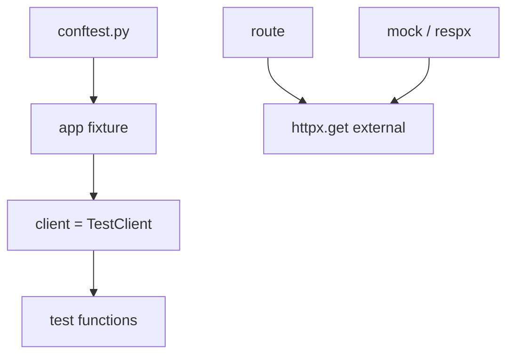

# Month 9 · Week 4 · Day 5
# pytest Fixtures (app + client) and Mocking Outbound HTTP

**Program:** Full-Stack Mastery · 18 months  
**Phase:** 3 — Python and backend  
**Month index:** [../../README.md](../../README.md)  
**Week 4:** [1](day-01.md) · [2](day-02.md) · [3](day-03.md) · [4](day-04.md) · Day 5 (today) · [6](day-06.md) · [7](day-07.md)  
**Week rhythm today:** Learn + type-along  
**Student state:** You can write tests. Project 6A will have many. Today **fixtures** stop copy-paste, and you **mock a boundary** if you call another HTTP API.  
**Study time:** 3–4 focused hours

Labs: `~\fullstack-lab\month-09\week-04\day-05\`.

---

## How to use this textbook

1. Read a section. Close it. Say it.  
2. Type `conftest.py`. Do not hit the real internet in tests.  
3. Optional review links are for later rechecking.

---

## How to read this chapter

A **fixture** is a setup function pytest **injects** by parameter name. **`app`** and **`client`** fixtures give every test a clean FastAPI and TestClient. **Mocking** replaces **outbound** `httpx.get("https://example.invalid/...")` with a fake response so CI does not need the network.



**Wrong belief:** “I’ll mock FastAPI itself; then tests are fast.”  
**Correct:** you mock **outbound** I/O. You still run **your** routes. Mocking the app away tests the mock.

---

## Today's contract

By the end of this day you will be able to:

1. Write `conftest.py` with `app` and `client` fixtures.  
2. Reset in-memory repo in a fixture (`autouse` or explicit).  
3. Use `from fastapi.testclient import TestClient` **or** httpx ASGI client — one style.  
4. Add **one** route that **calls out** with httpx to a fake URL.  
5. Mock that call (`unittest.mock.patch` or **respx**) so tests are offline.  
6. Explain what you would **not** mock (your own 404 logic).

**Today's gate.** Closed-book:

> Fixtures build app and client and clear RAM. I mock external HTTP, not my routers. Tests stay HTTP at my boundary. No live internet required.

---

## Time box

| Block | Minutes | Work |
|---|---|---|
| A | 50 | Theory |
| B | 60 | Type-along: conftest + weather fake |
| C | 70 | Independent: override + mock assertion |
| D | 20 | Git |
| E | 15 | Recall |

---

# Block A — Theory

## 1. conftest.py

pytest loads `conftest.py` from the test directory automatically. You do not import it.

```python
# conftest.py
import pytest
from fastapi.testclient import TestClient
from main import app as fastapi_app
from store import repo

@pytest.fixture
def app():
    return fastapi_app

@pytest.fixture
def client(app):
    repo.clear()
    with TestClient(app) as c:
        yield c
```

- `client` depends on `app`.  
- `with TestClient` runs startup/shutdown if you add events later.  
- `repo.clear()` **before** each test that uses `client`.

`autouse=True` reset fixture:

```python
@pytest.fixture(autouse=True)
def _clean():
    repo.clear()
    yield
    repo.clear()
```

Do not autouse a client that opens resources you do not need for unit tests of `repo.name_taken`.

---

## 2. Why an `app` fixture

Later you might build a **fresh** FastAPI per test (`create_app()` factory). Today a module `app` is OK if you **clear overrides and repo**. Factory is better when settings differ:

```python
def create_app() -> FastAPI:
    app = FastAPI()
    app.include_router(...)
    return app

@pytest.fixture
def app():
    return create_app()
```

Project 6A: a `create_app()` now saves pain. Not mandatory if you document reset.

---

## 3. httpx ASGI client (allowed alternative)

```python
import httpx

@pytest.fixture
def client(app):
    repo.clear()
    transport = httpx.ASGITransport(app=app)
    with httpx.Client(transport=transport, base_url="http://test") as c:
        yield c
```

Same assertions on `status_code` and `.json()`. Pick one per project.

---

## 4. Outbound HTTP — when you even have it

Many APIs never call out. Project 6A **may** skip this if you have no external dependency. The **Month 9 list** says: *mock an external boundary **if you call one**.*

Today you **will** call one on purpose so the skill exists:

```python
import httpx

def fetch_motto() -> str:
    r = httpx.get("https://httpbin.org/uuid", timeout=5.0)
    r.raise_for_status()
    return r.json()["uuid"]

@router.get("/motto")
def motto() -> dict:
    return {"uuid": fetch_motto()}
```

**Do not** use httpbin in pytest. Mock `fetch_motto` or mock `httpx.get`.

---

## 5. unittest.mock.patch

```python
from unittest.mock import patch

def test_motto_mocked(client: TestClient) -> None:
    with patch("routers.extra.fetch_motto", return_value="fake-uuid"):
        r = client.get("/motto")
    assert r.status_code == 200
    assert r.json() == {"uuid": "fake-uuid"}
```

Patch **where it is used** (`routers.extra.fetch_motto`), not only where it is defined, if the router imported the name.

```python
# routers/extra.py
from services.motto import fetch_motto  # patch routers.extra.fetch_motto
```

**Wrong belief:** “I’ll patch `httpx.get` globally in all tests.”  
**Correct:** patch the **narrow** function you own. Global httpx patches surprise other tests.

---

## 6. respx (optional)

`uv add --dev respx` can mock httpx routes. If you use it, keep it on the motto test only. `unittest.mock` is enough to pass the day.

---

## 7. What not to mock

- Do not mock `HTTPException`.  
- Do not mock Pydantic.  
- Do not mock TestClient.  
- Mock **the network**. Your 404 test should use a **missing id**, not `patch(repo.get, None)` unless you are unit-testing the router mapping — even then an empty repo is clearer.

---

## 8. Security start

- Tests must not contain live API keys.  
- `timeout=` on real httpx calls so a hung network cannot freeze you when you demo **without** mock once.  
- Do not commit cassette files of real user data.

---

# Block B — Type-along

```powershell
cd ~\fullstack-lab
mkdir month-09\week-04\day-05 -Force
cd ~\fullstack-lab\month-09\week-04\day-05
uv init --name lab-fixtures
uv add fastapi uvicorn httpx
uv add --dev pytest
```

Structure: `main.py`, `store.py` with a tiny resource (POST/GET), `routers/motto.py` with mocked motto, `tests/conftest.py`, `tests/test_items.py`, `tests/test_motto.py`.

```powershell
uv run pytest -q
```

Write `MOCK.md`: the patch target string and why.

Run motto **once** without mock **manually** if the network works; if it fails, that is why tests mock. Do not make CI depend on httpbin.

---

# Block C — Independent

1. Fixture `client` isolation: two tests POST; each sees only its row.  
2. Motto test **fails** if mock not applied — demonstrate by temporarily breaking patch target, then fix. Write `FAIL.txt`.  
3. Optional `create_app()`.  
4. `pytest.ini` or `pyproject.toml` `testpaths`.

Not Project 6A paste.

```powershell
cd ~\fullstack-lab
git add month-09
git commit -m "Month 9 Week 4 Day 5: pytest app/client fixtures and HTTP mock."
```

---

# Block E — Recall

1. Who imports conftest.  
2. Why `with TestClient`.  
3. Patch target = import site.  
4. What Month 9 says about mocking if you do **not** call out.  
5. Why not mock 404.

## Office hours — fixtures and mocks

**Patch `httpx.get` but the router imported `from httpx import get`.** Patch `routers.motto.get` or stop importing `get` directly. `MOCK.md` records the **failed** target too.

**`create_app` not used; tests mutate global middleware.** A second TestClient sees leftover overrides. Fixture `finally: app.dependency_overrides.clear()`.

**`autouse` client makes unit tests of `repo.name_taken` boot FastAPI.** Split: only HTTP tests request `client`.

**Live httpbin in CI.** Ban it. The motto route exists to be mocked. A manual demo is optional.

**`base_url="http://test"` with httpx client and you request `http://127.0.0.1:8000`.** That leaves ASGI and hits a real port. Use relative paths: `client.get("/motto")`.

Two tests POST unique codes; both pass only if `repo.clear()` runs. That is the isolation test. Name it `test_isolation_second_post_can_reuse_code`.

## conftest.py shape

```python
import pytest
from fastapi.testclient import TestClient
from main import app as fastapi_app
from store import repo

@pytest.fixture
def app():
    return fastapi_app

@pytest.fixture
def client(app):
    repo.clear()
    with TestClient(app) as c:
        yield c
    repo.clear()
    app.dependency_overrides.clear()
```

`tests/test_motto.py` patches `fetch_motto` at the **router module** name.

If 6A has no outbound call, you still keep this lab. The project gate says mock **if** you call one — not “invent httpbin in 6A.”

Do not commit API tokens. `timeout=5.0` on any real httpx you use in a manual demo.

`FAIL.txt` is the traceback from the **wrong** patch target. That file proves you understand import-site patching, not that you copied `patch("httpx.get")` from a blog.

---

## Definition of done

- [ ] `conftest.py` with client + reset  
- [ ] Isolation test  
- [ ] One mocked outbound (or extracted `fetch_*`)  
- [ ] `MOCK.md`  
- [ ] pytest green offline  
- [ ] Commit exists  

---

## Check yourself before git

`conftest.py` provides `client` and clears the repo. Isolation test exists. Motto (or equivalent) is mocked at the import site. `MOCK.md` names the patch target. pytest is green **offline**.

```powershell
uv run pytest -q
```

If motto hits the network in pytest, the patch target is wrong. Read `MOCK.md` and the import in the router file.

`with TestClient(app)` runs startup/shutdown. Use it in the fixture.

---

## Optional review links

Fixtures and mocking are explained in this chapter.

- [pytest fixtures](https://docs.pytest.org/en/stable/explanation/fixtures.html)
- [FastAPI: Testing](https://fastapi.tiangolo.com/tutorial/testing/)
- [unittest.mock](https://docs.python.org/3/library/unittest.mock.html)
- [httpx](https://www.python-httpx.org/)

---

## Tomorrow

**Start Project 6A** in `~/ops-api/` (own git repo). **CONTRACT.md first.** Three related resources, in-memory, tests. You will **not** finish in one day. Continue until the Month 9 gate is true — exam is Day 7, implementation continues after if needed.
