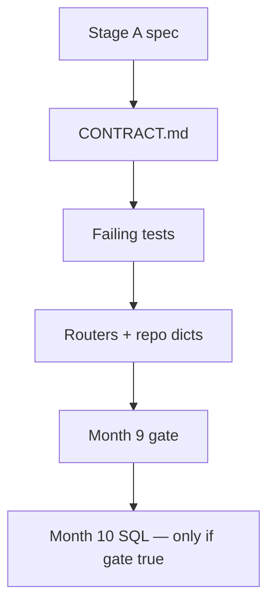
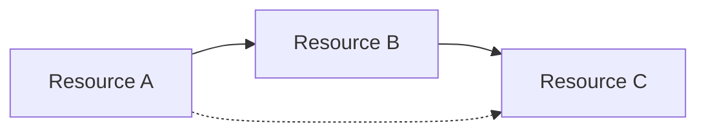
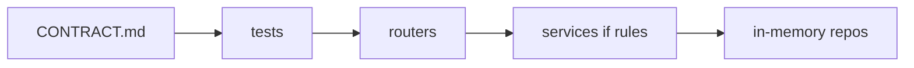

# Month 9 · Week 4 · Day 6
# Start Project 6A: Contract First, Then In-Memory API

**Program:** Full-Stack Mastery · 18 months  
**Phase:** 3 — Python and backend  
**Month index:** [../../README.md](../../README.md)  
**Week 4:** [1](day-01.md) · [2](day-02.md) · [3](day-03.md) · [4](day-04.md) · [5](day-05.md) · Day 6 (today) · [7](day-07.md)  
**Week rhythm today:** Project start (not a finish line)  
**Student state:** Month 9 skills exist. Project **6A** is **your** API in **its own repository**. This textbook will **not** give you the source.  
**Study time:** 3–4 focused hours today; **continue** after Day 7 until the gate is true.

**Spec (Stage A only):** `full_stack_project_requirements_2026/project_06_production_style_backend_system.md` — section **Stage A — API Before Database**. Ignore Stage B (Postgres) and Stage C (Redis) until Month 10+.

Repo: **`~/ops-api/`** (or `C:\Users\<you>\ops-api`). **Not** `fullstack-lab`. Git from commit one.

---

## How to use this textbook

1. Read Stage A in the project file. Close tutorials.  
2. Write **CONTRACT.md** before a happy-path forest of routes.  
3. Implement **behind** the contract. Tests are HTTP.  
4. Stop when the clock ends even if 6A is incomplete — Day 7 is the exam. Then **return** to 6A.  
5. AI may review CONTRACT.md. It may not generate the three-resource API.

---

## How to read this chapter

Project 6A is Month 9’s **product**: a production-**style** API **without** a database. The style is the contract, statuses, models, routers, tests, and justified modules. Storage is RAM.



**Wrong belief:** “I’ll copy users/projects/tasks from a blog so I match the spec example.”  
**Correct:** the spec’s trio is an **example**. You may use that family **or** inventory/issues (Project 4 kinship for Month 13) **or** another **three related** resources. Related means **foreign ids** you **validate** (invalid relationship → error). Do not ship three unrelated CRUDs.

**Wrong belief:** “I’ll add SQLAlchemy today so I’m ahead.”  
**Correct:** Stage A **forbids** that distraction. Month 10 replaces the repo guts. If you add SQL now, you skipped the point.

---

## Today's contract

By the end of **this calendar day** you will be able to:

1. Init `~/ops-api` with `uv`, FastAPI, pytest, `.gitignore`.  
2. Finish a **CONTRACT.md** that a stranger could implement: three resources, relationships, every path, statuses, JSON fields, list query params, error shapes.  
3. Implement **at least one** resource through typed CRUD + tests **or** prove all three list/create skeletons exist — **honest** `STATUS.md`.  
4. Commit early and often.

You will **not** be done with 6A at bedtime. That is expected.

**Today's gate** (for **Day 6**, not the month):

> CONTRACT.md exists and is specific. The repo runs. I did not paste a mega template. I did not open Postgres.

---

## Time box

| Block | Minutes | Work |
|---|---|---|
| A | 40 | Read Stage A + choose domain + relationship diagram |
| B | 70 | Write CONTRACT.md (no implementation yet except health) |
| C | 70 | Tests + first resource (or failing tests for three) |
| D | 20 | Git remotes optional; commits required |
| E | 15 | STATUS.md — what remains until month gate |

---

# Block A — Domain (yours)

Stage A examples: users / projects / tasks. Also welcome: sites / bins / items; catalogs / issues / comments. **Three related**:

- A **owns** B  
- B **contains** C  
- C may **reference** A (assignee)

Draw it:



Write `DOMAIN.md` in the repo: three nouns, two sentences on relationships, what “invalid relationship” means (POST task with missing project id).

**Auth:** Stage A says it may be simplified. **No real passwords.** If you have a user resource, store a **lab-only** fake hash and **never** return it (Week 2). You may skip login and pass `assignee_id` as a body field.

**Forbidden this project (Month 9):** SQLAlchemy, Alembic, Redis, Mongo, copying OpenAPI from a vendor, returning unvalidated dicts as the public contract.

---

# Block B — CONTRACT.md (the Month 9 habit at full size)

Minimum sections:

1. **Title, base URL**, version (`/v1` recommended).  
2. **Resources** — field tables: create / patch / out / stored-only.  
3. **Relationships** — which ids must exist; 404 vs 409 vs 422 (pick and stick).  
4. **Endpoints** — method, path, success, errors. Include list, get one, create, PUT, PATCH, delete/archive.  
5. **List protocol** — skip/limit or page/size; filter; sort whitelist; `q`; envelope.  
6. **Errors** — 422 `detail` list (default or your handler); 404 string; 409 unique/conflict.  
7. **Persistence** — in-memory; process restart wipes; `--reload` wipes.  
8. **CORS** — `http://127.0.0.1:5173` (+ localhost if needed). Not `*`.  
9. **Out of scope for 6A** — Postgres, Redis, real email, JWT (unless you insist on a toy and still do not leak secrets).  
10. **Examples** — one JSON per create body.

If CONTRACT.md is vague (“CRUD for tasks”), it is not done. Block C does not start.

**Wrong belief:** “OpenAPI is the contract; I don’t need a markdown file.”  
**Correct:** you design **first**. `/docs` must **match**. The markdown is what you write **before** path operations exist.

Health: `GET /health` (and maybe `GET /v1/health`).

---

# Block C — Implement behind the contract

```powershell
cd ~
uv init ops-api --name ops-api
cd ops-api
uv add fastapi uvicorn pydantic-settings httpx
uv add --dev pytest
```

`.gitignore`: `.venv/`, `.env`, `__pycache__/`, `.pytest_cache/`. `.env.example` with `APP_TITLE`.

Suggested (not mandatory) layout — **justify in README**:

```text
app/main.py          # create_app(), middleware, CORS, include_router /v1
app/settings.py
app/routers/
app/models/
app/repos/           # in-memory classes
app/services/        # only if rules exist
tests/conftest.py
CONTRACT.md
README.md
```

Empty `services/` with pass-throughs: **delete**. Parent-exists checks: **keep** a service or a clear repo+router `if`.

**First vertical slice (recommended):**

1. `GET /health`  
2. Resource A: create, get, list (pagination), 404, 422 tests  
3. Resource B with `a_id` that must exist  
4. Resource C  

Do not implement upload/background unless the contract needs them. They were **skills**; 6A only needs them if they serve the domain.

**Tests:** TestClient or httpx ASGI; fixtures reset **all** repos; happy, 404, 422, 409, list total, leak tests for any internal field.

```powershell
uv run uvicorn app.main:app --reload --host 127.0.0.1 --port 8000
```

If your factory is `app.main:app`, that path is what you pass. Document the string in README. Windows: **`curl.exe`**.

---

# Block D — Git

```powershell
cd ~/ops-api
git init
git add .
git commit -m "Project 6A: contract and initial in-memory API scaffold."
```

Use messages that match what you actually added. Several commits today are better than one novel.

Do **not** commit `.env` with secrets (you should have none).

---

# Block E — STATUS.md

Checklist copied from **your** contract, not from hope:

- [ ] Three resources related  
- [ ] Create/read/list/update/patch/delete (or archive) on **primary** resources  
- [ ] Pagination + filter + sort + search  
- [ ] Separate models  
- [ ] Errors consistent  
- [ ] Routers + Depends + justified repo  
- [ ] CORS 5173  
- [ ] pytest covering happy/404/422  
- [ ] Mock outbound **if** you call out  

This is the Month 9 gate in project clothing. Day 7 you **self-mark**. If false after the exam, **keep building 6A**. Do not start Month 10.

---

## Complete explanation (Month 9 you must use — keep this page)

**HTTP:** path vs query vs body; 201/204/404/409/422; PUT replace; PATCH `exclude_unset`; no upsert unless contract says (it should not).

**Pydantic v2:** Create/Patch/Out; `model_dump`; `response_model`; no leak; 422 loc.

**Architecture:** APIRouter prefix tags; `include_router` `/v1`; `Depends(get_repo)`; in-memory **class**; settings from env; timing header optional; CORS explicit origin.

**Tests:** fixtures app+client; isolation; HTTP assertions.

**RAM:** dies on reload. That is Stage A.

## What “related” looks like without a database

You simulate foreign keys:

```python
def create_task(projects: ProjectRepo, tasks: TaskRepo, data: dict) -> dict:
    if projects.get(data["project_id"]) is None:
        raise InvalidParentError("project")
    return tasks.add(data)
```

Router maps `InvalidParentError` to **409** or **422** — **your contract**. 404 on the **child POST** is also used by some APIs (“project not found”). Pick one sentence and test it.

List tasks `?project_id=` is a **filter**, not a different resource. Keep `GET /v1/tasks?project_id=1` and/or nested `GET /v1/projects/{id}/tasks` — if nested, still do not duplicate two conflicting contracts.

**Pagination** on the largest list (tasks). Filter/sort/search there. Smaller lists may stay simple; the **gate** wants at least one list that does all four.

**Do not** implement Stage B tables as comments in SQL. No SQL files this month.

**README** must include: `uv sync`, uvicorn string, `uv run pytest -q`, “data is RAM,” CORS origin.

If Block B ate the whole day, commit CONTRACT.md + health + empty routers with 501 — then **do not** pretend CRUD is done in STATUS.md.



## First-slice tests (names)

```text
test_health
test_create_a_201
test_get_a_404
test_create_a_422
test_list_a_total
test_create_b_invalid_parent
```

If only `test_health` exists at lights-out, STATUS.md says so. Tomorrow’s exam does not require 6A complete; the **month** gate does.

**create_app** in `app/main.py` so tests import a factory. CORS 5173 on that factory. `uv run uvicorn app.main:app --reload --host 127.0.0.1 --port 8000` — fix the module path if `app` is a package.

`.gitignore` must include `.venv/` and `.env`. First commit should already have CONTRACT.md.

Do not copy this textbook’s parking slots / cabins / stamps into 6A. Those were labs.

## STATUS.md honesty examples

**Good:** “Rooms CRUD tested. Desks POST validates room_id. Bookings not started. Pagination on desks only. CORS not wired.”

**Bad:** “Almost done” with no list.

Day 7 will self-mark the **month** gate. A false row is allowed if you keep building. A false row plus Month 10 is not.

If `uv init` put the package under `src/`, your uvicorn string changes. Read the error. Document the string you actually run.

Windows: `cd $HOME\ops-api` or `cd ~/ops-api` in PowerShell both work if the folder exists. Do not put 6A under `fullstack-lab/month-09`.

---

## Definition of done (Day 6)

- [ ] `~/ops-api` exists with git  
- [ ] CONTRACT.md is implementable  
- [ ] DOMAIN.md relationships  
- [ ] Health serves  
- [ ] At least one resource tested **or** STATUS.md honestly says tests are next  
- [ ] No SQLAlchemy / Redis  
- [ ] No complete copy from a tutorial  

---

## Check yourself before git

`~/ops-api` is its own repo. CONTRACT.md is specific enough to implement. DOMAIN.md names relationships. No SQLAlchemy, no Redis, no tutorial paste. STATUS.md is honest. Uvicorn string is in README.

```powershell
uv run uvicorn app.main:app --reload --host 127.0.0.1 --port 8000
uv run pytest -q
```

Fix the module path if your layout differs.

If CONTRACT.md has no list query section, you will fail gate item 6. Write skip/limit (or page/size), `q`, one filter, sort whitelist **today** even if code waits.

Create/Out models are required on the first resource you implement. Dict POST is a Week 1 sin you are not allowed to keep in 6A.

CORS 5173 belongs on `create_app`, not “later maybe.”

---

## Optional review links

Stage A lives in the project requirements file. FastAPI mechanics live in this month’s day files.

- [FastAPI bigger applications](https://fastapi.tiangolo.com/tutorial/bigger-applications/)
- [FastAPI testing](https://fastapi.tiangolo.com/tutorial/testing/)
- [FastAPI CORS](https://fastapi.tiangolo.com/tutorial/cors/)

---

## If the slice stalls (this day)

| Symptom | What to do |
|---|---|
| CONTRACT vague | stay in Block B |
| tests import fail | fix package/`app.main:app` |
| want SQLAlchemy | stop — Stage A is RAM |
| one resource only | STATUS.md says so; continue after exam |
| copied a blog trio | delete and write your contract |

Continue after Day 7 until the month gate is true.

---

## Security reminder

No real passwords. Fake hashes stay off Out. `.env` gitignored. CORS 5173 not `*`. Invalid parent ids are errors, not silent creates.

Stage B/C wait. The adapter stays; storage changes next month.

Day 7 exam uses a **different** domain (rooms/desks/bookings). Do not paste 6A into the exam mini.

---

## Tomorrow

**Month 9 exam** — textbook days 1–6 of each week **closed** except Day 7’s synthesis. Closed-book **contract design**, a **mini API**, **debug** (forgot 404, unvalidated dict, CORS `*`), **self-mark** the gate. Then continue 6A until the gate is true.
