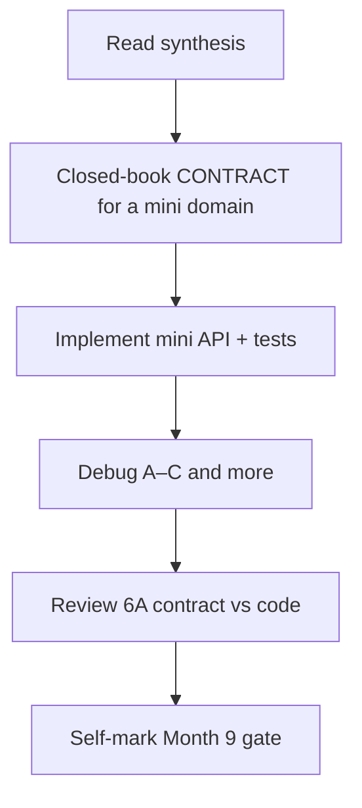
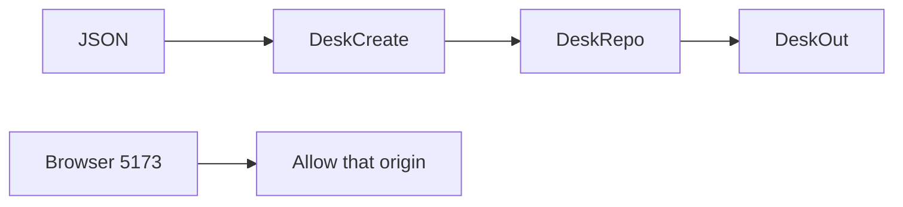

# Month 9 · Week 4 · Day 7
# Month 9 Exam + Gate

**Program:** Full-Stack Mastery · 18 months  
**Phase:** 3 — Python and backend  
**Month index:** [../../README.md](../../README.md)  
**Week 4:** [1](day-01.md) · [2](day-02.md) · [3](day-03.md) · [4](day-04.md) · [5](day-05.md) · [6](day-06.md) · Day 7 (today)  
**Week rhythm today:** Monthly exam  
**Study time:** 3–4 focused hours (Project 6A continues **after** if the gate is still false)

Textbook files stay **closed** except:

- **this file** (synthesis + exam blocks + self-mark table),
- Stage A **headings** in `full_stack_project_requirements_2026/project_06_production_style_backend_system.md` if you need to remember **what 6A must contain** — not as a source to paste,
- your **own** `~/ops-api/CONTRACT.md` only in Block 4 (review), not during Blocks 1–3.

Repair forgotten facts from **this synthesis**, not from Weeks 1–4 day files and not from a FastAPI tutorial.

Work in `~\fullstack-lab\month-09-exam\` for exam evidence. Do **not** implement the exam mini-API inside `~/ops-api`. Do **not** start Month 10 because the calendar moved.

---

## How to read this chapter

This file is the **exam and the teacher**. The synthesis is written so a student whose Weeks 1–4 notes are foggy can still re-learn the month from **today’s pages**, then prove it with the blocks and the gate.



During Blocks 1–3, other day files stay closed. If you go blank, re-read **this synthesis**. AI may not write exam-01, the mini-API, or the debug answers.

---

## Today's contract

By the end of this day you will be able to teach Month 9 aloud from this synthesis, design a contract closed-book, ship a mini API, debug three classic failures, and **honestly** mark the Month 9 gate.

**Today's gate** is the Month 9 Gate table below — not “I attended four weeks.” If any required row is false, **do not start Month 10**. Continue Project 6A.

---

## Time box

| Block | Minutes | Work |
|---|---|---|
| 0 | 25 | Read the complete explanation; speak it |
| 1 | 40 | Closed-book contract design (`exam-01-contract.md`) |
| 2 | 50 | Mini-build (`mini/`) |
| 3 | 30 | Debug A–F |
| 4 | 20 | Review `~/ops-api` CONTRACT vs routes (if it exists) |
| 5 | 15 | Break one mini test; restore |
| 6 | 15 | Design: in-memory vs SQL (why 6A first) |
| 7 | 20 | Retro + self-mark |

---

## Month 9 synthesis (the lesson, in this book)

**FastAPI** is an **HTTP adapter**. It maps **method + path** to a function. **Uvicorn** is the ASGI server: `uv run uvicorn main:app --reload --host 127.0.0.1 --port 8000`. `main:app` is module + variable. Bind **127.0.0.1**. **`--reload` re-imports**; module dicts **empty**. That is Stage A storage on purpose. Windows clients: **`curl.exe`**.

**Path params** (`{id}`) identify. **Query params** filter, paginate, sort, search. **Bodies** are JSON (or multipart for files). FastAPI parses types: bad `id` → **422**, not 404. **You** raise **`HTTPException` 404** when the store has no row. Framework 404 means **no route**.

**Statuses:** GET 200; POST create **201**; PUT/PATCH 200; DELETE **204** empty (`None`; do not `.json()`). **409** well-formed but **conflicts** (unique field, sometimes invalid relationship). **422** schema. **413** file too large. **202** for accepted background work. Never **200** with `ok: false` as the real error channel.

**PUT** replaces (no upsert). **PATCH** uses **`model_dump(exclude_unset=True)`**. Path id wins.

**Pydantic v2:** `BaseModel`, `Field`, **`model_dump`** not `.dict()`. Create vs Patch vs Out. **`response_model`** is an **allowlist** — storage may have hashes and flags. Leak = omitted `response_model` or Out that declares secrets. 422 `detail` is a **list** with `loc` (`body`/`query`/`path`). HTTPException `detail` is often a **string**. Handlers wrap on purpose; tests follow CONTRACT.md. `Query(ge=, le=)` on skip/limit.

**List:** filter → search → sort **whitelist** → **total** → slice. Envelope `{items, total, ...}`. Empty page is **200**. Cap `limit`.

**Architecture:** `APIRouter` prefix + tags; `include_router` (often `/v1`). **Depends(`get_repo`)** injects an in-memory **class** with methods — pattern, not SQL. Repo does not raise HTTPException. **Services** only when a rule is real (parent exists). Empty layers fail. **Settings** from env / pydantic-settings; no secrets in git. **Middleware** `X-Process-Time`. **CORS** for `http://127.0.0.1:5173` (and localhost if needed) — **not `*`**, not auth. Versioning: **path `/v1`** is the simple default vs headers (proxies, OpenAPI).

**UploadFile:** multipart, `await read()`, cap size, untrusted filename. **BackgroundTasks:** same process, fake email, not Redis.

**Tests:** `from fastapi.testclient import TestClient` or httpx ASGI. Fixtures `app` + `client`; **clear** repos; **clear** `dependency_overrides`. Mock **outbound** HTTP if you call it; do not mock your 404. CONTRACT.md **before** growing routes. `/docs` must match.

**Project 6A:** own repo `~/ops-api/`; three **related** resources; Stage A only; continue until gate.

**Wrong belief:** “FastAPI is the database.”  
**Correct:** FastAPI is HTTP. The dict is RAM. Month 10 is SQL.

The rest of this file unpacks those sentences so the exam is not a vocabulary quiz against a ghost month.

---

# Complete explanation — API engineering you must still own

## 1. Lifecycle and RAM (Week 1)

Import runs `app = FastAPI()` and `repo = Repo()`. Uvicorn holds the process. Reload = new import = empty dicts. Tests in one process share globals unless fixtures `clear()`.

Path operation = decorator + function. Function name is not the URL.

## 2. HTTP semantics (Week 1)

Identify with path. Filter with query. Create with POST body. Unique collision 409 after validation. Second DELETE: this course uses 404 (resource gone). 204 has no body.

## 3. Models (Week 2)

Three jobs: inbound create, inbound patch, outbound public. `Field(min_length, ge)`. `default_factory=list`. Examples help `/docs`. `exclude_unset` is PATCH. Tests assert 422 **loc**, not a frozen `msg` sentence. Do not return `Create.model_dump()` if it contains `password`.

## 4. Split (Week 3)

`main.py` includes routers and middleware. Routers own status codes. Repo owns dict keys. `Depends` is how tests swap stores. `prefix="/items"` + `@router.get("/items")` = `/items/items`. CORSMiddleware last/first order exists; policy is **explicit origins**.

## 5. List, CORS, extras (Week 4)

Pagination without total is a UI lie. CORS is a **browser** rule; TestClient still asserts headers. `/v1` is visible versioning. Upload is not JSON. BackgroundTasks are not a queue.

## 6. 6A (Week 4 Day 6)

Contract first. Related ids validated. In-memory until Month 10.

---

# Block 0 — Speak the synthesis

Out loud, no other files: adapter vs store; 422 vs 404 vs 409; create vs out; exclude_unset; Depends; CORS origin; why 6A is RAM. Then start Block 1.

---

# Block 1 — Closed-book contract (40 min)

Create `~\fullstack-lab\month-09-exam\exam-01-contract.md`.

**Domain (imposed so you cannot paste 6A):** **reading rooms**, **desks** (each desk belongs to a room), **bookings** (each booking is a desk + a `label` string). No users table required.

The contract **must** include:

- Field tables for three resources (create / out; patch if you will implement)  
- Relationship rules (booking with unknown `desk_id` → which status?)  
- Endpoints with methods and statuses  
- List on **desks**: skip/limit (or page/size), `q`, one filter, sort whitelist  
- Error shapes (422 list vs 404 string)  
- Persistence sentence  
- CORS origin 5173  
- Version `/v1`  

If you cannot fill it without opening Week files, re-read the synthesis. Do not open Day 6’s CONTRACT.md.

This block is **design**. Code is Block 2.

---

# Block 2 — Mini-build (50 min)

Textbook closed except this file’s spec reminders.

```powershell
cd ~\fullstack-lab
mkdir month-09-exam\mini -Force
cd ~\fullstack-lab\month-09-exam\mini
uv init --name exam-mini
uv add fastapi uvicorn
uv add --dev pytest httpx
```

Implement **enough** of exam-01 to prove the month:

**Must:**

- `GET /health`  
- Rooms: POST + GET one + 404  
- Desks: POST requiring existing `room_id` (409 or 422 per **your** contract) + GET list with **total** + skip/limit + `response_model`  
- Pydantic Create/Out; no leak if you store `internal_note` on room  
- TestClient tests: 201, 404, 422 loc, list total, isolation fixture  
- `HTTPException` for missing room get-one  

**Should if time:** PATCH desk `exclude_unset`; DELETE 204; CORS header test with Origin 5173.

**Must not:** SQLAlchemy, Redis, Project 6A copy, `allow_origins=["*"]`, dict-only POST without a model.

```powershell
uv run pytest -q
uv run uvicorn main:app --reload --host 127.0.0.1 --port 8000
```

Use `curl.exe` once for 404.

---

# Block 3 — Debug (30 min)

Write `exam-03-debug.md`. For each: **what the client sees**, **root cause**, **fix in one or two sentences**. No need to run broken code.

**A. Forgot 404.** `GET /rooms/99` returns **200** with `null` or `{}` because the function `return store.get(id)` and FastAPI encodes `None`. What status should it be, and what do you raise?

**B. Returned unvalidated dict.** `POST /desks` uses `payload: dict`, stores it, returns it. Client sends `{"room_id": "nope", "extra_admin": true}`. What goes wrong versus a `DeskCreate` + `DeskOut`? Which statuses and leaks appear?

**C. CORS `*`.** `allow_origins=["*"]`, `allow_credentials=True`, frontend on 5173 with cookies “later.” What does the browser do? What is the Month 9 policy origin?

**D.** PATCH without `exclude_unset` wiped `label`.  

**E.** Tests assert `id == 1` always; second test fails.  

**F.** `@router.get("/rooms")` plus `prefix="/rooms"`. TestClient `GET /rooms` 404.

---

# Block 4 — Review Project 6A

If `~/ops-api` exists: compare CONTRACT.md to actual routes (open **only** those two). One mismatch: file an issue in `exam-04-6a.md` or fix with a commit **after** the exam mini is done. If 6A is only a contract, write what you will implement next. If 6A does not exist, write that the month gate is **false** until Day 6 work happens.

Do not start Postgres “while you’re here.”

---

# Block 5 — Break a test

In mini: change 404 assert to 200; `uv run pytest -q` fails; restore. Paste the fail snippet into `exam-05-fail.txt`.

---

# Block 6 — Design

`exam-06-design.md` (10–15 lines): why Stage A is in-memory **before** SQLAlchemy. What sloppy HTTP the ORM would hide. Why 6A’s repo class method names should survive Month 10.

---

# Block 7 — Retro + self-mark

`exam-07-retro.md`: weakest status code; whether you still want `*`; 6A remaining work.

---

## Month 9 Gate (self-mark)

True **without a tutorial**. Evidence paths are yours.

| # | Claim | Evidence | Pass? |
|---|---|---|---|
| 1 | CONTRACT.md **before** happy path (6A + exam-01) | ops-api/CONTRACT.md, exam-01-contract.md | |
| 2 | CRUD + list with 201, 204 or 200, 404, 422, 409 where it fits | tests | |
| 3 | Separate create / update / response models | models | |
| 4 | Validation errors are JSON (422 shape known) | test + 422.json or pytest | |
| 5 | Routers + Depends; config from env; no secrets in git | layout, .env.example | |
| 6 | List: pagination + filter or search + sort | list tests | |
| 7 | pytest + TestClient/httpx; mock outbound **if** you call one | tests/ | |
| 8 | CORS explained; 5173 not `*` | middleware + exam-03 C | |

If any **required** row is false, **do not start Month 10**. Finish 6A Stage A.

```powershell
cd ~\fullstack-lab
git add month-09-exam
git commit -m "Complete Month 9 exam evidence."
```

---

## If you passed

Month 10 is **SQL and PostgreSQL**. Open it only when this gate is true. The in-memory repo’s method names should still make sense when the dict becomes a session.

## If you did not pass

Stay on Month 9. The exam synthesis remains the teacher. Project 6A remains RAM.

---

If the gate table has a false row, the honest action is more 6A, not Month 10.

---

## Optional review links

Repair from this synthesis first.

- [FastAPI first steps](https://fastapi.tiangolo.com/tutorial/first-steps/)
- [Response model](https://fastapi.tiangolo.com/tutorial/response-model/)
- [Handling errors](https://fastapi.tiangolo.com/tutorial/handling-errors/)
- [Dependencies](https://fastapi.tiangolo.com/tutorial/dependencies/)
- [Testing](https://fastapi.tiangolo.com/tutorial/testing/)
- [CORS](https://fastapi.tiangolo.com/tutorial/cors/)

---

# Scoring the mini (you, not a grader bot)

| Piece | Honest pass |
|---|---|
| exam-01 contract | Three resources, statuses, list query, CORS, `/v1`, RAM sentence |
| Mini rooms 404 | `HTTPException`, not `return None` |
| Mini desks create | Pydantic; invalid `room_id` uses the status you wrote |
| Mini list | `total` ≠ `len(items)` when limit < total |
| Mini 422 | `detail` is a list; `loc` mentions a field |
| Debug A–C | 404 raise; models not dict; CORS 5173 not `*` |

If the mini used `payload: dict` to “save time,” Block 2 is a fail even if pytest is green. Green tests on a dict body do not prove Week 2.

---

## Worked answers you should not need — check after you write debug

**A.** `store.get` returned `None`; FastAPI encoded it as 200 null. Fix: `if row is None: raise HTTPException(404, ...)`. Returning `{}` is still a lie.

**B.** Unvalidated dict accepts extra keys and wrong types (or coerces badly). `admin` flags leak. `DeskCreate` would 422 `room_id`. `DeskOut` would drop extras. `response_model` is the seatbelt; the Create model is the lock on the door.

**C.** Browsers reject `*` with credentials. Even without credentials, `*` trains you to skip origin policy. Course: `http://127.0.0.1:5173`. curl still works — that is why C is an exam item.

If your written answers disagree, fix them from this box **only after** you attempted A–C alone.



---

## Month 10 is not a reward for finishing the calendar

PostgreSQL will add constraints, transactions, and query plans. It will not teach you 201 vs 200. Students who skip 6A RAM produce ORMs that `return db_row` and leak columns. The gate exists to stop that.

Continue `~/ops-api` until every gate row is true. Do not begin Month 10 on a false gate.

## Closed-book cards (write answers in exam-07-retro or a cards.md)

1. Who turns `"12"` in the path into `int` 12?  
2. Why `/items/abc` is not your 404.  
3. `model_dump(exclude_unset=True)` — one sentence.  
4. Why Out is an allowlist.  
5. Why `get_repo` must not `return Repo()` new each request.  
6. Why `total` is not `len(items)` after slice.  
7. Name the Vite origin this month allows.  
8. BackgroundTasks vs Redis — one sentence.  
9. TestClient vs calling a service function — which catches missing `status_code=201`?  
10. Why Stage A forbids SQLAlchemy.

If you miss more than two, re-read the synthesis, then the gate table. Missing these and starting Month 10 is how ORMs hide HTTP.

**Mini uvicorn** (after pytest is green):

```powershell
uv run uvicorn main:app --reload --host 127.0.0.1 --port 8000
curl.exe -s -D - http://127.0.0.1:8000/rooms/999 -o NUL
```

You want **404** and `detail`, not **200**. That is debug A in a terminal.

Do not put the mini inside `~/ops-api`. Do not start Month 10 tonight on a false self-mark.

## Definition of done (exam day)

- [ ] exam-01 contract is implementable (three resources, statuses, list query, CORS, RAM)
- [ ] Mini API uses Pydantic, 404 via `HTTPException`, 422 on bad create
- [ ] Debug A–C written, then checked against the worked box
- [ ] Self-mark table is honest
- [ ] Month 10 not started on a false row

The gate table is the course’s definition of done for the month. Attendance is not.
