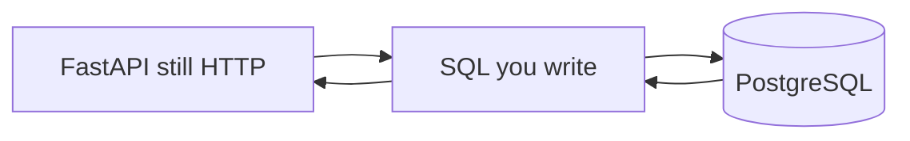

# Month 10 — SQL and PostgreSQL

**Program:** Full-Stack Mastery Textbook  
**Phase:** 3 — Python and backend engineering  
**Length:** 4 weeks · 7 days each · 3–4 focused hours/day  
**Prereq:** Month 9 gate passed (Project 6A exists as an in-memory FastAPI; you can explain CONTRACT.md)  
**This month’s job:** Make **relational data** and **SQL** yours — keys, constraints, joins, transactions, indexes — **before** an ORM hides them. Project 6 **Stage B** starts with a schema and reporting queries **you** write. SQLAlchemy is **Month 11**.

**Project 6 Stage B (schema + SQL this month):** `full_stack_project_requirements_2026/project_06_production_style_backend_system.md`. This textbook will **not** give you the API or the finished schema of `~/ops-api/`.

**This textbook is the lesson.** Tables, SQL, ACID, and `EXPLAIN` are explained in the day files. Optional review links are for later rechecking.

These files are written to render as **web pages**: relative links, tables, and **Mermaid** diagrams.

---

## How this textbook is organized

```
month-10/
  README.md     ← you are here
  week-01/      tables, types, keys, constraints, relationships, normalization
  week-02/      SELECT … window functions
  week-03/      ACID, isolation, locks, anomalies
  week-04/      indexes, EXPLAIN, pagination, pools
                + raw-SQL reporting lab + Month 10 exam
```

Labs: `~\fullstack-lab\month-10\`.  
Product schema work: **your** `~/ops-api/` (or a SQL-only lab repo). Do not paste a tutorial dump into git and call it a design.

---

## Why SQL before the ORM

Month 9 stored dicts. Dicts do not enforce “this task belongs to a real project.” PostgreSQL does — if you **declare** keys and constraints.



**Wrong belief:** “I’ll learn SQL from SQLAlchemy error messages.”  
**Correct:** the ORM speaks SQL. If you cannot read the SQL, you cannot debug a slow join or a missing FK.

---

## Month 10 Gate

True **without a tutorial**:

1. Given a feature, **draw** tables, keys, and relationships, then justify them in sentences.
2. Write `CREATE TABLE` with primary keys, foreign keys, `NOT NULL`, and `UNIQUE` where it belongs.
3. Write `SELECT` with `JOIN`, `WHERE`, `GROUP BY` / `HAVING`, and at least one **CTE**.
4. Explain **ACID** and one isolation anomaly in a story (lost update, phantom, or similar).
5. Use a **transaction** for a multi-row change that must not half-apply.
6. Read an **`EXPLAIN`** (or `EXPLAIN ANALYZE`) and say whether an index is doing work.
7. Explain **OFFSET pagination vs keyset** and when N+1 is a SQL problem, not a Python loop accident.
8. Deliver **reporting queries** on a realistic schema you designed — not a copied blog schema.

If any item is false, do not start Month 11.

---

## What this month must teach (complete list)

| Week | Must learn | Must practice |
|---|---|---|
| 1 | tables, rows, columns, types, PK/FK, constraints, 1-1 / 1-n / n-n, normalization | ER + `CREATE TABLE` |
| 2 | SELECT, INSERT, UPDATE, DELETE, WHERE, ORDER, GROUP, HAVING, JOIN, subquery, CTE, window basics | `psql` until the syntax is in your fingers |
| 3 | ACID, transactions, isolation, locks, anomalies, DB-enforced correctness | `BEGIN` / `COMMIT` / `ROLLBACK` |
| 4 | indexes, composite indexes, selectivity, EXPLAIN, pagination, N+1, connection pools (concept) | Reporting SQL; exam |

**Avoid:** SQLAlchemy this month; MongoDB; Redis; copying a giant “ecommerce schema”; putting business rules only in the API when a constraint would have saved you.

Horizontal:

- **Debugging:** read `psql` errors; they name columns and constraints.
- **Security:** parameterized queries from the first `INSERT` of user data. Concatenating SQL strings is how injection begins — Month 13 deepens this; you start the habit **now**.
- **Tests:** SQL files in git; a checklist that can fail (tables exist, FKs reject orphans).
- **Git:** small commits of `.sql` files.

---

## Tools this month

| Tool | Why |
|---|---|
| PostgreSQL | The system of record. Install locally on Windows (installer or `winget`). **Docker is Month 15** — optional if you already have it, not the gate. |
| `psql` | The SQL REPL. |
| A GUI (optional) | pgAdmin, DBeaver, or VS Code — still type SQL; do not click-only. |
| `uv` / Python | Only if you drive `psycopg` for tests. Raw SQL still wins the month. |

Windows: PowerShell. If `psql` is not on `PATH`, use the full path under `C:\Program Files\PostgreSQL\<version>\bin\`.

---

## Weekly rhythm

Same as Month 1. Day 1 learn. Day 2 exercises. Day 3 from memory. Day 4 lab. Day 5 tests/docs. Day 6 independent. Day 7 review. Week 4 Day 7 is the Month 10 exam + gate.

| Minutes | Block |
|---|---|
| 30–45 | Concepts from **this textbook** |
| 45–60 | Focused SQL |
| 60–90 | Independent schema / queries |
| 30–60 | Lab |
| 15 | Notes / recall |

---

## Start

Open [week-01/day-01.md](week-01/day-01.md).

When Month 10’s gate is true, continue with [Month 11](../month-11/README.md).
