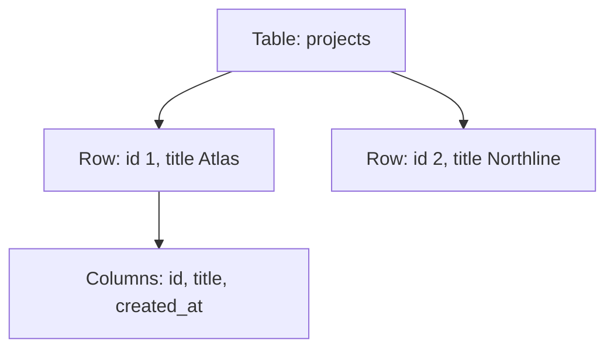

# Month 10 · Week 1 · Day 1
# Tables, Rows, Columns, Types

**Program:** Full-Stack Mastery · 18 months  
**Phase:** 3 — Python and backend  
**Month index:** [../../README.md](../../README.md)  
**Week 1:** Day 1 (today) · [2](day-02.md) · [3](day-03.md) · [4](day-04.md) · [5](day-05.md) · [6](day-06.md) · [7](day-07.md)  
**Week rhythm today:** Learn + type-along  
**Student state:** Project 6A lives in RAM. Today data must **survive the process** and **mean something**.  
**Study time:** 3–4 focused hours

**This week covers:** tables, rows, columns, types, primary keys, foreign keys, constraints, relationships, normalization.

Today: what a **relation** is, how PostgreSQL stores it, and how to install/connect on **Windows** so tomorrow’s keys are not theoretical. Foreign keys are Day 2. Do not skip them.

Labs: `~\fullstack-lab\month-10\week-01\day-01\`.

---

## How to use this textbook

1. Read a section. Close it. Say it in a full sentence.  
2. Type every `psql` command. Do not screenshot a GUI as “proof.”  
3. If `psql` is not found, fix `PATH` — that is a Month 1 skill.  
4. Optional review links are for later rechecking.

---

## How to read this chapter

A **table** is a named set of **rows**. A row is one fact (one project, one user). A **column** is one kind of value that every row may have (`title`, `created_at`). A **data type** is a promise: this column is text, or an integer, or a timestamp — not “whatever JSON showed up.”



**Wrong belief:** “A table is an Excel sheet, so mixed types in one column are fine.”  
**Correct:** mixed types are how `priority` becomes `'high'` and `3` and `NULL` and then every report lies.

**Wrong belief:** “I’ll put everything in one `data JSONB` column and stay flexible.”  
**Correct:** JSONB is a tool. A core business fact (who owns this project) belongs in a **typed column with a key**, not a blob you hope to remember.

---

## Today's contract

By the end of this day you will be able to:

1. Explain table, row, column, and type without waving at “the database.”  
2. Install or confirm **PostgreSQL** on this Windows machine and connect with **`psql`**.  
3. Create a database and a first table with explicit types.  
4. Insert two rows and `SELECT` them.  
5. Name **NULL** as “unknown / missing,” not as the number zero or the string `""`.

**Today's gate.** Closed-book:

> PostgreSQL stores relations: named tables of typed columns. A row is one entity. Types and NULL are contracts. My FastAPI process can die; the table is still on disk.

---

## Time box

| Block | Minutes | Work |
|---|---|---|
| A | 50 | Theory |
| B | 70 | Install/connect + first table |
| C | 50 | Independent: a second table |
| D | 15 | Git |
| E | 15 | Recall |

---

# Block A — Theory

## 1. Why this month exists

In Month 9, `ACCOUNTS[id] = {...}` vanished when Uvicorn stopped. That was honest: RAM is not a product database.

PostgreSQL is a **process** that keeps files on disk and answers **SQL**. Your FastAPI app is a **client** of that process, the same way the browser is a client of FastAPI. Month 1’s picture still holds: two programs, a network (often `127.0.0.1:5432`), a protocol.

## 2. Table, row, column

| Word | Meaning | If you confuse it |
|---|---|---|
| Table (relation) | A set of rows with the same columns | You invent a new shape per insert |
| Row (tuple) | One instance | You update “the table” when you meant one project |
| Column (attribute) | A named, typed field | You store `title` in two spellings |
| Cell | The value at (row, column) | You think Excel “merge cells” is a database feature |

SQL’s `SELECT` returns a **result table**. It is not always stored. A query is a question; a base table is a stored answer waiting for questions.

## 3. Types you will actually use

Start small. Do not collect every PostgreSQL type like stamps.

| Type | Use | Notes |
|---|---|---|
| `INTEGER` / `BIGINT` | Counts, surrogate ids | `SERIAL` / `GENERATED … AS IDENTITY` for auto ids |
| `TEXT` | Names, titles | Prefer `TEXT` over `VARCHAR(255)` unless a real length exists |
| `BOOLEAN` | Flags | `true`/`false`; not `'yes'` |
| `TIMESTAMPTZ` | When it happened | Always timezone-aware for apps |
| `NUMERIC` | Money, exact decimals | Do not use `FLOAT` for money |
| `UUID` | Distributed ids | Fine; not required today |

**Wrong belief:** “`VARCHAR(255)` is more professional than `TEXT`.”  
**Correct:** in PostgreSQL, `TEXT` and `VARCHAR` are stored similarly. A length limit is a **business rule**. Put it in `CHECK` or `VARCHAR(n)` when the rule is real (country code), not as decoration.

## 4. NULL

`NULL` means **we do not have a value**. It is not `0`, not `""`, not `"null"`.

`WHERE title = NULL` is never true. You write `WHERE title IS NULL`. Comparisons with `NULL` yield unknown, which `WHERE` treats as not-true.

Empty string `''` is a value. A form that stores `''` for a missing middle name is a different choice from `NULL`. Pick one and document it. For optional foreign keys, `NULL` is the usual “no parent.”

## 5. Identity

How do you point at a row tomorrow? You need a **stable identifier**. Today you will use an integer identity column. Natural keys (`email`) can be unique **and** still make a poor primary key if they can change. Day 2 makes this precise.

---

# Block B — Type-along

## B1. Confirm PostgreSQL

```powershell
psql --version
```

If that fails, install PostgreSQL for Windows (EnterpriseDB installer or `winget search PostgreSQL`). Add `bin` to PATH. Restart the terminal. Month 1: PATH is a list of directories.

Connect (password you chose at install):

```powershell
psql -U postgres -c "SELECT version();"
```

If it asks for a password, that is normal. Do not commit that password. Do not put it in a screenshot in git.

## B2. A lab database

```powershell
psql -U postgres -c "CREATE DATABASE month10;"
mkdir ~\fullstack-lab\month-10\week-01\day-01 -Force
cd ~\fullstack-lab\month-10\week-01\day-01
```

Create `01-projects.sql` and type:

```sql
CREATE TABLE projects (
  id INTEGER GENERATED BY DEFAULT AS IDENTITY PRIMARY KEY,
  title TEXT NOT NULL,
  created_at TIMESTAMPTZ NOT NULL DEFAULT now()
);

INSERT INTO projects (title) VALUES
  ('Atlas'),
  ('Northline');

SELECT id, title, created_at FROM projects ORDER BY id;
```

Run:

```powershell
psql -U postgres -d month10 -f 01-projects.sql
```

Read the output. Two rows. Types held.

**Wrong belief:** “I created it in a GUI, so I do not need a `.sql` file.”  
**Correct:** the file is the lesson you can git. The GUI is a viewer.

## B3. NULL experiment

```sql
INSERT INTO projects (title) VALUES (NULL);
```

This must **fail** because of `NOT NULL`. Paste the error into `NOTES.md` in one sentence: which contract fired.

Then:

```sql
INSERT INTO projects (title) VALUES ('');
SELECT id, title, length(title) FROM projects;
```

Empty string succeeded. That is why `NOT NULL` is not “not blank.” Blank is Day 2’s `CHECK (title <> '')` if you want it.

---

# Block C — Independent

Create `02-users.sql` in the same folder: a `users` table with `id`, `email TEXT NOT NULL`, `created_at TIMESTAMPTZ`. Insert two users. Select them.

Do **not** add a foreign key yet. That is tomorrow. Today you prove you can declare types and `NOT NULL`.

Write `WHAT-I-SAW.md`: version string from `SELECT version();`, the NOT NULL error, the empty-string row.

---

# Block D — Git

```powershell
cd ~\fullstack-lab
git add month-10
git commit -m "Month 10 Week 1 Day 1: first PostgreSQL table."
```

Do not commit passwords, `.pgpass` with secrets, or connection strings with credentials.

---

# Block E — Recall

1. Table vs row vs column.  
2. Why `FLOAT` is wrong for money.  
3. `NULL` vs `''`.  
4. Why RAM dicts are not this.  
5. What `GENERATED … AS IDENTITY` is for.

## Office hours

**`psql` not recognized.** PATH. Full path to `bin\psql.exe` works. Then fix PATH so tomorrow is not a scavenger hunt.

**Authentication failed.** User `postgres` and the installer password. You did not “break SQL.” You failed a login, like SSH.

**I created objects in `postgres` database.** The `postgres` DB is a default. Use `month10` (or your name) so you can drop a lab without crying.

---

## Definition of done

- [ ] `psql` talks to PostgreSQL on this machine  
- [ ] `projects` table exists with typed columns  
- [ ] `NOT NULL` failure recorded  
- [ ] Independent `users` table  
- [ ] Commit exists  

---

## Tomorrow

Primary keys, foreign keys, uniqueness, and the three relationship shapes. Bring today’s tables; we will connect them.

---

## Optional review links

PostgreSQL types and `psql` are explained in this chapter. These pages are for later checking, not for first learning.

- [PostgreSQL: Data types](https://www.postgresql.org/docs/current/datatype.html)
- [PostgreSQL: psql](https://www.postgresql.org/docs/current/app-psql.html)
