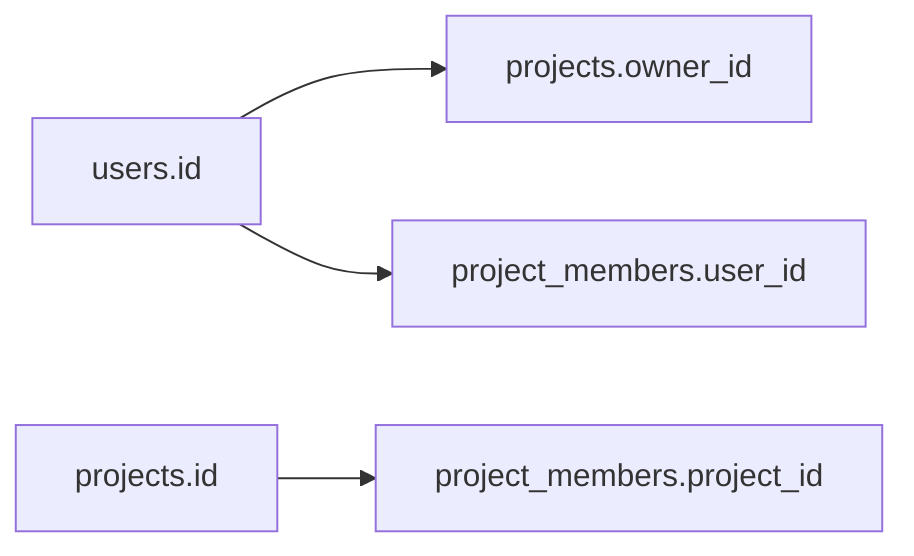

# Month 10 · Week 1 · Day 2
# Primary Keys, Foreign Keys, and Constraints

**Program:** Full-Stack Mastery · 18 months  
**Phase:** 3 — Python and backend  
**Month index:** [../../README.md](../../README.md)  
**Week 1:** [1](day-01.md) · Day 2 (today) · [3](day-03.md) · [4](day-04.md) · [5](day-05.md) · [6](day-06.md) · [7](day-07.md)  
**Week rhythm today:** Exercises + debugging (theory is in this file)  
**Student state:** Day 1 gate passed. You can create a typed table and insert rows. Today those rows must **point at each other on purpose**.  
**Study time:** 3–4 focused hours

**This week covers:** tables, types, keys, constraints, relationships, normalization.

Today: what a **primary key** is, why **foreign keys** exist, `UNIQUE` and `CHECK`, and the three relationship shapes. Normalization gets a full treatment so you can smell a repeating-group table. Junction tables are the many-to-many tool. `ON DELETE` is a decision, not a default you copy.

Labs: `~\fullstack-lab\month-10\week-01\day-02\`. Use database `month10` from Day 1.

---

## How to use this textbook

1. Read a section. Close it. Say it in a full sentence.
2. Type every `CREATE TABLE`. Constraint names in the error message are the lesson.
3. When an insert fails, read the constraint name before you “fix” the SQL.
4. Optional review links are for later rechecking.

---

## How to read this chapter

A **key** is how the database points at a row tomorrow. A **constraint** is a rule the database will **refuse to break**, even if your FastAPI handler has a bug.



**Wrong belief:** “The API will remember to check that the owner exists.”  
**Correct:** the API is a program. Programs have bugs. A foreign key is a **second adult in the room**.

**Wrong belief:** “I’ll store `owner_email` as text on every project and skip keys.”  
**Correct:** emails change. Two spellings of the same person become two people. Point at a **stable id**.

---

## Today's contract

By the end of this day you will be able to:

1. Explain **primary key** vs **unique** vs **foreign key** without mixing the words.
2. Choose a **surrogate** integer identity and still put `UNIQUE` on a natural field (`email`).
3. Draw **one-to-many**, **one-to-one**, and **many-to-many**, and name the extra table for n-n.
4. Write `CHECK` for a real business rule (non-blank title, status in a list).
5. Explain `ON DELETE RESTRICT` vs `CASCADE` and pick **RESTRICT** unless you can say why cascade is safe.
6. Name **1NF / 2NF / 3NF** with a bad table and a repaired one.

**Today's gate.** Closed-book:

> A primary key identifies a row. A foreign key says this id must exist in that other table. UNIQUE is not a primary key. Many-to-many needs a junction table. Constraints are how the database enforces the model when the API is tired.

---

## Time box

| Block | Minutes | Work |
|---|---|---|
| A | 55 | Theory: keys, relationships, normalization |
| B | 70 | Type-along: users, projects, members |
| C | 50 | Independent: tasks with a project FK |
| D | 15 | Git |
| E | 15 | Recall |

---

# Block A — Theory

## 1. Primary key

A **primary key** is the column (or set of columns) the database uses as **the** identity of a row.

Properties you actually need:

- **Unique** — two rows never share it.
- **Not NULL** — identity cannot be “unknown.”
- **Stable** — it should not change because a user edited a form.

Day 1 used `INTEGER GENERATED BY DEFAULT AS IDENTITY PRIMARY KEY`. That is a **surrogate key**: a value invented for identity, not a fact about the world.

An email can be unique **and** still be a poor primary key if people change email addresses. Keep `email TEXT NOT NULL UNIQUE` and let `id` be the primary key.

**Composite primary keys** exist (two columns together). A junction table often uses `(project_id, user_id)` as its primary key. You will type that today.

**Wrong belief:** “Primary key means the column I search by.”  
**Correct:** you search by whatever is useful (`email`, `title`). The primary key is identity. Indexes (Week 4) make searches fast.

## 2. Foreign key

A **foreign key** is a column whose values must match a primary key (or unique key) in another table — or be `NULL` if you allow “no parent.”

```sql
owner_id INTEGER NOT NULL REFERENCES users (id)
```

That line means: every project has an owner, and that owner is a real user row.

If you insert `owner_id = 999` and user 999 does not exist, PostgreSQL **rejects** the insert. That rejection is the feature.

Name the constraint when you want a readable error:

```sql
CONSTRAINT projects_owner_fk
  FOREIGN KEY (owner_id) REFERENCES users (id)
```

`psql` will print `projects_owner_fk`. That is kinder than `fkey_123`.

## 3. UNIQUE and CHECK

`UNIQUE` says no two rows share this value (NULLs are a special case: in PostgreSQL, two NULLs in a unique column are allowed, because `NULL` is not equal to `NULL`). If “email may be missing” and “email must be unique when present,” that is the model. If email is required, `NOT NULL UNIQUE`.

`CHECK` is a boolean expression the row must satisfy:

```sql
CHECK (title <> ''),
CHECK (status IN ('open', 'done', 'archived'))
```

Do not use `CHECK` as a substitute for a **lookup table** when the list will grow every week (countries, tags). A small closed set (`open` / `done`) is a fine CHECK. Tags that users invent belong in a table.

## 4. Three relationship shapes

| Shape | Meaning | How you store it |
|---|---|---|
| **One-to-many** | One user owns many projects | `projects.owner_id → users.id` |
| **One-to-one** | One user has one profile | `profiles.user_id PRIMARY KEY` and FK to `users` |
| **Many-to-many** | Users belong to many projects; projects have many members | Junction: `project_members (project_id, user_id)` |

One-to-one is “one-to-many with a unique FK.” The uniqueness is the whole trick.

Many-to-many **without** a junction table is how people invent comma-separated `member_ids` text columns. That is a list pretending to be a cell. It cannot be a foreign key. It cannot be joined cleanly. Do not do it.

## 5. ON DELETE

When you delete a user, what happens to their projects?

| Action | Meaning | Use when |
|---|---|---|
| **RESTRICT** (or NO ACTION) | Delete fails if children exist | Default for this course |
| **CASCADE** | Delete children too | Only if the child has no meaning without the parent **and** you accept mass deletion |
| **SET NULL** | Child stays; FK becomes NULL | Optional parent |

**Wrong belief:** “CASCADE is convenient, so I always cascade.”  
**Correct:** cascading a user delete into every project and task is how a support tool becomes a weapon. Prefer **RESTRICT**. Make the application archive or reassign first.

## 6. Normalization, in working English

**First normal form (1NF):** one value per cell. No lists in a column. No repeating `tag1, tag2, tag3` columns.

**Second normal form (2NF):** 1NF plus: if the primary key is composite, non-key facts depend on the **whole** key. A junction table should not store `user_email` — that depends only on `user_id`.

**Third normal form (3NF):** non-key facts do not depend on other non-key facts. Do not store `owner_email` on `projects` if you already have `owner_id`. Email lives on `users`.

You do not need to chant “Boyce-Codd” at a gate. You need to **smell** a table that repeats the same email on fifty project rows and split it.

Walk the bad table slowly. A spreadsheet intern ships this:

```text
projects_bad
  id, title, owner_email, owner_name, members  -- members = 'Ada, Lin'
```

Row 1: Atlas, ada@x.com, Ada, `Ada, Lin`.  
Row 2: Northline, ada@x.com, Ada Lovelace, `Lin`.

**1NF fails** because `members` is a list in a cell. You cannot make `Lin` a foreign key. You cannot count members with `COUNT(*)`. A second failure of the same spirit is three columns `member1`, `member2`, `member3`: you invented a fake maximum.

Repair toward 1NF: one **row** per membership. That already wants `project_members`.

Now suppose you “fix” membership like this:

```text
project_members_bad
  PRIMARY KEY (project_id, user_id)
  project_id, user_id, user_email, role
```

**2NF fails** because `user_email` depends only on `user_id`, not on the pair. Ada on five projects stores her email five times. She changes email; four rows lie. `role` may stay: Ada can be `owner` on Atlas and `member` on Northline. That fact depends on the **whole** key.

Put `owner_email` on `projects` as well as `owner_id` and **3NF fails**. Email is a fact about the user. Project → owner → email is a **transitive** dependency. Reports that read `projects.owner_email` disagree with `users.email` the first time someone updates only one table.

Repair:

- `users (id, email UNIQUE, name)`
- `projects (id, title, owner_id FK)`
- `project_members (project_id, user_id, role)` with both FKs

That repair **is** Week 1. Joins to *read* the email are Week 2. Copying the email onto `projects` to “avoid a join” is how 3NF dies before you have measured anything.

**Wrong belief:** “Normalized databases are slow; denormalize from day one.”  
**Correct:** you denormalize after a measured read path, and you still need a way to keep copies honest. This month is the honest schema. Indexes are Week 4.

## 7. How to read a constraint error

PostgreSQL names the rule you broke. Typical shapes:

| You did | The error talks about |
|---|---|
| Two rows with the same PK or UNIQUE | `duplicate key value violates unique constraint` |
| Child row with a missing parent | `violates foreign key constraint` |
| `NULL` in `NOT NULL` | `null value in column … violates not-null constraint` |
| Blank title with CHECK | `violates check constraint` |
| Delete parent while children exist (RESTRICT) | `update or delete on table … violates foreign key constraint` |

Copy the **constraint name** into `NOTES.md`. In `psql`, `\d projects` lists columns, PKs, FKs, and checks. That is how you debug without guessing.

**Wrong belief:** “I’ll add CASCADE so my DELETE tutorial works.”  
**Correct:** CASCADE is a product decision. A user delete that wipes projects is a support incident. Prefer RESTRICT; reassign or archive in the application, then delete.

A throwaway CASCADE demo belongs in a **separate** pair of tables (`cascade_parent` / `cascade_child`), not on `users`. If you run one, drop those tables before you leave the lab.

## 8. Insert order and identity values

Parents first, children second. If `users` is empty, `projects.owner_id` has nowhere to point.

Do not hard-code `1` and `2` in a seed you will rerun after other labs. Identity sequences **do not rewind** when you `DELETE` rows. After a messy afternoon, Ada might be `id = 17`. `SELECT id FROM users WHERE email = 'ada@example.com'` is honest. `INSERT … RETURNING id` is Week 2.

---

# Block B — Type-along

## B1. Folder

```powershell
mkdir ~\fullstack-lab\month-10\week-01\day-02 -Force
cd ~\fullstack-lab\month-10\week-01\day-02
```

If `month10` does not exist, create it as on Day 1.

## B2. Schema file

Create `01-keys.sql`. Type this. Do not paste a generated “saas schema.”

```sql
DROP TABLE IF EXISTS project_members;
DROP TABLE IF EXISTS projects;
DROP TABLE IF EXISTS users;

CREATE TABLE users (
  id INTEGER GENERATED BY DEFAULT AS IDENTITY PRIMARY KEY,
  email TEXT NOT NULL UNIQUE,
  name TEXT NOT NULL,
  created_at TIMESTAMPTZ NOT NULL DEFAULT now(),
  CONSTRAINT users_email_nonblank CHECK (email <> ''),
  CONSTRAINT users_name_nonblank CHECK (name <> '')
);

CREATE TABLE projects (
  id INTEGER GENERATED BY DEFAULT AS IDENTITY PRIMARY KEY,
  title TEXT NOT NULL,
  owner_id INTEGER NOT NULL,
  created_at TIMESTAMPTZ NOT NULL DEFAULT now(),
  CONSTRAINT projects_title_nonblank CHECK (title <> ''),
  CONSTRAINT projects_owner_fk
    FOREIGN KEY (owner_id) REFERENCES users (id)
    ON DELETE RESTRICT
);

CREATE TABLE project_members (
  project_id INTEGER NOT NULL,
  user_id INTEGER NOT NULL,
  role TEXT NOT NULL DEFAULT 'member',
  CONSTRAINT project_members_pk PRIMARY KEY (project_id, user_id),
  CONSTRAINT project_members_project_fk
    FOREIGN KEY (project_id) REFERENCES projects (id) ON DELETE RESTRICT,
  CONSTRAINT project_members_user_fk
    FOREIGN KEY (user_id) REFERENCES users (id) ON DELETE RESTRICT,
  CONSTRAINT project_members_role_check CHECK (role IN ('owner', 'member'))
);

INSERT INTO users (email, name) VALUES
  ('ada@example.com', 'Ada'),
  ('lin@example.com', 'Lin');

INSERT INTO projects (title, owner_id) VALUES
  ('Atlas', 1),
  ('Northline', 1);

INSERT INTO project_members (project_id, user_id, role) VALUES
  (1, 1, 'owner'),
  (1, 2, 'member');
```

Run:

```powershell
psql -U postgres -d month10 -f 01-keys.sql
```

## B3. Make it refuse

Type these **one at a time**. Each must fail. Paste the constraint name into `NOTES.md`.

```sql
-- duplicate email
INSERT INTO users (email, name) VALUES ('ada@example.com', 'Other Ada');

-- blank title
INSERT INTO projects (title, owner_id) VALUES ('', 1);

-- orphan project
INSERT INTO projects (title, owner_id) VALUES ('Ghost', 999);

-- duplicate membership
INSERT INTO project_members (project_id, user_id, role) VALUES (1, 2, 'member');
```

Then try deleting Ada while she still owns a project:

```sql
DELETE FROM users WHERE id = 1;
```

RESTRICT should refuse. Write one sentence: **what** refused, **why** that is safer than CASCADE here.

## B4. A legal extra member

```sql
INSERT INTO users (email, name) VALUES ('grace@example.com', 'Grace');
INSERT INTO project_members (project_id, user_id, role) VALUES (2, 3, 'member');

SELECT p.title, u.email, pm.role
FROM project_members pm
JOIN projects p ON p.id = pm.project_id
JOIN users u ON u.id = pm.user_id
ORDER BY p.id, u.id;
```

If JOIN still feels like magic, you are early — Week 2 will slow it down. Today you only need: **rows meet when ids match**.

---

# Block C — Independent

Create `02-tasks.sql` in the same folder.

Requirements (you write the SQL):

1. Table `tasks` with `id`, `project_id` (FK, NOT NULL, ON DELETE RESTRICT), `title` (non-blank CHECK), `is_done BOOLEAN NOT NULL DEFAULT false`, `created_at`.
2. Insert two tasks on project 1.
3. Prove an orphan task (`project_id = 999`) fails.
4. Optional: `assignee_id INTEGER REFERENCES users (id)` **nullable** — a task may be unassigned. `ON DELETE RESTRICT` still, or `SET NULL` if you can justify “delete user, keep task.” Write the justification in `NOTES.md`.

Do **not** add SQLAlchemy. Do **not** build FastAPI.

Write `WHAT-I-SAW.md`: constraint names from the four failures in B3, plus the orphan task failure.

Optional CASCADE demo — **throwaway** tables only:

```sql
DROP TABLE IF EXISTS cascade_child;
DROP TABLE IF EXISTS cascade_parent;

CREATE TABLE cascade_parent (
  id INTEGER PRIMARY KEY,
  name TEXT NOT NULL
);

CREATE TABLE cascade_child (
  id INTEGER PRIMARY KEY,
  parent_id INTEGER NOT NULL
    REFERENCES cascade_parent (id) ON DELETE CASCADE
);

INSERT INTO cascade_parent VALUES (1, 'P');
INSERT INTO cascade_child VALUES (10, 1);
DELETE FROM cascade_parent WHERE id = 1;
SELECT * FROM cascade_child;
```

`cascade_child` must be empty. One sentence in NOTES: CASCADE deleted the child without asking. Then `DROP TABLE cascade_child; DROP TABLE cascade_parent;`. Do **not** change `projects` to CASCADE.

---

# Block D — Git

```powershell
cd ~\fullstack-lab
git add month-10/week-01/day-02
git commit -m "Month 10 Week 1 Day 2: keys, FKs, junction table."
```

---

# Block E — Recall

1. Why email is UNIQUE but not the primary key.  
2. Why many-to-many needs a third table.  
3. RESTRICT vs CASCADE in one story.  
4. 1NF in one sentence with the comma-separated members example.  
5. What `CHECK (title <> '')` catches that `NOT NULL` does not.

## Office hours

**`relation "users" does not exist`.** You ran `02-tasks.sql` against a database that never got `01-keys.sql`, or you dropped tables and forgot to recreate. Order matters.

**`there is no unique constraint matching given keys`.** A foreign key must point at a PRIMARY KEY or UNIQUE column. You pointed at `users.email` without UNIQUE, or at a column that does not exist.

**I used CASCADE and deleted half the lab.** That is the lesson. Restore from your `.sql` files. Prefer RESTRICT tomorrow.

**`JOIN` in the SELECT scared me.** Fine. Two-step inserts with ids you selected. Week 2 will make JOIN a first-class skill. Today “rows meet when ids match” is enough.

**Docker?** Not the gate. Local PostgreSQL on Windows is enough. Month 15 is containers.

**Ids are not 1 and 2.** Sequences do not reset on DELETE. Select by email.

---

## Definition of done

- [ ] `users`, `projects`, `project_members` exist with named FKs  
- [ ] Four refusals recorded by constraint name  
- [ ] Independent `tasks` table with a real FK  
- [ ] NOTES explain RESTRICT  
- [ ] Commit exists  

---

## Tomorrow

From memory you will draw and `CREATE` three related tables. Today’s files stay closed for the first 25 minutes. The recap lives in Day 3.

---

## Optional review links

Keys and constraints are explained in this chapter. These pages are for later checking, not for first learning.

- [PostgreSQL: Constraints](https://www.postgresql.org/docs/current/ddl-constraints.html)
- [PostgreSQL: CREATE TABLE](https://www.postgresql.org/docs/current/sql-createtable.html)
