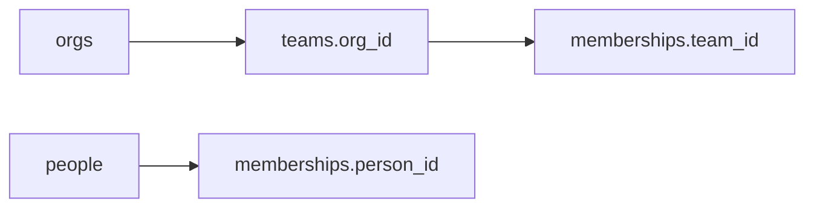

# Month 10 · Week 1 · Day 3
# From Memory: Three Related Tables

**Program:** Full-Stack Mastery · 18 months  
**Phase:** 3 — Python and backend  
**Month index:** [../../README.md](../../README.md)  
**Week 1:** [1](day-01.md) · [2](day-02.md) · Day 3 (today) · [4](day-04.md) · [5](day-05.md) · [6](day-06.md) · [7](day-07.md)  
**Week rhythm today:** Implement from memory  
**Student state:** Day 2 gate passed. You typed PK, FK, UNIQUE, CHECK, and a junction table. Today those ideas must still live in your head — from **this file**.  
**Study time:** 3–4 focused hours  
**Prereq:** Day 2 gate passed.

Labs: `~\fullstack-lab\month-10\week-01\day-03\`. Do **not** copy Day 2 `.sql` files. Do **not** implement Project 6. Do **not** reopen Atlas users/projects for the first **25 minutes** of Block 2. Today’s nouns are **orgs, people, teams, memberships** so you cannot paste yesterday.

---

## How Day 3 works

Days 1–2 stay **closed** during the build. This file contains the recap so you are not sent to another site to learn.

Allowed:

- The complete explanation in this file
- Your own notes in `fullstack-lab` that you wrote **before** today
- `psql` error messages in front of you

Not allowed:

- Pasting a schema from AI
- Copying `day-02/01-keys.sql`
- Browsing PostgreSQL docs as the teacher during the build

If you are stuck **more than 25 minutes** on one task, open **only** the matching Day 1 or Day 2 section **in this textbook**, read it, close it, continue from memory. Record what you had to look up in `lookups.txt`. That list is Day 4’s repair list.

There is **no complete schema** in this file. The domain is specified. You write `CREATE TABLE`.

---

## How to read this chapter

A tiny operational model is three or four tables that **refuse orphans**. Cardinality is not a nested JSON list. It is a foreign key, or a junction table whose primary key is a pair.



**Wrong belief:** “Memory day means I reopen Day 2 with the file beside `psql`.”  
**Correct:** the recap below is the teacher. Days 1–2 are backup after 25 minutes.

---

## Complete explanation (keys you must still own)

A **table** is a named set of **rows** with the same **typed columns**. A row is one entity: one org, one person, one team. `NOT NULL` refuses SQL NULL. `NULL` means unknown or missing; it is not the number zero and not the empty string `''`. Day 1 proved that `INSERT … VALUES ('')` can succeed under `NOT NULL`. If blank is illegal, you need `CHECK (col <> '')` as well.

A **primary key** uniquely identifies a row and cannot be NULL. This course prefers a **surrogate**:

```sql
id INTEGER GENERATED BY DEFAULT AS IDENTITY PRIMARY KEY
```

A natural unique field (`email`, org `code`) is usually `UNIQUE NOT NULL` **in addition** to `id`. People change emails. Child tables should not chase a changing PK. A table has **one** primary key and may have several UNIQUE constraints.

**UNIQUE** means at most one copy of that value among rows (two NULLs in a UNIQUE column are allowed in PostgreSQL, because `NULL` is not equal to `NULL`). Composite unique is how you say the **pair** is unique: `UNIQUE (org_id, name)` on teams means two orgs may both have a team named Platform, but one org may not have two Platforms. Unique `name` alone would be the wrong sentence.

**CHECK** is a boolean expression the row must satisfy. Name it: `CONSTRAINT people_email_not_blank CHECK (email <> '')`. Unnamed checks produce ugly auto names in errors. A small closed set (`role IN ('lead', 'member')`) is a fine CHECK. A list that grows every week belongs in a table, not an endless CHECK.

A **foreign key** says this column’s value must match a parent primary key (or unique key), or be NULL if the column allows it. Insert **parents first**. `INSERT INTO teams (org_id, name) VALUES (999, 'Ghost')` **must fail** if org 999 does not exist. That failure is the feature. Month 9 caught orphans in Python. Month 10 makes the insert impossible.

**ON DELETE RESTRICT** (this course’s lab default, close to `NO ACTION`): you cannot delete a parent while children still point at it. That is annoying and correct. **ON DELETE CASCADE** deletes the children too. Use CASCADE only when the child is owned debris with no independent meaning — and you accept a silent wipe. Do not enable CASCADE so a DELETE tutorial “works.” **SET NULL** is for optional parents. Write a sentence if you use it.

**One-to-many:** the FK lives on the **many** side. `teams.org_id → orgs.id`. One org, many teams.

**One-to-one:** a FK that is also UNIQUE, often as the child’s PK. Two profiles cannot share a person.

**Many-to-many:** a **junction** table. Composite PK `(team_id, person_id)`. Attributes of the **relationship** (`role`, `joined_at`) live on the junction, not copied onto both parents. If you store `members TEXT` as `'Ada,Lin'` you cannot foreign-key Lin and you cannot query “teams Ada is on” without string surgery. That is a 1NF failure.

**1NF:** atomic cells; no lists in a cell; no `member1, member2` columns. **2NF:** if the key is composite, non-key columns depend on the **whole** key — do not store `person_email` on `(team_id, person_id)`. **3NF:** do not copy `org_name` onto every team row; store `org_id` and join later (Week 2). Copying names is how Ada is spelled two ways on two rows.

`CREATE TABLE` order: parents before children. `DROP` children before parents. `DROP TABLE IF EXISTS … CASCADE` smashes dependent objects; use it only when you mean to wipe a lab, not as a reflex.

Identity sequences **do not rewind** after DELETE. Never assume `id = 1` after other labs. `SELECT id FROM orgs WHERE code = 'acme'` is honest. `INSERT … RETURNING id` is Week 2.

Connect with `psql -U postgres -d month10`. `\d table_name` lists keys. Errors name constraints. Read the name before you change SQL.

**Wrong belief:** “I’ll add FKs later when the API is done.”  
**Correct:** later never comes, and the API will insert ghosts. Constraints are the model.

**Wrong belief:** “A junction table is overkill for two names.”  
**Correct:** two names become twenty. The junction is the many-to-many **shape**, not a size optimization.

**Wrong belief:** “IDENTITY means I never SELECT ids.”  
**Correct:** children need the parent’s id. Look it up. Do not hard-code 1 and 2 in a seed you will rerun.

---

## Today's contract

By the end of this day you will be able to:

1. Draw orgs, people, teams, and memberships without yesterday’s SQL.  
2. Write `CREATE TABLE` with PK, FK, UNIQUE (including composite), and CHECK.  
3. Prove an orphan team insert fails.  
4. Prove per-org unique team names: same name, two orgs, succeeds; same name, same org, fails.  
5. Prove DELETE org fails while teams exist (RESTRICT).  
6. Write `lookups.txt` honestly.

**Today's gate.** Closed-book:

> I can create related tables with PK/FK/UNIQUE/CHECK, a junction for n-n, prove an orphan insert fails, and explain RESTRICT without opening Day 2. Composite UNIQUE `(org_id, name)` is not the same as UNIQUE `name`.

---

## Time box

| Block | Minutes | Work |
|---|---|---|
| 1 | 35 | Speak the recap; sketch ER |
| 2 | 90 | CREATE + inserts + refusal proofs (Day 2 closed 25 min) |
| 3 | 40 | Independent: 1–1 org_settings + lookups repair |
| 4 | 20 | Git + NOTES |
| 5 | 15 | Recall |

---

# Block 1 — Speak and sketch

On paper (or `ER.md`), draw **orgs**, **people**, **teams**, and **memberships**:

- An org has many teams (1-n). FK on `teams`.  
- A person can sit on many teams; a team has many people (n-n) via `memberships`.  
- `people.email` unique, non-blank.  
- `teams.name` unique **per org** (`UNIQUE (org_id, name)`), not globally unique.  
- `memberships.role` in `('lead', 'member')`.  
- All FKs `ON DELETE RESTRICT`.

Speak aloud: primary key, foreign key, junction, RESTRICT, why Platform can exist twice in the company if two orgs need it. If you cannot, re-read the recap. Do not open Day 2 yet.

Mermaid `erDiagram` in `ER.md` is welcome. A photo of paper is not a substitute for a file in git.

---

# Block 2 — Build from the spec

```powershell
mkdir ~\fullstack-lab\month-10\week-01\day-03 -Force
cd ~\fullstack-lab\month-10\week-01\day-03
```

Use database `month10` with a prefix `d3_` on table names so you do not smash Day 2, **or** `CREATE DATABASE month10d3;`. Write the choice in `NOTES.md`.

Write `00-reset.sql` (children first):

```sql
DROP TABLE IF EXISTS d3_memberships;
DROP TABLE IF EXISTS d3_teams;
DROP TABLE IF EXISTS d3_people;
DROP TABLE IF EXISTS d3_orgs;
```

Write `schema.sql` yourself. Required pieces — no complete dump in this file:

- IDENTITY PKs  
- `REFERENCES … ON DELETE RESTRICT` written explicitly  
- UNIQUE on `people.email`  
- UNIQUE `(org_id, name)` on teams  
- Composite PK on memberships `(team_id, person_id)`  
- CHECK on role; CHECK email and names not blank  

**Timer:** 25 minutes of schema plus the first orphan insert with Day 2 **closed**. If you miss FK syntax, look up **only** the CREATE TABLE foreign key section in Day 2, close it, type from memory, log the lookup.

```powershell
psql -U postgres -d month10 -f 00-reset.sql
psql -U postgres -d month10 -f schema.sql
```

Then seed and prove. You write `seed.sql` and `proofs.sql`. Intents:

1. Insert one org, two people, two teams, three memberships (one person on two teams is the n-n proof). Look up ids by email/code; do not assume `1`.  
2. `INSERT` a team with `org_id = 999` — must fail.  
3. `INSERT` a duplicate email — must fail.  
4. `INSERT` a second team with the same name in the **same** org — must fail; same name in a **second** org — must succeed.  
5. `DELETE` an org that still has teams — must fail under RESTRICT.  
6. `INSERT` a membership with a missing `person_id` — must fail.  
7. `INSERT` `role = 'superadmin'` — must fail CHECK.

Save outputs in `PROOF.md` with **constraint names**. If step 5 succeeds, you used CASCADE or forgot the FK. Fix the schema. Do not celebrate a successful parent delete.

---

# Block 3 — Independent

Add **`d3_org_settings`**: a 1–1 table. Each org may have **at most one** settings row. The settings primary key **is** `org_id` and that column **references** `d3_orgs(id) ON DELETE RESTRICT`.

Columns: `org_id`, `timezone TEXT NOT NULL`, `updated_at TIMESTAMPTZ NOT NULL DEFAULT now()`, CHECK timezone `<> ''`.

Prove:

- two settings rows for the same org fail (PK).  
- settings for a missing org fail (FK).  
- deleting an org that has settings fails (RESTRICT) — you already cannot delete an org with teams; test settings on a **new** org with no teams, or delete memberships/teams first in a throwaway experiment and record the order.

Write `ONE-TO-ONE.md`: five to eight sentences. Why PK=FK is 1–1. What would have happened if `org_id` were not unique.

If `lookups.txt` is empty, good. If not, re-type the weak piece **without** copying Day 2 as a blob.

---

# Block 4 — Git

```powershell
cd ~\fullstack-lab
git add month-10\week-01\day-03
git commit -m "Month 10 Week 1 Day 3: orgs, teams, memberships from memory."
```

---

# Block 5 — Recall

1. Why `(org_id, name)` unique is not the same as `name` unique.  
2. Junction PK choice — why the pair, not a surrogate only.  
3. Insert order: parents, then children, then junction.  
4. What RESTRICT protected when you tried to delete an org.  
5. 1NF vs a `members TEXT` column.  
6. What went in `lookups.txt`.

## Office hours

**`unique constraint` on the wrong columns.** Read your `UNIQUE (...)`. Global unique vs per-parent unique are different sentences.

**Drop order.** Children first, or you will fight `because other objects depend on it`.

**Ids keep climbing after DROP TABLE.** Sequences can remain if you only DELETE rows. After DROP TABLE, a new CREATE usually starts identity at 1 — unless you used `GENERATED BY DEFAULT` and inserted explicit ids. Still look up ids in seeds.

**I opened Day 2 at minute three.** Write it in `lookups.txt`. Redo CREATE once with the file closed. Honesty is the gate.

**I built users/projects/Atlas again.** Wrong domain. The point of Day 3 is transfer.

---

## Definition of done

- [ ] ER.md exists  
- [ ] Schema created without copying Day 2 files  
- [ ] Seven proofs (or the listed five plus two extras) in PROOF.md  
- [ ] 1–1 org_settings proved  
- [ ] lookups.txt exists (even if it says “none”)  
- [ ] Commit exists  

---

## Tomorrow

Lab feature: **CHECK (title <> '')**, **unique email**, and **tasks** that cannot be orphans. You will harden a small tracker-shaped schema and collect failing inserts as a checklist.

---

## Extra modeling notes (if Block 2 felt thin)

**Per-parent uniqueness in one paragraph.** Global `UNIQUE (name)` on teams says there is only one “Platform” in the whole database. Composite `UNIQUE (org_id, name)` says there is only one “Platform” **inside an org**. Those are different products. A multi-tenant ops API almost always wants the composite. If you put only `UNIQUE (name)` today, two real companies cannot both have a Platform team. That is not a PostgreSQL quirk. That is the wrong sentence.

**Membership is not a column on people.** `people.team_id` would be 1–n (one team per person). The spec is n–n. The extra table is not bureaucracy. It is the only place `role` can live without lying: Ada is lead on Platform and member on Design. Two roles, two membership rows, one person row.

**Seed without magic ids.** After other weeks share `month10`, identity values are not a lesson plan. `INSERT INTO d3_orgs (code, name) VALUES ('acme', 'Acme');` then `SELECT id FROM d3_orgs WHERE code = 'acme'`. If you insist on writing `org_id = 1` in the seed, rerun from `00-reset.sql` in the same session and still record the selected ids in PROOF.md once.

Write `COMPOSITE.md` (six to ten sentences) answering: what would break if team names were globally unique; what would break if memberships used a surrogate PK **without** UNIQUE `(team_id, person_id)`.

---

# Drop order as a sentence

`d3_memberships` references teams and people. `d3_teams` references orgs. `d3_org_settings` references orgs. Drop memberships and settings before teams and people, then orgs. If you `DROP TABLE d3_orgs` first, PostgreSQL refuses (RESTRICT) or cascades if you asked it to. Type the DROP list in `00-reset.sql` in dependency order. That order is a model of the graph.

## Role CHECK vs role table

`lead` / `member` is a closed set. CHECK is honest. If Day 6’s product will add roles weekly, a `roles` table is better — not required today. Do not CHECK twenty strings.

Write `ROLE.md` only if you added a third role; otherwise skip.

## Proof table (fill in PROOF.md)

| # | Intent | Constraint name |
|---|---|---|
| 2 | orphan team | |
| 3 | duplicate email | |
| 4a | duplicate team name same org | |
| 4b | same name second org succeeds | (no error) |
| 5 | delete org with teams | |
| 6 | orphan membership | |
| 7 | bad role | |

Empty names mean you did not run it. Fill them.

---

## Optional review links

The recap in this chapter is the lesson. These pages are for later checking, not for first learning.

- [PostgreSQL: Constraints](https://www.postgresql.org/docs/current/ddl-constraints.html)
- [PostgreSQL: CREATE TABLE](https://www.postgresql.org/docs/current/sql-createtable.html)
