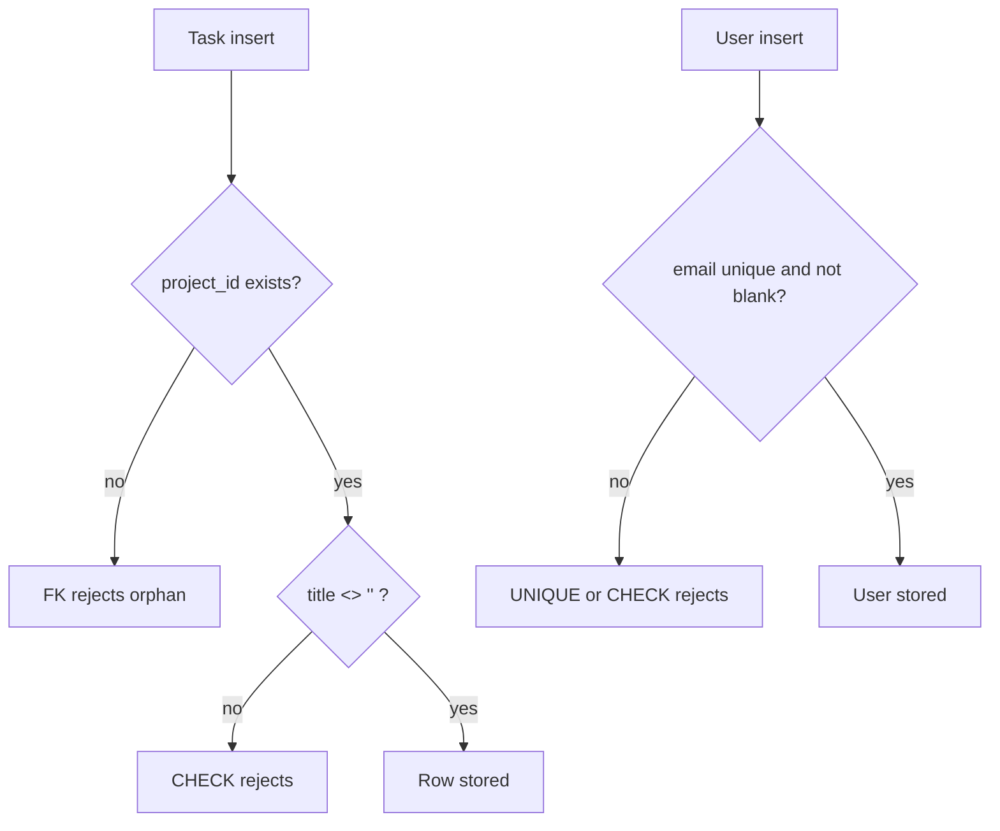

# Month 10 · Week 1 · Day 4
# Lab: CHECK, Unique Email, and No Orphan Tasks

**Program:** Full-Stack Mastery · 18 months  
**Phase:** 3 — Python and backend  
**Month index:** [../../README.md](../../README.md)  
**Week 1:** [1](day-01.md) · [2](day-02.md) · [3](day-03.md) · Day 4 (today) · [5](day-05.md) · [6](day-06.md) · [7](day-07.md)  
**Week rhythm today:** Lab feature  
**Student state:** You can CREATE related tables from memory. Today you **harden** a small tracker schema so blank titles, duplicate emails, and orphan tasks are **impossible**.  
**Study time:** 3–4 focused hours

Labs: `~\fullstack-lab\month-10\week-01\day-04\`. Database `month10` (prefix `d4_` recommended). Prefer **ON DELETE RESTRICT**. No SQLAlchemy. No FastAPI. Do not paste Project 6.

---

## How to use this textbook

1. Read why each rule belongs in the database, then type the SQL.  
2. A feature is not done until a **failing insert** proves it.  
3. `ALTER TABLE` and “drop and recreate” are both legal today; document which you chose.  
4. Optional review links are for later rechecking.

---

## How to read this chapter

Day 2 taught keys. Day 3 proved you could place them without a cheat sheet. Today the product rule is: **the database refuses three lies**.



**Wrong belief:** “I’ll trim titles in FastAPI, so CHECK is duplicate work.”  
**Correct:** FastAPI is one client. `psql`, a future job, and a buggy retry all write SQL. The rule belongs next to the data.

**Wrong belief:** “Orphan tasks are a 404 in the API; the table can be loose.”  
**Correct:** a 404 is what you tell HTTP **after** a lookup. An orphan **row** is a lie already on disk. Foreign keys stop the lie from landing.

---

## Today's contract

By the end of this day you will be able to:

1. Add **`CHECK (title <> '')`** so `NOT NULL` is not mistaken for “not blank.”  
2. Enforce **unique email** with a named UNIQUE constraint you can quote from an error.  
3. Create **`tasks`** with `project_id` **NOT NULL** and **REFERENCES … ON DELETE RESTRICT**.  
4. Prove three refusals: blank title, duplicate email, orphan `project_id`.  
5. Explain why **RESTRICT** on task → project is the default, not CASCADE.  
6. Keep a **checklist** of statements that must fail (Day 5 turns this into SCHEMA.md).

**Today's gate.** Closed-book:

> NOT NULL allows ''. CHECK can forbid blank titles. UNIQUE on email is not a primary key. A task without a real project is an orphan; the FK must reject it. I prefer ON DELETE RESTRICT so deleting a project with tasks fails until I decide what to do with the work.

---

## Time box

| Block | Minutes | Work |
|---|---|---|
| A | 45 | Theory: CHECK vs NOT NULL, UNIQUE vs PK, orphans, ALTER vs rebuild |
| B | 75 | Type-along: schema + required refusals |
| C | 55 | Independent: status CHECK, nullable assignee, labels optional |
| D | 20 | Git + CHECKLIST.md |
| E | 15 | Recall |

---

# Block A — Theory

## 1. Why this lab exists

Keys without CHECKs still accept `title = ''`. Unique without a name still works, but the error is harder to teach a teammate. Tasks without an FK still accept `project_id = 99999`. Each of those rows will survive into Month 11’s ORM as “perfectly valid models.”

The lab is three **invariants**:

1. A user email is present, not blank, and unique.  
2. A project title is present and not blank.  
3. A task belongs to a project that exists.

An **invariant** is a sentence that must remain true after every successful statement. Week 3 will put several row changes in one transaction. Today one statement at a time is enough — if each statement that would break an invariant **fails**.

This is still the Week 1 modeling week. You are not learning SELECT fluency yet. You are making a schema that Week 2 can query without lying.

## 2. NOT NULL is not “not blank”

`NOT NULL` means the cell is not SQL NULL. The empty string is a value of type TEXT. Forms send it when the user clicks Save on an empty box. Day 1 already showed this. Today you close the hole.

```sql
CONSTRAINT d4_projects_title_not_blank CHECK (title <> '')
```

`<>` means “not equal.” If `title` were NULL, `title <> ''` would be **unknown**, not true, and CHECK fails for NULL unless you wrote `CHECK (title IS NULL OR title <> '')`. Keep `title TEXT NOT NULL` **and** the CHECK. Together: missing is illegal; blank is illegal.

Whitespace-only titles (`'   '`) still pass `<> ''`. A stricter check is `CHECK (btrim(title) <> '')`. Use it if you want; mention it in NOTES.md. Do not pretend `<> ''` trims.

**Wrong belief:** “I’ll use VARCHAR(1) minimum somehow.”  
**Correct:** a minimum length is CHECK (`char_length(title) >= 1` is the same hole as `<> ''`). VARCHAR(255) is a **maximum**, and a weak one unless the business named 255.

## 3. Unique email, named

```sql
CONSTRAINT d4_users_email_key UNIQUE (email)
```

or `email TEXT NOT NULL UNIQUE`. Naming the constraint makes `psql` errors say `d4_users_email_key`. That name belongs in Day 5’s SCHEMA.md.

UNIQUE is **not** the primary key. The PK stays `id`. Email can change; ids on `tasks.assignee_id` should not have to change with it. That is the same identity lesson as Day 2, now as a lab you can fail on purpose.

Duplicate insert: same email, different display name. Must fail.

Case: PostgreSQL UNIQUE on TEXT is **case-sensitive** by default. `Ada@Example.com` and `ada@example.com` are two values. If your product treats email as case-insensitive, you need a unique index on `lower(email)` — Week 4 indexes. Today note the limitation in NOTES.md rather than invent a partial index you cannot explain.

**Wrong belief:** “UNIQUE email means email should be the PK.”  
**Correct:** unique login is a business rule. Stable `id` is identity. Both can exist.

## 4. Orphan tasks

A **task** is work that belongs to a **project**. If `project_id` points nowhere, every JOIN next week drops the row or fabricates a hole. Month 9 called a missing parent a **409 or 422**. Month 10 can make the insert **impossible**.

```sql
project_id INTEGER NOT NULL,
CONSTRAINT d4_tasks_project_fk
  FOREIGN KEY (project_id) REFERENCES d4_projects (id)
  ON DELETE RESTRICT
```

`NOT NULL` means “must have a project.” The FK means “that project exists.” RESTRICT means “you cannot DELETE the project while tasks still point at it.”

**Wrong belief:** “ON DELETE CASCADE is fine; if the project is gone, tasks should vanish.”  
**Correct:** maybe, if tasks are not an audit trail. This course still prefers RESTRICT until you write a sentence: *tasks are owned debris and we intend a wipe.* Ops APIs almost always want “archive the project” or “move tasks” rather than silent delete. Day 2’s user-delete story still applies.

Insert order: users → projects → tasks.

A nullable `project_id` would mean “inbox tasks with no project.” That is a different product. If you want it, you still need the FK (orphans of id 99999 remain illegal); only NULL would mean unassigned. Today’s spec is **NOT NULL**. Do not weaken it to make a demo insert easier.

## 5. ALTER TABLE versus rebuild

You can:

```sql
ALTER TABLE d4_projects
  ADD CONSTRAINT d4_projects_title_not_blank CHECK (title <> '');
```

If a blank title **already exists**, ALTER **fails** until you UPDATE or DELETE the bad row. That is a gift: the database refuses to add a rule the current data breaks.

Drop and recreate (`DROP TABLE …` in dependency order, then CREATE) is cleaner in a lab. It is **not** how you treat production later (Alembic, Month 11). Today, either path is allowed. Write `APPROACH.md` with one paragraph: ALTER vs rebuild, and whether you had to clean a blank row first.

`ALTER TABLE … ADD CONSTRAINT … FOREIGN KEY` is how you add an FK that Day 1 forgot. Existing orphan rows **block** the ADD. You must delete or fix orphans first. Remember that sentence for Day 5’s checklist.

## 6. Parameterized inserts (habit, even in a SQL lab)

When Python appears (optional Day 5), user-supplied title and email go through **placeholders**, never string concatenation:

```python
cur.execute(
    "INSERT INTO d4_users (email, name) VALUES (%s, %s)",
    (email, name),
)
```

Today you type literals in `.sql` files. That is fine for a lab you control. Do not build `INSERT … VALUES ('" + email + "')` in a scratch `.py`. Concatenation is how injection begins. Month 13 deepens this; the habit starts when the first user-shaped string exists.

## 7. Status CHECK versus a lookup table

A task `status` of `open` / `done` / `archived` is a **closed set**. CHECK is honest. If product people will add statuses every sprint, a `task_statuses` table and an FK is the grown-up form. Do not write `CHECK (status IN ('open', 'done', … twenty values))` as a lifestyle. Today three values is enough.

Labels that users invent are **not** a CHECK. They are a table, and applying them is n–n (`task_labels`). Optional independent work. Comma-separated `labels TEXT` is the 1NF failure you already know.

---

# Block B — Type-along

```powershell
mkdir ~\fullstack-lab\month-10\week-01\day-04 -Force
cd ~\fullstack-lab\month-10\week-01\day-04
```

Create `00-reset.sql`. Drop **today’s** working set. Children first:

```sql
DROP TABLE IF EXISTS d4_task_labels;
DROP TABLE IF EXISTS d4_labels;
DROP TABLE IF EXISTS d4_tasks;
DROP TABLE IF EXISTS d4_projects;
DROP TABLE IF EXISTS d4_users;
```

Create `01-schema.sql`. Type this shape:

```sql
CREATE TABLE d4_users (
  id INTEGER GENERATED BY DEFAULT AS IDENTITY PRIMARY KEY,
  email TEXT NOT NULL,
  name TEXT NOT NULL,
  created_at TIMESTAMPTZ NOT NULL DEFAULT now(),
  CONSTRAINT d4_users_email_key UNIQUE (email),
  CONSTRAINT d4_users_email_not_blank CHECK (email <> ''),
  CONSTRAINT d4_users_name_not_blank CHECK (name <> '')
);

CREATE TABLE d4_projects (
  id INTEGER GENERATED BY DEFAULT AS IDENTITY PRIMARY KEY,
  owner_id INTEGER NOT NULL,
  title TEXT NOT NULL,
  created_at TIMESTAMPTZ NOT NULL DEFAULT now(),
  CONSTRAINT d4_projects_title_not_blank CHECK (title <> ''),
  CONSTRAINT d4_projects_owner_fk
    FOREIGN KEY (owner_id) REFERENCES d4_users (id)
    ON DELETE RESTRICT
);

CREATE TABLE d4_tasks (
  id INTEGER GENERATED BY DEFAULT AS IDENTITY PRIMARY KEY,
  project_id INTEGER NOT NULL,
  title TEXT NOT NULL,
  is_done BOOLEAN NOT NULL DEFAULT false,
  created_at TIMESTAMPTZ NOT NULL DEFAULT now(),
  CONSTRAINT d4_tasks_title_not_blank CHECK (title <> ''),
  CONSTRAINT d4_tasks_project_fk
    FOREIGN KEY (project_id) REFERENCES d4_projects (id)
    ON DELETE RESTRICT
);
```

```powershell
psql -U postgres -d month10 -f 00-reset.sql
psql -U postgres -d month10 -f 01-schema.sql
```

Create `02-seed.sql`. Look up ids; do not assume `1` if this database has history. After a fresh CREATE, `1` may be correct **this run** — still prefer email lookups:

```sql
INSERT INTO d4_users (email, name) VALUES
  ('ada@example.com', 'Ada'),
  ('lin@example.com', 'Lin');

INSERT INTO d4_projects (owner_id, title)
SELECT id, 'Atlas' FROM d4_users WHERE email = 'ada@example.com';

INSERT INTO d4_tasks (project_id, title)
SELECT p.id, 'Write SCHEMA.md'
FROM d4_projects p
WHERE p.title = 'Atlas';
```

```powershell
psql -U postgres -d month10 -f 02-seed.sql
```

Create `03-refusals.sql`. Run **one statement at a time**. Each must fail. Paste the **constraint name** into `CHECKLIST.md` (columns: action, expected failure, actual constraint name).

```sql
-- 1. Duplicate email
INSERT INTO d4_users (email, name)
VALUES ('ada@example.com', 'Impostor');

-- 2. Blank email
INSERT INTO d4_users (email, name)
VALUES ('', 'No Mail');

-- 3. Blank project title
INSERT INTO d4_projects (owner_id, title)
SELECT id, '' FROM d4_users WHERE email = 'ada@example.com';

-- 4. Orphan task — this is the gate proof
INSERT INTO d4_tasks (project_id, title)
VALUES (99999, 'Ghost work');

-- 5. Blank task title (real project)
INSERT INTO d4_tasks (project_id, title)
SELECT p.id, ''
FROM d4_projects p
WHERE p.title = 'Atlas';

-- 6. Delete project while a task exists (RESTRICT)
DELETE FROM d4_projects WHERE title = 'Atlas';
```

If 6 succeeds, your FK is missing or you used CASCADE. Fix the schema and rerun from reset. Atlas must still be there; the task must still be there.

Write `APPROACH.md`: rebuild vs ALTER; whether any existing blank row blocked a CHECK.

Optional JOIN check (Week 2 will go deeper; today matching ids is enough):

```sql
SELECT t.title, p.title AS project
FROM d4_tasks t
JOIN d4_projects p ON p.id = t.project_id
ORDER BY t.id;
```

---

# Block C — Independent

Add these **without** a complete dump in this textbook. You write `04-independent.sql`.

1. **`status` on tasks:** `TEXT NOT NULL DEFAULT 'open'` with `CHECK (status IN ('open', 'done', 'archived'))`. Insert `status = 'flying'` must fail. Decide what happens to `is_done` — either drop it and use status, or keep both and write one sentence about the redundancy (it is a 3NF smell if both mean the same fact).  
2. **`assignee_id`:** nullable FK to `d4_users(id) ON DELETE RESTRICT` **or** `ON DELETE SET NULL` with a written justification in `ASSIGNEE.md`. Insert `assignee_id = 99999` must fail. Insert `assignee_id = NULL` must succeed. Do not use `0` as a sentinel.  
3. **Unique task title per project?** Optional. If you add `UNIQUE (project_id, title)`, two Atlas tasks named `Write SCHEMA.md` must fail, but another project may reuse the title. If you skip it, write why titles are not unique in your model.  
4. **Labels (optional n–n):** `d4_labels` + `d4_task_labels` composite PK. Comma-separated `labels TEXT` is forbidden. Prove an orphan `label_id` fails.

Write `WHAT-I-SAW.md`: every new constraint name, plus one paragraph on RESTRICT vs SET NULL for assignee.

Do not add SQLAlchemy. Do not start `~/ops-api` schema here unless you are only taking notes — Day 6 is independent Project 6 Stage B.

---

# Block D — Git

`CHECKLIST.md` must exist before you commit.

```powershell
cd ~\fullstack-lab
git add month-10\week-01\day-04
git commit -m "Month 10 Week 1 Day 4: CHECK, unique email, orphan tasks refused."
```

---

# Block E — Recall

1. Why `NOT NULL` did not catch Day 1’s empty title.  
2. UNIQUE vs PRIMARY KEY for email.  
3. What insert proves the task FK works.  
4. Why ALTER CHECK can fail on existing rows.  
5. One sentence: parameterized queries vs concatenating email.  
6. Why CASCADE on project delete is a product decision.

## Office hours

**`check constraint is violated by some row`.** You added CHECK while a blank title already lived in the table. UPDATE or DELETE that row, then ALTER again — or rebuild.

**Orphan insert succeeded.** No FK, or you pointed at a project that exists. `SELECT id FROM d4_projects;`. 99999 is not magic if you actually have that id (you will not, unless you forced it).

**`DELETE FROM d4_projects` succeeded.** CASCADE or no child rows. `\d d4_tasks` and look at `On delete`.

**Duplicate email succeeded with different case.** Default TEXT UNIQUE is case-sensitive. Note it; do not “fix” with `citext` you cannot explain unless you read the type.

**`syntax error at or near "CHECK"`.** CHECK is a table constraint or column constraint; commas between column definitions. Read the statement `psql` points at.

---

## Definition of done

- [ ] Named UNIQUE on email; duplicate insert fails  
- [ ] CHECK rejects blank project title and blank task title  
- [ ] Orphan task insert fails  
- [ ] Project DELETE fails while tasks exist (RESTRICT)  
- [ ] CHECKLIST.md has constraint names  
- [ ] Independent status + assignee proved  
- [ ] Commit exists  

---

## Tomorrow

Documentation day: **SCHEMA.md** plus a **failing checklist** you can rerun. Optional tiny **psycopg** test that the orphan insert fails. The database remains the source of truth; Markdown is how a teammate learns it without guessing.

---

## Why these three refusals belong together

Duplicate email, blank title, and orphan task look like three unrelated syntax drills. They are one idea: **the database is the product rule**. HTTP can still return 409/422 with a friendly body. That body is for clients. The table is for truth. If Month 11’s ORM “forgets” a check, PostgreSQL will not.

Write `THREE-LIES.md` (a short page): the lie each refusal prevents, and what a report would show if the refusal were missing.

---

## Optional review links

CHECK, UNIQUE, and ALTER are explained in this chapter. These pages are for later checking, not for first learning.

- [PostgreSQL: Constraints](https://www.postgresql.org/docs/current/ddl-constraints.html)
- [PostgreSQL: ALTER TABLE](https://www.postgresql.org/docs/current/sql-altertable.html)
- [PostgreSQL: CREATE TABLE](https://www.postgresql.org/docs/current/sql-createtable.html)
