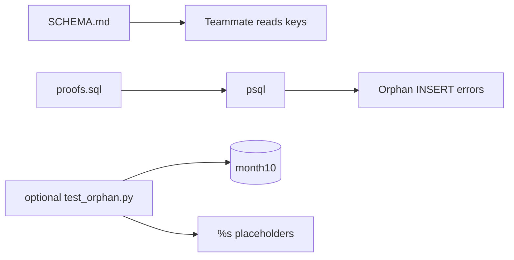

# Month 10 · Week 1 · Day 5
# SCHEMA.md, a Failing Checklist, and an Optional psycopg Test

**Program:** Full-Stack Mastery · 18 months  
**Phase:** 3 — Python and backend  
**Month index:** [../../README.md](../../README.md)  
**Week 1:** [1](day-01.md) · [2](day-02.md) · [3](day-03.md) · [4](day-04.md) · Day 5 (today) · [6](day-06.md) · [7](day-07.md)  
**Week rhythm today:** Tests, refactor, docs  
**Student state:** Day 4 refused blank titles, duplicate emails, and orphan tasks. Today you **write that down** so a teammate (and future you) can rerun the proof.  
**Study time:** 3–4 focused hours

Labs: `~\fullstack-lab\month-10\week-01\day-05\`. Copy **your** Day 4 SQL forward; do not paste a new internet schema. Do not start SQLAlchemy. Docker is not the gate.

---

## How to use this textbook

1. SCHEMA.md is a **document you write**, not `\d` pasted blindly.  
2. A checklist item is not done until you have seen the failure **this session**.  
3. If you write Python, use **psycopg placeholders** (`%s`). Never concatenate SQL.  
4. Optional review links are for later rechecking.

---

## How to read this chapter

Month 9’s CONTRACT.md was the HTTP promise. **SCHEMA.md** is the data promise: tables, keys, what must fail. `psql` is manual. A **failing checklist** is the regression net for constraints: insert orphan **must** fail. Optional **psycopg** is TestClient’s analog — a script that talks to PostgreSQL the way FastAPI will next month, still with **raw SQL**.



**Wrong belief:** “The SQL files are self-explanatory.”  
**Correct:** six months from now you will not remember why `status` is a CHECK and not a table. Write the sentence today.

**Wrong belief:** “Tests mean pytest.”  
**Correct:** a `proofs.sql` you run after every change **is** a test. pytest is optional sugar this week. Waiting for an ORM is how orphans ship.

---

## Today's contract

By the end of this day you will be able to:

1. Write **SCHEMA.md** for users, projects, tasks (and labels if present): columns, keys, FKs, CHECKs, delete behavior.  
2. Keep **`proofs.sql`** as expected failures (orphan task, blank title, duplicate email).  
3. Optionally: a tiny **psycopg** test that asserts the orphan insert raises.  
4. Parameterize if you pass user text into SQL from Python — never f-string SQL.  
5. Refactor constraint names so errors are readable.

**Today's gate.** Closed-book:

> SCHEMA.md is the contract for tables. proofs.sql is the failing checklist. Inserting a task with a missing project_id must fail. If Python talks to Postgres, it uses bound parameters. Constraint names are part of the interface.

---

## Time box

| Block | Minutes | Work |
|---|---|---|
| A | 40 | Theory: docs as tests; parameterized SQL; isolation |
| B | 70 | SCHEMA.md + proofs.sql + named constraints |
| C | 55 | Independent: optional psycopg test; tidy leftovers |
| D | 20 | Git |
| E | 15 | Recall |

---

# Block A — Theory

## 1. SCHEMA.md is not OpenAPI and not `\d`

FastAPI will not generate this file for you this month. You write intent:

- Table name and one-sentence purpose  
- Columns with types and NULL/NOT NULL  
- Primary key  
- Unique constraints (and what business rule they encode)  
- Foreign keys, **including ON DELETE**  
- CHECKs  
- Invariants that span tables (“no task without a project”)  
- What NULL means if a column is optional (unassigned vs unknown — pick one)

`/docs` in FastAPI can drift from CONTRACT.md. `\d` can drift from SCHEMA.md if you ALTER in a session and forget to edit the file. Day 5’s job is to **make them match** the live `month10` database.

What you will **not** put in SCHEMA.md: FastAPI routes, Redis, MongoDB, SQLAlchemy class names.

## 2. A failing checklist is a test

A markdown list that says “orphan must fail” with no command is a poster. A **failing checklist** is SQL you run:

```sql
INSERT INTO d4_tasks (project_id, title) VALUES (99999, 'should fail');
```

You **want** an error. Practical pattern:

1. `checklist.md` — human table: id, setup, statement, expected constraint name.  
2. `proofs.sql` — the statements, commented, run one at a time **or** documented as expected to abort.  
3. `checklist-results.md` — paste actual `psql` errors this session.  
4. Optional: Python that **asserts** the exception.

Do not wrap the orphan insert in a transaction you COMMIT by accident. If the insert succeeded, the test **failed**.

## 3. Parameterized SQL (the security habit starts now)

If you write Python:

```python
# Correct: the driver sends the value separately from the SQL text
cur.execute(
    "INSERT INTO d4_tasks (project_id, title) VALUES (%s, %s)",
    (project_id, title),
)
```

Never:

```python
# Forbidden: user text glued into SQL
cur.execute(
    f"INSERT INTO d4_tasks (project_id, title) VALUES ({project_id}, '{title}')"
)
```

`%s` is a **psycopg placeholder**, not Python `%` formatting. Do not write `"... %s ..." % (title,)`. That is still concatenation with extra steps. Pass a **tuple** (or list) as the second argument to `execute`.

Month 13 will name injection as a class of bug. The **habit** is today’s. Even in a lab, glue is illegal.

**Wrong belief:** “Placeholders are only for user input; 99999 can be pasted into the string.”  
**Correct:** one style. Always placeholders for values.

## 4. Readable constraint names

`d4_tasks_project_fk` in an error is a teacher. `$1` or `d4_tasks_project_id_fkey` you never chose is a shrug. Use `CONSTRAINT name` in CREATE TABLE. If Day 4 left anonymous names, ALTER to named constraints or rebuild. SCHEMA.md must quote the **live** names from `\d`.

## 5. Isolation if you use pytest

If a Python test inserts a **legal** row and does not roll back, the next run has extra tasks. A statement that **errors** aborts the current transaction in PostgreSQL (Week 3). For a test that **expects** an error, catch it, then ROLLBACK or use a fresh connection. Do not leave a half-open transaction. If this paragraph feels early, use `psql` one-shots today and save transaction nuance for Week 3.

Connection strings with passwords do not get committed. `.env` is gitignored. `.env.example` has `PGHOST=127.0.0.1`, `PGDATABASE=month10`, `PGUSER=postgres`, empty `PGPASSWORD=` with a comment.

If you skip Python, the gate still holds with `psql` evidence. Python is **optional**, not a way to dodge SCHEMA.md.

## 6. What “refactor” means today

Refactor SQL, not Python architecture.

- One `00-reset.sql`, one `01-schema.sql`, one `02-seed.sql`, one `proofs.sql`.  
- Constraint names stable and quoted in SCHEMA.md.  
- No leftover `cascade_child` tables from Day 2 experiments unless documented.  
- Seeds that look up emails instead of assuming id `1` if you have been burned.

You are not extracting a “repository layer.” There is no FastAPI today.

---

# Block B — Type-along docs

```powershell
mkdir ~\fullstack-lab\month-10\week-01\day-05 -Force
cd ~\fullstack-lab\month-10\week-01\day-05
```

Bring forward Day 4 schema:

```powershell
Copy-Item ~\fullstack-lab\month-10\week-01\day-04\*.sql -Destination . -ErrorAction SilentlyContinue
```

If copy fails, recreate from Day 4’s **rules** (not from a chat dump). Run against `month10`. Rewrite any unnamed FKs.

Write **`SCHEMA.md`**. Required headings:

1. Purpose (three sentences: users, projects, tasks)  
2. ER in mermaid or ASCII  
3. Table `d4_users` — columns, PK, UNIQUE, CHECK  
4. Table `d4_projects` — FK to users, ON DELETE RESTRICT, title CHECK  
5. Table `d4_tasks` — FK to projects, ON DELETE RESTRICT, title CHECK, optional assignee  
6. Invariants list (bullet sentences that must stay true)  
7. Explicit non-goals: no SQLAlchemy this month; no CASCADE on users  

Write **`checklist.md`**:

| # | Setup | Statement (intent) | Must fail | Constraint you expect |
|---|---|---|---|---|
| 1 | seeded users | insert duplicate email | yes | `d4_users_email_key` |
| 2 | seeded projects | insert project title `''` | yes | `d4_projects_title_not_blank` |
| 3 | none | insert task `project_id = 99999` | yes | `d4_tasks_project_fk` |
| 4 | Atlas has a task | `DELETE FROM d4_projects` Atlas | yes | FK / RESTRICT |

Run each. Paste **actual** `psql` error lines into `checklist-results.md`. If a name differs (`d4_tasks_project_id_fkey`), **update SCHEMA.md** to the real name. The doc follows the database.

```powershell
psql -U postgres -d month10 -c "\d d4_users"
psql -U postgres -d month10 -c "\d d4_projects"
psql -U postgres -d month10 -c "\d d4_tasks"
```

Write `HOW-I-TESTED.md`: which files you ran, in which order, and that the orphan insert **errored**.

---

# Block C — Independent

**Required:** tidy leftover lab tables from Day 2–3 that confuse `\d` (`d3_orgs` may stay if you still want them — then say so). Either DROP with `99-cleanup-optional.sql` or document “left Day 3 tables on purpose.”

**Optional Python:**

```powershell
cd ~\fullstack-lab\month-10\week-01\day-05
uv init --name lab-schema-test
uv add psycopg
uv add --dev pytest
```

Create `test_orphan.py` that **you** type. Spec, not a dump:

- Read connection from **environment** (`DATABASE_URL` or `PGPASSWORD`), not from git.  
- Connect to `month10`.  
- `INSERT INTO d4_tasks (project_id, title) VALUES (%s, %s)` with `(999999, 'Ghost')`.  
- Assert `psycopg.errors.ForeignKeyViolation` (or `'foreign key'` in `str(e).lower()`).  
- Do **not** f-string SQL.

```powershell
$env:PGPASSWORD = "your-local-password-not-for-git"
uv run pytest -q
```

If pytest is red because the insert **succeeded**, your FK is missing — that is a Day 4 repair, not a pytest problem.

Write `SECURITY.md` (eight to twelve lines): why placeholders; why the password is not in the repo; why this is not SQLAlchemy.

**Refactor:** if `01-schema.sql` still uses anonymous CHECKs, name them and rerun. Update SCHEMA.md.

---

# Block D — Git

Ignore `.env`. Do not commit passwords.

```powershell
cd ~\fullstack-lab
git add month-10\week-01\day-05
git commit -m "Month 10 Week 1 Day 5: SCHEMA.md and failing constraint checklist."
```

---

# Block E — Recall

1. SCHEMA.md vs CONTRACT.md vs `\d`.  
2. Why a checklist row that always succeeds is useless.  
3. `%s` in psycopg — what it is not (string format).  
4. Why ALTER CHECK can fail.  
5. Where the password lives.  
6. What Day 6 will ask you to design (your domain, not `d4_`).

## Office hours

**pytest cannot import psycopg.** You added it with `uv add` in a different folder than you ran pytest. `cd` to the project that has `.venv`.

**I committed `.env`.** Remove it from the commit if you can; rotate the password. Add `.gitignore`. This is a real incident, not a style note.

**Orphan test passes vacuously.** You asserted `True` or caught all exceptions. Assert the **integrity** error. PostgreSQL `sqlstate` `23503` is foreign_key_violation if you want to be precise.

**SCHEMA.md lists CASCADE; `\d` shows RESTRICT.** The file is wrong. Fix the file. Do not “fix” the database to match a lie.

**Transaction left dirty.** After a failed insert, rollback. Week 3 explains why the session looks “aborted.”

---

## Definition of done

- [ ] SCHEMA.md matches `\d` for users, projects, tasks  
- [ ] checklist-results.md shows orphan insert failed  
- [ ] Duplicate email and blank title failures recorded  
- [ ] Optional psycopg test either exists and uses `%s`, or NOTES say skipped  
- [ ] No password in git  
- [ ] Commit exists  

---

## Tomorrow

Independent **Project 6 Stage B** draft: ER + `CREATE TABLE` for **your** domain in `~/ops-api/` (or a SQL-only lab repo). Not a blog schema. Not an API. Not this week’s `d4_` tables copied into ops-api.

---

## Optional review links

Documentation and psycopg parameterization are explained in this chapter. These pages are for later checking, not for first learning.

- [PostgreSQL: psql `\d`](https://www.postgresql.org/docs/current/app-psql.html)
- [psycopg 3: Passing parameters to SQL queries](https://www.psycopg.org/psycopg3/docs/basic/params.html)
