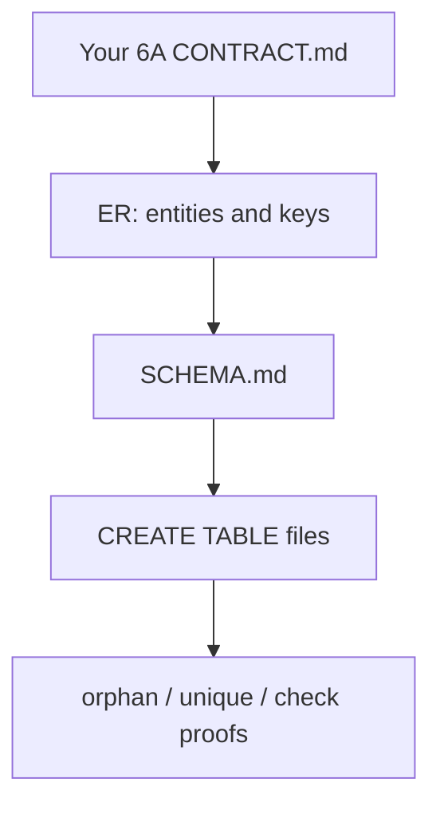

# Month 10 · Week 1 · Day 6
# Independent: Draft the Project 6 Stage B Schema

**Program:** Full-Stack Mastery · 18 months  
**Phase:** 3 — Python and backend  
**Month index:** [../../README.md](../../README.md)  
**Week 1:** [1](day-01.md) · [2](day-02.md) · [3](day-03.md) · [4](day-04.md) · [5](day-05.md) · Day 6 (today) · [7](day-07.md)  
**Week rhythm today:** Independent implementation  
**Student state:** You can document and prove constraints. Today those skills apply to **your** Project 6 domain — not Atlas, not a blog, not `d4_` copied into ops-api.  
**Study time:** 3–4 focused hours

Work in **`~/ops-api/`** (SQL under `sql/` or `schema/`) **or** `~\fullstack-lab\month-10\week-01\day-06\` if you refuse to mix labs into the product repo yet. This textbook will **not** give you the finished schema. No FastAPI rewrite. No SQLAlchemy. No API.

If `~/ops-api` does not exist because Month 9 gate was skipped, stop and finish 6A. Today is Stage B **draft**, not a chance to skip HTTP.

Read **headings** in `full_stack_project_requirements_2026/project_06_production_style_backend_system.md` for what Stage B must eventually support. Do not paste a tutorial dump.

---

## How to use this textbook

1. ER first. SCHEMA.md second. SQL third. API never today.  
2. Type SQL yourself. AI may review names; it may not ship your CREATE TABLE file.  
3. Optional review links are for later rechecking.

---

## How to read this chapter

Stage A stored dicts. Stage B begins when those nouns become **tables with constraints**. The API can wait until Month 11 for an ORM. This month you still owe **raw SQL** reporting (Week 4). Today you owe the **shape**.

Week 1’s skill is not “I cloned an ecommerce schema.” It is “I can **justify** tables for **my** resources.”



**Wrong belief:** “I’ll copy users/projects/tasks from Week 1 labs into ops-api and rename them.”  
**Correct:** if 6A already **is** issues/projects, the **lab** Atlas/`d4_` schema is still not your product. Design from **your** CONTRACT.md nouns. If 6A is rooms/desks, do not suddenly become a blog.

**Wrong belief:** “A blog schema is simpler so I’ll practice on posts and comments.”  
**Correct:** the independent spec forbids a blog schema. Transfer is the lesson.

**Wrong belief:** “JSON blob for flexibility.”  
**Correct:** core relationships are columns and FKs. JSONB is a side pocket, not the product.

---

## Today's contract

By the end of this day you will be able to:

1. List at least **three** related resources from **your** 6A/6B domain.  
2. Draw ER: 1-n and at least one n-n **or** a justified reason you do not need n-n yet.  
3. Write `CREATE TABLE` with PK, FK **ON DELETE RESTRICT**, UNIQUE, CHECK where it belongs.  
4. Run proofs: orphan refused, uniqueness refused, blank refused.  
5. Write SCHEMA.md in **your** repo language.  
6. Map 6A JSON fields to columns in `GAPS.md`.

**Today's gate.** Closed-book:

> I designed Stage B tables for my domain, not a tutorial blog. Keys and constraints are in git. I can defend every FK. The database, not FastAPI, refuses orphans. I did not paste Project 6 complete source from anywhere. SQLAlchemy still waits for Month 11.

---

## Time box

| Block | Minutes | Work |
|---|---|---|
| A | 30 | Nouns + ER from your CONTRACT.md |
| B | 40 | SCHEMA.md first (English before types) |
| C | 90 | CREATE TABLE + seed + must-fail proofs |
| D | 25 | Map to 6A JSON; align SCHEMA.md with `\d` |
| E | 15 | Recall |

---

# Block A — Domain and drawing

Open **your** Month 9 `CONTRACT.md` (allowed today — it is **your** file). List the three resources. If CONTRACT.md is missing, the Month 9 gate is still false; do not “catch up” by inventing SQL for an API you never specified.

**Allowed:** issue tracker, project ops, inventory, reading rooms, fleet of devices, clinic appointments — any 6A you actually built.

**Forbidden as today’s schema:** blog posts/comments, Twitter clones, generic `users/posts/likes` from a tutorial, copying Day 2 or Day 4 SQL verbatim into ops-api, a public “awesome postgres schema” repo.

**Fallback if 6A is truly only one noun:** expand **honestly** with two related nouns you will add to the contract **this week**, and write `CONTRACT-DELTA.md` listing HTTP you are **not** implementing today.

On paper / `ER.md`:

- identity of each entity (surrogate id vs unique code)  
- owner vs membership (1-n vs n-n)  
- what must not be orphaned  
- what is unique  
- optional 1–1 (profile, settings) only if 6A had that split  

Speak: where each FK lives; why RESTRICT on delete of a parent that still has children.

---

# Block B — SCHEMA.md before clever SQL

Empty `001_tables.sql` is allowed. Empty SCHEMA.md is not.

Write:

- Purpose of the database in five sentences (ops-api Stage B, not the Week 1 lab)  
- Table list  
- For each table: columns, PK, UNIQUE, FK + ON DELETE, CHECK  
- Invariants (“an issue belongs to a real project”; “email unique”)  
- NULL meaning for optional FKs  
- What you are **not** indexing yet (Week 4)  
- What you are **not** putting in JSONB as a substitute for keys  
- Delete behavior in English  

You will edit this after `\d`. A wrong first draft is still a draft.

---

# Block C — CREATE TABLE you type

```powershell
mkdir ~\ops-api\sql -Force
cd ~\ops-api\sql
```

If you refuse to touch ops-api until Month 11, use `~\fullstack-lab\month-10\week-01\day-06\` and write `WHERE.md` pointing at the future path. The SQL still has to be **your domain**.

Files (you write them; no complete schema here):

- `00-reset.sql` — DROP in child-first order, **only** your Stage B table names  
- `01-schema.sql` — CREATE TABLE  
- `02-seed.sql` — two parents, three children, membership if n-n  
- `03-must-fail.sql` — statements run one at a time  

**Must include:**

1. Surrogate PKs (or a justified natural PK — write the justification).  
2. At least two foreign keys.  
3. At least one UNIQUE that is not the PK.  
4. At least one CHECK (`title <> ''` or status in a small set).  
5. ON DELETE RESTRICT on FKs unless SCHEMA.md has a named CASCADE with a reason.  
6. `TIMESTAMPTZ` `created_at` on core tables.

**Must not include:**

- SQLAlchemy models  
- Alembic  
- A dumped `pg_dump` of `month10` lab tables renamed  
- Passwords  
- `ON DELETE CASCADE` on `users` “for convenience”  
- Blog posts/comments  

Apply to a database you choose: keep using `month10` with a **schema** (`CREATE SCHEMA ops; SET search_path TO ops;`) **or** `CREATE DATABASE ops_api;` so lab tables and product tables do not collide. Write the choice in SCHEMA.md.

```powershell
psql -U postgres -c "CREATE DATABASE ops_api;"
# if it already exists, that is fine
psql -U postgres -d ops_api -f 00-reset.sql
psql -U postgres -d ops_api -f 01-schema.sql
psql -U postgres -d ops_api -f 02-seed.sql
```

If you stay on `month10`, prefix tables (`ops_`) so Day 4 `d4_` objects survive.

Run must-fail cases. Record constraint names in `FAILURES.md`.

If you use Python at all, placeholders only. You do not need Python today.

---

# Block D — Map to 6A and align

Table in `GAPS.md`: JSON field in 6A → column today. If 6A had a nested object you flattened badly, say so. Month 11 will map models onto **this** SQL, not the other way around.

```powershell
psql -U postgres -d ops_api -c "\d"
```

Fix SCHEMA.md until it matches. One mismatch is a bug in the doc.

```powershell
cd ~\ops-api
git add sql SCHEMA.md ER.md GAPS.md
git commit -m "Month 10 Week 1 Day 6: Stage B schema draft with constraints."
```

If work lived under fullstack-lab, commit there instead. Do not commit both a paste and an original.

---

# Block E — Recall

1. Why the blog schema was forbidden.  
2. Three resources and where each FK lives.  
3. Why RESTRICT is the default on your parents.  
4. Which invariant is UNIQUE vs CHECK vs FK.  
5. What you refused to put in JSONB.  
6. Why this is not an API day.

## Office hours

**I do not have three resources.** Month 9 required them. Add the third **in the schema and in CONTRACT-DELTA.md**. Do not fake a junction with no meaning.

**`ops_api` vs `month10`.** Either is fine. Mixing Atlas lab rows with product rows is how you DELETE the wrong table. Prefer a separate database or a schema.

**I designed 15 tables.** Too many for Day 6. Three to six core tables. Extra junction if needed. Week 4 reporting will punish a maze you cannot query.

**I used JSONB for the whole payload.** A JSONB extras column is allowed **later** if you justify it. Core identity and FKs stay typed columns.

**I redesigned the whole product.** Scope creep. Three resources, keys, proofs. Extra tables can wait until a feature needs them.

**6A used integer ids in RAM.** Good — keep the ids as PK. Do not switch to UUID today unless you can say why.

---

## Definition of done

- [ ] ER.md for **your** domain  
- [ ] CREATE TABLE files in git  
- [ ] UNIQUE + CHECK + FK RESTRICT present  
- [ ] Orphan insert failed; duplicate unique failed; blank CHECK failed  
- [ ] SCHEMA.md matches `\d`  
- [ ] GAPS.md vs 6A  
- [ ] No blog schema; no lab Atlas/`d4_` paste as the product  
- [ ] Commit exists  

---

## Tomorrow

Week review: synthesis of keys and normalization; a **mini ER exam** on a new imposed domain. Textbook days 1–6 stay closed during the exam block. Repair from Day 7’s recap.

---

## Spec envelope (not a schema)

Your CREATE TABLE file must make these sentences true. How you name tables is yours.

1. Every child row points at a parent that exists.  
2. At least one natural business key is UNIQUE (email, code, slug) **and** is not treated as the only identity if it can change.  
3. At least one text field that humans type cannot be `''`.  
4. Deleting a parent that still has work attached **fails** (RESTRICT) unless SCHEMA.md names the child as disposable and uses CASCADE on **that** FK only.  
5. If two entities can share many of each other (watchers, labels, members), you have a junction table with a composite uniqueness rule.  
6. You can point at each table and say which 6A JSON object it replaces.

**Worked anti-pattern (do not ship):**

```text
CREATE TABLE ops_blob (
  id INTEGER PRIMARY KEY,
  kind TEXT,
  data JSONB
);
```

That table can store anything and therefore constrains nothing. It is not Stage B. A JSONB **extras** column on an otherwise typed table is a later conversation.

**Worked size hint (do not copy names if they are not yours):** three resource tables + at most one junction + timestamps. If you need a fourth resource, it should already exist in CONTRACT.md.

Write `DEFENSE.md`: ten to twenty sentences. One paragraph per table. One paragraph: “I did not copy the blog schema because…”. One paragraph: “Week 2 will SELECT … from these tables.”

If `DEFENSE.md` could apply to any tutorial dump, it is too vague. Name **your** nouns.

---

# CONTRACT.md → columns (worked method)

Take one 6A resource. For each JSON field in CONTRACT.md, write: column name, type, NULL?, CHECK?, UNIQUE?, FK?. Nested objects either become a 1–1 table or flatten **with a sentence**. Arrays of ids become a junction, not `INTEGER[]` without FKs.

That mapping **is** GAPS.md. If a field has no column, either you dropped it on purpose or you are still in RAM. Say which.

## Database choice recap

`CREATE DATABASE ops_api;` keeps labs in `month10`. `CREATE SCHEMA ops` keeps one database. Mixing `d4_tasks` with `ops_issues` in public schema is how you DROP the wrong table. Write the choice again at the top of SCHEMA.md if it is not there.

---

# Stage B is not a blog — one more time

If DEFENSE.md could describe WordPress, rewrite it with **your** resource names from CONTRACT.md. The independent day fails a paste even if the SQL is pretty.

Write `NOUNS.md`: three resource names, no commentary.

## Seed two parents three children

That count is a minimum. Without it, Week 2 reports cannot HAVING >= 2. Do it today.

---

## Optional review links

Relational modeling is explained in this week’s chapters. These pages are for later checking, not for first learning.

- [PostgreSQL: Constraints](https://www.postgresql.org/docs/current/ddl-constraints.html)
- [PostgreSQL: CREATE TABLE](https://www.postgresql.org/docs/current/sql-createtable.html)
- Project 6 Stage B headings in `full_stack_project_requirements_2026/project_06_production_style_backend_system.md` (requirements, not a schema to copy)
