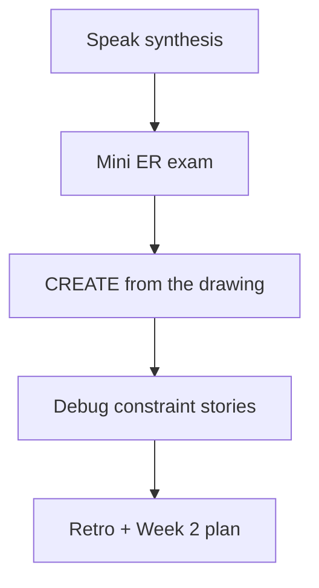

# Month 10 · Week 1 · Day 7
# Week Review — Keys, Relationships, Normalization

**Program:** Full-Stack Mastery · 18 months  
**Phase:** 3 — Python and backend  
**Month index:** [../../README.md](../../README.md)  
**Week 1:** [1](day-01.md) · [2](day-02.md) · [3](day-03.md) · [4](day-04.md) · [5](day-05.md) · [6](day-06.md) · Day 7 (today)  
**Week rhythm today:** Review, repair, plan Week 2  
**Student state:** You created typed tables, keys, constraints, and a Stage B draft. Today those ideas must still live in your head — from **this file**.  
**Study time:** 3–4 focused hours

Do not start Week 2 because the calendar moved. SELECT on a schema you cannot defend is two problems.

Work in `~\fullstack-lab\month-10\week-01\day-07\`. Do **not** implement the mini-exam inside `~/ops-api/`. Days 1–6 stay **closed** during Blocks 2–3 except this file.

---

## How to read this chapter

This is a **closed-book teaching day**. The synthesis **is** the Week 1 lesson.



Repair forgotten facts from **this** recap, not from a SQL tutorial and not from Day 2’s Atlas file.

---

## Week synthesis (the lesson, in this book)

PostgreSQL stores **relations**: named tables of typed columns. A **row** is one entity. A **type** is a promise (`TEXT`, `INTEGER`, `BOOLEAN`, `TIMESTAMPTZ`, `NUMERIC` for money — not `FLOAT`). `NULL` is unknown, not `0`, not `''`. `WHERE col = NULL` is never true; use `IS NULL`. Day 1’s empty title showed `NOT NULL` is not “not blank.”

The FastAPI process can die. The table is on disk. That was Month 9’s honesty upgraded.

**Primary key:** the identity of a row; unique and not null; preferably a **stable surrogate** (`INTEGER GENERATED BY DEFAULT AS IDENTITY`). **UNIQUE** on `email` or `code` is a business rule, not a substitute for `id` if that value can change. A table has **one** PK and may have several UNIQUE constraints. Junction tables often use a **composite PK** `(a_id, b_id)`.

**Foreign key:** a column (or columns) that must match a parent PK/UNIQUE, or NULL if allowed. Insert parents first. An **orphan** is a child id with no parent row. The FK **rejects** it. Month 9’s HTTP 409/422 is still useful; it is not a replacement for the FK.

**ON DELETE RESTRICT** (lab default): deleting a parent fails while children reference it. **CASCADE** deletes children; use it only when the child cannot exist alone **and** you accept a wipe. **SET NULL** is for optional parents. Cascading a user delete into projects is how a support tool becomes a weapon.

**CHECK:** a predicate (`title <> ''`, `status IN (...)`). Name constraints so errors teach. Growing lists (tags) are tables, not endless CHECK lists.

**1–n:** FK on the many side. **1–1:** unique FK, often PK=FK. **n–n:** junction table; relationship attributes (`role`) live there.

**1NF:** atomic cells; no lists in a cell; no `tag1, tag2` columns. A cell that holds `'Ada, Lin'` cannot be a foreign key and cannot be counted with `COUNT(*)` without string surgery.

**2NF:** already 1NF, and no non-key fact that depends on only part of a composite key. `user_email` does not belong on `(project_id, user_id)`. If Ada is on five projects, her email would be stored five times; she changes it; four rows lie. `role` may stay: Ada can be lead on one team and member on another.

**3NF:** already 2NF, and no non-key fact that depends on another non-key. Do not store `owner_email` on `projects` if you already have `owner_id`. Email is a fact about the user. Project → owner → email is a **transitive** dependency. Reports that read `projects.owner_email` disagree with `users.email` the first time someone updates only one table.

Walk a deliberately bad table:

```text
projects_bad
  id, title, owner_email, owner_name, members  -- members = 'Ada, Lin'
```

Repair: `users (id, email UNIQUE, name)`, `projects (id, title, owner_id FK)`, `project_members (project_id, user_id, role)` with both FKs. That repair **is** Week 1. Joins to *read* the email are Week 2. Copying the email onto `projects` to “avoid a join” is how 3NF dies before you have measured anything.

Insert parents first. Orphan inserts **must** fail. That failure is a test. SCHEMA.md is the data CONTRACT. Python, if used, binds parameters (`%s`), never f-string SQL.

`create_all` and ORMs are **next month**. This week you can read a `CREATE TABLE` aloud.

Project 6 Stage B is **your** ER and CREATE TABLE, not a blog, not a paste of Atlas or `d4_`.

**Wrong belief:** “The API will remember.”  
**Correct:** the API is a client. Constraints are the last honest process.

**Wrong belief:** “VARCHAR(255) is more professional than TEXT.”  
**Correct:** length is a business rule. Put a real maximum in CHECK or VARCHAR(n); do not decorate.

**Wrong belief:** “CASCADE is professional.”  
**Correct:** CASCADE is a product decision. Default RESTRICT until you can name the child as owned debris.

**Wrong belief:** “I’ll put members in a text column for now.”  
**Correct:** now is how 1NF dies. Junction table.

The sections below unpack that so you can exam without Days 1–6.

---

## Today's contract

By the end of this day you will be able to teach Week 1 aloud from this synthesis, design a mini schema closed-book, prove orphans fail, and debug six classic modeling defects on paper.

**Today's gate.** Closed-book:

> I can explain PK vs UNIQUE vs FK, 1–1 / 1–n / n–n, RESTRICT vs CASCADE, and 1NF/2NF/3NF with a bad table. I drew a new domain and created it in SQL with a failing orphan insert. I did not paste Atlas, d4_, or a blog.

---

## Time box

| Block | Minutes | Work |
|---|---|---|
| 1 | 35 | Speak the synthesis; repair from this file |
| 2 | 50 | Mini ER exam (imposed library domain) |
| 3 | 50 | CREATE + must-fail proofs |
| 4 | 25 | Debug on paper (A–F) |
| 5 | 20 | Retro + Week 2 plan |

---

# Complete explanation — modeling you must still own

## 1. Identity (Days 1–2)

Point at a row tomorrow with a stable id. Email can be UNIQUE and still change. Children store `owner_id`, not `owner_email`, so 3NF holds. `GENERATED … AS IDENTITY` invents the surrogate. You still **SELECT** that id to insert children. Sequences do not rewind because you deleted rows.

## 2. Constraints (Days 2 and 4)

NOT NULL, UNIQUE, CHECK, FK. Blank string vs NULL. Named constraints. ALTER CHECK fails if bad rows exist — the database refuses to add a rule current data breaks. Unique email is not a PK. Orphan tasks are FK violations.

## 3. Relationships (Days 2–3)

FK location is the whole trick for 1–n. Junction for n–n. PK=FK for strong 1–1. Composite UNIQUE `(org_id, name)` is per-parent uniqueness, not global uniqueness.

## 4. Delete behavior (Day 2)

RESTRICT vs CASCADE vs SET NULL as **stories**, not flags you copy from a snippet.

## 5. Docs and proof (Day 5)

SCHEMA.md + checklist. Orphan insert must fail. Placeholders in Python.

## 6. Stage B draft (Day 6)

Your domain. Separate database or schema from lab tables if you can. No blog.

---

# Block 1 — Speak the synthesis

Out loud, no other day files: table/row/type; PK vs UNIQUE; where the FK lives; RESTRICT story; dump-table 1NF/2NF/3NF repair. Write `SYNTHESIS.md` if you do not record audio. If a paragraph is empty, re-read **this** file — not Days 1–6. Then start Block 2.

---

# Block 2 — Mini ER exam (imposed domain)

Create `~\fullstack-lab\month-10\week-01\day-07\exam-er.md`.

**Domain (imposed so you cannot paste 6A or Atlas):** **library**.

- `authors (id, name unique nonblank)`  
- `books (id, title nonblank, author_id FK RESTRICT)` — 1-n: one author many books **for this mini** (real libraries are n-n; you may add `book_authors` instead if you want the harder shape — pick one and stick)  
- `patrons (id, email unique, nonblank)`  
- `loans (id, book_id, patron_id, borrowed_at TIMESTAMPTZ)` — both FKs RESTRICT  

Rules in sentences in `exam-er.md`:

- Cardinalities  
- Why email is UNIQUE but not the patron PK  
- Why `author_name` does not belong on `books` (3NF)  
- Why `borrowers TEXT` on books would fail 1NF  
- One **gap**: a book may not have two **open** loans — you may skip partial unique indexes today and name the gap, or add `returned_at NULL` and document that two NULL returned_at rows could still both be “open” without a partial unique (Week 4)

This block is **design**. SQL is Block 3. If you go blank, re-read **this** synthesis, not Day 6’s ops-api.

---

# Block 3 — CREATE from the drawing

Textbook closed except this file’s spec reminders.

```powershell
mkdir ~\fullstack-lab\month-10\week-01\day-07 -Force
cd ~\fullstack-lab\month-10\week-01\day-07
```

You write `01-schema.sql` and `02-seed.sql`. No complete solution here. Prefix `exam_` if you fear colliding with other labs.

Must:

- Four tables (or five if you chose `book_authors`)  
- CHECK titles/names not blank  
- UNIQUE email  
- RESTRICT on FKs  
- Seed: two authors, three books, two patrons, two loans  

Must fail (record in `exam-fail.md`):

1. Book with `author_id = 99999`  
2. Duplicate patron email  
3. Blank book title  
4. DELETE author who still has books  
5. Loan with missing `patron_id`  

```powershell
psql -U postgres -d month10 -f 01-schema.sql
psql -U postgres -d month10 -f 02-seed.sql
```

---

# Block 4 — Debug on paper

Write `exam-debug.md`. For each: **what PostgreSQL does**, **root cause**, **fix in one or two sentences**. You do not need to run broken code.

**A.** `CREATE TABLE items (id INTEGER, name TEXT); INSERT twice with id NULL.` Both succeed. What identity rule is missing?

**B.** `members TEXT` on projects storing `'Ada,Lin'`. Which normal form fails? How do you repair?

**C.** `projects.owner_email` plus `owner_id`. Which normal form? What update anomaly?

**D.** `ON DELETE CASCADE` from users to projects. Support deletes a spam user. What else dies? What would RESTRICT have forced?

**E.** FK `REFERENCES users (email)` but `email` is not UNIQUE. What error? Why must the target be unique?

**F.** `CHECK (title <> '')` added with ALTER; one row has `title = ''`. What happens? What do you do first?

**G.** `WHERE email = NULL` to find missing emails. What result? What predicate?

---

# Block 5 — Retro + Week 2 plan

`RETRO.md`:

- Weakest idea this week (PK vs UNIQUE, RESTRICT, 2NF, …)  
- Whether Day 6 schema is yours or a paste (honest)  
- Week 2 will be SELECT/INSERT/UPDATE/DELETE, NULL three-valued logic, JOIN, GROUP BY, CTE, window basics — not modeling from scratch  

```powershell
cd ~\fullstack-lab
git add month-10\week-01\day-07
git commit -m "Month 10 Week 1 Day 7: keys and normalization review."
```

---

## Scoring the mini (you, not a grader bot)

| Piece | Honest pass |
|---|---|
| exam-er.md | Four nouns, 3NF note, 1NF note, RESTRICT |
| Schema | named FKs, CHECK, unique email, no blog |
| Failures | Five named errors |
| Debug B–C | 1NF list cell; 3NF copied email |
| Debug D | CASCADE story, not “it’s convenient” |
| Debug G | `IS NULL`, not `= NULL` |

If Block 3 used `members TEXT` or no FK, the mini fails even if INSERT succeeded.

---

## Worked answers you should not need — check after you write debug

**A.** No PRIMARY KEY and NULL ids. Add IDENTITY PK (and NOT NULL). Two NULLs are not two identities.

**B.** 1NF: repeating group in a cell. Junction `project_members`.

**C.** 3NF: email depends on owner, not on project. Store `owner_id` only; join later.

**D.** Projects (and anything cascading from them) vanish. RESTRICT would refuse until projects were reassigned or deleted **on purpose**.

**E.** PostgreSQL requires the referenced columns to be unique. Add UNIQUE on email **or** reference `users(id)`.

**F.** ALTER fails because existing rows violate the CHECK. Fix or delete those rows, then ALTER.

**G.** `= NULL` is never true (unknown). Use `WHERE email IS NULL`.

If your written answers disagree, fix them from this box **only after** you attempted A–G alone.

---

## Office hours

**I opened Day 2 during Block 3.** Log it in `lookups.txt`. Redo the CREATE once closed-book. Honesty beats a perfect first compile.

**Mini-build looks like Project 6.** Wrong nouns. Library is the point.

**Partial unique for open loans.** If you do not know it, GAPS.md is honesty. Week 4 can add it.

**Week 2 tonight?** Only if this day’s gate is true. Otherwise repair Day 6 schema or the exam tables.

---

## Definition of done

- [ ] Spoke PK / FK / 1NF–3NF without notes  
- [ ] exam-er.md is implementable  
- [ ] Library tables exist; five failures recorded  
- [ ] Debug A–G written, then checked against the worked box  
- [ ] RETRO.md exists  
- [ ] Week 2 not started on a false gate  

---

## Tomorrow

Week 2 Day 1: **SELECT**, **WHERE**, **ORDER BY**, **LIMIT**, **NULL** three-valued logic, **ILIKE**. Modeling stays; querying begins.

---

## Closed-book cards (write answers in RETRO.md)

1. Why email UNIQUE and `id` PK can both exist.  
2. Where the FK column lives in 1–n.  
3. Why n–n needs a third table.  
4. RESTRICT vs CASCADE — one story each.  
5. 1NF with a comma-separated members example.  
6. 2NF with `user_email` on a junction.  
7. 3NF with `owner_email` on projects.  
8. What `CHECK (title <> '')` catches that `NOT NULL` does not.  
9. Why `WHERE email = NULL` finds nothing.  
10. Why Stage B this week forbids SQLAlchemy.

If you miss more than two, re-read the synthesis, then the mini-build. Missing these and starting Week 2 is how JOIN hides a mushy model.

Do not put the library mini inside `~/ops-api`. Do not start Week 2 tonight on a false self-mark.

---

## Optional review links

Repair from this synthesis first. These pages are for later checking, not for first learning.

- [PostgreSQL: Constraints](https://www.postgresql.org/docs/current/ddl-constraints.html)
- [PostgreSQL: CREATE TABLE](https://www.postgresql.org/docs/current/sql-createtable.html)
