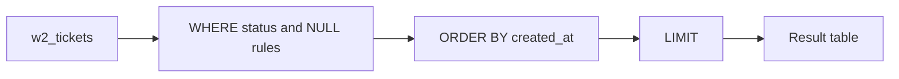

# Month 10 · Week 2 · Day 1
# SELECT, WHERE, ORDER BY, LIMIT, NULL, and ILIKE

**Program:** Full-Stack Mastery · 18 months  
**Phase:** 3 — Python and backend  
**Month index:** [../../README.md](../../README.md)  
**Week 2:** Day 1 (today) · [2](day-02.md) · [3](day-03.md) · [4](day-04.md) · [5](day-05.md) · [6](day-06.md) · [7](day-07.md)  
**Week rhythm today:** Learn + type-along  
**Student state:** Week 1 gate passed. You can declare keys and refuse orphans. Today you **ask questions** of rows that already exist.  
**Study time:** 3–4 focused hours

**This week covers:** SELECT, INSERT, UPDATE, DELETE, WHERE, ORDER BY, GROUP BY, HAVING, JOIN, subqueries, CTEs, aggregates, window-function basics.

Today: **SELECT** lists, **WHERE**, **ORDER BY**, **LIMIT**, **NULL** three-valued logic, and **ILIKE**. JOIN is Day 4. Do not skip NULL. Students who treat NULL like `''` write reports that lie.

Labs: `~\fullstack-lab\month-10\week-02\day-01\`. Database `month10`. Prefix `w2_`. No SQLAlchemy. Parameterized queries if Python appears. Docker is not the gate.

---

## How to use this textbook

1. Read a section. Close it. Say the idea in a full sentence.  
2. Type every query. Read the result table. If it surprises you, that is the lesson.  
3. When a WHERE clause “drops rows you expected,” ask whether NULL made the predicate **unknown**.  
4. Optional review links are for later rechecking.

---

## How to read this chapter

A **query** is a question. A **base table** is stored. The result of SELECT is also a table — it just might not be stored. You filter with WHERE, sort with ORDER BY, and cap with LIMIT. NULL is not a value you compare with `=`. ILIKE is how you search text without pretending the world typed the same case you did.



**Wrong belief:** “SELECT * is fine; I’ll pick columns in Python.”  
**Correct:** the database should send what you need. `*` hides schema changes and ships columns you will later regret (password hashes, internal flags). Name columns.

**Wrong belief:** “`WHERE assignee_id = NULL` finds unassigned tickets.”  
**Correct:** that predicate is never true. You write `WHERE assignee_id IS NULL`.

---

## Today's contract

By the end of this day you will be able to:

1. Write `SELECT` with an explicit column list, aliases, and `DISTINCT` when duplicates are the question.  
2. Filter with `WHERE` using `AND`/`OR`, `IN`, `BETWEEN`, and parentheses you can defend.  
3. Sort with `ORDER BY` (including `DESC` and a tie-breaker column).  
4. Cap rows with `LIMIT` and explain that `OFFSET` exists but is not today’s pagination design (Week 4).  
5. Predict results involving **NULL** using three-valued logic (true / false / unknown).  
6. Search text with **`ILIKE`** and know why `%` and `_` are wildcards.

**Today's gate.** Closed-book:

> SELECT returns a result table. WHERE keeps rows where the predicate is **true**, not unknown. NULL compared with `=` is unknown. ILIKE is case-insensitive pattern match. ORDER BY defines sequence; LIMIT is a cap, not a substitute for a keyset. I name columns; I do not SELECT * as a lifestyle.

---

## Time box

| Block | Minutes | Work |
|---|---|---|
| A | 50 | Theory |
| B | 70 | Type-along: seed + queries |
| C | 55 | Independent: five questions you invent |
| D | 15 | Git |
| E | 15 | Recall |

---

# Block A — Theory

## 1. SELECT is projection

`SELECT title, status FROM w2_tickets` **projects** two columns. The table may have ten. The result has two. That is not Excel “hiding a column.” It is a new table with a smaller heading.

Aliases rename output: `SELECT title AS ticket_title`. Use them when two tables will later share a column name (Day 4). Today they keep the result readable.

Expressions are legal: `SELECT char_length(title) AS title_len`. You are not limited to stored columns. Do not compute in Python what SQL can say clearly **once** for every client.

`DISTINCT` removes duplicate **result rows**, not “duplicate-ish” rows. `SELECT DISTINCT status` is a list of statuses that appear. `SELECT DISTINCT title, status` is unique **pairs**. If you needed unique titles regardless of status, that is a different question.

**Wrong belief:** “DISTINCT is how I fix a JOIN that exploded rows.”  
**Correct:** DISTINCT can hide a bad join. Day 4 you will count first. DISTINCT is a last resort, not a broom.

## 2. FROM and the mental model

`FROM w2_tickets` names the table you start with. Later, FROM will include JOINs. Today one table. You can still use a subquery in FROM next week; do not need it today.

`psql` displays the result. It is not stored unless you `CREATE TABLE AS` or `INSERT … SELECT`. Asking a question does not change disk. INSERT/UPDATE/DELETE (Day 2) do.

## 3. WHERE is a predicate

`WHERE status = 'open'` keeps rows for which that comparison is **true**.

Connectives: `AND` is tighter than `OR` in PostgreSQL’s precedence, but **you will use parentheses** whenever both appear. Readable SQL beats memorizing a precedence table under stress.

```sql
WHERE (status = 'open' OR status = 'blocked')
  AND project_id = 1
```

`IN ('open', 'blocked')` is the same idea as a chain of ORs on one column.

`BETWEEN 1 AND 10` is inclusive on both ends for integers and timestamps. For timestamps, inclusive end is a footgun (“through Friday” vs “before Saturday”). Prefer `created_at >= $start AND created_at < $end` when you care. Today BETWEEN on integers is enough to feel inclusivity.

Comparisons: `=`, `<>`, `<`, `>`, `<=`, `>=`. For text, `=` is exact. Pattern match is `LIKE` / `ILIKE`.

## 4. Three-valued logic (this is the hard part)

SQL boolean values are **true**, **false**, and **unknown**. NULL means we do not have a value, so almost every comparison with NULL yields **unknown**.

`WHERE` keeps a row only if the predicate is **true**. Unknown is discarded. That is why `WHERE assignee_id = NULL` returns **no rows**, even if unassigned tickets exist. It is not a syntax error. It is a logic error.

| Expression | Result |
|---|---|
| `1 = 1` | true |
| `1 = 2` | false |
| `1 = NULL` | unknown |
| `NULL = NULL` | unknown |
| `NULL OR true` | true |
| `NULL AND true` | unknown |
| `NOT NULL` | unknown |

`IS NULL` and `IS NOT NULL` are the tests that see NULL as a state:

```sql
WHERE assignee_id IS NULL      -- unassigned
WHERE assignee_id IS NOT NULL  -- assigned
```

`IS DISTINCT FROM` treats NULL as a comparable “value” for inequality: `a IS DISTINCT FROM b` is true when one is NULL and the other is not, or when both are non-null and unequal. You may not need it today. Know it exists so `<>` surprises you less.

**CHECK** from Week 1: `CHECK (title <> '')` rejects NULL titles unless you allow them, because unknown is not true. Combined with `NOT NULL`, you already closed that. WHERE is where NULL will bite you **in queries**.

**Wrong belief:** “NULL is like JavaScript’s `== null` and I can use `=`.”  
**Correct:** SQL `=` never succeeds for NULL. `IS NULL` is the operator.

**Wrong belief:** “I’ll store unassigned as `0` so WHERE is easy.”  
**Correct:** `0` is not a user id. You will JOIN to a ghost. NULL plus `IS NULL` is the model. Week 1 already forbade sentinel zeros.

## 5. ORDER BY and LIMIT

Tables are **bags** (multisets) with no guaranteed order unless you `ORDER BY`. If you `LIMIT 10` without ORDER BY, PostgreSQL may return any ten rows. That “worked in the GUI” is not a sort.

```sql
SELECT id, title, created_at
FROM w2_tickets
WHERE status = 'open'
ORDER BY created_at DESC, id DESC
LIMIT 10;
```

The tie-breaker (`id DESC`) makes the order **stable**. Two tickets in the same microsecond will not swap between runs if `id` is unique.

`LIMIT 10 OFFSET 20` skips twenty then takes ten. It is legal. It gets expensive and unstable when rows insert in the middle (Week 4 keyset pagination). Today: LIMIT is a cap for labs and for “show me a sample.” Do not design the product list page on OFFSET yet.

`FETCH FIRST 10 ROWS ONLY` is the standard spelling. `LIMIT` is the PostgreSQL spelling you will see everywhere. Both are fine today.

## 6. LIKE and ILIKE

`LIKE` is case-sensitive in PostgreSQL (depends on collation; treat it as case-sensitive unless you know otherwise). `ILIKE` is case-insensitive.

Wildcards:

- `%` — any string (including empty)  
- `_` — any single character  

```sql
WHERE title ILIKE '%schema%'
```

finds “SCHEMA.md”, “Write schema”, “schematic” if those strings appear. Leading `%` cannot use a normal B-tree index well (Week 4). Today correctness first.

If the user types `%` or `_` as search text, those are **wildcards**, not letters. Escaping is `LIKE '…' ESCAPE '\'` or you switch to `position(lower(q) in lower(title)) > 0` / `strpos`. For today’s lab, you control the pattern. When Python appears, the pattern is a **parameter**, not concatenated SQL — but `%` inside the **value** is still a wildcard. That is a product bug, not injection, if you meant literal percent.

`SIMILAR TO` and POSIX regex (`~`) exist. Do not need them today. ILIKE covers search-as-humans-type.

## 7. AND/OR and NULL together

`WHERE status = 'open' OR assignee_id = 1` — if `assignee_id` is NULL, the second part is unknown; the row still survives if status is open (true OR unknown = true). If status is also NULL, the whole WHERE may be unknown and the row vanishes.

Draw a truth table on paper for one confusing query in the lab. That drawing is more valuable than a second tutorial tab.

---

# Block B — Type-along

```powershell
mkdir ~\fullstack-lab\month-10\week-02\day-01 -Force
cd ~\fullstack-lab\month-10\week-02\day-01
```

Create `00-reset.sql`:

```sql
DROP TABLE IF EXISTS w2_tickets;
DROP TABLE IF EXISTS w2_projects;
DROP TABLE IF EXISTS w2_users;
```

Create `01-schema.sql`:

```sql
CREATE TABLE w2_users (
  id INTEGER GENERATED BY DEFAULT AS IDENTITY PRIMARY KEY,
  email TEXT NOT NULL UNIQUE,
  name TEXT NOT NULL
);

CREATE TABLE w2_projects (
  id INTEGER GENERATED BY DEFAULT AS IDENTITY PRIMARY KEY,
  title TEXT NOT NULL,
  CONSTRAINT w2_projects_title_not_blank CHECK (title <> '')
);

CREATE TABLE w2_tickets (
  id INTEGER GENERATED BY DEFAULT AS IDENTITY PRIMARY KEY,
  project_id INTEGER NOT NULL REFERENCES w2_projects (id) ON DELETE RESTRICT,
  assignee_id INTEGER REFERENCES w2_users (id) ON DELETE RESTRICT,
  title TEXT NOT NULL,
  status TEXT NOT NULL DEFAULT 'open',
  created_at TIMESTAMPTZ NOT NULL DEFAULT now(),
  CONSTRAINT w2_tickets_title_not_blank CHECK (title <> ''),
  CONSTRAINT w2_tickets_status_check CHECK (status IN ('open', 'blocked', 'done'))
);
```

Create `02-seed.sql`. Type it. You need **NULL assignees** on purpose.

```sql
INSERT INTO w2_users (email, name) VALUES
  ('ada@example.com', 'Ada'),
  ('lin@example.com', 'Lin');

INSERT INTO w2_projects (title) VALUES
  ('Atlas'),
  ('Northline');

INSERT INTO w2_tickets (project_id, assignee_id, title, status) VALUES
  (1, 1, 'Write SCHEMA.md', 'open'),
  (1, NULL, 'Triage inbox', 'open'),
  (1, 2, 'Fix unique email', 'done'),
  (2, NULL, 'Blocked on vendor', 'blocked'),
  (2, 1, 'Schema review', 'open'),
  (2, 2, 'Northline checklist', 'open');
```

If identity is not 1, 2 after other labs, rewrite the seed with subqueries on email and title as in Week 1. After a fresh DROP/CREATE of `w2_*` only, 1 and 2 are expected.

```powershell
psql -U postgres -d month10 -f 00-reset.sql
psql -U postgres -d month10 -f 01-schema.sql
psql -U postgres -d month10 -f 02-seed.sql
```

Create `03-queries.sql` and run statements one at a time. Write predicted row counts in `PREDICT.md` **before** you run.

```sql
-- Q1. Named columns, not *
SELECT id, title, status FROM w2_tickets ORDER BY id;

-- Q2. Open tickets, newest first
SELECT id, title, created_at
FROM w2_tickets
WHERE status = 'open'
ORDER BY created_at DESC, id DESC;

-- Q3. Unassigned — must use IS NULL
SELECT id, title
FROM w2_tickets
WHERE assignee_id IS NULL;

-- Q4. The trap — predict 0 rows
SELECT id, title
FROM w2_tickets
WHERE assignee_id = NULL;

-- Q5. ILIKE
SELECT id, title
FROM w2_tickets
WHERE title ILIKE '%schema%';

-- Q6. IN and LIMIT
SELECT id, title, status
FROM w2_tickets
WHERE status IN ('open', 'blocked')
ORDER BY status, id
LIMIT 3;

-- Q7. AND / OR with parentheses
SELECT id, title, status, assignee_id
FROM w2_tickets
WHERE status = 'open'
  AND (assignee_id = 1 OR assignee_id IS NULL);

-- Q8. DISTINCT statuses
SELECT DISTINCT status FROM w2_tickets ORDER BY status;
```

```powershell
psql -U postgres -d month10 -f 03-queries.sql
```

Paste Q3 and Q4 results into `NULL.md`. One paragraph: why Q4 is empty. That paragraph is the gate.

---

# Block C — Independent

Write `04-independent.sql` with **five** questions the seed can answer. You invent the English; you write the SQL. Constraints:

1. One query uses `ILIKE` with a leading **and** trailing `%`.  
2. One query uses `IS NOT NULL`.  
3. One query uses `ORDER BY` two columns.  
4. One query uses `LIMIT` without pretending it is a product page.  
5. One query demonstrates `OR` **without** parentheses, then the **same** question **with** parentheses, and `NOTES.md` says whether the result changed.

Forbidden: `SELECT *` except one documented experiment that you then replace.

Write `ANSWERS.md`: English question, SQL filename/label, row count you got.

Do not JOIN yet unless you already remember it — Day 4. Do not UPDATE yet — Day 2.

Optional Python: print Q3 with psycopg and `%s` only if you pass a parameter. Skip if you are slow. SQL files win the day.

---

# Block D — Git

```powershell
cd ~\fullstack-lab
git add month-10\week-02\day-01
git commit -m "Month 10 Week 2 Day 1: SELECT, WHERE, NULL, ILIKE."
```

---

# Block E — Recall

1. What WHERE does with **unknown**.  
2. `= NULL` vs `IS NULL`.  
3. Why ORDER BY before LIMIT.  
4. `%` vs `_` in ILIKE.  
5. Why SELECT * is a habit to break.  
6. DISTINCT vs a broken join (preview).

## Office hours

**Q4 returned rows.** You did not run `= NULL`; you ran `IS NULL` by accident, or a client rewrote it. In `psql`, `= NULL` is empty.

**ILIKE found nothing.** Pattern needs `%`. `ILIKE 'schema'` is exact except case. `ILIKE '%schema%'` is substring.

**Seed failed FK.** Reset `w2_*` only. Do not DROP Week 1 tables unless you mean to.

**I used OFFSET 100000.** Stop. Week 4. Today LIMIT 10 is a sample.

---

## Definition of done

- [ ] `w2_tickets` seeded with NULL assignees  
- [ ] PREDICT.md existed before running 03-queries  
- [ ] NULL.md explains Q4  
- [ ] Five independent questions with counts  
- [ ] No SELECT * as the submitted style  
- [ ] Commit exists  

---

## Tomorrow

INSERT, UPDATE, DELETE, **RETURNING**, and why “upsert” is a decision, not a default. You will mutate these rows on purpose.

---

## Optional review links

SELECT and NULL are explained in this chapter. These pages are for later checking, not for first learning.

- [PostgreSQL: SELECT](https://www.postgresql.org/docs/current/sql-select.html)
- [PostgreSQL: Comparison / NULL](https://www.postgresql.org/docs/current/functions-comparison.html)
- [PostgreSQL: Pattern matching](https://www.postgresql.org/docs/current/functions-matching.html)
