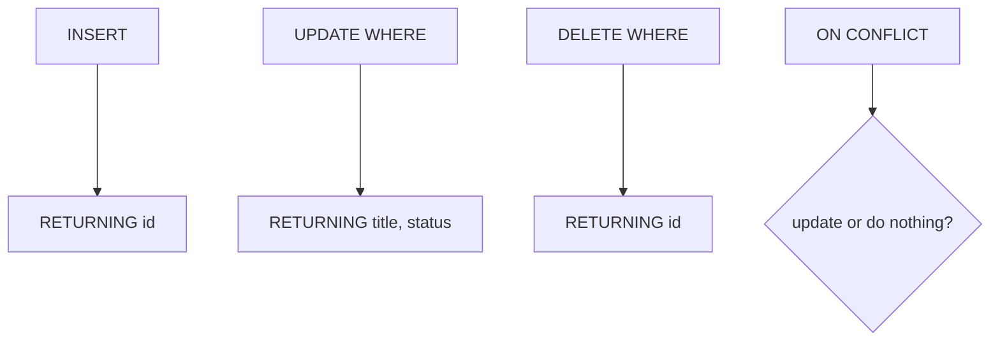

# Month 10 · Week 2 · Day 2
# INSERT, UPDATE, DELETE, RETURNING, and Upsert

**Program:** Full-Stack Mastery · 18 months  
**Phase:** 3 — Python and backend  
**Month index:** [../../README.md](../../README.md)  
**Week 2:** [1](day-01.md) · Day 2 (today) · [3](day-03.md) · [4](day-04.md) · [5](day-05.md) · [6](day-06.md) · [7](day-07.md)  
**Week rhythm today:** Exercises + debugging (theory is in this file)  
**Student state:** Day 1 gate passed. You can SELECT and you respect `IS NULL`. Today you **change** rows and read back what PostgreSQL stored.  
**Study time:** 3–4 focused hours

Labs: `~\fullstack-lab\month-10\week-02\day-02\`. Continue `w2_*` tables in `month10`. No SQLAlchemy. If Python writes user text, **placeholders**. Prefer RESTRICT — do not “fix” a failed DELETE with CASCADE.

---

## How to use this textbook

1. Read why INSERT/UPDATE/DELETE return a **count**, then type RETURNING.  
2. Every mutating statement is a chance to break a Week 1 constraint. Read the error name.  
3. Upsert is optional syntax with mandatory **meaning**. Do not copy `ON CONFLICT` until you can say what conflict means.  
4. Optional review links are for later rechecking.

---

## How to read this chapter

SELECT does not change disk. **INSERT** adds rows. **UPDATE** changes cells in rows that match WHERE. **DELETE** removes rows that match WHERE. **RETURNING** gives you the row **after** the change — including identity values you did not choose. An **upsert** inserts, or updates if a uniqueness rule says the row already exists. It is not a default. PUT in Month 9 was **not** upsert; SQL still lets you choose.



**Wrong belief:** “UPDATE without WHERE is a quick way to set a default.”  
**Correct:** UPDATE without WHERE updates **every row**. That is a production incident. Always write WHERE. If you mean every row, write `WHERE true` so the intent is loud.

**Wrong belief:** “I’ll INSERT then SELECT max(id) to know what I created.”  
**Correct:** `max(id)` races with other sessions. `RETURNING id` is the row you inserted.

---

## Today's contract

By the end of this day you will be able to:

1. INSERT one row and many rows; INSERT … SELECT.  
2. UPDATE with WHERE; SET several columns; leave others alone.  
3. DELETE with WHERE; explain why DELETE from a parent hits RESTRICT.  
4. Use **RETURNING** on insert/update/delete.  
5. Explain **upsert** (`ON CONFLICT`) vs insert-or-fail vs Month 9 PUT.  
6. Debug: 0-row UPDATE, unique violation, FK violation, accidental full-table UPDATE (you will **not** run the last on purpose against product data).

**Today's gate.** Closed-book:

> INSERT adds. UPDATE and DELETE need WHERE. RETURNING is how I get the identity I just created. ON CONFLICT is a uniqueness decision, not “SQL PUT.” Constraints still fire. I never concatenate user text into SQL.

---

## Time box

| Block | Minutes | Work |
|---|---|---|
| A | 50 | Theory |
| B | 70 | Type-along mutations + RETURNING |
| C | 55 | Independent: debugging 0-row and conflict |
| D | 15 | Git |
| E | 15 | Recall |

---

# Block A — Theory

## 1. INSERT

Minimal:

```sql
INSERT INTO w2_tickets (project_id, title)
VALUES (1, 'New from Day 2');
```

Columns you omit use DEFAULT (`status`, `created_at`) or NULL if the column allows it (`assignee_id`). Omitting a NOT NULL column without a default **fails**.

Multi-row:

```sql
INSERT INTO w2_tickets (project_id, title, status) VALUES
  (1, 'A', 'open'),
  (1, 'B', 'open');
```

`INSERT … SELECT` copies from a query. Useful for seeds and migrations. Dangerous if the SELECT is wrong — you insert a lot. Run the SELECT alone first.

```sql
INSERT INTO w2_tickets (project_id, title)
SELECT id, 'Kickoff' FROM w2_projects WHERE title = 'Atlas';
```

## 2. RETURNING

```sql
INSERT INTO w2_tickets (project_id, title)
VALUES (1, 'Need the id')
RETURNING id, created_at, status;
```

The result is a table. In Python you fetch it like SELECT. FastAPI create handlers in Month 11 will want that id for the 201 body. Today you learn it without an ORM.

UPDATE and DELETE also RETURNING. A DELETE … RETURNING is how you log what you removed **in the same statement**.

**Wrong belief:** “I’ll query by title to find the row I just inserted.”  
**Correct:** titles are not unique in this lab. RETURNING is identity.

## 3. UPDATE

```sql
UPDATE w2_tickets
SET status = 'done',
    assignee_id = 1
WHERE id = 3
RETURNING id, status, assignee_id;
```

SET lists assignments. WHERE picks rows. If WHERE matches nothing, PostgreSQL reports `UPDATE 0`. That is not an error. It is a silent no-op. APIs that map this to HTTP 200 “updated” are lying; Month 9 used 404 when the id was missing. SQL will not 404 for you. You check the count or RETURNING emptiness.

Multiple rows: `WHERE project_id = 1 AND status = 'open'` can close a batch. That is powerful. It is also how you close the wrong batch if the predicate is sloppy.

NULL: `SET assignee_id = NULL` unassigns. That is not “set to zero.”

Expressions: `SET title = title || ' (closed)'` — know it exists. Prefer explicit values from parameters in app code.

## 4. DELETE

```sql
DELETE FROM w2_tickets
WHERE id = 6
RETURNING id, title;
```

DELETE without WHERE deletes **all rows** in the table. The table remains. That is still a disaster. Always WHERE.

Deleting a **project** while tickets reference it **fails** under RESTRICT. The error is a foreign key violation, not “0 rows.” You must delete (or reassign) children first, or change the product rule.

`TRUNCATE` is a bulk empty with different locking and identity behavior. Not today. Do not TRUNCATE `w2_users` as a shortcut.

## 5. Upsert vs not

**Insert-or-fail:** INSERT, and UNIQUE/PK raises if the row exists. Month 9 POST + 409 maps here. This is the default honest create.

**Update-if-exists:** UPDATE … WHERE unique_key. 0 rows means not found.

**Upsert:** one statement that inserts or, on a **named conflict**, updates (or skips).

```sql
INSERT INTO w2_users (email, name)
VALUES ('ada@example.com', 'Ada Lovelace')
ON CONFLICT (email)
DO UPDATE SET name = EXCLUDED.name
RETURNING id, name;
```

`EXCLUDED` is the row you **tried** to insert. `ON CONFLICT DO NOTHING` skips. `ON CONFLICT DO UPDATE` merges.

You must have a UNIQUE or PK on the conflict target (`email`). You cannot ON CONFLICT an arbitrary column.

**When upsert is wrong:** a POST that should 409 on duplicate email. Upsert would **rename** Ada if someone posted her email again. That is a different verb. Month 9 PUT replaced a known id; it did not create-or-merge on email unless you specified that. SQL `ON CONFLICT` is easy to paste from a blog. It is a **product** choice.

**Wrong belief:** “Upsert is how professionals avoid errors.”  
**Correct:** errors are information. Unique violation means “this email is taken.” Swallowing it into an update can overwrite a real user.

There is also `INSERT … ON CONFLICT DO UPDATE` used for counters (`SET n = table.n + 1`). That is a real upsert. Still name the unique key.

## 6. Constraints still fire

INSERT/UPDATE/DELETE are not a bypass. CHECK, FK, UNIQUE, NOT NULL all apply. An UPDATE that sets `project_id = 99999` fails the FK. An UPDATE that sets `title = ''` fails CHECK. A DELETE of a parent fails RESTRICT.

Read the constraint name. Same skill as Week 1, now on UPDATE.

## 7. Parameterized mutations

```python
cur.execute(
    "UPDATE w2_tickets SET title = %s WHERE id = %s RETURNING id, title",
    (new_title, ticket_id),
)
```

Never `f"UPDATE … '{new_title}'"`. The title `'; DROP TABLE w2_tickets; --` is a classroom cliché because concatenation is how it starts. Placeholders send values **out of band**.

## 8. Transactions preview

Several statements that must all succeed belong in `BEGIN` … `COMMIT` (Week 3). Today, each file statement auto-commits in `psql` by default. If INSERT succeeds and UPDATE fails, you already have a new row. That is why RETURNING + a second statement is not atomic yet. Do not invent a transfer today. Notice the gap.

---

# Block B — Type-along

```powershell
mkdir ~\fullstack-lab\month-10\week-02\day-02 -Force
cd ~\fullstack-lab\month-10\week-02\day-02
```

If `w2_tickets` is missing, rerun Day 1 reset/schema/seed **first**.

Create `01-insert.sql`:

```sql
INSERT INTO w2_tickets (project_id, assignee_id, title, status)
VALUES (1, NULL, 'Day 2 inbox', 'open')
RETURNING id, project_id, assignee_id, title, status, created_at;
```

```powershell
psql -U postgres -d month10 -f 01-insert.sql
```

Copy the returned `id` into `NOTES.md` as `new_id`. Do not guess.

Create `02-update.sql` — replace `N` with `new_id`:

```sql
UPDATE w2_tickets
SET status = 'blocked'
WHERE id = N
RETURNING id, status;

UPDATE w2_tickets
SET status = 'done'
WHERE id = 999999
RETURNING id, status;
```

The second statement should return **no rows**. Write one sentence: SQL did not error; 0 rows is not 404 unless **you** check.

Create `03-delete-restrict.sql`:

```sql
DELETE FROM w2_projects WHERE title = 'Atlas';
```

This must **fail** if Atlas still has tickets. Paste the FK name into NOTES.md.

Create `04-delete-child.sql` using `new_id`:

```sql
DELETE FROM w2_tickets
WHERE id = N
RETURNING id, title;
```

Create `05-upsert.sql`:

```sql
-- A. Honest conflict: should FAIL (no ON CONFLICT)
INSERT INTO w2_users (email, name)
VALUES ('ada@example.com', 'Impostor');

-- B. Upsert that changes the name — run only after you write WHY.md
INSERT INTO w2_users (email, name)
VALUES ('ada@example.com', 'Ada Lovelace')
ON CONFLICT (email)
DO UPDATE SET name = EXCLUDED.name
RETURNING id, email, name;
```

Run A first (expect unique violation). Write `WHY.md` **before** B: is renaming Ada on email conflict something an API POST should do? If you would 409, **do not** make B your default. Run B as a demo, then restore the name:

```sql
UPDATE w2_users SET name = 'Ada' WHERE email = 'ada@example.com';
```

---

# Block C — Independent debugging

Write `broken-notes.md` and SQL that demonstrates each. You do not ship a virus; you ship **documented** failures.

**C1. 0-row UPDATE.** Update `WHERE id = -1`. Record `UPDATE 0`. How would TestClient have treated this in Month 9?

**C2. CHECK on UPDATE.** `UPDATE w2_tickets SET title = '' WHERE id = 1`. Must fail. Constraint name.

**C3. FK on UPDATE.** `SET project_id = 99999` on a real ticket. Must fail.

**C4. DELETE all tickets in a project** with a WHERE you can defend, then try DELETE project. If RESTRICT still fires, you missed a child. SELECT remaining tickets.

**C5. ON CONFLICT DO NOTHING** insert of Ada’s email. Returns INSERT 0. Write when that is correct (idempotent seed) vs a swallowed duplicate POST.

Optional: psycopg script that INSERTs with `%s` and prints RETURNING id. No f-strings. Password from env.

Write `WHAT-I-SAW.md` covering C1–C5.

---

# Block D — Git

```powershell
cd ~\fullstack-lab
git add month-10\week-02\day-02
git commit -m "Month 10 Week 2 Day 2: INSERT UPDATE DELETE RETURNING upsert."
```

---

# Block E — Recall

1. Why not `SELECT max(id)` after INSERT.  
2. UPDATE 0 vs an error.  
3. DELETE parent vs RESTRICT.  
4. EXCLUDED in ON CONFLICT.  
5. When upsert would violate Month 9 POST/409.  
6. Placeholders on UPDATE.

## Office hours

**I lost Ada’s name.** You ran DO UPDATE. Restore from seed or the UPDATE at the end of Block B.

**RETURNING empty on INSERT.** INSERT failed; you missed the error. Scroll.

**Cannot delete ticket.** Something else references it (you added a child table). `\d w2_tickets`.

**ON CONFLICT error: no unique constraint.** You targeted a column that is not UNIQUE/PK.

---

## Definition of done

- [ ] INSERT … RETURNING captured an id  
- [ ] UPDATE 0 documented  
- [ ] Parent DELETE failed RESTRICT  
- [ ] WHY.md on upsert vs 409  
- [ ] C1–C5 recorded  
- [ ] Commit exists  

---

## Tomorrow

From memory: CRUD SQL for a **new noun** (not tickets). Recap lives in Day 3. No complete solution dump.

---

## Debugging catalog (keep this when Day 3 is closed)

| Symptom | Likely cause | What you do |
|---|---|---|
| `UPDATE 0` | Wrong id, or already deleted | SELECT the id first; do not treat 0 as success in an API |
| Unique violation on INSERT | Duplicate email or composite key | 409 in HTTP later; today read the constraint name |
| FK violation on INSERT | Parent missing | Insert parent or pick a real id |
| FK violation on DELETE | RESTRICT children exist | Delete or move children; do not CASCADE to “make it work” |
| CHECK on UPDATE | Blank title or illegal status | Fix the value; do not drop the CHECK |
| ON CONFLICT error | Target is not UNIQUE/PK | Add the constraint or conflict on the right columns |
| RETURNING empty on INSERT | INSERT failed | Scroll to the ERROR line |

Write `CATALOG.md` with one row you actually hit today, in your own words.

**Autocommit reminder.** In `psql`, each statement commits unless you `BEGIN`. If you INSERT a ticket and then fail a second UPDATE, the ticket is already stored. Week 3 is the fix. Today, notice it: two statements are two facts unless you wrap them.

**INSERT … SELECT footgun.** `INSERT INTO w2_tickets (project_id, title) SELECT id, title FROM w2_projects` copies **project titles** as ticket titles for every project. That can be legal and still be nonsense. Run the SELECT alone. Look at the result. Then INSERT.

---

**psql `\echo`.** You may add comments in SQL. Do not add `SELECT '=== Q3 ===';` as a substitute for PREDICT.md.

Write `RUN-ORDER.md`: the exact `psql -f` sequence for a teammate.

---

Write `PREDICT-UPDATE.md`: before running C2/C3, guess the constraint names.

---

## Optional review links

Mutating SQL is explained in this chapter. These pages are for later checking, not for first learning.

- [PostgreSQL: INSERT](https://www.postgresql.org/docs/current/sql-insert.html)
- [PostgreSQL: UPDATE](https://www.postgresql.org/docs/current/sql-update.html)
- [PostgreSQL: DELETE](https://www.postgresql.org/docs/current/sql-delete.html)
- [PostgreSQL: ON CONFLICT](https://www.postgresql.org/docs/current/sql-insert.html#SQL-ON-CONFLICT)
