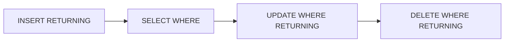

# Month 10 · Week 2 · Day 3
# From Memory: CRUD SQL for a Noun

**Program:** Full-Stack Mastery · 18 months  
**Phase:** 3 — Python and backend  
**Month index:** [../../README.md](../../README.md)  
**Week 2:** [1](day-01.md) · [2](day-02.md) · Day 3 (today) · [4](day-04.md) · [5](day-05.md) · [6](day-06.md) · [7](day-07.md)  
**Week rhythm today:** Implement from memory  
**Student state:** Day 2 gate passed. You typed INSERT/UPDATE/DELETE/RETURNING. Today those verbs must still live in your head — from **this file**.  
**Study time:** 3–4 focused hours  
**Prereq:** Day 2 gate passed.

Labs: `~\fullstack-lab\month-10\week-02\day-03\`. Do **not** copy Day 1–2 ticket SQL. The noun is **`w2_notes`** (sticky notes on a **board**). Days 1–2 stay closed for the first 25 minutes of Block 2.

---

## How Day 3 works

Allowed: this recap, `psql` errors, notes you write today.  
Not allowed: pasting CRUD from AI, copying `w2_tickets` statements as a blob, browsing docs as the teacher during the build.

If stuck **more than 25 minutes**, open **only** the matching Day 1 or Day 2 section in this textbook, close it, continue. Log `lookups.txt`.

There is **no complete CRUD file** in this chapter. The spec is below. You implement it.

---

## How to read this chapter

CRUD in SQL is four statements plus WHERE discipline, RETURNING for identity, and NULL tests when you list “empty” things.



**Wrong belief:** “Memory day means I keep Day 2 open in a split pane.”  
**Correct:** the recap is the teacher.

---

## Complete explanation (SQL you must still own)

**SELECT** names columns. `WHERE` keeps rows where the predicate is **true**. Unknown (NULL comparisons with `=`) is discarded. Unassigned / empty optional FKs use `IS NULL`, never `= NULL`. **ILIKE** `'%text%'` is case-insensitive substring. **ORDER BY** makes LIMIT meaningful. **SELECT *** is not your submitted style.

**INSERT** lists columns and VALUES (or SELECT). Omitted columns take DEFAULT or NULL. **RETURNING** returns the inserted row, including `GENERATED` ids. Do not `max(id)`.

**UPDATE … SET … WHERE**. No WHERE means every row. `UPDATE 0` is not an error; you must notice it. SET `col = NULL` is how you clear an optional FK.

**DELETE FROM … WHERE**. No WHERE means every row. Deleting a parent with RESTRICT children **errors**. Delete children first or change the product.

**ON CONFLICT (unique_col) DO UPDATE / DO NOTHING** is upsert. POST-create that should 409 must **not** upsert by default. Seeds may DO NOTHING.

Constraints still fire on every mutation. Read the constraint name.

`psql -U postgres -d month10`. Default is autocommit per statement. Multi-step atomicity is Week 3.

Placeholders in Python: `%s` as the second argument to `execute`, never f-strings.

**Wrong belief:** “I’ll find the row I inserted by title.”  
**Correct:** titles collide. RETURNING id.

**Wrong belief:** “DELETE FROM notes; is reset.”  
**Correct:** that is a wipe. Use WHERE or DROP TABLE in a reset file you intend.

---

## Today's contract

By the end of this day you will be able to:

1. CREATE `w2_boards` and `w2_notes` (1–n) with PK/FK/CHECK from memory.  
2. INSERT a board and notes with RETURNING.  
3. SELECT with WHERE, ILIKE, IS NULL, ORDER BY, LIMIT.  
4. UPDATE one note; demonstrate UPDATE 0.  
5. DELETE a note; fail DELETE of a board that still has notes.

**Today's gate.** Closed-book:

> I wrote CRUD for a new noun without copying ticket SQL. RETURNING gave me ids. IS NULL listed notes with no color. I did not UPDATE or DELETE without WHERE. Parent DELETE hit RESTRICT.

---

## Time box

| Block | Minutes | Work |
|---|---|---|
| 1 | 25 | Speak recap; sketch two tables |
| 2 | 90 | CREATE + CRUD proofs (Day 1–2 closed 25 min) |
| 3 | 45 | Independent: color NULL vs '', upsert decision |
| 4 | 20 | Git |
| 5 | 15 | Recall |

---

# Block 1 — Sketch

`w2_boards`: id, title UNIQUE not blank, created_at.  
`w2_notes`: id, board_id FK RESTRICT NOT NULL, body not blank, color TEXT NULL (NULL = default/unspecified), pinned BOOLEAN NOT NULL DEFAULT false, created_at.

Draw 1–n. Speak insert order. Speak how you list “notes with no color.”

---

# Block 2 — Spec you implement

```powershell
mkdir ~\fullstack-lab\month-10\week-02\day-03 -Force
cd ~\fullstack-lab\month-10\week-02\day-03
```

Write `00-reset.sql`, `01-schema.sql`, `02-crud.sql`. No solution dump.

Must:

1. CREATE both tables; CHECK body/title `<> ''`; FK ON DELETE RESTRICT.  
2. INSERT one board RETURNING id.  
3. INSERT three notes: one with `color = 'yellow'`, one `'blue'`, one `color NULL`. RETURNING ids.  
4. `SELECT` notes on that board `ORDER BY pinned DESC, id` `LIMIT 10`.  
5. `SELECT` notes `WHERE color IS NULL`.  
6. `SELECT` notes `WHERE body ILIKE '%todo%' OR body ILIKE '%todo%'` — put the word `todo` in one body so this hits.  
7. UPDATE one note `SET pinned = true WHERE id = …` RETURNING.  
8. UPDATE `WHERE id = -1` — record UPDATE 0.  
9. DELETE one note RETURNING.  
10. `DELETE FROM w2_boards WHERE id = …` while notes remain — must fail.

Timer: 25 minutes closed-book for schema + first INSERT RETURNING.

Write `PROOF.md` with ids and error names.

---

# Block 3 — Independent

1. **NULL vs `''` for color.** Insert `color = ''`. If you did not CHECK color, it succeeds. Decide: forbid blank with CHECK, or treat `''` as a color named empty. Write `COLOR.md`. Then SELECT `WHERE color IS NULL` vs `WHERE color = ''` vs `WHERE coalesce(color, '') = ''`. Predict counts first.

2. **Upsert on board title.** Write two statements: (a) INSERT duplicate title, expect UNIQUE fail; (b) optional ON CONFLICT DO NOTHING. In `UPSERT.md`, say which belongs in a POST handler.

3. Optional psycopg: insert a note with `%s` parameters from variables. No f-string.

---

# Block 4 — Git

```powershell
cd ~\fullstack-lab
git add month-10\week-02\day-03
git commit -m "Month 10 Week 2 Day 3: notes CRUD from memory."
```

---

# Block 5 — Recall

1. RETURNING vs max(id).  
2. IS NULL vs = NULL for color.  
3. UPDATE 0.  
4. Why board DELETE failed.  
5. lookups.txt.

## Office hours

**I copied ticket column names.** Wrong noun. Boards/notes. Redo.

**ILIKE found the NULL color note.** Your OR went wider than you thought. Print the WHERE.

**Identity not 1.** Look at RETURNING. Do not hard-code.

---

## Definition of done

- [ ] Two tables, CRUD proofs in PROOF.md  
- [ ] IS NULL query  
- [ ] UPDATE 0 recorded  
- [ ] RESTRICT on board delete  
- [ ] COLOR.md + UPSERT.md  
- [ ] Commit exists  

---

## Tomorrow

JOIN (inner/left), GROUP BY, HAVING, aggregates, plus a **CTE** and a **window** (`ROW_NUMBER` or `RANK`). Querying across tables begins.

---

## Recap you may reread after the 25-minute timer

**CRUD mapped to HTTP (for later, not for an API today).** POST → INSERT RETURNING. GET list → SELECT WHERE ORDER LIMIT. GET one → SELECT WHERE id. PATCH → UPDATE SET only mentioned columns (SQL still sets what you write; you choose the SET list). DELETE → DELETE WHERE id RETURNING. 404 is **your** check of 0 rows. PostgreSQL will not emit HTTP.

**Color NULL worked example.** Three notes: yellow, blue, NULL. `WHERE color IS NULL` returns one row. `WHERE color = ''` returns zero unless you inserted blank. `WHERE color <> 'yellow'` does **not** include NULL (unknown). If you wanted “not yellow, including unspecified,” write `WHERE color IS DISTINCT FROM 'yellow'`. Predict that before you run it. Put the prediction in `COLOR.md`.

**Board DELETE order.** Notes first, then board — or fail RESTRICT and leave the board. Either is honest. CASCADE from board to notes would wipe notes when you delete a board. Only if notes are owned debris. Prefer RESTRICT in this lab.

Write `HTTP-MAP.md` (eight sentences): which SQL verb you would use for each of POST/GET/PATCH/DELETE on notes. Still no FastAPI today.

---

# Notes CRUD traps (still in this file)

**Pinned sort.** `ORDER BY pinned DESC, id` puts pinned notes first. `true` sorts after `false` in some contexts — in PostgreSQL, `FALSE < TRUE`, so `pinned DESC` puts `true` first. Predict before you run. If you get unpinned first, you used ASC.

**ILIKE OR.** `WHERE body ILIKE '%todo%' OR color ILIKE '%todo%'` is a different question than body only. Parentheses if you AND with `board_id`.

**UPDATE color to NULL.** `SET color = NULL` is how you clear. `SET color = 'NULL'` is a four-character color. Write that in COLOR.md.

**DELETE board.** Children first, or RESTRICT error. Do not CASCADE to finish the lab faster.

**Duplicate board title.** UNIQUE fail is 409 later. ON CONFLICT DO NOTHING is a seed. Write which you would use in POST in UPSERT.md — the answer is almost certainly not upsert.

Write `TRAPS.md`: five bullets you actually hit or nearly hit.

## Recap table (close this, then type Block 2)

| Verb | Needs WHERE? | Returns |
|---|---|---|
| SELECT | filter optional | result table |
| INSERT | n/a | RETURNING row |
| UPDATE | **yes** | row count + RETURNING |
| DELETE | **yes** | row count + RETURNING |

If UPDATE/DELETE WHERE is missing, stop. That pause is the skill.

---

# Color three-valued extra (run it)

After Block 3’s three notes (yellow, blue, NULL):

```sql
SELECT id, color FROM w2_notes WHERE color <> 'yellow';
SELECT id, color FROM w2_notes WHERE color IS DISTINCT FROM 'yellow';
```

Predict: first query **excludes** NULL (unknown). Second includes NULL and blue. Put predictions in COLOR.md **before** running.

## Board unique vs note unique

Board titles UNIQUE globally. Note bodies are **not** unique in the spec — two todos can exist. Do not add UNIQUE(body) to look busy. If you want unique body per board, that is `UNIQUE (board_id, body)` and a different product. Write the choice in NOTES.md.

## curl is not today

No FastAPI. HTTP-MAP.md is a mapping on paper. If you start Uvicorn, you are in the wrong month folder.

Write `NOT-HTTP.md`: one sentence, this folder is SQL only.

## Lookups honesty

If you opened Day 2 RETURNING syntax at minute 5, say so. Redo INSERT RETURNING with the file closed. The gate is transfer, not a clean timer.

---

# Note body seed

Put the word `todo` in exactly one body so ILIKE has a hit and a miss. Predict counts. If ILIKE `%todo%` matches two, you put the word twice. That is still a valid proof if you document it.

Write `ILIKE-COUNT.md`: predicted vs actual.

## RETURNING list

INSERT board RETURNING id. INSERT notes RETURNING id, board_id, color. UPDATE RETURNING pinned. DELETE RETURNING id. If any mutating statement lacks RETURNING in 02-crud.sql, add it. Seeing the row is how you know WHERE hit.

---

# Definition of done extra ticks

- [ ] COLOR.md includes IS DISTINCT FROM prediction  
- [ ] UPSERT.md says POST should not rename boards  
- [ ] PROOF.md has ids from RETURNING, not guessed 1  
- [ ] lookups.txt exists  

If COLOR.md is missing the prediction, rerun Block 3.

## psql quoting on Windows

Use a file, not `psql -c` with nested quotes in PowerShell, for ILIKE. Files avoid escaping hell. That is a Month 1 lesson applied here.

Write `FILE-NOT-C.md`: we ran 02-crud.sql via `-f`.

---

Write `LOOKUPS-NONE.md`: lookups.txt says none, or lists sections.

---

Write `COLOR-PRED.md`: IS DISTINCT FROM count predicted.

---

## Closing note

Do not start Day 4 until PROOF.md has RETURNING ids. Empty notes mean the lab did not happen.

---

## Optional review links

The recap in this file is the teacher. These pages are for later checking, not for first learning.

- [PostgreSQL: INSERT](https://www.postgresql.org/docs/current/sql-insert.html)
- [PostgreSQL: SELECT](https://www.postgresql.org/docs/current/sql-select.html)
- [PostgreSQL: UPDATE](https://www.postgresql.org/docs/current/sql-update.html)
