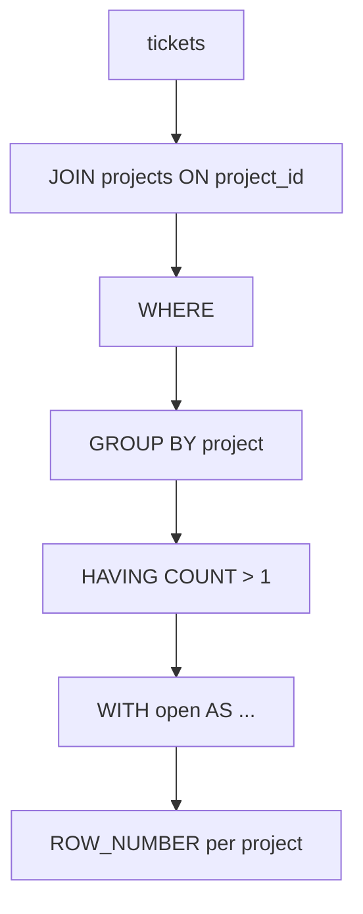

# Month 10 · Week 2 · Day 4
# JOIN, GROUP BY, HAVING, Aggregates, CTE, and a Window

**Program:** Full-Stack Mastery · 18 months  
**Phase:** 3 — Python and backend  
**Month index:** [../../README.md](../../README.md)  
**Week 2:** [1](day-01.md) · [2](day-02.md) · [3](day-03.md) · Day 4 (today) · [5](day-05.md) · [6](day-06.md) · [7](day-07.md)  
**Week rhythm today:** Lab feature  
**Student state:** You can CRUD one table. Today rows **meet** other rows. Reports start here.  
**Study time:** 3–4 focused hours

Labs: `~\fullstack-lab\month-10\week-02\day-04\`. Use `w2_*` tickets/projects/users (rerun Day 1 seed if needed) **and** extra seed in this file. No SQLAlchemy. No ORM “relationship()”. You write JOIN.

---

## How to use this textbook

1. Draw the join as a picture before you type `ON`.  
2. Count rows **before** and **after** JOIN. Explosion is a bug until you can name why.  
3. GROUP BY columns must match the grain of the question.  
4. Optional review links are for later rechecking.

---

## How to read this chapter

A **join** builds a bigger result table by matching keys. **INNER JOIN** keeps matches. **LEFT JOIN** keeps all left rows and fills NULLs on the right when nothing matches. **GROUP BY** collapses rows into groups; **aggregates** (`COUNT`, `SUM`, `AVG`, `MIN`, `MAX`) compute per group. **HAVING** filters **groups**, not original rows (that was WHERE). A **CTE** (`WITH`) names a subquery so a human can read it. A **window** (`ROW_NUMBER() OVER (…)`) computes per row **without** collapsing groups.



**Wrong belief:** “JOIN is INNER by default so I never need LEFT.”  
**Correct:** INNER **drops** projects with zero tickets. A report “tickets per project including zeros” is **LEFT JOIN** plus `COUNT(tickets.id)` not `COUNT(*)`.

**Wrong belief:** “HAVING is WHERE for people who forgot the order.”  
**Correct:** WHERE runs **before** grouping. HAVING runs **after**. `WHERE COUNT(*) > 1` is a syntax error. `HAVING COUNT(*) > 1` is the rule.

---

## Today's contract

By the end of this day you will be able to:

1. Write INNER JOIN and LEFT JOIN with explicit `ON` keys.  
2. Explain a **fan-out** (one-to-many join duplicating parent columns).  
3. GROUP BY + COUNT/SUM and filter groups with HAVING.  
4. Write a **CTE** that you could have written as a subquery — and say why the CTE is clearer.  
5. Write `ROW_NUMBER() OVER (PARTITION BY … ORDER BY …)` for “latest ticket per project” style ranking.  
6. Contrast a **subquery** vs a JOIN for one “projects with no tickets” question.

**Today's gate.** Closed-book:

> INNER JOIN keeps matches. LEFT JOIN keeps the left side. COUNT(*) on a left join counts padded rows; COUNT(child.id) skips NULLs. GROUP BY sets grain. HAVING filters groups. WITH names a step. ROW_NUMBER ranks without collapsing. I can find unmatched parents without DISTINCT as a broom.

---

## Time box

| Block | Minutes | Work |
|---|---|---|
| A | 55 | Theory |
| B | 75 | Type-along joins, groups, CTE, window |
| C | 50 | Independent: one report + subquery vs JOIN |
| D | 15 | Git |
| E | 15 | Recall |

---

# Block A — Theory

## 1. INNER JOIN

```sql
SELECT p.title AS project, t.title AS ticket, t.status
FROM w2_tickets t
INNER JOIN w2_projects p ON p.id = t.project_id;
```

For each ticket, find the project whose `id` equals `t.project_id`. If a ticket’s project is missing, the FK from Week 1 should have made that **impossible**. INNER JOIN dropping orphans is a symptom of a missing FK, not a style.

You may write `JOIN` without `INNER`; it means inner. Write INNER while you learn.

**ON** is the match. **WHERE** is a filter after the match (logically). Putting filters in ON vs WHERE **changes LEFT JOIN** (a WHERE on the right table can turn a left join into an inner join). For INNER JOIN, ON vs WHERE often matches the same rows but not the same readability. Keys in ON; business filters in WHERE.

## 2. LEFT JOIN

```sql
SELECT p.title, t.id AS ticket_id
FROM w2_projects p
LEFT JOIN w2_tickets t ON t.project_id = p.id;
```

Every project appears. If it has no tickets, `ticket_id` is NULL. If it has three tickets, the project title appears **three times**. That duplication is **fan-out**. It is correct for a detail listing. It is wrong if you then `SUM` a project-level number without grouping — you would triple the budget.

**RIGHT JOIN** is LEFT with the tables flipped. Prefer LEFT and put the “must keep” table first. **FULL OUTER JOIN** keeps unmatched from both sides. Rare today.

## 3. COUNT, NULL, and left joins

`COUNT(*)` counts rows. `COUNT(column)` counts non-NULL values of that column.

After LEFT JOIN, a project with no tickets still produces **one** result row with NULL ticket columns. `COUNT(*)` per project is 1. `COUNT(t.id)` is 0. That is the report you wanted.

```sql
SELECT p.title, COUNT(t.id) AS ticket_count
FROM w2_projects p
LEFT JOIN w2_tickets t ON t.project_id = p.id
GROUP BY p.id, p.title
ORDER BY p.title;
```

`GROUP BY p.id, p.title`: in PostgreSQL, grouping by PK is enough to select other columns of that table in recent versions, but grouping by `p.id, p.title` is the habit that transfers.

## 4. GROUP BY grain

The **grain** is “one row per what?” One row per project. One row per status. One row per (project, status).

```sql
SELECT t.status, COUNT(*) AS n
FROM w2_tickets t
GROUP BY t.status;
```

If you `SELECT t.status, t.title, COUNT(*)` and `GROUP BY t.status` only, PostgreSQL **errors**. Title is not a function of status. That error is a gift. MySQL’s old loose GROUP BY was a bug factory. Believe PostgreSQL.

## 5. HAVING vs WHERE

```sql
SELECT p.title, COUNT(t.id) AS n
FROM w2_projects p
LEFT JOIN w2_tickets t ON t.project_id = p.id
GROUP BY p.id, p.title
HAVING COUNT(t.id) >= 2;
```

WHERE cannot see `n`. HAVING can. Filter tickets to `status = 'open'` **before** grouping with WHERE; filter “projects with at least two open tickets” with WHERE status and HAVING COUNT.

## 6. Aggregates you will actually use

| Function | Notes |
|---|---|
| `COUNT(*)` | Rows |
| `COUNT(col)` | Non-null col |
| `COUNT(DISTINCT col)` | Unique non-null |
| `SUM(col)` | NULLs ignored; SUM of no rows is NULL not 0 — `COALESCE(SUM(x), 0)` |
| `AVG(col)` | Ignores NULL |
| `MIN` / `MAX` | Also work on text and timestamps |

`BOOL_OR` / `FILTER (WHERE …)` exist. Optional: `COUNT(*) FILTER (WHERE status = 'open')` is a clean conditional count. Use it once today if you have time.

## 7. Subquery vs JOIN

“Projects with **no** tickets”:

```sql
SELECT p.title
FROM w2_projects p
WHERE NOT EXISTS (
  SELECT 1 FROM w2_tickets t WHERE t.project_id = p.id
);
```

or

```sql
SELECT p.title
FROM w2_projects p
LEFT JOIN w2_tickets t ON t.project_id = p.id
WHERE t.id IS NULL;
```

Both are honest. `NOT IN (SELECT project_id FROM tickets)` becomes a trap if `project_id` could be NULL (three-valued logic). Prefer `NOT EXISTS` or LEFT JOIN … IS NULL. You will compare them in the lab.

A subquery in SELECT (`(SELECT COUNT(*) FROM tickets t WHERE t.project_id = p.id)`) is a **correlated** subquery. It can be clear. It can be slow (Week 4). A JOIN + GROUP BY is often the same question in set form.

## 8. CTE

```sql
WITH open_tickets AS (
  SELECT id, project_id, title, created_at
  FROM w2_tickets
  WHERE status = 'open'
)
SELECT p.title, COUNT(o.id) AS open_count
FROM w2_projects p
LEFT JOIN open_tickets o ON o.project_id = p.id
GROUP BY p.id, p.title;
```

`WITH` names a result. PostgreSQL may inline it. You write it for **humans**. Chain several CTEs for steps. Recursion exists (`WITH RECURSIVE`); not today’s gate.

## 9. Window functions: ROW_NUMBER

Aggregates collapse. Windows **compute extra columns** while keeping rows.

```sql
SELECT
  t.project_id,
  t.id,
  t.title,
  t.created_at,
  ROW_NUMBER() OVER (
    PARTITION BY t.project_id
    ORDER BY t.created_at DESC, t.id DESC
  ) AS rn
FROM w2_tickets t;
```

`PARTITION BY` is “restart numbering per project.” `ORDER BY` inside OVER is the rank order, **not** the query’s ORDER BY (you still ORDER BY at the end if you want a display order).

Wrap in a CTE and `WHERE rn = 1` to get **the latest ticket per project**. That is a standard report. `RANK()` ties get the same rank and skip numbers; `ROW_NUMBER()` always unique per partition. Today use ROW_NUMBER so “latest one” is unambiguous even when timestamps tie (id DESC).

**Wrong belief:** “I’ll DISTINCT ON in every dialect.”  
**Correct:** `DISTINCT ON (project_id)` is PostgreSQL-specific and useful; learn it later. ROW_NUMBER is the portable idea.

---

# Block B — Type-along

```powershell
mkdir ~\fullstack-lab\month-10\week-02\day-04 -Force
cd ~\fullstack-lab\month-10\week-02\day-04
```

Ensure Day 1 `w2_*` data exists. Add a **project with zero tickets** so LEFT JOIN is visible:

```sql
INSERT INTO w2_projects (title)
SELECT 'Empty Harbor'
WHERE NOT EXISTS (
  SELECT 1 FROM w2_projects WHERE title = 'Empty Harbor'
);
```

Save as `00-empty-project.sql` and run it.

Create `01-inner.sql`:

```sql
SELECT p.title AS project, t.title AS ticket, t.status
FROM w2_tickets t
INNER JOIN w2_projects p ON p.id = t.project_id
ORDER BY p.title, t.id;
```

Count rows. Compare to `SELECT COUNT(*) FROM w2_tickets`. They should match if every ticket has a project.

Create `02-left.sql`:

```sql
SELECT p.title, t.id AS ticket_id, t.title AS ticket
FROM w2_projects p
LEFT JOIN w2_tickets t ON t.project_id = p.id
ORDER BY p.title, t.id;
```

Find Empty Harbor: ticket columns NULL. Write `FANOUT.md`: how many times Atlas appears.

Create `03-group.sql`:

```sql
SELECT p.title, COUNT(t.id) AS ticket_count
FROM w2_projects p
LEFT JOIN w2_tickets t ON t.project_id = p.id
GROUP BY p.id, p.title
ORDER BY ticket_count DESC, p.title;
```

Empty Harbor must show **0**, not missing. If you used INNER JOIN, it will be missing — fix it.

Create `04-having.sql`:

```sql
SELECT p.title, COUNT(t.id) AS n
FROM w2_projects p
LEFT JOIN w2_tickets t ON t.project_id = p.id
GROUP BY p.id, p.title
HAVING COUNT(t.id) >= 2;
```

Create `05-cte.sql`:

```sql
WITH open_tickets AS (
  SELECT id, project_id, title, created_at, assignee_id
  FROM w2_tickets
  WHERE status = 'open'
)
SELECT p.title, COUNT(o.id) AS open_count
FROM w2_projects p
LEFT JOIN open_tickets o ON o.project_id = p.id
GROUP BY p.id, p.title
ORDER BY p.title;
```

Create `06-window.sql`:

```sql
WITH ranked AS (
  SELECT
    t.project_id,
    t.id,
    t.title,
    t.created_at,
    ROW_NUMBER() OVER (
      PARTITION BY t.project_id
      ORDER BY t.created_at DESC, t.id DESC
    ) AS rn
  FROM w2_tickets t
)
SELECT p.title AS project, r.id AS ticket_id, r.title AS latest_ticket, r.created_at
FROM ranked r
JOIN w2_projects p ON p.id = r.project_id
WHERE r.rn = 1
ORDER BY p.title;
```

Empty Harbor will **not** appear (no tickets to rank). Write one sentence in `WINDOW.md`: how you would LEFT JOIN projects to this result to show NULL latest ticket. Then do it if you have time.

```powershell
psql -U postgres -d month10 -f 01-inner.sql
psql -U postgres -d month10 -f 02-left.sql
psql -U postgres -d month10 -f 03-group.sql
psql -U postgres -d month10 -f 04-having.sql
psql -U postgres -d month10 -f 05-cte.sql
psql -U postgres -d month10 -f 06-window.sql
```

Create `07-unmatched.sql` — both styles:

```sql
-- A. LEFT JOIN anti-join
SELECT p.title
FROM w2_projects p
LEFT JOIN w2_tickets t ON t.project_id = p.id
WHERE t.id IS NULL;

-- B. NOT EXISTS
SELECT p.title
FROM w2_projects p
WHERE NOT EXISTS (
  SELECT 1 FROM w2_tickets t WHERE t.project_id = p.id
);
```

Confirm A and B match. Write `SUBQUERY.md` two paragraphs.

---

# Block C — Independent

Write `08-report.sql` — **one** reporting question in English at the top as a comment, then SQL that uses **at least two of**: JOIN, GROUP BY, CTE, window.

Examples (pick one, or invent):

- Open tickets per assignee, **including users with zero** (LEFT JOIN from users). Unassigned tickets are a separate row (`COALESCE(u.name, '(unassigned)')`).  
- For each project, count open vs done using `FILTER` or a CTE.  
- Rank tickets per assignee by `created_at` and list `rn <= 2` (two most recent).

Write `EXPECTED.md`: column names and approximate shape (not necessarily every cell). Day 5 will turn this into expected-result notes in git.

Join `w2_users` for assignee names. Remember NULL assignee: INNER JOIN users **drops** unassigned tickets. LEFT JOIN users keeps them.

Do not paste a BI tutorial. Do not use SQLAlchemy.

---

# Block D — Git

```powershell
cd ~\fullstack-lab
git add month-10\week-02\day-04
git commit -m "Month 10 Week 2 Day 4: JOIN GROUP BY CTE window."
```

---

# Block E — Recall

1. INNER vs LEFT — which drops Empty Harbor.  
2. COUNT(*) vs COUNT(t.id) after LEFT JOIN.  
3. HAVING vs WHERE.  
4. PARTITION BY in ROW_NUMBER.  
5. Why NOT IN is scary with NULLs.  
6. Fan-out in one sentence.

## Office hours

**Empty Harbor missing from the count report.** You INNER JOINed. LEFT JOIN + COUNT(t.id).

**GROUP BY error.** You selected a column not in GROUP BY and not aggregated. Add it to GROUP BY or drop it.

**Window query has no Empty Harbor.** Ranked tickets only. LEFT JOIN from projects as the follow-up.

**Row counts exploded.** You joined two 1–n relationships at once (tickets and members). That is a **double fan-out**. Group in CTEs first, then join summaries. Write that if it happened.

---

## Definition of done

- [ ] INNER and LEFT queries run  
- [ ] Empty Harbor has ticket_count 0  
- [ ] HAVING query runs  
- [ ] CTE open_tickets used  
- [ ] ROW_NUMBER latest-per-project runs  
- [ ] Anti-join A and B match  
- [ ] Independent report + EXPECTED.md  
- [ ] Commit exists  

---

## Tomorrow

Query files in git with **expected result notes**. You will tidy today’s SQL into a small pack a teammate can rerun.

---

## Optional review links

Joins, grouping, CTEs, and windows are explained in this chapter. These pages are for later checking, not for first learning.

- [PostgreSQL: Joins](https://www.postgresql.org/docs/current/queries-table-expressions.html#QUERIES-JOIN)
- [PostgreSQL: Aggregate functions](https://www.postgresql.org/docs/current/functions-aggregate.html)
- [PostgreSQL: WITH (CTE)](https://www.postgresql.org/docs/current/queries-with.html)
- [PostgreSQL: Window functions](https://www.postgresql.org/docs/current/tutorial-window.html)
