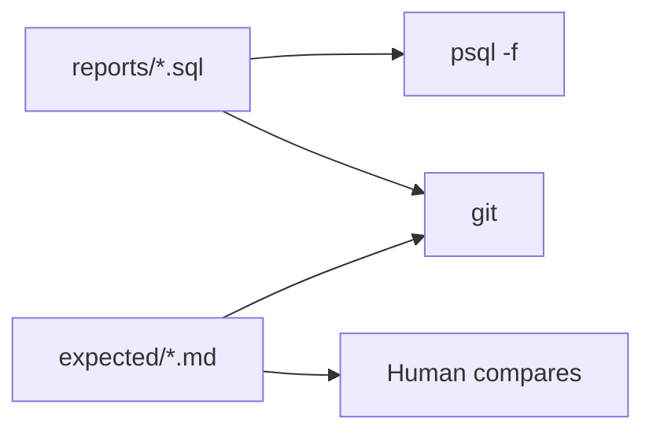

# Month 10 · Week 2 · Day 5
# Query Files in Git and Expected Result Notes

**Program:** Full-Stack Mastery · 18 months  
**Phase:** 3 — Python and backend  
**Month index:** [../../README.md](../../README.md)  
**Week 2:** [1](day-01.md) · [2](day-02.md) · [3](day-03.md) · [4](day-04.md) · Day 5 (today) · [6](day-06.md) · [7](day-07.md)  
**Week rhythm today:** Tests, refactor, docs  
**Student state:** Day 4 produced joins, groups, a CTE, and a window. Today those queries become a **pack** someone else can rerun.  
**Study time:** 3–4 focused hours

Labs: `~\fullstack-lab\month-10\week-02\day-05\`. Copy **your** Day 4 SQL forward and clean it. No SQLAlchemy. Expected results are **notes**, not a screenshot dump of secrets.

---

## How to use this textbook

1. A query without an expected shape is a demo, not a test.  
2. Refactor names and comments; do not “rewrite in an ORM.”  
3. If you automate, still use placeholders for values.  
4. Optional review links are for later rechecking.

---

## How to read this chapter

Week 1 Day 5 documented **schema**. Today you document **questions**. Each `.sql` file is a named report. Each `expected/*.md` (or comments at the top of the SQL) says: grain, columns, important rows (Empty Harbor count 0), and what would mean a **regression**.



**Wrong belief:** “I’ll know the right answer when I see it.”  
**Correct:** you will not, in three weeks. Write “Empty Harbor → 0 tickets” today.

**Wrong belief:** “Golden CSV of every cell is the only real test.”  
**Correct:** timestamps and identity values drift. Assert **shape and invariants**, not every `created_at`.

---

## Today's contract

By the end of this day you will be able to:

1. Organize Day 4 queries into a **`reports/`** folder with stable filenames.  
2. Write **expected result notes** per report (grain, columns, key invariants).  
3. Refactor: aliases, CTE names, comments that state the English question.  
4. Rerun the pack after a tiny seed change and update notes if an invariant broke.  
5. Optionally: a psycopg/pytest that asserts Empty Harbor’s count is 0.

**Today's gate.** Closed-book:

> Queries live in git as files. Expected notes describe grain and invariants, not a brittle dump of ids. COUNT(t.id) after LEFT JOIN is an invariant I can recheck. I still do not concatenate SQL.

---

## Time box

| Block | Minutes | Work |
|---|---|---|
| A | 35 | Theory: what to freeze vs what drifts |
| B | 70 | Pack + expected notes + rerun |
| C | 55 | Independent: break a query on purpose; optional pytest |
| D | 20 | Git |
| E | 15 | Recall |

---

# Block A — Theory

## 1. Why query files, not a notebook only

A notebook you never commit is a conversation with yourself. `reports/03_tickets_per_project.sql` is a contract. FastAPI will later wrap it. Analysts will rerun it. Git blame will tell who changed the JOIN.

One question per file, or a numbered pack with a README table. Do not concatenate ten unrelated SELECTs without comments — `psql -f` will print a wall.

## 2. What expected notes should contain

For each report:

- **English question** (one sentence)  
- **Grain** (one row per project / per status / per latest ticket)  
- **Columns** (names and meaning)  
- **Join type** (inner vs left) and why  
- **Invariants**: Empty Harbor has 0; open CTE excludes `done`; `rn = 1` unique per project  
- **NULL behavior**: unassigned tickets appear as `(unassigned)` or are dropped — say which  
- **What you are not asserting**: exact `id` values, exact `now()` timestamps  

If the seed is in git, you **may** assert exact title lists. Prefer titles (`Empty Harbor`) over ids (`7`).

## 3. Refactor rules today

- `t` and `p` aliases are fine if FROM introduces them immediately.  
- CTE names are verbs or nouns: `open_tickets`, `ranked`.  
- Delete `SELECT *`.  
- `ON p.id = t.project_id` not `ON true` or comma joins (`FROM a, b WHERE …`). Comma joins are inner joins wearing a 1989 costume.  
- `HAVING` only for group filters.

## 4. Regression without a warehouse

Change seed: add one ticket to Empty Harbor **then delete it**, or use a transaction you ROLLBACK (Week 3 will make ROLLBACK precise). Document the procedure in `HOW-I-TESTED.md`: run the count report, INSERT a ticket, run again, DELETE the ticket, confirm 0 returns.

If you use pytest: assume Day 4’s Empty Harbor INSERT is present; assert a row with that title and count 0.

## 5. Security

Reports that filter `WHERE title ILIKE %s` still use placeholders. A report with a baked-in `'%schema%'` is fine for a lab file. A report built as `f"ILIKE '%{q}%'"` is not.

---

# Block B — Type-along pack

```powershell
mkdir ~\fullstack-lab\month-10\week-02\day-05\reports -Force
mkdir ~\fullstack-lab\month-10\week-02\day-05\expected -Force
cd ~\fullstack-lab\month-10\week-02\day-05
```

Copy Day 4 SQL, then split/rename to something like:

| File | Question |
|---|---|
| `reports/01_ticket_listing.sql` | Inner join listing |
| `reports/02_project_ticket_counts.sql` | Left join counts including zeros |
| `reports/03_busy_projects.sql` | HAVING count >= 2 |
| `reports/04_open_counts_cte.sql` | CTE of open tickets |
| `reports/05_latest_ticket_per_project.sql` | ROW_NUMBER rn = 1 |
| `reports/06_projects_without_tickets.sql` | Anti-join |

Write `reports/README.md`: table of files and English questions.

For each, write `expected/02_project_ticket_counts.md` (match names):

```markdown
# Tickets per project

Grain: one row per project.
Columns: title, ticket_count.
Join: LEFT JOIN tickets so Empty Harbor appears.
Invariant: title 'Empty Harbor' has ticket_count 0.
Not asserted: order beyond ORDER BY in the SQL file; numeric ids.
```

Rerun:

```powershell
psql -U postgres -d month10 -f reports/02_project_ticket_counts.sql
```

If Empty Harbor is missing, the query is wrong — fix SQL, not the note.

Write `PACK.md`: how to reset `w2_*` (point at Day 1 files) and then run reports in order.

---

# Block C — Independent

**C1. Break HAVING.** Temporarily change `>= 2` to `>= 99`. Note that the expected file would fail. Restore. This is how you know the note is doing work.

**C2. WHERE on a left join (classic bug).** In a copy `scratch_left_where.sql`:

```sql
SELECT p.title, t.id
FROM w2_projects p
LEFT JOIN w2_tickets t ON t.project_id = p.id
WHERE t.status = 'open';
```

Empty Harbor disappears (WHERE rejects NULL status). Write `LEFT-WHERE.md`: how to keep projects with zero opens — filter in ON (`AND t.status = 'open'`) or CTE first, then LEFT JOIN. Implement the **correct** version as `reports/07_open_counts_keep_zeros.sql` with expected notes.

**C3. Optional pytest** with psycopg: query counts, assert any row with title Empty Harbor has count 0. `%s` if you pass parameters. Password from env.

**C4.** If Day 4 independent `08-report.sql` exists, move it into `reports/08_*.sql` and write expected notes. If not, write a new 08 using users LEFT JOIN.

Write `WHAT-I-SAW.md`: C1 restored; C2 explanation; whether pytest ran.

---

# Block D — Git

```powershell
cd ~\fullstack-lab
git add month-10\week-02\day-05
git commit -m "Month 10 Week 2 Day 5: report pack and expected notes."
```

---

# Block E — Recall

1. Grain vs columns.  
2. Why not freeze all ids.  
3. LEFT JOIN + WHERE on the right table.  
4. Invariant you chose for Empty Harbor.  
5. Placeholders vs baked-in lab patterns.

## Office hours

**Empty Harbor never existed.** Re-run Day 4’s INSERT … WHERE NOT EXISTS.

**pytest sees different counts.** Another session inserted tickets. Reports should tell you to reset `w2_*` from Day 1 + empty project.

**I committed DATABASE_URL with a password.** Remove; rotate; `.gitignore`.

**Comma join in an old file.** Rewrite as JOIN … ON. Do not leave `FROM a, b WHERE a.id = b.a_id` in the pack.

---

## Definition of done

- [ ] reports/ README + at least six SQL files  
- [ ] expected notes with invariants  
- [ ] LEFT-WHERE.md and report 07  
- [ ] HOW-I-TESTED.md  
- [ ] Commit exists  

---

## Tomorrow

Independent **reporting queries on your Project 6 schema**. CTE or window if a question needs it. Not the `w2_` tickets pack copied onto ops-api.

---

## What “expected” looks like when numbers move

Identity columns and `now()` will not match a screenshot from Tuesday. That is why notes speak **titles** and **counts**. If your seed is fully in git and you reset every time, you **may** freeze a sorted list of project titles. Still do not freeze `created_at`.

**A worked expected note for the window report:**

```markdown
# Latest ticket per project

Grain: one row per project that has at least one ticket.
Columns: project title, ticket id, ticket title, created_at.
Rule: ROW_NUMBER partitioned by project_id, ordered by created_at DESC, id DESC, keep rn = 1.
Invariant: no project title repeats.
Gap: Empty Harbor absent unless we LEFT JOIN projects to this CTE.
```

Copy that shape, not the ticket nouns, into every expected file.

**README table is part of the test.** If `reports/README.md` lists a file that does not exist, the pack is broken. If a file exists and is not listed, it will rot. Keep them in sync.

**psql output.** `\timing` is optional. `\x` expands rows. Neither replaces expected notes.

Write `INVARIANTS.md`: three bullets that must remain true after any allowed seed change (Empty Harbor exists; at least one project has two tickets; at least one unassigned ticket). If a report needs those, say so.

---

## Optional review links

Query packing is explained in this chapter. These pages are for later checking, not for first learning.

- [PostgreSQL: psql](https://www.postgresql.org/docs/current/app-psql.html)
- [PostgreSQL: WITH](https://www.postgresql.org/docs/current/queries-with.html)
- [PostgreSQL: Joins](https://www.postgresql.org/docs/current/queries-table-expressions.html#QUERIES-JOIN)
