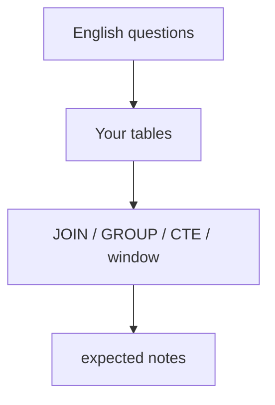

# Month 10 · Week 2 · Day 6
# Independent: Reporting Queries on Your Schema

**Program:** Full-Stack Mastery · 18 months  
**Phase:** 3 — Python and backend  
**Month index:** [../../README.md](../../README.md)  
**Week 2:** [1](day-01.md) · [2](day-02.md) · [3](day-03.md) · [4](day-04.md) · [5](day-05.md) · Day 6 (today) · [7](day-07.md)  
**Week rhythm today:** Independent implementation  
**Student state:** You have a query pack on `w2_*` lab tables. Today the questions hit **your** Project 6 Stage B schema.  
**Study time:** 3–4 focused hours

Work in `~/ops-api/sql/reports/` or `~\fullstack-lab\month-10\week-02\day-06\`. This textbook will **not** give you finished reports. No SQLAlchemy. No FastAPI. No blog schema. No complete Project 6 source.

---

## How to use this textbook

1. English questions first. SQL second. Expected notes third.  
2. AI may review a JOIN; it may not ship your reporting pack.  
3. Use CTE or ROW_NUMBER if the question needs a step or a “latest per parent.”  
4. Optional review links are for later rechecking.

---

## How to read this chapter

Week 1 Day 6 asked for tables. Today those tables must **answer product questions**. If you cannot write a LEFT JOIN count on your own parents, the schema is still a drawing.



**Wrong belief:** “I’ll copy Empty Harbor reports and rename projects.”  
**Correct:** your nouns differ. If 6A is inventory, “bins with zero qty” is the analog — you still write it.

**Wrong belief:** “Reporting is Month 11 ORM `group_by`.”  
**Correct:** raw SQL is the Month 10 gate. The ORM will emit SQL you must read.

---

## Today's contract

By the end of this day you will be able to:

1. Write **four** English reporting questions on **your** schema.  
2. Implement them with JOIN and at least one GROUP BY.  
3. Include **one CTE** and **one window** (`ROW_NUMBER` or `RANK`) somewhere in the pack (can be two different files).  
4. Include **one** “parents with zero children” LEFT JOIN or NOT EXISTS.  
5. Write expected notes (grain + invariants).  
6. Seed enough rows that zeros and non-zeros both appear.

**Today's gate.** Closed-book:

> I queried my Stage B schema, not w2_tickets pasted. I can explain each JOIN. A zero-child parent appears. A CTE or window is a real step, not a decoration. Expected notes exist. No API.

---

## Time box

| Block | Minutes | Work |
|---|---|---|
| A | 25 | Four questions in QUESTIONS.md |
| B | 40 | Seed gaps (zeros, NULLs, two children) |
| C | 90 | SQL + expected notes |
| D | 20 | Rerun + git |
| E | 15 | Recall |

---

# Block A — Questions before SQL

Open your Week 1 Day 6 SCHEMA.md. Write `QUESTIONS.md` with four questions. They must be **yours**. Size hints (do not copy if they do not fit):

- Count of children per parent, including zeros  
- Latest child per parent (window)  
- Filter + ILIKE on a title/name  
- Unassigned / NULL FK list (`IS NULL`)  
- Busy parents (HAVING COUNT >= 2)  
- Members/labels junction: count per parent  

Forbidden questions: “select * from users,” blog post counts, copying Day 5 file text with find-replace `w2_` → `ops_`.

If Day 6 schema is missing, you cannot honest-Day-6 this. Repair Week 1 Day 6 first. Do not invent a blog to have something to query.

---

# Block B — Seed so reports can fail

A report that never sees a zero is untested. Add to `02-seed.sql` or a new `02b-report-seed.sql`:

- One parent with **no** children  
- One parent with **at least two** children  
- One optional FK **NULL** if your model has one  
- Enough text for an ILIKE hit and a miss  

Apply to `ops_api` (or `month10` search_path/`ops_` prefix — whatever Day 6 used). Document in `WHERE.md`.

---

# Block C — Implement (no dump)

Create `reports/01_….sql` … `04_….sql` (names from QUESTIONS.md).

Must appear across the pack:

1. INNER JOIN (detail listing)  
2. LEFT JOIN + `COUNT(child.id)`  
3. `WITH` CTE  
4. `ROW_NUMBER() OVER (PARTITION BY … ORDER BY …)` or `RANK()`  
5. `WHERE` + `ILIKE` or `IS NULL`  
6. Optional HAVING  

Each file starts with a comment: English question, grain, join type.

`expected/` notes: invariants using **your** titles/codes, not `Empty Harbor` unless you actually named a row that.

If Python: placeholders only.

Do not use MongoDB. Do not use SQLAlchemy `func.count`.

---

# Block D — Rerun and commit

```powershell
psql -U postgres -d ops_api -f reports/01_….sql
```

Fix SQL until expected notes match. If you change seed, update notes.

```powershell
cd ~\ops-api
git add sql
git commit -m "Month 10 Week 2 Day 6: Stage B reporting queries."
```

Or commit under fullstack-lab if that is where the files live.

---

# Block E — Recall

1. Why LEFT JOIN for zeros.  
2. COUNT(*) vs COUNT(child.id).  
3. PARTITION BY meaning.  
4. Which question used a CTE and why.  
5. Why this is not the w2 pack.

## Office hours

**I only have one table.** Day 6 was incomplete. Add the FK child today — that is schema work, still allowed if SCHEMA.md updates.

**Window feels fake.** If you PARTITION BY a constant, you are numbering the whole table. Partition by the parent id.

**I queried month10 d4_ tables.** Wrong database for this day unless Day 6 really lives there — then say so in WHERE.md. Still your nouns.

**DOUBLE fan-out.** Joined two child tables at once and counts exploded. CTE two summaries, then join summaries to parent.

---

## Definition of done

- [ ] QUESTIONS.md has four product questions  
- [ ] Four SQL files run on **your** schema  
- [ ] Zeros visible; CTE used; window used  
- [ ] expected notes with invariants  
- [ ] No blog; no w2 paste as the product  
- [ ] Commit exists  

---

## Tomorrow

Week review: SQL fluency, subquery vs JOIN, repair from **this week’s** synthesis in Day 7. Mini-exam on a new small schema, not ops-api.

---

## How to choose the four questions

A good reporting question names **grain** and **audience**. “List everything” is not a report. “How many open items sit on each parent, including quiet parents?” is a report. “What is the latest event on each parent?” is a report. “Which parents have no events?” is a report. “Which titles match a search?” is a report.

If two questions are the same JOIN with a different WHERE, that is one question and a parameter. Write the ILIKE as a **second** file only if the English differs (“search” vs “count”).

**Window without theater.** `ROW_NUMBER() OVER (ORDER BY id)` on the whole table is a line number. It is legal and rarely a product question. `PARTITION BY parent_id ORDER BY created_at DESC` is “latest per parent.” Use that shape unless you can name another partition.

**CTE without theater.** `WITH x AS (SELECT * FROM t) SELECT * FROM x` is not a step. A CTE that filters status, or ranks, or aggregates children **before** joining parents, is a step.

Write `GRAIN.md`: one line per report file: “one row per ___.” If two files share a grain, that is fine; if you cannot fill the blank, the question is mush.

**Junction tables.** If your Stage B has members or labels, `COUNT(DISTINCT user_id)` after a join is different from `COUNT(*)`. Fan-out will lie. Mention DISTINCT only when you mean unique people, and prefer counting from a CTE at the right grain.

---

# Seed sketches that make zeros real

A parent with no children is not a failed seed. It is a **fixture**. Name it in QUESTIONS.md (“Quiet warehouse,” “Empty clinic”) so expected notes can point at a title.

A parent with two children is the HAVING fixture.

A NULL optional FK is the IS NULL fixture.

If all parents have children, report 1 cannot show zeros. You will “fix” the SQL by INNER JOIN and think you passed. You did not.

Write `FIXTURES.md`: three named rows you inserted for those cases.

## Window check

After `rn = 1`, `COUNT(*)` of the result should equal the number of parents **that have at least one child**. If it equals all parents, you LEFT JOINed ranks incorrectly or every parent has a child. If it is more than the number of parents, PARTITION BY is wrong (not unique ranks).

Write that check as a SQL comment on the window file.

## CTE check

If the CTE is `SELECT * FROM t`, delete it. If the CTE filters or ranks or aggregates, keep it. Name it after the step: `open_items`, `ranked_events`, `child_counts`.

---

# Independent reporting: typed skeleton comments (you fill)

```sql
-- 01: children per parent including zeros
-- Grain: one row per <parent>
-- SELECT parent.title, COUNT(child.id)
-- FROM parent LEFT JOIN child ...
-- GROUP BY parent.id, parent.title

-- 02: latest child per parent
-- WITH ranked AS (
--   SELECT ..., ROW_NUMBER() OVER (PARTITION BY parent_id ORDER BY created_at DESC, id DESC) AS rn
-- FROM child)
-- SELECT * FROM ranked WHERE rn = 1

-- 03: ILIKE search
-- WHERE title ILIKE '%...%'  -- if Python, placeholder

-- 04: IS NULL optional FK
-- WHERE assignee_id IS NULL
```

These comments are not runnable product SQL. Your files are. If you paste this skeleton unchanged, Day 6 fails.

## Transfer from Week 2 Day 5

LEFT JOIN + WHERE on the child status drops zeros. You already wrote LEFT-WHERE.md on lab tickets. Reproduce the **correct** pattern on **your** schema as one of the four files. If you do not, zeros will vanish and you will not notice until Week 4 exam.

## What “four questions” is not

Four filters on the same listing (`status=open`, `status=done`, …) are one question. Four grains are four questions. GRAIN.md is how you prove variety.

Write `VARIETY.md`: four grains listed. If two are the same, replace one.

---

# Quiet parent name

Pick a title that cannot be confused with Atlas. `Quiet Harbor` if you want a cousin of Empty Harbor **on your nouns**, or `No-Items Bin` for inventory. Put that exact string in expected notes.

Write `QUIET.md`: the title, and which report file must show n=0 for it.

## IN vs JOIN for “children of these parents”

`WHERE parent_id IN (SELECT id FROM parents WHERE …)` is a subquery. JOIN is often clearer. Both can be right. Do not N+1. If you write a Python loop, you failed Block C even if results look right.

---

# Report file names

`01_counts.sql` is better than `query.sql`. README links those names. If you have `untitled.sql`, rename.

Write `NAMES.md`: list of report files.

## Expected note template copy

Grain / columns / join / invariant / not asserted. Four files, four notes. A single EXPECTED.md with four headings is allowed if README says so.

---

Write `FOUR-GRAINS.md`: paste GRAIN.md here if it lived only in your head.

---

Write `CTE-NAME.md`: the CTE identifier you used (not x).

---

Write `QUIET-TITLE.md`: exact quiet-parent title string.

---

## Closing note

Do not copy w2_ report files into ops-api. GRAIN.md must name **your** parents.

---

## Optional review links

Reporting SQL is explained in Days 1–5. These pages are for later checking, not for first learning.

- [PostgreSQL: SELECT](https://www.postgresql.org/docs/current/sql-select.html)
- [PostgreSQL: Window functions](https://www.postgresql.org/docs/current/tutorial-window.html)
- [PostgreSQL: WITH](https://www.postgresql.org/docs/current/queries-with.html)
