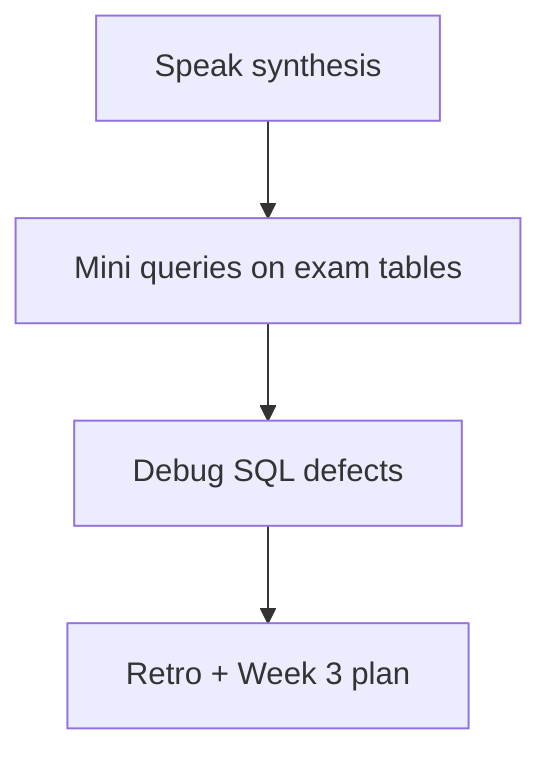

# Month 10 · Week 2 · Day 7
# Week Review — SQL Fluency, Subquery vs JOIN

**Program:** Full-Stack Mastery · 18 months  
**Phase:** 3 — Python and backend  
**Month index:** [../../README.md](../../README.md)  
**Week 2:** [1](day-01.md) · [2](day-02.md) · [3](day-03.md) · [4](day-04.md) · [5](day-05.md) · [6](day-06.md) · Day 7 (today)  
**Week rhythm today:** Review, repair, plan Week 3  
**Student state:** You can SELECT, mutate with RETURNING, JOIN, GROUP, CTE, and number rows with a window. Today that fluency must live in **this file**.  
**Study time:** 3–4 focused hours

Do not start Week 3 because the calendar moved. Transactions on queries you cannot read are two problems.

Work in `~\fullstack-lab\month-10\week-02\day-07\`. Do not implement the mini-exam inside `~/ops-api/`. Days 1–6 stay closed during Blocks 2–3 except this file.

---

## How to read this chapter

This is a **closed-book teaching day**. The synthesis **is** the Week 2 lesson.



Repair from **this** recap, not from Day 4’s ticket files.

---

## Week synthesis (the lesson, in this book)

**SELECT** projects columns. Name them. `SELECT *` hides change and leaks. The result is a table, not always stored.

**WHERE** keeps rows whose predicate is **true**. SQL uses **three-valued logic**: true, false, **unknown**. `NULL = NULL` is unknown. `WHERE assignee_id = NULL` returns no rows. Use `IS NULL` / `IS NOT NULL`. `AND`/`OR` with NULL follows three-valued tables; use parentheses when both appear.

**ILIKE** is case-insensitive pattern match. `%` any string, `_` one character. Leading `%` is correct for substring search and later unfriendly to B-tree (Week 4). User-supplied patterns are **values** (placeholders), but `%` in the value is still a wildcard.

**ORDER BY** defines sequence. Without it, LIMIT is a sample of **some** rows. Tie-break with a unique column. **LIMIT** caps. **OFFSET** exists; keyset pagination is Week 4.

**INSERT** adds rows. **UPDATE** and **DELETE** need WHERE. Missing WHERE is a wipe. **UPDATE 0** is not an error; APIs must notice. **RETURNING** is how you get `GENERATED` ids — not `max(id)`, which races.

**ON CONFLICT** is upsert: insert or, on a unique conflict, update or do nothing. Month 9 POST+409 is insert-or-fail. Upsert that silently renames Ada is a product bug.

Constraints still fire on mutations. RESTRICT still blocks parent DELETE.

**INNER JOIN** keeps matches. **LEFT JOIN** keeps the left side; right columns NULL if unmatched. Fan-out: one parent with three children yields three rows. **COUNT(*)** after LEFT JOIN counts padded rows; **COUNT(child.id)** skips NULLs — zeros for Empty Harbor.

**WHERE** on a right-table column after LEFT JOIN can **drop** unmatched left rows (NULL fails `status = 'open'`). Filter the right table in **ON**, or CTE first, then LEFT JOIN.

**GROUP BY** sets grain. Non-grouped, non-aggregated columns error in PostgreSQL. **HAVING** filters groups after aggregation. **WHERE** filters rows before.

**Subquery vs JOIN:** unmatched parents: `NOT EXISTS` or `LEFT JOIN … WHERE child.id IS NULL`. `NOT IN (SELECT nullable_col)` is a NULL trap. Correlated `SELECT (SELECT COUNT(*) …)` is clear and sometimes slower than JOIN+GROUP.

**CTE (`WITH`)** names a step for humans. **ROW_NUMBER() OVER (PARTITION BY parent ORDER BY …)** ranks without collapsing; `WHERE rn = 1` is latest-per-parent. `RANK()` ties share a rank.

Parameterized SQL: psycopg `%s` as bound values, never f-strings.

**Wrong belief:** “DISTINCT fixes a join explosion.”  
**Correct:** explosion means the grain is wrong. DISTINCT hides it.

**Wrong belief:** “JOIN is always inner; missing rows mean missing data.”  
**Correct:** missing rows may mean you inner-joined a zero-child parent out of the report.

---

## Today's contract

**Today's gate.** Closed-book:

> I can explain WHERE vs unknown, RETURNING, INNER vs LEFT, COUNT(child.id), HAVING vs WHERE, CTE vs subquery, and ROW_NUMBER. I wrote queries on this file’s mini schema without copying Week 2 ticket SQL.

---

## Time box

| Block | Minutes | Work |
|---|---|---|
| 1 | 35 | Speak synthesis |
| 2 | 55 | Mini schema + queries |
| 3 | 30 | Debug on paper |
| 4 | 25 | Retro |
| 5 | 15 | Recall |

---

# Complete explanation — querying you must still own

## 1. Read (Day 1)

Projection, filter, sort, cap. NULL is a state. ILIKE is a pattern.

## 2. Write (Day 2)

INSERT/UPDATE/DELETE. RETURNING. Upsert is optional meaning.

## 3. Memory CRUD (Day 3)

New noun. Same verbs.

## 4. Combine (Day 4)

Join types, group grain, CTE, window.

## 5. Pack (Day 5)

Files + expected invariants.

## 6. Your schema (Day 6)

Transfer. Not `w2_` renamed.

---

# Block 1 — Speak

Out loud: `= NULL` vs `IS NULL`; RETURNING; LEFT JOIN zeros; HAVING; PARTITION BY. Write `SYNTHESIS.md` if you do not record. Then Block 2.

---

# Block 2 — Mini-exam (imposed: cafes)

Create tables **you** write: `exam_cafes (id, name unique nonblank)`, `exam_drinks (id, cafe_id FK RESTRICT, name, price NUMERIC, sold_out BOOLEAN)`. Seed: two cafes, drinks on only **one** cafe so the other is Empty Harbor’s cousin. One drink `sold_out = true`.

Queries (no complete SQL in this file — spec only):

1. ILIKE drink names containing `latte` (put that word in a seed row).  
2. INNER JOIN drinks to cafes.  
3. LEFT JOIN: drinks **count per cafe** including **zero**.  
4. CTE of drinks that are not sold out, then count per cafe (zeros kept).  
5. ROW_NUMBER: most expensive drink per cafe (`ORDER BY price DESC, id`).  
6. Anti-join: cafes with no drinks.  
7. UPDATE one drink price RETURNING; UPDATE `WHERE id = -1` record 0.

Write `exam-expected.md`: cafe-without-drinks has count 0.

```powershell
mkdir ~\fullstack-lab\month-10\week-02\day-07 -Force
cd ~\fullstack-lab\month-10\week-02\day-07
psql -U postgres -d month10 -f 01-schema.sql
```

---

# Block 3 — Debug on paper

`exam-debug.md`. Cause and fix.

**A.** `WHERE cafe_id = NULL` to find drinks with a missing cafe (should be impossible with FK). What result? What if you meant a nullable column?

**B.** LEFT JOIN drinks, `WHERE drinks.sold_out = false`, empty cafe vanishes.

**C.** `SELECT cafe_id, name, COUNT(*) FROM exam_drinks GROUP BY cafe_id` — PostgreSQL error. Why?

**D.** INSERT drink `ON CONFLICT (name) DO UPDATE` when name is unique **per cafe** not globally. What conflict target is wrong?

**E.** `NOT IN (SELECT cafe_id FROM exam_drinks)` if cafe_id could be NULL. What happens?

**F.** `SELECT max(id) FROM exam_drinks` after INSERT in two sessions. Why RETURNING?

---

# Block 4 — Retro

`RETRO.md`: weakest join; whether Day 6 reports were yours; Week 3 is ACID and ROLLBACK — you will wrap multi-row changes.

```powershell
cd ~\fullstack-lab
git add month-10\week-02\day-07
git commit -m "Month 10 Week 2 Day 7: SQL fluency review."
```

---

## Scoring

| Piece | Honest pass |
|---|---|
| Count including zero | LEFT JOIN + COUNT(drink.id) |
| CTE | Not a pointless WITH wrapping SELECT * |
| Window | PARTITION BY cafe_id |
| Anti-join | Matches the zero cafe |
| Debug B | ON filter or CTE, not WHERE on right |

---

## Worked answers — check after you write debug

**A.** `= NULL` unknown; 0 rows. `IS NULL`. With a real FK NOT NULL, missing cafe_id should not exist.

**B.** WHERE turns left join into inner. Filter `sold_out` in ON or in a CTE of in-stock drinks, then LEFT JOIN cafes.

**C.** `name` not aggregated and not in GROUP BY.

**D.** Conflict must match a unique constraint. You need `UNIQUE (cafe_id, name)` and `ON CONFLICT (cafe_id, name)`.

**E.** If the subquery yields NULL, NOT IN becomes unknown for every row; you can get **no rows**. Use NOT EXISTS.

**F.** Concurrent inserts; max is not “my row.” RETURNING is.

---

## Office hours

**I queried w2_tickets.** Wrong. Cafes. Transfer.

**NUMERIC vs FLOAT.** Price is NUMERIC. Week 1 still holds.

**Week 3 tonight?** Only if this gate is true.

---

## Definition of done

- [ ] Spoke NULL, JOIN, GROUP, window  
- [ ] Cafe mini queries + zero count  
- [ ] Debug A–F written then checked  
- [ ] RETRO.md  
- [ ] Week 3 not started on a false gate  

---

## Tomorrow

Week 3 Day 1: **ACID**, **BEGIN/COMMIT/ROLLBACK**, what a transaction is.

---

## Fluency drill (write answers in DRILL.md before Block 2)

Translate each English sentence to SQL **shape** (you may skip running until Block 2 cafes exist):

1. Drinks whose name contains “mocha”, any case.  
2. Cafes that have **no** drinks.  
3. Number of drinks per cafe, zeros included.  
4. Same as 3, but only in-stock drinks, zeros included.  
5. The single most expensive in-stock drink per cafe.  
6. Insert a drink and get its id back.  
7. Unassign a nullable column (if you had one) without using 0.

Then implement 1–6 on the cafe tables. If your shape for (4) used WHERE `sold_out = false` after LEFT JOIN, repair it using this file’s debug B **before** you look at the worked box.

**Subquery vs JOIN paragraph.** Write ten sentences in `JOIN-VS-SUBQUERY.md`: when NOT EXISTS is easier to read than LEFT JOIN IS NULL; when a JOIN+GROUP BY beats a correlated COUNT; why you will still learn both. This paragraph is part of the week gate.

---

# Cafe mini: what “zero drinks” looks like

Seed cafe `Lamp` with no drinks. Count query must list Lamp with 0. If Lamp is missing, you INNER JOINed. That is the week’s entire LEFT JOIN lesson in one title.

Latest-drink window will **omit** Lamp (no rows to rank). Write that gap in exam-expected.md. Optional extra: LEFT JOIN cafes to the ranked CTE to show NULL drink columns for Lamp. That extra is the same gap as Day 4 Empty Harbor + window.

## Subquery vs JOIN — required paragraph prompts

Use these prompts inside JOIN-VS-SUBQUERY.md:

- NOT EXISTS reads like English “cafes that do not have a drink.”  
- LEFT JOIN IS NULL is the same anti-join in set form; EXPLAIN may differ.  
- Correlated COUNT in SELECT is easy to type and easy to N+1-ify later in an ORM.  
- JOIN+GROUP BY is one set operation.  
- NOT IN (SELECT cafe_id FROM drinks) is wrong if cafe_id can be NULL; your FK is NOT NULL so it might **happen** to work — still prefer NOT EXISTS.

---

# Cafe drinks price grain

`NUMERIC` price: `SUM(price)` per cafe is a report; `AVG(price)` ignores NULL prices if you allow them. Today price is NOT NULL in a good schema. `FILTER (WHERE NOT sold_out)` on SUM is a CTE-or-FILTER extra if time remains.

Window `ORDER BY price DESC, id` — `id` tie-break so two $4 drinks still have unique `rn`. Without id, ROW_NUMBER is still unique but **which** $4 drink is rn=1 is undefined besides the remaining sort. Always add id.

## Debug E extra

`NOT IN (SELECT cafe_id FROM exam_drinks)` with a NOT NULL FK will often match NOT EXISTS. The trap is when the subquery **can** produce NULL. Write one sentence: “I used NOT EXISTS so I do not depend on that.”

## Mini file list

- `01-schema.sql`  
- `02-seed.sql`  
- `03-queries.sql`  
- `exam-expected.md`  
- `exam-debug.md`  
- `JOIN-VS-SUBQUERY.md`  
- `DRILL.md`  
- `SYNTHESIS.md`  
- `RETRO.md`  

If SYNTHESIS.md is empty, Block 1 did not happen.

---

# Debug scoring reminder

A is NULL. B is LEFT+WHERE. C is GROUP BY. D is ON CONFLICT target. E is NOT IN. F is max(id). If your exam-debug.md answers those with “try again,” rewrite from the synthesis **after** your first attempt.

Write `ATTEMPT.md`: “I wrote debug before the worked box: yes/no.”

---

Write `DRILL-DONE.md`: seven translations attempted before Block 2, yes/no.

---

Write `LAMP.md`: cafe with zero drinks, exact name used in seed.

---

Write `ANTIJOIN.md`: LEFT JOIN IS NULL or NOT EXISTS for cafes with no drinks.

---

Write `SYN-EMPTY.md`: SYNTHESIS.md is not empty yes/no.

---

## Optional review links

Repair from this synthesis first.

- [PostgreSQL: SELECT](https://www.postgresql.org/docs/current/sql-select.html)
- [PostgreSQL: Joins](https://www.postgresql.org/docs/current/queries-table-expressions.html#QUERIES-JOIN)
- [PostgreSQL: Window functions](https://www.postgresql.org/docs/current/tutorial-window.html)
