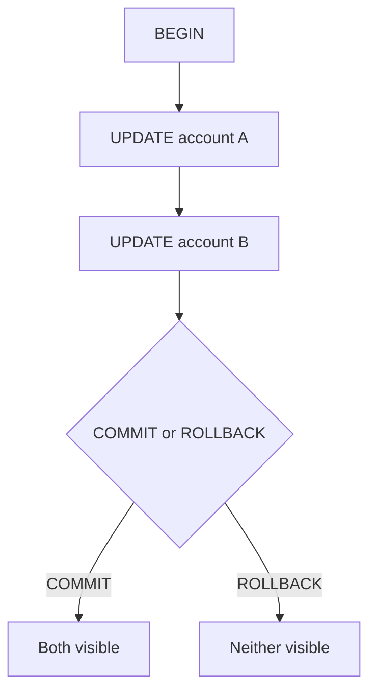

# Month 10 · Week 3 · Day 1
# ACID, BEGIN, COMMIT, and ROLLBACK

**Program:** Full-Stack Mastery · 18 months  
**Phase:** 3 — Python and backend  
**Month index:** [../../README.md](../../README.md)  
**Week 3:** Day 1 (today) · [2](day-02.md) · [3](day-03.md) · [4](day-04.md) · [5](day-05.md) · [6](day-06.md) · [7](day-07.md)  
**Week rhythm today:** Learn + type-along  
**Student state:** Week 2 gate passed. You can JOIN and RETURNING. Today several statements become **one fact** — or none.  
**Study time:** 3–4 focused hours

**This week covers:** ACID, transactions, isolation, locks, concurrency anomalies, constraints, database-enforced correctness.

Today: what a **transaction** is, **ACID** in working English, **BEGIN / COMMIT / ROLLBACK**, and autocommit in `psql`. Isolation stories are Day 2. Do not skip ROLLBACK. Docker is not the gate. No SQLAlchemy. No lock cookbook.

Labs: `~\fullstack-lab\month-10\week-03\day-01\`. Database `month10`. Prefix `w3_`.

---

## How to use this textbook

1. Read why two updates must not half-apply, then type BEGIN.  
2. When a statement errors, notice whether later statements are **rejected** until ROLLBACK.  
3. Optional review links are for later rechecking.

---

## How to read this chapter

A **transaction** is a bundle of SQL that the database treats as **one unit**: all of it becomes visible, or none of it does. **COMMIT** publishes the bundle. **ROLLBACK** forgets it. **ACID** is four properties people use to describe that unit. Your FastAPI process can crash mid-request; PostgreSQL will not leave “debited but not credited” **if** those two updates shared a transaction.



**Wrong belief:** “Each SQL file is already a transaction.”  
**Correct:** in `psql`, **each statement** autocommits unless you `BEGIN`. Two UPDATEs in a file without BEGIN are two transactions.

**Wrong belief:** “I’ll catch errors in Python and it will be atomic.”  
**Correct:** Python exceptions do not undo SQL already committed. You BEGIN, execute, COMMIT or ROLLBACK.

---

## Today's contract

By the end of this day you will be able to:

1. Define a **transaction** in one paragraph without the word “magic.”  
2. Expand **ACID** into four sentences you could say to a teammate.  
3. Use **BEGIN**, **COMMIT**, and **ROLLBACK** in `psql`.  
4. Show that ROLLBACK undoes an INSERT you have not committed.  
5. Show that after an **error**, PostgreSQL **aborts the transaction** until ROLLBACK (or COMMIT will fail).  
6. Explain autocommit vs an explicit transaction.

**Today's gate.** Closed-book:

> A transaction is one unit of work. COMMIT makes it visible; ROLLBACK does not. Atomicity is all-or-nothing. Durability means a committed fact survives a crash (the disk story). In psql I must BEGIN or each statement stands alone. After an error I ROLLBACK; I do not keep issuing SQL in an aborted block and hope.

---

## Time box

| Block | Minutes | Work |
|---|---|---|
| A | 50 | Theory: transactions and ACID |
| B | 70 | Type-along: BEGIN/COMMIT/ROLLBACK |
| C | 55 | Independent: two-row insert that must not split |
| D | 15 | Git |
| E | 15 | Recall |

---

# Block A — Theory

## 1. Why this week exists

Week 2’s INSERT then UPDATE were two facts. If the process died between them, the database kept the first. That is correct **autocommit** behavior and wrong **product** behavior when the two rows are one business event: transfer funds, place an order and decrement stock, attach a membership and a role.

Month 9 could fake atomicity only inside one Python dict mutation. Two dicts could still tear. PostgreSQL can refuse the tear **if you ask**.

## 2. What a transaction is

A transaction starts at **BEGIN** (or the driver’s equivalent) and ends at **COMMIT** or **ROLLBACK**.

While it is open:

- Your session sees its own uncommitted writes.  
- Other sessions, at the default isolation you will study tomorrow, do **not** see those writes until COMMIT.  
- Locks may be held (Day 2). Do not hold a transaction open while you go to lunch.

**COMMIT** makes the writes durable and visible according to isolation rules.

**ROLLBACK** discards the writes. The database looks as if the transaction never happened (except some sequence values still increment — identity gaps are normal).

`BEGIN` is also `START TRANSACTION`. Use either. This course writes `BEGIN`.

## 3. ACID in working English

**Atomicity.** All of the transaction’s changes apply, or none do. There is no committed “half transfer.” A crash mid-transaction rolls back.

**Consistency.** The transaction takes the database from one **valid** state to another. “Valid” means constraints (PK, FK, CHECK, UNIQUE) plus whatever you encoded. If the second UPDATE violates a CHECK, the transaction cannot commit successfully with the first UPDATE kept — you ROLLBACK (and PostgreSQL will abort on the error). Consistency is **not** “the business is happy.” It is “the declared rules still hold.”

**Isolation.** Concurrent transactions do not see each other’s **uncommitted** dirt (in PostgreSQL’s model). How much **committed** concurrency they see is **isolation level** (Day 2). Default is **Read Committed**.

**Durability.** After COMMIT succeeds, a power loss should not lose that commit. WAL (write-ahead log) is the mechanism. You do not configure WAL today. You need the sentence: commit means **on disk**, not “the Python variable is set.”

**Wrong belief:** “ACID means the database is always correct about money.”  
**Correct:** ACID means the database keeps **its** promises. If you never BEGIN the two updates together, atomicity does not apply **across** them.

## 4. Autocommit

`psql` default: send a statement, it commits. A `.sql` file with ten INSERTs is ten transactions unless the file contains BEGIN/COMMIT.

Python drivers often autocommit **off** (psycopg 3: you use `conn.commit()` / `conn.rollback()`, or a `with` block). If you never commit, another session may not see your rows. If you never rollback after an error, the connection is in an aborted state.

Today in `psql` you will **feel** both modes.

## 5. Errors abort the transaction

In PostgreSQL, a statement that **errors** inside a transaction puts that transaction in an **aborted** state. Further statements fail with “current transaction is aborted, commands ignored until end of transaction block.” You **ROLLBACK** (or ROLLBACK TO SAVEPOINT if you used savepoints). You do not “skip the bad line and COMMIT the rest” without a savepoint.

Day 4 will prove constraint failure aborts. Today you will trip a simple error (`SELECT 1/0`) inside BEGIN to see the abort.

Savepoints (`SAVEPOINT sp1; ROLLBACK TO sp1;`) exist. Optional stretch. The gate is ROLLBACK of the whole transaction.

## 6. What is not a transaction

- A FastAPI request is not automatically a DB transaction (Month 11 sessions).  
- A `.sql` file is not automatically a transaction.  
- `RETURNING` is not a transaction.  
- Docker is not a transaction.

## 7. Identity and rollback

`IDENTITY` / sequences **do not roll back**. If you INSERT, get id 51, ROLLBACK, the next INSERT may be 52. Gaps are not missing money. Do not write accounting that assumes consecutive ids.

## 8. Security and transactions

A transaction does not make concatenated SQL safe. Placeholders still. A transaction **does** make “debit then credit” safe from a crash **between** statements. Injection and atomicity are different bugs.

---

# Block B — Type-along

```powershell
mkdir ~\fullstack-lab\month-10\week-03\day-01 -Force
cd ~\fullstack-lab\month-10\week-03\day-01
```

Create `00-schema.sql`:

```sql
DROP TABLE IF EXISTS w3_accounts;
CREATE TABLE w3_accounts (
  id INTEGER GENERATED BY DEFAULT AS IDENTITY PRIMARY KEY,
  name TEXT NOT NULL UNIQUE,
  balance INTEGER NOT NULL,
  CONSTRAINT w3_accounts_balance_nonneg CHECK (balance >= 0)
);

INSERT INTO w3_accounts (name, balance) VALUES
  ('Ada', 100),
  ('Lin', 100);
```

```powershell
psql -U postgres -d month10 -f 00-schema.sql
```

**B1. Autocommit is two facts.** In an interactive `psql -U postgres -d month10` session, type (do not put this in a file yet):

```sql
UPDATE w3_accounts SET balance = balance - 30 WHERE name = 'Ada';
-- stop. imagine crash here.
UPDATE w3_accounts SET balance = balance + 30 WHERE name = 'Lin';
SELECT name, balance FROM w3_accounts ORDER BY name;
```

If you stopped after the first UPDATE (run only the first, then SELECT), Ada is already 70. Restore:

```sql
UPDATE w3_accounts SET balance = 100;
```

Write `AUTCOMMIT.md`: one paragraph, why a crash after statement 1 is a product bug.

**B2. BEGIN / COMMIT.** Create `01-transfer-commit.sql`:

```sql
BEGIN;

UPDATE w3_accounts SET balance = balance - 30 WHERE name = 'Ada';
UPDATE w3_accounts SET balance = balance + 30 WHERE name = 'Lin';

COMMIT;

SELECT name, balance FROM w3_accounts ORDER BY name;
```

```powershell
psql -U postgres -d month10 -f 01-transfer-commit.sql
```

Balances should be Ada 70, Lin 130 if you restored to 100/100 first. If not, write the numbers you got and reset to 100/100 for B3.

**B3. ROLLBACK.** Reset to 100/100. Create `02-transfer-rollback.sql`:

```sql
BEGIN;

UPDATE w3_accounts SET balance = balance - 30 WHERE name = 'Ada';
SELECT name, balance FROM w3_accounts ORDER BY name;

ROLLBACK;

SELECT name, balance FROM w3_accounts ORDER BY name;
```

Inside the transaction Ada is 70. After ROLLBACK both 100. Paste both result sets into `ROLLBACK.md`.

**B4. Error aborts.** Reset balances. Create `03-aborted.sql`:

```sql
BEGIN;
UPDATE w3_accounts SET balance = balance - 10 WHERE name = 'Ada';
SELECT 1 / 0;
UPDATE w3_accounts SET balance = balance + 10 WHERE name = 'Lin';
COMMIT;
```

Run it. You should see division by zero, then either “aborted” on the second UPDATE or COMMIT failing. Finish with:

```sql
ROLLBACK;
SELECT name, balance FROM w3_accounts ORDER BY name;
```

Ada must **not** be permanently 90. Write `ABORTED.md`: what you saw; why you ROLLBACK.

In `psql -f`, a file may stop at the first error depending on `ON_ERROR_STOP`. Try **interactive** `psql` for B4 if the file exits too fast. Document which.

**B5. Open transaction visibility (same session).** 

```sql
BEGIN;
INSERT INTO w3_accounts (name, balance) VALUES ('Tmp', 1);
SELECT * FROM w3_accounts WHERE name = 'Tmp';
ROLLBACK;
SELECT * FROM w3_accounts WHERE name = 'Tmp';
```

First SELECT sees Tmp. Second does not. That is your own transaction.

---

# Block C — Independent

**C1. Pair insert.** Tables `w3_orders (id, note TEXT)` and `w3_order_items (id, order_id FK RESTRICT, sku TEXT NOT NULL, qty INTEGER CHECK (qty > 0))`. In **one** transaction: insert an order RETURNING id, insert two items. COMMIT. In a **second** experiment: BEGIN, insert order, insert item with `qty = 0` (must fail CHECK), observe abort, ROLLBACK, prove **no** order row remains.

You write the SQL. No dump here.

**C2.** Write `ACID.md`: four short paragraphs, one per letter, using **today’s accounts or orders**, not a memorized slogan.

**C3.** Optional: two `psql` windows. BEGIN insert in window 1; SELECT in window 2 before COMMIT. Window 2 should **not** see the row (Read Committed). Then COMMIT; window 2 sees it. Isolation vocabulary is Day 2; today you only record **visibility**. Write `TWO-WINDOWS.md`.

Do not use SELECT FOR UPDATE yet. Do not set isolation levels yet.

---

# Block D — Git

```powershell
cd ~\fullstack-lab
git add month-10\week-03\day-01
git commit -m "Month 10 Week 3 Day 1: transactions BEGIN COMMIT ROLLBACK."
```

---

# Block E — Recall

1. Autocommit vs BEGIN.  
2. Atomicity vs two committed UPDATEs.  
3. Why sequences leave gaps after ROLLBACK.  
4. What you do after “transaction is aborted.”  
5. Durability in one sentence.  
6. Consistency vs “the CFO is happy.”

## Office hours

**COMMIT after error succeeded and kept Ada’s debit.** You were not in a transaction (autocommit). BEGIN first.

**I cannot type in two windows.** Fine. Skip C3; Day 2 will demand stories anyway.

**Balance went negative.** CHECK should have stopped it; if you used a transfer larger than Ada’s balance, that is Day 4’s constraint-abort lab. Reset and continue.

**psql -f stopped at 1/0.** Set `ON_ERROR_STOP` off for the demo, or use interactive mode. The lesson is the aborted state, not the flag.

---

## Definition of done

- [ ] ACID.md in your words with today’s tables  
- [ ] ROLLBACK.md shows before/after  
- [ ] Aborted transaction recovered with ROLLBACK  
- [ ] Pair insert experiment: no orphan order after failed item  
- [ ] Commit exists  

---

## Tomorrow

Isolation: **Read Committed** default, **lost update** and **phantom** as stories, **SELECT FOR UPDATE** as a concept — not an exploit cookbook.

---

## Optional review links

Transactions are explained in this chapter. These pages are for later checking, not for first learning.

- [PostgreSQL: Transactions](https://www.postgresql.org/docs/current/tutorial-transactions.html)
- [PostgreSQL: BEGIN](https://www.postgresql.org/docs/current/sql-begin.html)
- [PostgreSQL: Transaction isolation (preview)](https://www.postgresql.org/docs/current/transaction-iso.html)
