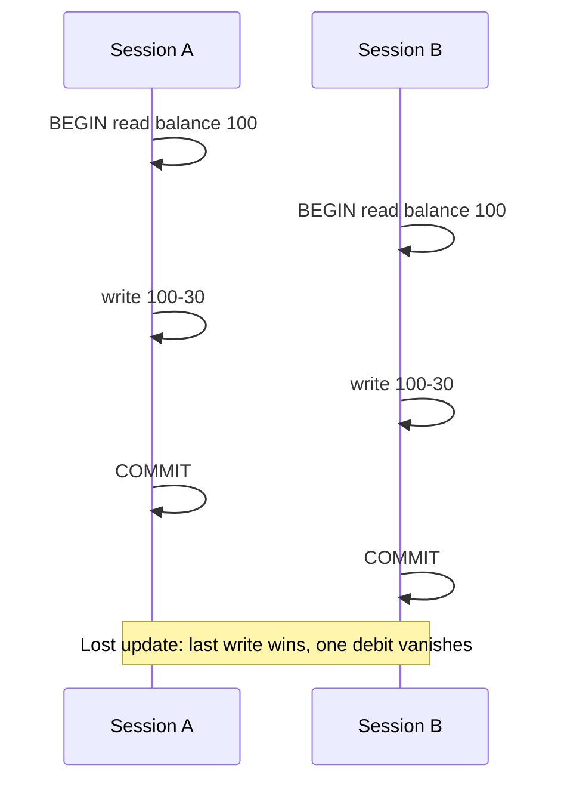

# Month 10 · Week 3 · Day 2
# Isolation Stories and SELECT FOR UPDATE as a Concept

**Program:** Full-Stack Mastery · 18 months  
**Phase:** 3 — Python and backend  
**Month index:** [../../README.md](../../README.md)  
**Week 3:** [1](day-01.md) · Day 2 (today) · [3](day-03.md) · [4](day-04.md) · [5](day-05.md) · [6](day-06.md) · [7](day-07.md)  
**Week rhythm today:** Exercises + debugging (theory is in this file)  
**Student state:** Day 1 gate passed. You can BEGIN/COMMIT/ROLLBACK. Today concurrent sessions **interleave**. You will learn **stories**, not a lock exploit cookbook.  
**Study time:** 3–4 focused hours

Labs: `~\fullstack-lab\month-10\week-03\day-02\`. Two `psql` windows. **SELECT FOR UPDATE** is a concept you will type **once** on a row you own in lab, not a recipe for attacking systems. No SQLAlchemy. No advisory-lock encyclopedia.

---

## How to use this textbook

1. Read the story. Predict. Then try two windows.  
2. If you cannot open two windows, write the prediction anyway — then try later.  
3. Do not practice locks against databases you do not own. This is `month10` on your machine.  
4. Optional review links are for later rechecking.

---

## How to read this chapter

**Isolation** is how much one transaction sees of **others**. PostgreSQL’s default is **Read Committed**: each statement sees the latest **committed** data. Uncommitted writes from others stay invisible. That still allows **lost updates** if two sessions read, think, and write without locking or a single SQL update. A **phantom** is a new row that appears in a later statement of the same transaction under some levels; at Read Committed, **each statement** can see new committed rows. **SELECT FOR UPDATE** means “I intend to update these rows; other writers wait.” It is a **coordination** tool, not a weapon.



**Wrong belief:** “ACID isolation means two users cannot mess up a counter.”  
**Correct:** default isolation prevents **dirty reads**, not every application race. You still design updates (`SET balance = balance - 30`) or row locks.

**Wrong belief:** “I’ll always SET SESSION CHARACTERISTICS AS TRANSACTION ISOLABLE SERIALIZABLE and never think.”  
**Correct:** Serializable has a cost and serialization failures you must retry. This course: understand Read Committed first. You may **read** the docs on Repeatable Read / Serializable; you will not tune production isolation today.

---

## Today's contract

By the end of this day you will be able to:

1. Explain **Read Committed** in a story: what you **cannot** see (uncommitted), what you **can** (committed between your statements).  
2. Tell the **lost update** story with two readers and two writers.  
3. Tell a **phantom / new-row** story at Read Committed (count changes between two SELECTs).  
4. Explain **SELECT FOR UPDATE** as “lock these rows for update in this transaction,” and when a simple `UPDATE … SET col = col - 1` already avoids lost update.  
5. **Not** produce a lock-wait exploit script against anything but your lab.

**Today's gate.** Closed-book:

> Read Committed hides uncommitted data. Two transactions can still overwrite each other’s decisions if they read into application memory and write stale values. Lost update is that story. A second SELECT in the same transaction can see new committed rows. SELECT FOR UPDATE asks others to wait so I can update those rows. I prefer a single SQL UPDATE that computes on the server when that is enough.

---

## Time box

| Block | Minutes | Work |
|---|---|---|
| A | 55 | Theory: stories |
| B | 70 | Two-window labs |
| C | 50 | Independent: write stories in your nouns |
| D | 15 | Git |
| E | 15 | Recall |

---

# Block A — Theory

## 1. Isolation is not atomicity

Atomicity: your own bundle is all-or-nothing. Isolation: **other** bundles. You can be atomic and still lose an update against a neighbor.

PostgreSQL levels (names you should recognize):

| Level | Dirty read | Typical extra |
|---|---|---|
| Read Uncommitted | In PostgreSQL, **same as Read Committed** (no dirty read) | Do not expect dirty reads here |
| **Read Committed** (default) | No | Each statement sees latest committed |
| Repeatable Read | No | Snapshot for the transaction; write conflicts / serialization issues |
| Serializable | No | Looks serial; retries on conflict |

Today’s labs: **default**. You may `SHOW transaction_isolation;` and record `read committed`.

## 2. Dirty read (why you barely see it here)

A dirty read is seeing **another** transaction’s uncommitted write. PostgreSQL does not give you that at these levels. Day 1’s two windows already showed: uncommitted INSERT is invisible next door. That is isolation working.

## 3. Lost update — the story you must own

Ada’s account has 100. Two withdrawals of 30, both decided from a **read** of 100 in application code:

1. Session A reads 100.  
2. Session B reads 100.  
3. Session A writes 70, commits.  
4. Session B writes 70, commits (it still believes “100 − 30”).  

The second 30 **vanished**. Final 70, should be 40. That is a **lost update**. Isolation did not fail at dirty-read; the **application** wrote a stale absolute value.

**SQL that avoids this particular race:**

```sql
UPDATE w3_accounts SET balance = balance - 30 WHERE name = 'Ada';
```

The computation happens **in the database** on the latest row version (with row locking under the UPDATE). Two such UPDATEs serialize: 100→70, 70→40.

**SQL that reintroduces it:**

```sql
-- session reads
SELECT balance FROM w3_accounts WHERE name = 'Ada'; -- 100
-- python: new = 100 - 30
UPDATE w3_accounts SET balance = 70 WHERE name = 'Ada';
```

Month 11’s ORM `.balance -= 30` in Python can be this bug. That is why you learn it **before** the ORM.

CHECK `balance >= 0` still helps: you cannot go negative, but you can still **lose** a debit if you write stale positives.

## 4. Phantom / changing counts — the story

You BEGIN. `SELECT COUNT(*) FROM w3_accounts WHERE balance >= 0` → 2. Someone else COMMITs a new account. You `SELECT COUNT(*)` again in the **same** transaction. At **Read Committed**, the second statement can see the new row. The “phantom” is a row that was not in the first read.

Repeatable Read / Serializable aim to stop that (with their own failure modes). You do not need to demonstrate those levels today. You need the story: **Read Committed is per-statement snapshots**, not one snapshot for the whole transaction.

Non-repeatable read (related): you SELECT Ada’s balance twice; a committed UPDATE sits between; you see 100 then 70. At Read Committed, that is allowed.

## 5. SELECT FOR UPDATE — concept

```sql
BEGIN;
SELECT * FROM w3_accounts WHERE name = 'Ada' FOR UPDATE;
-- other sessions' UPDATE on Ada waits until you COMMIT or ROLLBACK
UPDATE w3_accounts SET balance = balance - 30 WHERE name = 'Ada';
COMMIT;
```

**Meaning:** lock matching rows against concurrent **updates** (and other FOR UPDATE) until your transaction ends. Reads without FOR UPDATE still see **committed** state; they do not necessarily wait.

**When you need it:** you read several columns, decide in the application, then update **if** the decision still holds. The lock makes “read-think-write” one critical section.

**When you do not:** a single `UPDATE … SET balance = balance - 30 WHERE … AND balance >= 30` already locks the row as it updates. Prefer that.

**What this course will not do:** teach you to lock large ranges to block other students, to hold locks while sleeping, or to FOR UPDATE a production database. Lab rows only. If a lock wait hangs, `ROLLBACK` in the holding session. `lock_timeout` exists; optional.

`FOR UPDATE SKIP LOCKED` and `FOR SHARE` exist. Skip them unless you are building a job queue later. Mention in NOTES that they exist; do not copy a queue recipe from the internet today.

## 6. Deadlock — one paragraph

Session A locks Ada, session B locks Lin, then each waits for the other. PostgreSQL **aborts one** with a deadlock error. Retry the transaction. Do not write a “deadlock generator” as a hobby. If you hit one accidentally in lab, ROLLBACK, record it, move on.

---

# Block B — Type-along (two windows)

Reset accounts from Day 1 schema (100/100). Keep `w3_accounts`.

```powershell
mkdir ~\fullstack-lab\month-10\week-03\day-02 -Force
```

**B1. Dirty read does not happen.** Window A:

```sql
BEGIN;
UPDATE w3_accounts SET balance = 1 WHERE name = 'Ada';
-- do not commit yet
```

Window B:

```sql
SELECT balance FROM w3_accounts WHERE name = 'Ada';
```

B should still see **100** (or last committed). Then A `ROLLBACK`. Write `NO-DIRTY.md`.

**B2. Lost update with stale writes.** Reset 100. **Do this slowly.**

Window A:

```sql
BEGIN;
SELECT balance FROM w3_accounts WHERE name = 'Ada';
```

Window B: same SELECT, see 100.

Window A:

```sql
UPDATE w3_accounts SET balance = 70 WHERE name = 'Ada';
COMMIT;
```

Window B:

```sql
UPDATE w3_accounts SET balance = 70 WHERE name = 'Ada';
COMMIT;
SELECT balance FROM w3_accounts WHERE name = 'Ada';
```

Final **70** is the lost update. Write `LOST-UPDATE.md`: expected 40, got 70.

Reset 100. Both windows, **without** reading into a constant:

```sql
BEGIN;
UPDATE w3_accounts SET balance = balance - 30 WHERE name = 'Ada';
COMMIT;
```

Run A fully, then B fully (or even overlap — second waits). Final **40**. Write the contrast in the same file.

**B3. Phantom-ish count.** Window A:

```sql
BEGIN;
SELECT COUNT(*) FROM w3_accounts;
```

Window B: `INSERT INTO w3_accounts (name, balance) VALUES ('Sam', 5);` (committed autocommit).

Window A: `SELECT COUNT(*) FROM w3_accounts;` then `ROLLBACK` (or COMMIT). Count can **increase**. Write `PHANTOM.md`. Delete Sam after.

**B4. FOR UPDATE wait (lab only).** Reset. Window A:

```sql
BEGIN;
SELECT * FROM w3_accounts WHERE name = 'Ada' FOR UPDATE;
```

Window B:

```sql
BEGIN;
UPDATE w3_accounts SET balance = balance - 1 WHERE name = 'Ada';
```

B **waits**. A `COMMIT`. B proceeds. Do **not** leave A open. Write `FOR-UPDATE.md`: one paragraph concept; “I did not hold this lock idle.”

If B waits forever, A is still in BEGIN. COMMIT or ROLLBACK A.

---

# Block C — Independent

Rewrite lost-update and phantom as stories about **your** Project 6 nouns in `MY-RACES.md` (inventory qty, ticket status, membership unique). No need to run 6A. Name whether a **single SQL UPDATE** would suffice.

Write `WHEN-FOR-UPDATE.md`: a case where read-think-write needs a lock (example: read two accounts, decide a fee, write both). A case where it does not (`qty = qty - 1`).

Do not write a script that loops FOR UPDATE against random ids. Do not set isolation to Serializable unless you also write a retry paragraph — optional stretch only.

---

# Block D — Git

```powershell
cd ~\fullstack-lab
git add month-10\week-03\day-02
git commit -m "Month 10 Week 3 Day 2: isolation stories and FOR UPDATE concept."
```

---

# Block E — Recall

1. Read Committed vs dirty read.  
2. Lost update in four steps.  
3. Why `balance = balance - 30` helps.  
4. Second COUNT in one transaction.  
5. What FOR UPDATE asks other **writers** to do.  
6. Why this is not a lock cookbook.

## Office hours

**Window B hangs.** A is in an open transaction. COMMIT/ROLLBACK A. That is the lesson, not a freeze of PostgreSQL.

**I saw Ada’s uncommitted 1 in B.** You queried in the **same** session as the UPDATE. Use two sessions (`psql` twice).

**Deadlock error.** ROLLBACK the failed one; retry. Shorten transactions.

---

## Definition of done

- [ ] NO-DIRTY.md, LOST-UPDATE.md, PHANTOM.md, FOR-UPDATE.md  
- [ ] Contrast stale write vs SQL `balance = balance - 30`  
- [ ] MY-RACES.md for your domain  
- [ ] Commit exists  

---

## Tomorrow

From memory: a **transfer-like** pair of updates in **one** transaction. Recap in Day 3. No complete solution dump.

---

# Repeatable Read in one paragraph (you may not demo it)

At Repeatable Read, PostgreSQL takes a **snapshot** for the transaction. Your second COUNT would **not** see Sam. Writers who conflict may get an error you must retry. That is not free isolation. This course’s labs stay on Read Committed so the phantom-ish COUNT is visible and the lost-update story is about **application writes**, not snapshot theory. If you `SET TRANSACTION ISOLATION LEVEL REPEATABLE READ` as stretch, write what changed and **set it back**. Do not leave a session on Serializable for the rest of the week.

## Write skew (name only)

Two doctors, two on-call rows, each reads “the other is on call,” both go off call. Each transaction looks valid. Serializable aims at that. You will not construct a write-skew lab that looks like an attack on a hospital. You will write **one sentence** in NOTES: write skew exists; Serializable is a later tool; today lost update is enough.

## SELECT FOR UPDATE OF table

If a JOIN is in the SELECT, `FOR UPDATE` can lock more tables than you meant. Keep today’s FOR UPDATE on a **single** table WHERE name = 'Ada'. That is enough to feel a wait. Do not FOR UPDATE a join of all accounts.

## Timeouts (optional)

```sql
SET lock_timeout = '2s';
```

Then B’s UPDATE fails instead of waiting forever if A is stuck. Reset or disconnect after. This is courtesy in a lab, not a production policy class.

Write `WAIT.md`: what you set, if anything, and that you COMMIT/ROLLBACK A promptly.

---

# Isolation SHOW

```sql
SHOW transaction_isolation;
```

Expect `read committed`. Paste into NOTES.md. If you changed it, set it back:

```sql
SET SESSION CHARACTERISTICS AS TRANSACTION ISOLATION LEVEL READ COMMITTED;
```

## Lost update numbers

Start 100. Two stale writes of 70. Final 70. Should be 40. The missing 30 is the lost debit. LOST-UPDATE.md must contain **70 vs 40**. If you only wrote “it was wrong,” rewrite with numbers.

## FOR UPDATE wait is not a crash

Window B’s `psql` looks hung. Type nothing for a minute if you must — then COMMIT A. B completes. If you Ctrl+C B, you cancelled B, not the lock. A still holds it until A ends.

Write `NOT-A-CRASH.md`: one paragraph.

---

# Two-window dirty-read recap from Day 1 C3

If you skipped C3 yesterday, do the visibility half today: BEGIN UPDATE Ada to 1; other window SELECT still 100; ROLLBACK. That is isolation’s easy win. Lost update is the hard win. Do not confuse them in LOST-UPDATE.md.

Write `NOT-DIRTY.md` if you did not already have NO-DIRTY.md.

---

Write `RR.md`: I did not leave Repeatable Read on (yes/no).

---

Write `TWO-WINDOWS.md`: did B wait, and did A commit? yes/no.

---

## Optional review links

Isolation stories are explained in this chapter. These pages are for later checking, not for first learning.

- [PostgreSQL: Transaction isolation](https://www.postgresql.org/docs/current/transaction-iso.html)
- [PostgreSQL: SELECT locking clauses](https://www.postgresql.org/docs/current/sql-select.html#SQL-FOR-UPDATE-SHARE)
