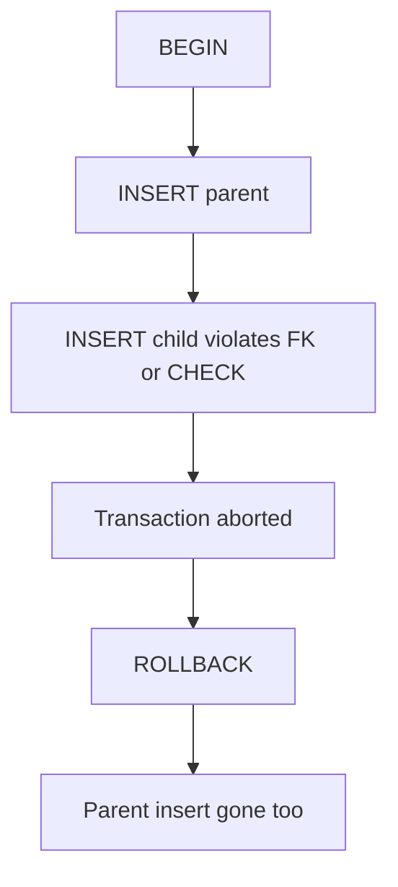

# Month 10 · Week 3 · Day 4
# Lab: ROLLBACK Undoes; Constraint Failure Aborts

**Program:** Full-Stack Mastery · 18 months  
**Phase:** 3 — Python and backend  
**Month index:** [../../README.md](../../README.md)  
**Week 3:** [1](day-01.md) · [2](day-02.md) · [3](day-03.md) · Day 4 (today) · [5](day-05.md) · [6](day-06.md) · [7](day-07.md)  
**Week rhythm today:** Lab feature  
**Student state:** You can wrap a transfer. Today you **prove** two properties so they are not slogans: ROLLBACK restores; a constraint error **aborts** the bundle.  
**Study time:** 3–4 focused hours

Labs: `~\fullstack-lab\month-10\week-03\day-04\`. Prefix `w3l_` (lab). No SQLAlchemy. Prefer RESTRICT. Parameterized if Python.

---

## How to use this textbook

1. Each proof is a before SELECT, a transaction, an after SELECT.  
2. Paste constraint names.  
3. Optional review links are for later rechecking.

---

## How to read this chapter

Week 1 constraints refuse bad rows. This week they refuse **inside** a transaction and take the **good** sibling statement with them — until you use a savepoint (optional). That is not meanness. That is atomicity.



**Wrong belief:** “I’ll COMMIT the good INSERT and skip the bad one.”  
**Correct:** after an error, PostgreSQL ignores commands until ROLLBACK. Without a SAVEPOINT, there is no “skip.”

**Wrong belief:** “ROLLBACK is only for developers who panic.”  
**Correct:** ROLLBACK is how you implement “this request failed.” HTTP 400/409 later maps here.

---

## Today's contract

By the end of this day you will be able to:

1. Prove ROLLBACK undoes INSERT/UPDATE you just did.  
2. Prove a **CHECK** failure aborts a multi-statement transaction.  
3. Prove an **FK** failure aborts (orphan insert after a parent insert in the same BEGIN).  
4. Prove **UNIQUE** failure aborts.  
5. Document `current transaction is aborted`.  
6. Optional SAVEPOINT: recover from a failed statement **without** losing an earlier insert you intend to keep — only if you can explain why that is **not** the transfer pattern.

**Today's gate.** Closed-book:

> ROLLBACK restores uncommitted work. A constraint error aborts the whole transaction unless I used a savepoint. I cannot COMMIT a half bundle after an error. CHECK, FK, and UNIQUE all participate in atomicity.

---

## Time box

| Block | Minutes | Work |
|---|---|---|
| A | 40 | Theory: abort vs savepoint vs autocommit |
| B | 80 | Type-along proofs |
| C | 50 | Independent: transfer + failing CHECK |
| D | 15 | Git |
| E | 15 | Recall |

---

# Block A — Theory

## 1. ROLLBACK is the inverse of uncommitted work

Committed data is not undone by ROLLBACK of a **later** transaction. ROLLBACK only affects the **current** open transaction. If you autocommitted an INSERT, you need DELETE (or a compensating transaction), not ROLLBACK.

## 2. Constraint failure is still a statement error

FK, CHECK, UNIQUE, NOT NULL all abort like `1/0`. The row that failed is not stored. Rows from **earlier statements in the same BEGIN** are also not visible to others and will vanish on ROLLBACK. They are still “there” for you until ROLLBACK — but you cannot COMMIT them without handling the abort.

## 3. SAVEPOINT (optional, named)

```sql
BEGIN;
INSERT INTO w3l_parents (name) VALUES ('KeepMe');
SAVEPOINT after_parent;
INSERT INTO w3l_children (parent_id, title) VALUES (99999, 'Ghost'); -- fails
ROLLBACK TO after_parent;
-- KeepMe still in this transaction
COMMIT;
```

Use savepoints for “optional extra insert.” Do **not** use them to fake a transfer that must be atomic. If the credit fails, you want the debit gone, not saved.

## 4. psql ON_ERROR_STOP

`psql -f` with `ON_ERROR_STOP=1` exits on first error — good for scripts. For abort demos, interactive `psql` or `ON_ERROR_STOP=0` lets you see the follow-up “aborted” message. Document which you used.

## 5. Python

```python
try:
    cur.execute(...)
    cur.execute(...)  # may raise
    conn.commit()
except Exception:
    conn.rollback()
    raise
```

If you commit after an exception without rollback, the driver may refuse. Never concatenate SQL.

---

# Block B — Type-along

```powershell
mkdir ~\fullstack-lab\month-10\week-03\day-04 -Force
cd ~\fullstack-lab\month-10\week-03\day-04
```

Create `00-schema.sql`:

```sql
DROP TABLE IF EXISTS w3l_children;
DROP TABLE IF EXISTS w3l_parents;

CREATE TABLE w3l_parents (
  id INTEGER GENERATED BY DEFAULT AS IDENTITY PRIMARY KEY,
  name TEXT NOT NULL UNIQUE,
  CONSTRAINT w3l_parents_name_not_blank CHECK (name <> '')
);

CREATE TABLE w3l_children (
  id INTEGER GENERATED BY DEFAULT AS IDENTITY PRIMARY KEY,
  parent_id INTEGER NOT NULL
    REFERENCES w3l_parents (id) ON DELETE RESTRICT,
  title TEXT NOT NULL,
  qty INTEGER NOT NULL,
  CONSTRAINT w3l_children_title_not_blank CHECK (title <> ''),
  CONSTRAINT w3l_children_qty_pos CHECK (qty > 0)
);
```

**Proof 1 — ROLLBACK undoes INSERT.** `01-rollback.sql` (interactive-friendly: you may split):

```sql
SELECT COUNT(*) AS before FROM w3l_parents;

BEGIN;
INSERT INTO w3l_parents (name) VALUES ('GhostParent');
SELECT COUNT(*) AS inside FROM w3l_parents;
ROLLBACK;

SELECT COUNT(*) AS after FROM w3l_parents;
```

`inside` is before+1. `after` equals `before`. Paste into `PROOF.md`.

**Proof 2 — CHECK aborts bundle.**

```sql
BEGIN;
INSERT INTO w3l_parents (name) VALUES ('Bundle');
INSERT INTO w3l_children (parent_id, title, qty)
SELECT id, 'Bad', 0 FROM w3l_parents WHERE name = 'Bundle';
-- qty 0 violates CHECK
COMMIT; -- should fail / not keep Bundle
```

Then `ROLLBACK;` if needed. `SELECT * FROM w3l_parents WHERE name = 'Bundle';` must be **empty**. Constraint name in PROOF.md.

**Proof 3 — FK abort.** BEGIN; insert parent `Bundle2`; insert child `parent_id = 99999`; abort; ROLLBACK; no Bundle2.

**Proof 4 — UNIQUE abort.** BEGIN; insert `Ada`; insert `Ada` again; abort; after ROLLBACK, zero or one Ada depending on whether the first Ada was in this transaction only — both gone if both were in the same BEGIN. If Ada existed before BEGIN, she remains; the second insert aborted the transaction — **uncommitted** first insert in **this** tx is gone. Design the proof so both inserts are in the transaction on a **new** name `AdaTx`.

**Proof 5 — aborted command ignored.** After a failed INSERT, issue `SELECT 1;` before ROLLBACK. Capture `current transaction is aborted`. Then ROLLBACK. `SELECT 1` works again.

Run via interactive `psql -U postgres -d month10` if `-f` exits too early. Write `HOW-I-RAN.md`.

---

# Block C — Independent

Reuse Day 3 bins **or** create `w3l_bins`. Transfer 3 units A→B in one transaction **successfully**. Then a transfer that **fails CHECK or WHERE** on the second update (or a dest bin id that does not exist). Prove the first decrement **does not persist**.

Write `TRANSFER-PROOF.md` with before/after counts.

Optional SAVEPOINT file `04-savepoint.sql` with a comment: “not for transfers.”

Optional pytest: two statements, second violates CHECK, assert parent count unchanged. Placeholders. Rollback in `except`.

---

# Block D — Git

```powershell
cd ~\fullstack-lab
git add month-10\week-03\day-04
git commit -m "Month 10 Week 3 Day 4: ROLLBACK and constraint abort proofs."
```

---

# Block E — Recall

1. ROLLBACK vs DELETE of committed rows.  
2. Why Bundle disappeared after CHECK fail.  
3. SAVEPOINT vs atomic transfer.  
4. Aborted state message.  
5. Python try/except rollback.

## Office hours

**Bundle was committed.** Autocommit: you were not in BEGIN, or you COMMITTED before the failing statement in a second transaction. One BEGIN.

**psql -f skipped the SELECT after error.** ON_ERROR_STOP. Interactive for the demo.

**I used CASCADE to delete proofs.** Not this lab. ROLLBACK.

---

## Definition of done

- [ ] Five proofs in PROOF.md  
- [ ] Transfer-proof independent  
- [ ] HOW-I-RAN.md  
- [ ] Commit exists  

---

## Tomorrow

Tests and docs for **transactional invariants**: SCHEMA-style notes plus a rerunnable abort checklist. Optional psycopg.

---

# How to write a proof that cannot lie

A proof has four times:

1. **Before** — SELECT the invariant (counts, balances, SUM(qty)).  
2. **Act** — BEGIN … statements … COMMIT or ROLLBACK.  
3. **After** — the same SELECT.  
4. **Name** — constraint name or “ROLLBACK” as the mechanism.

If you skip (1), you cannot see a no-op. If you skip (3), you are hoping. If you skip (4), you cannot teach a teammate.

## Autocommit false friends

If Proof 2’s parent `Bundle` **remains** after a CHECK failure, you were not in a transaction. Symptoms:

- You ran two files, and the INSERT committed at the end of file 1.  
- You used `psql -c` twice.  
- You COMMITTED before the failing INSERT.

Fix: one BEGIN at the top of **one** session, both INSERTs, then the failing statement, then ROLLBACK. Interactive `psql` is the honest tool for abort demos.

## Savepoint ethics

Savepoints are for “try this optional extra.” Example: attach a tag if the tag table accepts it; if not, keep the issue. Transfers, payments, stock moves, “create order+items” are **not** optional extras. If item 2 fails, item 1 and the order must vanish.

Write `SAVEPOINT-ETHICS.md` (six sentences): one good use, one forbidden use (keeping a debit).

## Python sketch (optional, placeholders)

```python
import os
import psycopg

def try_bundle():
    conn = psycopg.connect(
        host="127.0.0.1",
        dbname="month10",
        user="postgres",
        password=os.environ["PGPASSWORD"],
    )
    try:
        with conn.transaction():
            cur = conn.cursor()
            cur.execute(
                "INSERT INTO w3l_parents (name) VALUES (%s) RETURNING id",
                ("PyBundle",),
            )
            (pid,) = cur.fetchone()
            cur.execute(
                "INSERT INTO w3l_children (parent_id, title, qty) VALUES (%s, %s, %s)",
                (pid, "Bad", 0),
            )
    except psycopg.errors.CheckViolation:
        pass
    finally:
        conn.close()
```

If you run this, assert `PyBundle` is absent. Do not f-string. Do not commit this password.

## Constraint SQLSTATEs (optional asserts)

| Class | Meaning |
|---|---|
| 23503 | foreign_key_violation |
| 23505 | unique_violation |
| 23514 | check_violation |
| 23502 | not_null_violation |

You may `print(e.sqlstate)` in a lab test. Do not memorize as a religion; read the error text first.

Write `SQLSTATE.md` if you used Python; otherwise skip.

---

# Proof 5 exact message

You want something like: `ERROR:  current transaction is aborted, commands ignored until end of transaction block`. If you never saw it, you rolled back too fast or used autocommit. Interactive:

```text
month10=# BEGIN;
BEGIN
month10=# INSERT INTO w3l_children (parent_id, title, qty) VALUES (99999, 'x', 1);
ERROR:  insert or update on table "w3l_children" violates foreign key constraint ...
month10=# SELECT 1;
ERROR:  current transaction is aborted ...
month10=# ROLLBACK;
ROLLBACK
month10=# SELECT 1;
 ?column?
----------
        1
```

Paste your analog into PROOF.md. This transcript **is** the lab.

## Bundle2 FK abort

Parent insert in the same BEGIN as orphan child: both gone after ROLLBACK. If you insert the parent, COMMIT, then BEGIN orphan child, the parent **stays** — that is two transactions. Design Proof 3 so both statements share one BEGIN.

Write `ONE-BEGIN.md`: which proofs share a transaction.

---

# UNIQUE AdaTx proof design

Do not use a name that already exists from a previous run. `AdaTx` plus a suffix if you rerun. Both inserts in **one** BEGIN. After ROLLBACK, `SELECT FROM w3l_parents WHERE name LIKE 'AdaTx%'` is empty for that suffix.

Write `ADATX.md`: the exact name you used.

## Transfer independent uses bins

If you never created w3_bins on Day 3, create them in this folder for Block C. Do not skip the transfer-proof because parents/children felt enough. The decrement/increment pair is the lab feature.

---

Write `TRANSFER-PROOF-PATH.md`: path of the file that shows Ada/bins unchanged after failure.

---

Write `FIVE-PROOFS.md`: list proof numbers 1–5 done yes/no.

---

Write `BUNDLE-GONE.md`: SELECT count of Bundle after proof 2 (expect 0).

---

Write `ADATX-GONE.md`: AdaTx absent after UNIQUE abort yes/no.

---

## Closing note

Interactive `psql` is the honest tool for the aborted-transaction message. Capture it.

---

## Optional review links

Abort behavior is explained in this chapter. These pages are for later checking, not for first learning.

- [PostgreSQL: Transactions](https://www.postgresql.org/docs/current/tutorial-transactions.html)
- [PostgreSQL: SAVEPOINT](https://www.postgresql.org/docs/current/sql-savepoint.html)
- [PostgreSQL: Constraints](https://www.postgresql.org/docs/current/ddl-constraints.html)
