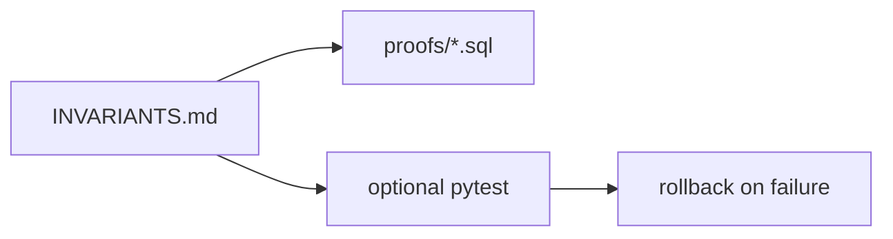

# Month 10 · Week 3 · Day 5
# Tests and Docs for Transactional Invariants

**Program:** Full-Stack Mastery · 18 months  
**Phase:** 3 — Python and backend  
**Month index:** [../../README.md](../../README.md)  
**Week 3:** [1](day-01.md) · [2](day-02.md) · [3](day-03.md) · [4](day-04.md) · Day 5 (today) · [6](day-06.md) · [7](day-07.md)  
**Week rhythm today:** Tests, refactor, docs  
**Student state:** Day 4 proved ROLLBACK and abort. Today those proofs become **invariants** a teammate can rerun.  
**Study time:** 3–4 focused hours

Labs: `~\fullstack-lab\month-10\week-03\day-05\`. Bring Day 4 SQL forward. No SQLAlchemy. Placeholders in Python.

---

## How to use this textbook

1. An invariant is a sentence that stays true after COMMIT.  
2. A test that never rolls back a failure is incomplete.  
3. Optional review links are for later rechecking.

---

## How to read this chapter

Week 1 SCHEMA.md named keys. Today **INVARIANTS.md** names **multi-row** truths: “qty never negative,” “order never exists without items if we aborted,” “transfer does not split.” Tests are SQL files and optional pytest that **expect** an exception and a restored count.



**Wrong belief:** “If CHECK exists, I do not need a transfer test.”  
**Correct:** CHECK protects a **row**. A split transfer is two rows. You still test the transaction.

**Wrong belief:** “I’ll test this in Month 11 with a session fixture.”  
**Correct:** you can prove abort now with psycopg. Waiting is how races ship.

---

## Today's contract

By the end of this day you will be able to:

1. Write **INVARIANTS.md** for lab tables (bins or parents/children).  
2. Keep rerunnable **proof scripts** for ROLLBACK and constraint abort.  
3. Optionally pytest: failed child insert → parent count unchanged; use `rollback()`.  
4. Document isolation story references (lost update) without requiring a flake-prone concurrent pytest.  
5. Never f-string SQL.

**Today's gate.** Closed-book:

> Transactional invariants are sentences about multiple rows. Proofs rerun. A pytest that expects IntegrityError must rollback and assert the good row did not commit. CHECK is necessary and not sufficient for transfers.

---

## Time box

| Block | Minutes | Work |
|---|---|---|
| A | 35 | Theory: invariants vs constraints |
| B | 70 | INVARIANTS.md + proof pack |
| C | 55 | Optional pytest + lost-update note |
| D | 20 | Git |
| E | 15 | Recall |

---

# Block A — Theory

## 1. Constraint vs invariant

A **constraint** is declared in SQL and enforced per statement. An **invariant** can be: “the sum of qty across bins is conserved by transfers.” PostgreSQL will not know “conservation” unless you encode it (trigger, or application transaction). Your **test** checks conservation after a successful transfer and checks **no change** after a failed one.

## 2. What to document

For each invariant:

- Sentence  
- How the DB helps (CHECK, FK, UNIQUE, transaction)  
- How you prove it (file name)  
- What isolation does **not** do for you (lost update if you write stale values)

## 3. pytest shape

Connect, `BEGIN` (or rely on connection transaction), execute, expect error, `rollback()`, `SELECT COUNT`. Isolation: do not run two threads unless you know how; document lost update as a **story test** in markdown. Concurrent pytest is optional stretch and flaky on a laptop.

Password from env. `%s` placeholders.

## 4. Refactor

Named constraints. One `00-schema.sql`. Proofs in `proofs/`. README order. `ON_ERROR_STOP` documented.

---

# Block B — Pack

```powershell
mkdir ~\fullstack-lab\month-10\week-03\day-05\proofs -Force
cd ~\fullstack-lab\month-10\week-03\day-05
```

Copy Day 4 schema. Write `INVARIANTS.md` with at least:

1. No orphan children (FK).  
2. qty > 0 on children (or bins qty >= 0).  
3. Unique parent names.  
4. A failed statement in a transaction does not leave a sibling insert committed.  
5. Successful transfer conserves total qty (if you use bins).

`proofs/README.md` lists files. Rerun each. `RESULTS.md` this session.

Include a **conservation** proof if you have bins: SELECT SUM(qty) before; transfer; SUM after equal.

---

# Block C — Independent

**C1. pytest optional** `test_abort.py`: insert parent+bad child in one transaction; catch `CheckViolation` or `ForeignKeyViolation`; rollback; parent name absent.

**C2. `LOST-UPDATE.md`** restates Day 2 with a pointer: we do **not** flake CI with two threads today; we forbid stale writes in `RULES.md` (`qty = qty - n` only).

**C3.** If Day 3 bins exist, add `proofs/transfer_fail.sql` to this pack so Week 3 proofs live in one folder.

Write `SECURITY.md`: placeholders; no passwords in git.

---

# Block D — Git

```powershell
cd ~\fullstack-lab
git add month-10\week-03\day-05
git commit -m "Month 10 Week 3 Day 5: transactional invariant proofs."
```

---

# Block E — Recall

1. Conservation vs CHECK.  
2. Why pytest must rollback.  
3. Why concurrent tests are optional.  
4. Aborted transaction.  
5. Placeholders.

## Office hours

**IntegrityError but parent exists.** Autocommit on the first execute. One transaction.

**sqlstate.** `23514` check, `23503` FK, `23505` unique — optional asserts.

---

## Definition of done

- [ ] INVARIANTS.md  
- [ ] proofs rerun; RESULTS.md  
- [ ] pytest or written skip  
- [ ] RULES.md stale writes  
- [ ] Commit exists  

---

## Tomorrow

Independent: name **invariants in your Project 6 schema** the DB must enforce. Not a finished API. Not a dump.

---

## Optional review links

- [PostgreSQL: Constraints](https://www.postgresql.org/docs/current/ddl-constraints.html)
- [psycopg 3: Transactions](https://www.psycopg.org/psycopg3/docs/basic/usage.html#transactions)
- [PostgreSQL: Transactions](https://www.postgresql.org/docs/current/tutorial-transactions.html)
