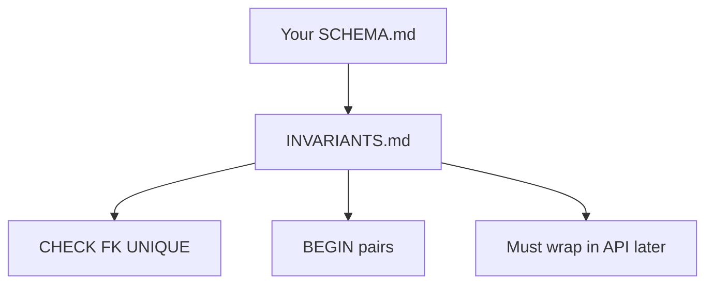

# Month 10 · Week 3 · Day 6
# Independent: Invariants Your Project 6 Schema Must Enforce

**Program:** Full-Stack Mastery · 18 months  
**Phase:** 3 — Python and backend  
**Month index:** [../../README.md](../../README.md)  
**Week 3:** [1](day-01.md) · [2](day-02.md) · [3](day-03.md) · [4](day-04.md) · [5](day-05.md) · Day 6 (today) · [7](day-07.md)  
**Week rhythm today:** Independent implementation  
**Student state:** You can prove abort and ROLLBACK on lab tables. Today you name the **same class of rules** on **your** Stage B schema.  
**Study time:** 3–4 focused hours

Work in `~/ops-api/sql/` (or fullstack-lab day-06). This textbook will **not** list your invariants for you. No finished project. No SQLAlchemy. No API. No blog schema.

---

## How to use this textbook

1. Open **your** SCHEMA.md. Write invariants in English first.  
2. For each: constraint, transaction, or “application must wrap.”  
3. Prove at least **two** with SQL on **your** database.  
4. Optional review links are for later rechecking.

---

## How to read this chapter

A schema without named invariants is a drawing. Week 1 FKs are invariants. Week 3 adds **bundles**: “create parent and child together or not at all,” “move quantity without a split,” “do not overwrite status with a stale read.”



**Wrong belief:** “I’ll enforce everything in FastAPI.”  
**Correct:** FastAPI is a client. Dual-write without a transaction is how inventory lies.

**Wrong belief:** “I’ll copy the bins transfer into ops-api.”  
**Correct:** only if your product **has** a conservation law. Name **your** law.

---

## Today's contract

By the end of this day you will be able to:

1. List **at least six** invariants for your domain.  
2. Tag each: `constraint` / `transaction` / `isolation-note` / `later-trigger`.  
3. Prove two constraint failures abort a bundle **on your tables**.  
4. Identify one **lost-update** risk in your nouns.  
5. Identify one operation that **must** be a single transaction in Month 11.

**Today's gate.** Closed-book:

> I can name what the DB already refuses and what still needs a transaction. I proved abort on my schema. I did not paste Atlas bins as my product. I did not ship an API.

---

## Time box

| Block | Minutes | Work |
|---|---|---|
| A | 40 | Inventory of rules from SCHEMA.md |
| B | 40 | INVARIANTS.md complete tags |
| C | 80 | Two proofs + one race story |
| D | 20 | Align docs; git |
| E | 15 | Recall |

---

# Block A — Harvest rules

From your CREATE TABLE files, list every CHECK, UNIQUE, FK, NOT NULL. Those are **already** invariants. Do not stop there. Ask:

- Can a child exist without a parent? (FK)  
- Can two members share the same pair? (composite PK)  
- Can a workflow skip a required sibling row? (**transaction**)  
- Can two agents decrement the same qty? (**isolation / single SQL UPDATE**)  
- Can DELETE parent while work remains? (RESTRICT)

Forbidden: inventing a blog. If Day 6 Week 1 is missing, repair that first.

---

# Block B — INVARIANTS.md template (fill with your nouns)

For each row:

| ID | Sentence | Mechanism | Proof |
|---|---|---|---|
| I1 | … | FK RESTRICT | `proofs/i1.sql` |
| I2 | … | CHECK | |
| I3 | … | UNIQUE | |
| I4 | create X and Y together | transaction | |
| I5 | qty conserved | transaction + CHECK | |
| I6 | status not stale-written | isolation note: use SQL `status = 'open'` in WHERE | |

You need **six**. Extra is fine. `later-trigger` is allowed once if you cannot encode yet — write why, not as a cop-out for a missing FK.

Write `MONTH11.md`: which FastAPI handler will BEGIN a transaction (names only, no code).

---

# Block C — Prove two

On `ops_api` (or your Day 6 DB):

1. BEGIN; insert parent; insert illegal child; ROLLBACK; parent gone.  
2. Either UNIQUE abort bundle **or** a two-update transfer/move in your domain with ROLLBACK.

`proofs/` + `RESULTS.md`.

**Race story** `RACES.md`: one lost-update in your nouns; whether `col = col + 1` fixes it; whether FOR UPDATE would be the read-think-write case.

No SELECT FOR UPDATE against production. Lab DB only. No lock-wait loops.

If you use Python, placeholders, rollback on exception.

---

# Block D — Git

Update SCHEMA.md with a link to INVARIANTS.md.

```powershell
cd ~\ops-api
git add sql SCHEMA.md INVARIANTS.md
git commit -m "Month 10 Week 3 Day 6: Stage B transactional invariants."
```

---

# Block E — Recall

1. Constraint vs multi-row invariant.  
2. Why RESTRICT is an invariant.  
3. One operation that needs BEGIN in Month 11.  
4. Stale write in your domain.  
5. Why abort takes the sibling insert.

## Office hours

**All six are FKs.** Add a transaction invariant (create two rows) and an isolation note. Variety is the lesson.

**I have no qty.** Status transitions, membership add+audit, issue+label — any pair.

**Proofs ran on w3l_ lab tables.** Wrong. Your nouns.

---

## Definition of done

- [ ] Six tagged invariants  
- [ ] Two proofs on **your** schema  
- [ ] RACES.md  
- [ ] MONTH11.md handler names  
- [ ] Commit exists  

---

## Tomorrow

Week review: transactions + constraints. Mini exam on a new pair of updates. Repair from Day 7’s synthesis.

---

# Invariant catalog (fill with your nouns — examples are shapes)

**Shape C — constraint already in CREATE TABLE.** “Every issue has a real project.” Mechanism: FK. Proof: insert `project_id = 99999` fails.

**Shape T — transaction.** “Creating an issue always writes an audit row, or neither.” Mechanism: BEGIN two INSERTs. Proof: second INSERT fails CHECK → no issue row.

**Shape I — isolation note.** “Two agents must not both close the last inventory unit from a stale read.” Mechanism: `qty = qty - 1 WHERE qty >= 1`, UPDATE 0 means conflict. FOR UPDATE only if you must read extra columns before deciding.

**Shape R — RESTRICT.** “Cannot delete a customer with open orders.” Mechanism: ON DELETE RESTRICT. Proof: DELETE fails; name the constraint.

**Shape U — uniqueness of a pair.** “A user cannot join a project twice.” Mechanism: PRIMARY KEY (project_id, user_id). Proof: second INSERT fails 23505.

**Shape K — CHECK.** “Duration minutes > 0.” Proof: 0 fails.

You need six rows. If four are Shape C, add T and I. Variety is the week.

## Mapping to Month 11 without writing Month 11

When you `session.add(order); session.add(item); session.commit()`, that **is** today’s BEGIN/COMMIT if the session is used correctly. If you `commit()` after the order and then insert the item in a new request, you recreated autocommit split. Write that risk in MONTH11.md.

`expire_on_commit` and session scope are Month 11. Today: “one request, one transaction, rollback on 4xx/5xx that happens after SQL started.”

## Proof file headers

Each `proofs/*.sql` starts with:

```sql
-- Invariant I4: create clinic and first clinician together
-- Expected: after failed clinician CHECK, no clinic named 'TxClinic'
```

Then the SQL. RESULTS.md pastes the error and the after SELECT.

## Forbidden proofs

Running proofs on `w3l_parents` and claiming they are Project 6. Using a blog `posts` table. CASCADE on users to make DELETE easy.

Write `NOT-LAB.md`: one sentence that your table names are from CONTRACT.md.

---

# Example invariant table (replace nouns)

| ID | Sentence | Tag |
|---|---|---|
| I1 | Every issue references a real project | constraint FK |
| I2 | Email unique among users | constraint UNIQUE |
| I3 | Title not blank | constraint CHECK |
| I4 | Issue and first comment created together | transaction |
| I5 | Cannot delete project with issues | constraint RESTRICT |
| I6 | Two workers cannot both take the last stock from a stale read | isolation-note |

If your domain has no stock, I6 is status: “two agents cannot both mark the same appointment booked from a stale remaining=1.” Still `col = col - 1 WHERE col >= 1` or a UNIQUE on a booking slot.

## Proof I4 sketch

BEGIN; INSERT parent RETURNING id; INSERT child with bad CHECK; catch abort; SELECT parent by unique name — empty.

That is the same as Week 3 Day 4 Bundle, with **your** names. If RESULTS.md still says `w3l_parents`, you failed today’s transfer.

## MONTH11.md prompts

- Which route creates two rows?  
- Will you commit after the first insert? (No.)  
- Where does rollback happen on 409?  

No code. Names of handlers from CONTRACT.md.

---

# Dual write warning

If 6A created an issue and a notification dict in one request, Stage B must do both INSERTs in one BEGIN or you split them. Name that pair in I4. If 6A had no pair, invent an honest one (issue+event) in CONTRACT-DELTA.md — still no API today.

Write `PAIR.md`: the two tables in the bundle.

## RESTRICT delete proof

`DELETE FROM parent WHERE id = …` while children exist must fail. Paste the constraint name into RESULTS.md. If it succeeds, you used CASCADE or had no children. Fix before claiming I5.

---

# Six rows minimum

If INVARIANTS.md has four rows, add I5 RESTRICT and I6 isolation-note before you git commit. Variety was the instruction. Four FKs is one idea repeated.

Write `COUNT-INV.md`: how many rows in the table (must be >= 6).

## Proofs live next to SCHEMA.md

Reviewers should not hunt Week 3 lab folders for Product 6 proofs. `ops-api/sql/proofs/` or `sql/invariants/`. Link from SCHEMA.md.

---

# Isolation-note must name a column

“Be careful with concurrency” is not I6. Name `qty`, `status`, or `remaining_slots` and the SQL shape `col = col - 1 WHERE col >= 1`. If your domain is only labels, I6 can be “do not upsert membership on POST.” Still specific.

Write `I6.md`: the sentence copied from the table.

## Proof 2 uniqueness

If both proofs are FK orphans, replace one with UNIQUE or CHECK abort in a bundle. Variety.

---

Write `SCHEMA-LINK.md`: SCHEMA.md links to INVARIANTS.md yes/no.

---

# Why I6 is not optional

A schema that never names a race will grow an ORM that reads-modify-writes. I6 exists so Month 11 has a written warning. If you skip it, add it now even if the proof is a paragraph not SQL.

Write `PAIR-TABLES.md`: the two table names in I4.

Write `I6-COL.md`: the column named in I6.

---

## Closing note

Six tagged invariants, two proofs on **your** tables. Lab `w3l_` names fail this day.

---

## Optional review links

These pages are for later checking, not for first learning.

- [PostgreSQL: Constraints](https://www.postgresql.org/docs/current/ddl-constraints.html)
- [PostgreSQL: Transactions](https://www.postgresql.org/docs/current/tutorial-transactions.html)
- [PostgreSQL: Transaction isolation](https://www.postgresql.org/docs/current/transaction-iso.html)
