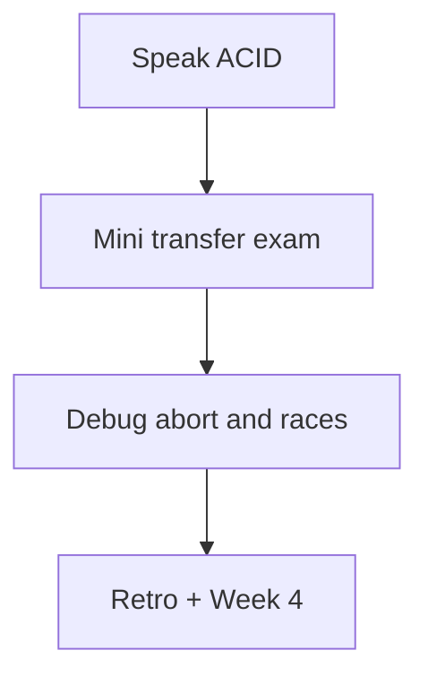

# Month 10 · Week 3 · Day 7
# Week Review — Transactions and Constraints

**Program:** Full-Stack Mastery · 18 months  
**Phase:** 3 — Python and backend  
**Month index:** [../../README.md](../../README.md)  
**Week 3:** [1](day-01.md) · [2](day-02.md) · [3](day-03.md) · [4](day-04.md) · [5](day-05.md) · [6](day-06.md) · Day 7 (today)  
**Week rhythm today:** Review, repair, plan Week 4  
**Student state:** You wrapped transfers, proved abort, and named Stage B invariants. Today that must live in **this file**.  
**Study time:** 3–4 focused hours

Do not start Week 4 because the calendar moved. Indexes on a race you cannot name are two problems.

Work in `~\fullstack-lab\month-10\week-03\day-07\`. Not inside `~/ops-api/`. Days 1–6 closed during Blocks 2–3 except this file.

---

## How to read this chapter

This is a **closed-book teaching day**. The synthesis **is** the Week 3 lesson.



---

## Week synthesis (the lesson, in this book)

A **transaction** is one unit of SQL: **BEGIN** … **COMMIT** or **ROLLBACK**. In `psql`, **autocommit** makes each statement its own transaction. Two UPDATEs without BEGIN can split a transfer if the process dies between them.

**Atomicity:** all or nothing. **Consistency:** declared constraints hold after commit; a failing statement **aborts** the transaction — further commands ignored until ROLLBACK. **Isolation:** others do not see uncommitted data; default **Read Committed** means each **statement** sees the latest committed state (counts can change inside one transaction). **Durability:** COMMIT survives crash (WAL story).

**ROLLBACK** undoes **uncommitted** work only. Sequences may gap.

**CHECK / FK / UNIQUE / NOT NULL** participate in atomicity: a bad child INSERT rolls back a parent INSERT in the same BEGIN. **SAVEPOINT** can isolate an optional failure; do not use it to keep a debit when the credit failed.

**Lost update:** two sessions read 100, both write 70; one debit vanishes. Fix: `SET qty = qty - n` (server-side) or short **SELECT FOR UPDATE** then update — a **concept**, not a hang-the-row cookbook. Prefer the single UPDATE when it encodes the rule. `WHERE qty >= n` plus UPDATE 0 handles insufficient stock without relying only on CHECK, though CHECK `qty >= 0` remains a backstop.

**Phantom / non-repeatable read** at Read Committed: a later SELECT in the same transaction can see new committed rows or new committed values.

Constraints without transactions still stop orphans **per statement**. Transactions stop **split multi-row facts**. Project 6 must name both (Week 3 Day 6).

Python: commit or rollback; placeholders `%s`; exception → rollback.

**Wrong belief:** “ACID means no races.”  
**Correct:** ACID means the database keeps its promises. Stale writes are still yours.

**Wrong belief:** “I’ll skip BEGIN until SQLAlchemy session.”  
**Correct:** the session will BEGIN for you only if you use it correctly. You must know what COMMIT means now.

---

## Today's contract

**Today's gate.** Closed-book:

> I can explain ACID, autocommit vs BEGIN, abort-after-error, ROLLBACK vs committed DELETE, lost update vs `col = col - 1`, and I implemented a mini transfer plus a failing constraint bundle from this spec.

---

## Time box

| Block | Minutes | Work |
|---|---|---|
| 1 | 35 | Speak synthesis |
| 2 | 55 | Mini: `exam_wallets` transfer |
| 3 | 30 | Debug on paper |
| 4 | 25 | Retro |
| 5 | 15 | Recall |

---

# Block 1 — Speak

ACID four sentences; aborted state; lost update four steps; FOR UPDATE in one sentence of intent. `SYNTHESIS.md`. Then Block 2.

---

# Block 2 — Mini-exam (wallets, not bins/accounts copy-paste)

You write schema: `exam_wallets (id, owner TEXT UNIQUE, cents INTEGER CHECK >= 0)`. Seed Ada 500, Lin 500. **Transfer 120 Ada→Lin** in one transaction with `cents = cents ± 120`. RETURNING. Prove ROLLBACK. Prove a transfer of 9999 fails (WHERE or CHECK) and **does not** debit Ada. Prove BEGIN; insert wallet; insert duplicate owner; abort; neither new wallet remains.

No complete SQL in this file.

```powershell
mkdir ~\fullstack-lab\month-10\week-03\day-07 -Force
```

`exam-proof.md` numbers.

---

# Block 3 — Debug on paper

**A.** Two UPDATEs in a file, no BEGIN; crash after first. What remains?

**B.** CHECK fails on statement 2; student issues COMMIT. What happens?

**C.** `SET cents = 380` after SELECT 500. Concurrent debit. Story?

**D.** `SELECT COUNT(*)` twice in one BEGIN; another session inserts. Read Committed?

**E.** ROLLBACK after COMMIT of a transfer. Does money return?

**F.** FOR UPDATE in session A, forgotten. Session B UPDATE waits. What do you do?

---

# Block 4 — Retro

`RETRO.md`: weakest letter of ACID; whether Day 6 invariants were yours; Week 4 is indexes and EXPLAIN — correctness before speed.

```powershell
cd ~\fullstack-lab
git add month-10\week-03\day-07
git commit -m "Month 10 Week 3 Day 7: transactions review."
```

---

## Scoring

| Piece | Pass |
|---|---|
| Transfer | One BEGIN, relative UPDATE |
| Fail 9999 | Ada unchanged |
| UNIQUE abort | No leftover wallet |
| Debug C | Lost update named |

---

## Worked answers — after you write

**A.** First UPDATE committed (autocommit). Split transfer.

**B.** COMMIT fails or does nothing useful; transaction aborted; ROLLBACK. No half commit.

**C.** Lost update if both write absolute 380.

**D.** Count may increase. Per-statement snapshot.

**E.** No. ROLLBACK does not undo committed work.

**F.** COMMIT or ROLLBACK A. Do not kill the server first.

---

## Office hours

**I used w3_accounts SQL.** Wrong. Wallets, from memory.

**Week 4 tonight?** Only if this gate is true.

---

## Definition of done

- [ ] Spoke ACID and lost update  
- [ ] Wallet mini proofs  
- [ ] Debug A–F then worked box  
- [ ] RETRO.md  
- [ ] Week 4 not started on a false gate  

---

## Tomorrow

Week 4 Day 1: **B-tree indexes**, composite indexes, **selectivity**, when **not** to index.

---

# Fluency cards (answers in DRILL.md, then wallets)

1. Autocommit vs BEGIN — which one splits a transfer?  
2. After `ERROR: division by zero` inside BEGIN, what is the next successful command you can run besides ROLLBACK? (Answer: none until you end the transaction.)  
3. Does ROLLBACK undo a COMMIT from five minutes ago?  
4. `SET balance = 70` after reading 100, concurrent debit — name the anomaly.  
5. `SET balance = balance - 30` twice concurrently — expected final if start 100?  
6. CHECK fail on statement 2 — does statement 1 stay if you never ROLLBACK and the connection drops? (Server aborts the tx.)  
7. FOR UPDATE meaning in one sentence.  
8. Why this course still prefers RESTRICT on FKs inside transactions.  
9. SAVEPOINT vs atomic transfer.  
10. Sequence gap after ROLLBACK — data bug or not?

If you miss three, re-read the synthesis before Block 2. The wallet mini will not teach what the cards already asked.

## Wallet mini seed sketch (you still write it)

Ada 500 cents, Lin 500. Transfer 120. Totals remain 1000 after success. Totals remain 1000 after failed 9999. That conservation **is** the exam of atomicity. Write `SUM(cents)` before and after in exam-proof.md.

Do not use FLOAT. INTEGER cents. Week 1 NUMERIC/INTEGER lesson still holds.

## Debug F extra

A forgotten FOR UPDATE is the most common “PostgreSQL is frozen” lab report. It is not frozen. Session A owns a row lock. `\x` and `SELECT * FROM pg_stat_activity` is optional curiosity — do not turn it into an ops rabbit hole. ROLLBACK A.

Write `LOCK-WAIT.md` only if you hit a wait today: which session you committed.

---

# Wallet transfer shape (still not a dump of Day 1 accounts)

You write:

```sql
BEGIN;
UPDATE exam_wallets SET cents = cents - 120 WHERE owner = 'Ada' AND cents >= 120
RETURNING owner, cents;
UPDATE exam_wallets SET cents = cents + 120 WHERE owner = 'Lin'
RETURNING owner, cents;
COMMIT;
```

If the first RETURNING is empty, ROLLBACK (insufficient funds). If the second is empty, ROLLBACK (Lin missing). Do not COMMIT after a silent no-op.

Failed 9999:

```sql
BEGIN;
UPDATE exam_wallets SET cents = cents - 9999 WHERE owner = 'Ada' AND cents >= 9999
RETURNING owner, cents;
-- if empty: ROLLBACK immediately
```

If you omit `AND cents >= 9999` and CHECK fires, you are in the aborted state. ROLLBACK. Ada unchanged. That is a pass.

UNIQUE abort:

```sql
BEGIN;
INSERT INTO exam_wallets (owner, cents) VALUES ('Sam', 1);
INSERT INTO exam_wallets (owner, cents) VALUES ('Sam', 2);
ROLLBACK;
```

Neither Sam remains.

## Speak list for Block 1 (if you stall)

Atomicity: two UPDATEs. Consistency: CHECK cents >= 0. Isolation: Lin does not see Ada’s uncommitted debit. Durability: after COMMIT, kill `psql`, reopen, numbers remain. Autocommit: without BEGIN, the debit is already a fact. Lost update: writing `cents = 380` after a SELECT. FOR UPDATE: lock Ada’s row while you think — then still prefer `cents = cents - n` when you can.

Write `SPEAK.md` with those six lines in your wording **before** Block 2, then close it and implement.

## Scoring extra

If you used FLOAT for money, Block 2 fails even if the transfer “worked.” INTEGER or NUMERIC only.

If you used CASCADE to delete Ada’s wallet while you were confused, reset the schema. RESTRICT is the week’s default.

If you opened Day 1 `w3_accounts` SQL and renamed columns, log it in lookups.txt and redo once from this file.

---

# Conservation arithmetic

500+500=1000. After 120 transfer: 380+620=1000. After failed 9999: still 1000. If the sum changes, you autocommitted a half. exam-proof.md must show the three sums.

Write `THOUSAND.md`: the three numbers you measured.

## Debug B remainder

COMMIT after error does not save Ada’s debit **if** you BEGAN. If it does save it, you were not in a transaction. That is debug A and B overlapping. Say which you actually ran.

---

# Closed-book cards extra

11. What SHOW transaction_isolation prints by default.  
12. SAVEPOINT vs keeping a debit.  
13. INTEGER cents vs FLOAT.  
14. UPDATE 0 vs CHECK error for overdraft.  
15. Who sees uncommitted debit (same session vs other).

If you miss these, re-read the synthesis. Do not start Week 4.

Write `CARDS.md` with your answers, then compare to the synthesis — not to Day 1 files.

## Mini must not use w3_accounts table names

`exam_wallets` only. If `\dt` shows you updated `w3_accounts` in this folder’s SQL, you copied. Redo.

---

# Exam evidence folder

All of today’s files live under `week-03/day-07/`, not `w3_accounts` lab folders. `exam_wallets` tables may live in `month10` beside other labs; prefix `exam_` avoids DROP accidents.

Write `PREFIX.md`: tables created today listed from `\dt exam_*`.

## Sum three times

Before any transfer, after success, after failed 9999. Three numbers in exam-proof.md. If you only have two, rerun.

---

Write `SUMS.md`: three conservation totals copied from exam-proof.md.

---

Write `EXAM-DT.md`: `\dt exam_*` output saved yes/no.

---

## Closing note

INTEGER cents. Conservation 1000. `exam_wallets`, not `w3_accounts`. Week 4 waits on this gate.

---

## Optional review links

Repair from this synthesis first. These pages are for later checking, not for first learning.

- [PostgreSQL: Transactions](https://www.postgresql.org/docs/current/tutorial-transactions.html)
- [PostgreSQL: Transaction isolation](https://www.postgresql.org/docs/current/transaction-iso.html)
- [PostgreSQL: Constraints](https://www.postgresql.org/docs/current/ddl-constraints.html)
