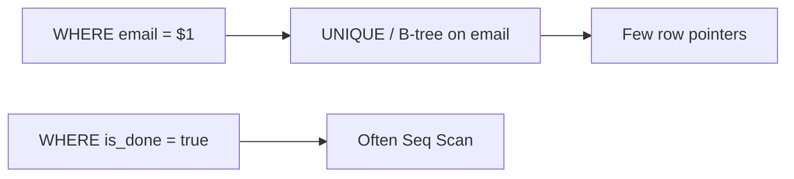

# Month 10 · Week 4 · Day 1
# B-tree Indexes, Composite Keys, Selectivity, When Not to Index

**Program:** Full-Stack Mastery · 18 months  
**Phase:** 3 — Python and backend  
**Month index:** [../../README.md](../../README.md)  
**Week 4:** Day 1 (today) · [2](day-02.md) · [3](day-03.md) · [4](day-04.md) · [5](day-05.md) · [6](day-06.md) · [7](day-07.md)  
**Week rhythm today:** Learn + type-along  
**Student state:** Week 3 gate passed. Correctness is in constraints and transactions. Today you make **finding** rows cheaper — **after** you can name why.  
**Study time:** 3–4 focused hours

**This week covers:** indexes, composite indexes, selectivity, EXPLAIN, pagination, N+1, connection-pool concepts, reporting pack, Month 10 exam.

Today: **B-tree** indexes, **composite** indexes, **selectivity**, and **when not to index**. EXPLAIN is Day 2. Do not skip “when not.” Docker is not the gate. SQLAlchemy is Month 11. Pool **concept** is Day 5.

Labs: `~\fullstack-lab\month-10\week-04\day-01\`. Database `month10`. Prefix `w4_`.

---

## How to use this textbook

1. Read why an index is a second structure to maintain, then CREATE INDEX.  
2. Type queries **before** indexing; feel sequential scan on a small table too — then scale the lab.  
3. Optional review links are for later rechecking.

---

## How to read this chapter

A **heap** (table) is rows. A **B-tree index** is a sorted lookup structure: “this value → these row locations.” PostgreSQL already indexes **primary keys** and **UNIQUE** constraints. Extra indexes are **copies of keys you search** that you pay for on every INSERT/UPDATE/DELETE. **Selectivity** is how well a predicate narrows rows. Indexing a boolean `is_done` on a table that is 50/50 is often a waste. A **composite** index `(project_id, created_at)` can serve `WHERE project_id = $1 ORDER BY created_at DESC` if columns are in the right order.



**Wrong belief:** “I’ll index every column; the database will be fast.”  
**Correct:** every index slows writes and uses disk. Unused indexes are a tax. Measure (Day 2) before decorating.

**Wrong belief:** “Primary key is not an index.”  
**Correct:** a PK **is** a unique index. You already have it. Do not CREATE INDEX on `id` again.

---

## Today's contract

By the end of this day you will be able to:

1. Explain a **B-tree** index as a sorted map, not a magic turbo button.  
2. List what PostgreSQL already indexes (PK, UNIQUE).  
3. Create a **secondary** index and a **composite** index with a named reason.  
4. Define **selectivity** and give a low-selectivity anti-pattern.  
5. Name three cases **not** to index.  
6. Relate `ILIKE '%foo%'` to why a normal B-tree may not help.

**Today's gate.** Closed-book:

> An index is extra data maintained on writes. PK and UNIQUE already have indexes. Composite column order must match how I filter and sort. Low-selectivity columns are poor single-column indexes. I do not index first and think later. Leading-wildcard ILIKE is not a B-tree poster child.

---

## Time box

| Block | Minutes | Work |
|---|---|---|
| A | 50 | Theory |
| B | 70 | Type-along: table + indexes + `\d` |
| C | 55 | Independent: justify three indexes on a lab |
| D | 15 | Git |
| E | 15 | Recall |

---

# Block A — Theory

## 1. Why indexes exist

Without an index, PostgreSQL often **seq scans**: read every row, keep matches. That is fine for 200 lab tickets. It is not fine for 20 million events filtered by `project_id`.

An index is a **separate** structure. B-tree (the default `CREATE INDEX`) keeps keys in sorted order. Equality and range (`<`, `>`, `BETWEEN`, `ORDER BY` that matches) can walk the tree instead of the heap — then **fetch** table rows (unless an index-only scan, Day 2).

You pay:

- Disk  
- Time on INSERT/UPDATE/DELETE (and VACUUM later)  
- Planner complexity  

You gain: faster **some** reads.

## 2. What you already have

```sql
CREATE TABLE w4_users (
  id INTEGER GENERATED BY DEFAULT AS IDENTITY PRIMARY KEY,
  email TEXT NOT NULL UNIQUE
);
```

`\d w4_users` shows indexes for `id` and `email`. Adding `CREATE INDEX ON w4_users (id);` is redundant and silly.

FK **does not** automatically index the **child** column in PostgreSQL. `tickets.project_id` is a classic **missing** index: joins and `ON DELETE RESTRICT` checks look up children by `project_id`. Indexing FK columns is a common, justified extra. You will still **say why**.

## 3. CREATE INDEX

```sql
CREATE INDEX w4_tickets_project_id_idx ON w4_tickets (project_id);
```

Name it. Future `DROP INDEX` and EXPLAIN love names.

`CREATE INDEX CONCURRENTLY` is a production trick (avoids long locks). Not a lab gate. Do not use it until you read the caveats. Today: ordinary CREATE INDEX on a small table.

Partial indexes: `CREATE INDEX … ON tickets (id) WHERE status = 'open'`. Powerful; optional note in NOTES.md. Not required today.

## 4. Composite indexes and order

```sql
CREATE INDEX w4_tickets_project_created_idx
  ON w4_tickets (project_id, created_at DESC);
```

B-tree composite is **leftmost prefix**: this index is good for `WHERE project_id = $1`, and for `WHERE project_id = $1 ORDER BY created_at DESC`. It is **not** as helpful for `WHERE created_at > $1` alone (the left column is missing).

**Wrong belief:** “Two single indexes are the same as a composite.”  
**Correct:** AND of two predicates may use bitmap combination of two indexes, or one composite. The composite is often better for a **known** pair. Do not create both plus the composite “to be safe.”

## 5. Selectivity

**High selectivity:** predicate matches a **small** fraction (`email = 'ada@…'`, `id = 12`). Indexes shine.

**Low selectivity:** `status = 'open'` when 90% are open; `is_done = false` on a fresh table. The planner may seq scan anyway because fetching most of the heap via index is **worse**.

Rule of thumb, not a law: if you return most of the table, a seq scan is honest. Day 2 you will **see** that in EXPLAIN.

## 6. When not to index

1. **Tiny tables** that always fit in memory and are always seq-scanned. Lab tables of 20 rows will not prove speed. You still practice CREATE INDEX for syntax and `\d`.  
2. **Columns never used** in WHERE/JOIN/ORDER BY.  
3. **Low-selectivity** flags as **single-column** indexes.  
4. **Duplicate** of PK/UNIQUE.  
5. **Write-heavy** tables where you have not measured a slow read.  
6. **`ILIKE '%x%'`** as the only access path — B-tree cannot start in the middle of a string. (`pg_trgm` exists; Month 10 mentions it as “later,” not a gate.)

## 7. Functions and indexes

`WHERE lower(email) = lower($1)` may **not** use an index on `email`. An index on `(lower(email))` can. Unique case-insensitive email is often `UNIQUE (lower(email))` via unique index. Week 1 noted case-sensitive UNIQUE. Today you may create:

```sql
CREATE UNIQUE INDEX w4_users_email_lower_idx ON w4_users (lower(email));
```

only if you understand you now have **two** uniqueness stories if `UNIQUE (email)` also exists. Prefer one. Document the choice.

## 8. Indexes are not constraints (except unique indexes)

A non-unique index does not reject duplicates. UNIQUE constraint / unique index does. Do not confuse “I indexed status” with “status is unique.”

---

# Block B — Type-along

```powershell
mkdir ~\fullstack-lab\month-10\week-04\day-01 -Force
cd ~\fullstack-lab\month-10\week-04\day-01
```

Create `00-schema.sql` with ~ a few thousand rows so an index is not purely theoretical. Type a generate_series seed:

```sql
DROP TABLE IF EXISTS w4_tickets;
DROP TABLE IF EXISTS w4_projects;
DROP TABLE IF EXISTS w4_users;

CREATE TABLE w4_users (
  id INTEGER GENERATED BY DEFAULT AS IDENTITY PRIMARY KEY,
  email TEXT NOT NULL UNIQUE,
  name TEXT NOT NULL
);

CREATE TABLE w4_projects (
  id INTEGER GENERATED BY DEFAULT AS IDENTITY PRIMARY KEY,
  title TEXT NOT NULL
);

CREATE TABLE w4_tickets (
  id INTEGER GENERATED BY DEFAULT AS IDENTITY PRIMARY KEY,
  project_id INTEGER NOT NULL REFERENCES w4_projects (id) ON DELETE RESTRICT,
  assignee_id INTEGER REFERENCES w4_users (id) ON DELETE RESTRICT,
  title TEXT NOT NULL,
  status TEXT NOT NULL DEFAULT 'open',
  created_at TIMESTAMPTZ NOT NULL DEFAULT now(),
  CONSTRAINT w4_tickets_status_check CHECK (status IN ('open', 'done'))
);

INSERT INTO w4_users (email, name) VALUES
  ('ada@example.com', 'Ada'),
  ('lin@example.com', 'Lin');

INSERT INTO w4_projects (title)
SELECT 'P-' || g FROM generate_series(1, 50) AS g;

INSERT INTO w4_tickets (project_id, assignee_id, title, status, created_at)
SELECT
  ((g - 1) % 50) + 1,
  CASE WHEN g % 5 = 0 THEN NULL ELSE 1 + (g % 2) END,
  'Ticket ' || g,
  CASE WHEN g % 4 = 0 THEN 'done' ELSE 'open' END,
  now() - (g || ' minutes')::interval
FROM generate_series(1, 4000) AS g;
```

```powershell
psql -U postgres -d month10 -f 00-schema.sql
```

```powershell
psql -U postgres -d month10 -c "\d w4_tickets"
```

Record existing indexes (PK, FKs are not auto-indexed on child).

Create `01-indexes.sql`:

```sql
CREATE INDEX w4_tickets_project_id_idx ON w4_tickets (project_id);
CREATE INDEX w4_tickets_project_created_idx
  ON w4_tickets (project_id, created_at DESC);
```

**Do not** also create a useless `CREATE INDEX ON w4_tickets (id);`.

Write `WHY.md`: two paragraphs, why `project_id`, why composite, why not `status` alone yet.

```sql
-- optional: skip status index on purpose
-- CREATE INDEX w4_tickets_status_idx ON w4_tickets (status);
```

If you create status index anyway, you must write why **or** drop it. Prefer skip.

`\d w4_tickets` again. Paste into `INDEXES.md`.

---

# Block C — Independent

1. Index `w4_tickets (assignee_id)` — justify for “tickets by user” and FK lookups. Nullable column: NULLs in B-tree are fine.  
2. **Refuse** an index on `title` for `ILIKE '%Ticket%'` — write `NO-ILIKE.md` why B-tree does not help leading `%`.  
3. Count indexes on `w4_tickets`. If more than PK + two you created + assignee, you probably over-indexed. Drop extras or justify each in `BUDGET.md`.  
4. Optional: unique index on `lower(email)` **instead of** or **in addition to** UNIQUE email — pick one story in `EMAIL.md`.

Do not run EXPLAIN as the gate today; peeking is allowed, Day 2 is the reading lesson.

---

# Block D — Git

```powershell
cd ~\fullstack-lab
git add month-10\week-04\day-01
git commit -m "Month 10 Week 4 Day 1: B-tree and composite indexes."
```

---

# Block E — Recall

1. PK is already an index.  
2. FK child column not auto-indexed.  
3. Leftmost prefix.  
4. Low selectivity example.  
5. ILIKE `%x%` vs B-tree.  
6. Write cost.

## Office hours

**generate_series failed.** Type mismatch: `g || ' minutes'` needs `g::text` on some versions: `(g::text || ' minutes')::interval`.

**Too many indexes already.** UNIQUE and PK. `\d` is the truth.

**I indexed every column.** Drop them. BUDGET.md.

---

## Definition of done

- [ ] 4000-ticket lab table  
- [ ] WHY.md for project_id and composite  
- [ ] NO-ILIKE.md  
- [ ] `\d` pasted  
- [ ] Commit exists  

---

## Tomorrow

**EXPLAIN** and **EXPLAIN ANALYZE**: Seq Scan vs Index Scan in full sentences.

---

## Optional review links

Indexes are explained in this chapter. These pages are for later checking, not for first learning.

- [PostgreSQL: Indexes](https://www.postgresql.org/docs/current/indexes.html)
- [PostgreSQL: Multicolumn indexes](https://www.postgresql.org/docs/current/indexes-multicolumn.html)
- [PostgreSQL: Index types](https://www.postgresql.org/docs/current/indexes-types.html)
