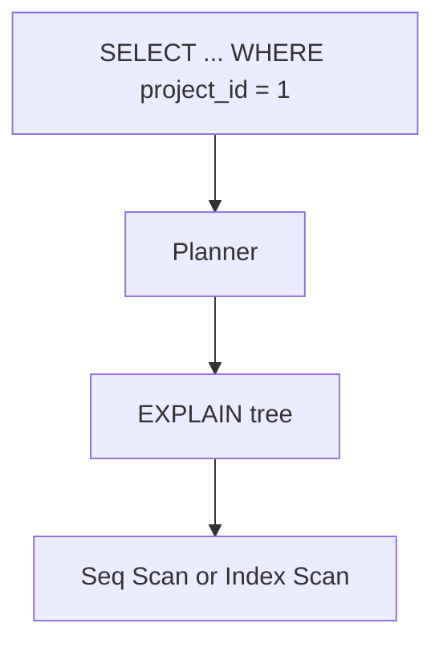

# Month 10 · Week 4 · Day 2
# EXPLAIN and EXPLAIN ANALYZE: Seq Scan vs Index Scan

**Program:** Full-Stack Mastery · 18 months  
**Phase:** 3 — Python and backend  
**Month index:** [../../README.md](../../README.md)  
**Week 4:** [1](day-01.md) · Day 2 (today) · [3](day-03.md) · [4](day-04.md) · [5](day-05.md) · [6](day-06.md) · [7](day-07.md)  
**Week rhythm today:** Exercises + debugging (theory is in this file)  
**Student state:** Day 1 created indexes. Today you **read a plan** in sentences, not as a screenshot you cannot explain.  
**Study time:** 3–4 focused hours

Labs: `~\fullstack-lab\month-10\week-04\day-02\`. Use `w4_tickets` from Day 1 (rerun seed if missing). No SQLAlchemy. No “just add index” without a plan. Docker is not the gate.

---

## How to use this textbook

1. Run EXPLAIN **before** ANALYZE if you only need the plan; ANALYZE **runs** the query.  
2. Write **full sentences**: what node, why, what cost means at a beginner-honest level.  
3. Optional review links are for later rechecking.

---

## How to read this chapter

**EXPLAIN** shows the **plan** the optimizer chose: Seq Scan, Index Scan, Bitmap Heap Scan, Nested Loop, Hash Join, and estimated **cost** and **rows**. **EXPLAIN ANALYZE** executes the query and adds **actual** time and rows. A **Seq Scan** reads the table. An **Index Scan** walks a B-tree then fetches rows. Neither is morally better. A seq scan of 4000 rows can beat a bad index. Your job is to **say what happened**.



**Wrong belief:** “Index Scan in the plan means I am done and fast.”  
**Correct:** look at **actual rows** and **time** with ANALYZE. An index can still fetch most of the heap.

**Wrong belief:** “Seq Scan means I forgot an index.”  
**Correct:** Seq Scan can be the right choice for low selectivity or small tables.

---

## Today's contract

By the end of this day you will be able to:

1. Run `EXPLAIN` and `EXPLAIN ANALYZE` in `psql`.  
2. Identify **Seq Scan** vs **Index Scan** (and mention Bitmap if it appears) in full sentences.  
3. Explain **cost** as a unitless planner estimate, not milliseconds (ANALYZE time **is** milliseconds).  
4. Compare a filtered `project_id = $1` plan **with** and **without** the extra index (drop/recreate in lab).  
5. Read a JOIN plan at a high level (Nested Loop vs Hash Join) without pretending to be a DBA.

**Today's gate.** Closed-book:

> EXPLAIN is a plan. ANALYZE runs it. Seq Scan reads the table. Index Scan uses an index then rows. Cost is an estimate; actual time is measured. I can write four sentences about a plan I captured. I do not add indexes without reading.

---

## Time box

| Block | Minutes | Work |
|---|---|---|
| A | 50 | Theory: nodes and cost |
| B | 75 | Type-along: capture plans |
| C | 50 | Independent: JOIN plan sentences |
| D | 15 | Git |
| E | 15 | Recall |

---

# Block A — Theory

## 1. Two commands

```sql
EXPLAIN
SELECT id, title FROM w4_tickets WHERE project_id = 1;

EXPLAIN ANALYZE
SELECT id, title FROM w4_tickets WHERE project_id = 1;
```

`EXPLAIN (ANALYZE, BUFFERS)` adds buffer hits. Optional. `EXPLAIN (FORMAT YAML)` is verbose; text is enough today.

ANALYZE **does the work**. Do not EXPLAIN ANALYZE a 40-minute report in production as a joke. Lab is fine.

## 2. Cost and rows

Each node shows `cost=startup..total` and `rows=`. Startup is work before the first row (e.g. sort). Total is estimated work to finish. Units are **not** milliseconds; they are the planner’s internal cost. **You compare plans**, you do not convert to money.

ANALYZE adds `actual time=…` in **milliseconds** and `rows=` actually produced. If estimated rows and actual rows differ a lot, statistics may be stale (`ANALYZE w4_tickets;` the command — yes, same word, different meaning). Run `ANALYZE w4_tickets;` after big inserts. Confusing names: `EXPLAIN ANALYZE` vs `ANALYZE table`.

## 3. Seq Scan in sentences

“The planner decided to read **all** rows of `w4_tickets` and keep those matching the filter. That is a sequential scan. It is reasonable if the table is small or the filter is not selective.”

## 4. Index Scan in sentences

“The planner decided to look up `project_id = 1` in index `w4_tickets_project_id_idx`, then fetch matching heap rows. That is an index scan. It is reasonable if few rows match.”

**Index Only Scan** means the index satisfied the columns (visibility map permitting). You may see it. Sentence: “No heap fetch needed for these columns.”

**Bitmap Index Scan + Bitmap Heap Scan:** gather many index matches, then fetch heap in order. Common for “moderate” matches. Sentence: “A bitmap combines index hits then reads the table more sequentially.”

## 5. Filter vs Index Cond

`Index Cond` is what the index could test. `Filter` is applied after, on rows already fetched. A function on the column (`WHERE lower(title) = 'x'`) often becomes a Filter and may seq scan.

## 6. Joins (preview)

**Nested Loop:** for each row of A, find matches in B (maybe via index). Good when A is small. **Hash Join:** build a hash of one side, probe the other. **Merge Join:** both sides ordered. You will write: “This join used a hash join on project_id; it built a hash of projects and scanned tickets,” or similar. Do not memorize every variant.

## 7. What EXPLAIN will not do

It will not fix a missing FK. It will not make `ILIKE '%x%'` a B-tree win. It will not replace an invariant test. It is a **read** of the engine’s choice.

---

# Block B — Type-along

```powershell
mkdir ~\fullstack-lab\month-10\week-04\day-02 -Force
cd ~\fullstack-lab\month-10\week-04\day-02
```

If `w4_tickets` missing, rerun Day 1 schema.

Create `01-explain-eq.sql`:

```sql
EXPLAIN ANALYZE
SELECT id, title
FROM w4_tickets
WHERE project_id = 1;
```

```powershell
psql -U postgres -d month10 -f 01-explain-eq.sql
```

Paste the plan into `PLANS.md`. Write **four sentences**: node type, index name if any, estimated vs actual rows (if shown), whether this matches high selectivity.

Create `02-explain-status.sql`:

```sql
EXPLAIN ANALYZE
SELECT id, title
FROM w4_tickets
WHERE status = 'open';
```

Likely Seq Scan (many opens). Four sentences: why seq scan is not a failure.

**Optional drop test** (lab only):

```sql
DROP INDEX IF EXISTS w4_tickets_project_id_idx;
EXPLAIN ANALYZE SELECT id FROM w4_tickets WHERE project_id = 1;
-- recreate
CREATE INDEX w4_tickets_project_id_idx ON w4_tickets (project_id);
```

Capture **both** plans. If the composite index still serves `project_id = 1`, say so — leftmost prefix. You may drop the composite **temporarily** to see a seq scan, then recreate. Document in `DROP-TEST.md`. Do not leave indexes dropped.

Create `03-ilike.sql`:

```sql
EXPLAIN ANALYZE
SELECT id, title
FROM w4_tickets
WHERE title ILIKE '%Ticket 12%';
```

Expect seq scan (leading wildcard). Sentence linking to Day 1 NO-ILIKE.

Run `ANALYZE w4_tickets;` then rerun 01. Note if estimates changed.

---

# Block C — Independent

`04-join.sql`:

```sql
EXPLAIN ANALYZE
SELECT p.title, COUNT(t.id)
FROM w4_projects p
LEFT JOIN w4_tickets t ON t.project_id = p.id
GROUP BY p.id, p.title;
```

Write `JOIN-PLAN.md`: **six or more full sentences**. Name the join type. Name scans on each table. Mention aggregate. You do not need to be perfect on every number.

`05-order.sql`: EXPLAIN the composite-shaped query:

```sql
SELECT id, title, created_at
FROM w4_tickets
WHERE project_id = 3
ORDER BY created_at DESC
LIMIT 10;
```

Does the plan mention the composite index? Sentences.

---

# Block D — Git

```powershell
cd ~\fullstack-lab
git add month-10\week-04\day-02
git commit -m "Month 10 Week 4 Day 2: EXPLAIN Seq Scan vs Index Scan."
```

---

# Block E — Recall

1. EXPLAIN vs EXPLAIN ANALYZE.  
2. Cost vs actual time.  
3. Seq Scan when it is honest.  
4. Index Cond vs Filter.  
5. ANALYZE table.  
6. Why ILIKE `%x%` scanned.

## Office hours

**Empty plan file.** Query error; table missing. Day 1 seed.

**I dropped indexes and left them down.** Recreate from Day 1 `01-indexes.sql`.

**Numbers differ from the textbook.** Hardware and stats differ. Sentences matter more than matching cost 12.34.

---

## Definition of done

- [ ] PLANS.md with four sentences each for eq and status  
- [ ] ILIKE plan noted  
- [ ] JOIN-PLAN.md six sentences  
- [ ] Indexes restored if dropped  
- [ ] Commit exists  

---

## Tomorrow

**OFFSET vs keyset pagination**; **N+1** as a SQL loop problem (not a Python accident only).

---

# Reading a plan without becoming a DBA

## Nested Loop vs Hash Join in sentences

**Nested Loop:** “For each row from the outer table, PostgreSQL looks up matches in the inner table. If the inner lookup uses an index on the join key, this can be cheap when the outer side is small.”

**Hash Join:** “PostgreSQL builds a hash table from one side (often the smaller) and probes it with rows from the other side. This is common for joining all tickets to all projects.”

If you cannot tell which you got, look for the words `Nested Loop` or `Hash Join` in the EXPLAIN text. Write that word in JOIN-PLAN.md. Guessing “it joined” is not a sentence.

## Rows removed by filter

If you see `Rows Removed by Filter: N`, the scan read rows and discarded them. An index condition would have avoided fetching some of those. That is how you distinguish Index Cond from Filter in a full sentence: “The index could not test `lower(title)`; the filter ran after the fetch.”

## Timing noise

First ANALYZE of a query can be slower (cache). Second run may be faster. Do not chase 0.05 ms. Chase node **type** and **row count** stories. If actual rows is 4000 and you expected 5, your WHERE did not filter — that is a query bug, not an index bug.

## ANALYZE the table

```sql
ANALYZE w4_tickets;
```

This updates statistics. After `generate_series` inserts, run it. If you skip it, the planner may think the table is empty-ish. Mention in PLANS.md whether you ANALYZEd.

## Parallel seq scan

You might see `Gather` and `Parallel Seq Scan`. Sentence: “PostgreSQL split the sequential read across workers.” That is still a seq scan family, not an index win. Do not confuse parallelism with indexing.

## What to paste

Paste the **top nodes**, not 200 lines of YAML. A text EXPLAIN of 15–40 lines is enough. Annotate with `-->` comments in PLANS.md, not in the SQL that you rerun.

Write `SENTENCE-BANK.md` with six templates you filled in using **your** plan’s numbers.

---

# Cost numbers — what they are not

`cost=0.00..85.50` does not mean 85 milliseconds. It does not mean 85 cents. It is a planner unit. Comparing **two plans for the same SQL** is the use. Comparing your laptop’s 85 to a classmate’s 92 is noise.

`actual time=0.123..1.456` **is** milliseconds for that run. Cache effects matter. Write “about 1–2 ms” not “exactly 1.456 forever.”

## Bitmap scan sentence bank

If you see Bitmap Index Scan:

“PostgreSQL collected row locations from the index into a bitmap, then read the heap in an order closer to sequential. This often appears when many rows match, more than a single index scan of scattered heap pages would like, but not so many that a seq scan wins.”

If you do not see it, do not pretend. Seq and Index Scan are enough for the gate.

## Join plan: nested loop example story

“Outer: Index Scan on w4_tickets for project_id = 3, 80 rows. Inner: Index Scan on w4_projects by id. Nested Loop because 80 is small.”

Your numbers will differ. The **structure** of the sentence is the skill.

## When EXPLAIN lies to beginners

- You EXPLAINed without ANALYZE and believed `rows=1` when actual is 4000 — stats.  
- You EXPLAIN ANALYZE a query with `LIMIT 10` and thought the whole table is cheap — LIMIT can short-circuit.  
- You read the **inner** node time as the whole query — look at the top node’s actual time.

Write `LIMIT-PLAN.md`: EXPLAIN ANALYZE the LIMIT 10 query from 05-order.sql and say whether the plan **stopped early**.

## Recreate indexes if you dropped them

Day 1 names:

```sql
CREATE INDEX IF NOT EXISTS w4_tickets_project_id_idx ON w4_tickets (project_id);
CREATE INDEX IF NOT EXISTS w4_tickets_project_created_idx
  ON w4_tickets (project_id, created_at DESC);
```

Do not leave the lab without these if you used the drop test.

---

# Hash join vs nested loop recap for this file

You may see Hash Join on the COUNT report that scans all tickets and all projects. Sentence: “A hash join built a hash of projects (50 rows) and scanned tickets (4000).” That is normal. It is not a missing index emergency.

Write `HASH.md`: one sentence from **your** 04-join.sql plan.

## Drop-test restore confirmation

`\d w4_tickets` must show `w4_tickets_project_id_idx` before you leave. If the drop test is still down, recreate. Day 3 pagination assumes the composite index may exist.

---

Write `COMPOSITE-USED.md`: did 05-order.sql mention `w4_tickets_project_created_idx` in EXPLAIN? yes/no/uncertain.

---

Write `EQ-NODE.md`: Seq Scan or Index Scan for project_id = 1.

---

Write `PLAN-STATUS.md`: Seq Scan or Index Scan for WHERE status = 'open'.

---

# ILIKE plan one-liner

Leading wildcard → Filter on seq scan (typical). Write that in PLANS.md if 03-ilike.sql did that. If you somehow got an index, say which — unusual for `%Ticket%`.

Write `BUFFERS.md`: used EXPLAIN (ANALYZE, BUFFERS) yes/no (optional).

Write `TOP-NODE.md`: the first node word in 01-explain-eq.sql plan.

---

## Closing note

Write four sentences per plan before you add another index. Seq Scan can be the honest answer.

Cost is not milliseconds.

---

## Optional review links

Plans are explained in this chapter. These pages are for later checking, not for first learning.

- [PostgreSQL: Using EXPLAIN](https://www.postgresql.org/docs/current/using-explain.html)
- [PostgreSQL: EXPLAIN](https://www.postgresql.org/docs/current/sql-explain.html)
- [PostgreSQL: Statistics](https://www.postgresql.org/docs/current/planner-stats.html)
