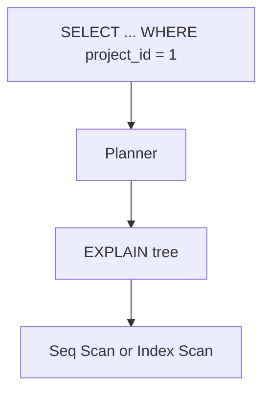

# Month 10 · Week 4 · Day 2
# EXPLAIN and EXPLAIN ANALYZE: Seq Scan vs Index Scan

**Program:** Full-Stack Mastery · 18 months  
**Phase:** 3 — Python and backend  
**Month index:** [../../README.md](../../README.md)  
**Week 4:** [1](day-01.md) · Day 2 (today) · [3](day-03.md) · [4](day-04.md) · [5](day-05.md) · [6](day-06.md) · [7](day-07.md)  
**Week rhythm today:** Exercises + debugging (theory is in this file)  
**Student state:** Day 1 created indexes. Today you **read a plan** in sentences, not as a screenshot you cannot explain.  
**Study time:** 3–4 focused hours

Labs: `~\fullstack-lab\month-10\week-04\day-02\`. Use `w4_tickets` from Day 1 (rerun seed if missing). No SQLAlchemy. No “just add index” without a plan. Docker is not the gate.

---

## How to use this textbook

1. Run EXPLAIN **before** ANALYZE if you only need the plan; ANALYZE **runs** the query.  
2. Write **full sentences**: what node, why, what cost means at a beginner-honest level.  
3. Optional review links are for later rechecking.

---

## How to read this chapter

**EXPLAIN** shows the **plan** the optimizer chose: Seq Scan, Index Scan, Bitmap Heap Scan, Nested Loop, Hash Join, and estimated **cost** and **rows**. **EXPLAIN ANALYZE** executes the query and adds **actual** time and rows. A **Seq Scan** reads the table. An **Index Scan** walks a B-tree then fetches rows. Neither is morally better. A seq scan of 4000 rows can beat a bad index. Your job is to **say what happened**.



**Wrong belief:** “Index Scan in the plan means I am done and fast.”  
**Correct:** look at **actual rows** and **time** with ANALYZE. An index can still fetch most of the heap.

**Wrong belief:** “Seq Scan means I forgot an index.”  
**Correct:** Seq Scan can be the right choice for low selectivity or small tables.

---

## Today's contract

By the end of this day you will be able to:

1. Run `EXPLAIN` and `EXPLAIN ANALYZE` in `psql`.  
2. Identify **Seq Scan** vs **Index Scan** (and mention Bitmap if it appears) in full sentences.  
3. Explain **cost** as a unitless planner estimate, not milliseconds (ANALYZE time **is** milliseconds).  
4. Compare a filtered `project_id = $1` plan **with** and **without** the extra index (drop/recreate in lab).  
5. Read a JOIN plan at a high level (Nested Loop vs Hash Join) without pretending to be a DBA.

**Today's gate.** Closed-book:

> EXPLAIN is a plan. ANALYZE runs it. Seq Scan reads the table. Index Scan uses an index then rows. Cost is an estimate; actual time is measured. I can write four sentences about a plan I captured. I do not add indexes without reading.

---

## Time box

| Block | Minutes | Work |
|---|---|---|
| A | 50 | Theory: nodes and cost |
| B | 75 | Type-along: capture plans |
| C | 50 | Independent: JOIN plan sentences |
| D | 15 | Git |
| E | 15 | Recall |

---

# Block A — Theory

## 1. Two commands

```sql
EXPLAIN
SELECT id, title FROM w4_tickets WHERE project_id = 1;

EXPLAIN ANALYZE
SELECT id, title FROM w4_tickets WHERE project_id = 1;
```

`EXPLAIN (ANALYZE, BUFFERS)` adds buffer hits. Optional. `EXPLAIN (FORMAT YAML)` is verbose; text is enough today.

ANALYZE **does the work**. Do not EXPLAIN ANALYZE a 40-minute report in production as a joke. Lab is fine.

## 2. Cost and rows

Each node shows `cost=startup..total` and `rows=`. Startup is work before the first row (e.g. sort). Total is estimated work to finish. Units are **not** milliseconds; they are the planner’s internal cost. **You compare plans**, you do not convert to money.

ANALYZE adds `actual time=…` in **milliseconds** and `rows=` actually produced. If estimated rows and actual rows differ a lot, statistics may be stale (`ANALYZE w4_tickets;` the command — yes, same word, different meaning). Run `ANALYZE w4_tickets;` after big inserts. Confusing names: `EXPLAIN ANALYZE` vs `ANALYZE table`.

## 3. Seq Scan in sentences

“The planner decided to read **all** rows of `w4_tickets` and keep those matching the filter. That is a sequential scan. It is reasonable if the table is small or the filter is not selective.”

## 4. Index Scan in sentences

“The planner decided to look up `project_id = 1` in index `w4_tickets_project_id_idx`, then fetch matching heap rows. That is an index scan. It is reasonable if few rows match.”

**Index Only Scan** means the index satisfied the columns (visibility map permitting). You may see it. Sentence: “No heap fetch needed for these columns.”

**Bitmap Index Scan + Bitmap Heap Scan:** gather many index matches, then fetch heap in order. Common for “moderate” matches. Sentence: “A bitmap combines index hits then reads the table more sequentially.”

## 5. Filter vs Index Cond

`Index Cond` is what the index could test. `Filter` is applied after, on rows already fetched. A function on the column (`WHERE lower(title) = 'x'`) often becomes a Filter and may seq scan.

## 6. Joins (preview)

**Nested Loop:** for each row of A, find matches in B (maybe via index). Good when A is small. **Hash Join:** build a hash of one side, probe the other. **Merge Join:** both sides ordered. You will write: “This join used a hash join on project_id; it built a hash of projects and scanned tickets,” or similar. Do not memorize every variant.

## 7. What EXPLAIN will not do

It will not fix a missing FK. It will not make `ILIKE '%x%'` a B-tree win. It will not replace an invariant test. It is a **read** of the engine’s choice.

---

# Block B — Type-along

```powershell
mkdir ~\fullstack-lab\month-10\week-04\day-02 -Force
cd ~\fullstack-lab\month-10\week-04\day-02
```

If `w4_tickets` missing, rerun Day 1 schema.

Create `01-explain-eq.sql`:

```sql
EXPLAIN ANALYZE
SELECT id, title
FROM w4_tickets
WHERE project_id = 1;
```

```powershell
psql -U postgres -d month10 -f 01-explain-eq.sql
```

Paste the plan into `PLANS.md`. Write **four sentences**: node type, index name if any, estimated vs actual rows (if shown), whether this matches high selectivity.

Create `02-explain-status.sql`:

```sql
EXPLAIN ANALYZE
SELECT id, title
FROM w4_tickets
WHERE status = 'open';
```

Likely Seq Scan (many opens). Four sentences: why seq scan is not a failure.

**Optional drop test** (lab only):

```sql
DROP INDEX IF EXISTS w4_tickets_project_id_idx;
EXPLAIN ANALYZE SELECT id FROM w4_tickets WHERE project_id = 1;
-- recreate
CREATE INDEX w4_tickets_project_id_idx ON w4_tickets (project_id);
```

Capture **both** plans. If the composite index still serves `project_id = 1`, say so — leftmost prefix. You may drop the composite **temporarily** to see a seq scan, then recreate. Document in `DROP-TEST.md`. Do not leave indexes dropped.

Create `03-ilike.sql`:

```sql
EXPLAIN ANALYZE
SELECT id, title
FROM w4_tickets
WHERE title ILIKE '%Ticket 12%';
```

Expect seq scan (leading wildcard). Sentence linking to Day 1 NO-ILIKE.

Run `ANALYZE w4_tickets;` then rerun 01. Note if estimates changed.

---

# Block C — Independent

`04-join.sql`:

```sql
EXPLAIN ANALYZE
SELECT p.title, COUNT(t.id)
FROM w4_projects p
LEFT JOIN w4_tickets t ON t.project_id = p.id
GROUP BY p.id, p.title;
```

Write `JOIN-PLAN.md`: **six or more full sentences**. Name the join type. Name scans on each table. Mention aggregate. You do not need to be perfect on every number.

`05-order.sql`: EXPLAIN the composite-shaped query:

```sql
SELECT id, title, created_at
FROM w4_tickets
WHERE project_id = 3
ORDER BY created_at DESC
LIMIT 10;
```

Does the plan mention the composite index? Sentences.

---

# Block D — Git

```powershell
cd ~\fullstack-lab
git add month-10\week-04\day-02
git commit -m "Month 10 Week 4 Day 2: EXPLAIN Seq Scan vs Index Scan."
```

---

# Block E — Recall

1. EXPLAIN vs EXPLAIN ANALYZE.  
2. Cost vs actual time.  
3. Seq Scan when it is honest.  
4. Index Cond vs Filter.  
5. ANALYZE table.  
6. Why ILIKE `%x%` scanned.

## Office hours

**Empty plan file.** Query error; table missing. Day 1 seed.

**I dropped indexes and left them down.** Recreate from Day 1 `01-indexes.sql`.

**Numbers differ from the textbook.** Hardware and stats differ. Sentences matter more than matching cost 12.34.

---

## Definition of done

- [ ] PLANS.md with four sentences each for eq and status  
- [ ] ILIKE plan noted  
- [ ] JOIN-PLAN.md six sentences  
- [ ] Indexes restored if dropped  
- [ ] Commit exists  

---

## Tomorrow

**OFFSET vs keyset pagination**; **N+1** as a SQL loop problem (not a Python accident only).

---

## Optional review links

Plans are explained in this chapter. These pages are for later checking, not for first learning.

- [PostgreSQL: Using EXPLAIN](https://www.postgresql.org/docs/current/using-explain.html)
- [PostgreSQL: EXPLAIN](https://www.postgresql.org/docs/current/sql-explain.html)
