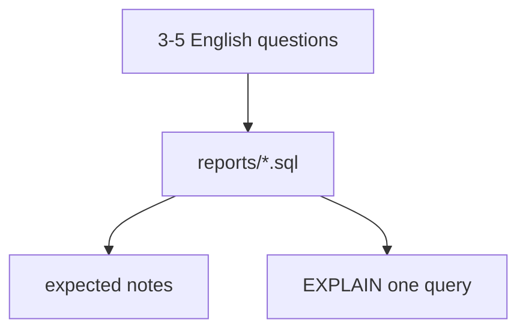

# Month 10 · Week 4 · Day 4
# Lab: Reporting Pack on Your Schema

**Program:** Full-Stack Mastery · 18 months  
**Phase:** 3 — Python and backend  
**Month index:** [../../README.md](../../README.md)  
**Week 4:** [1](day-01.md) · [2](day-02.md) · [3](day-03.md) · Day 4 (today) · [5](day-05.md) · [6](day-06.md) · [7](day-07.md)  
**Week rhythm today:** Lab feature  
**Student state:** You can paginate and avoid N+1 in SQL. Today you ship **3–5 reporting queries** on **your** Stage B schema — JOIN, GROUP, CTE, window.  
**Study time:** 3–4 focused hours

Work in `~/ops-api/sql/reports/` or `~\fullstack-lab\month-10\week-04\day-04\`. This textbook will **not** write your reports. No SQLAlchemy. No finished API. No blog. No paste of `w2_` or `w4_tickets` renamed as the product.

If Week 2 Day 6 reports already exist, **raise the bar**: EXPLAIN one of them, add a window if missing, add expected notes if missing. Do not rest on a copy.

---

## How to use this textbook

1. English questions first.  
2. Type SQL. Run it. Write expected grain.  
3. EXPLAIN ANALYZE at least **one** query in sentences.  
4. Optional review links are for later rechecking.

---

## How to read this chapter

Month 10’s project requirement is **raw SQL reporting** before the ORM. A pack is how you prove it. Each file is one question. The pack uses the vocabulary of Weeks 2–4: joins, aggregates, CTE, `ROW_NUMBER` or `RANK`, maybe keyset — not a dashboard product.



**Wrong belief:** “Five SELECTs from one table is a reporting pack.”  
**Correct:** the pack must **join** and **group**. A window or CTE is required in the set.

**Wrong belief:** “I’ll export CSV from pgAdmin and call it reporting.”  
**Correct:** git holds `.sql` files a reviewer can run.

---

## Today's contract

By the end of this day you will be able to:

1. Write **three to five** reports on **your** tables.  
2. Include INNER or LEFT JOIN, GROUP BY, a **CTE**, and a **window** across the pack.  
3. Include zeros for a parent-with-no-children if that question exists.  
4. Write expected notes (grain, invariants).  
5. EXPLAIN ANALYZE **one** report in at least four sentences.  
6. Use placeholders if Python passes user search text.

**Today's gate.** Closed-book:

> I have a reporting pack on my Stage B schema with JOIN, GROUP, CTE, and a window. Expected notes exist. I can read one EXPLAIN in sentences. I did not paste the ticket lab.

---

## Time box

| Block | Minutes | Work |
|---|---|---|
| A | 25 | QUESTIONS.md |
| B | 90 | Implement 3–5 reports |
| C | 50 | Expected notes + one EXPLAIN |
| D | 20 | Git |
| E | 15 | Recall |

---

# Block A — Questions

Open SCHEMA.md. Write 3–5 questions. Size hints (adapt nouns):

1. Children per parent including zeros (LEFT JOIN, COUNT(child.id))  
2. Latest child per parent (ROW_NUMBER)  
3. Busy parents (HAVING)  
4. Search ILIKE on a name  
5. Unassigned / IS NULL list  
6. Junction: distinct members per parent  

Forbidden: blog; `SELECT *`; only `w4_tickets`.

---

# Block B — Implement

You write the files. Seed zeros if needed (Week 2 Day 6 Block B).

Must appear in the pack as a whole:

- JOIN  
- GROUP BY  
- HAVING **or** FILTER **or** a documented skip with a CTE doing the same job  
- `WITH` CTE  
- `ROW_NUMBER()` or `RANK()`  
- Named columns, ORDER BY  

`reports/README.md` table.

If a query is N+1 in disguise (comment says “run per id”), rewrite.

---

# Block C — Expected + EXPLAIN

`expected/` as Week 2 Day 5: grain, invariants, not frozen timestamps.

Pick the count-including-zeros query or the latest-per-parent:

```powershell
psql -U postgres -d ops_api -c "EXPLAIN ANALYZE /* your sql */"
```

`EXPLAIN.md` **four or more sentences**: scan type, join type if any, whether an index you created was used, whether Seq Scan is honest.

If no index on the FK yet, you may `CREATE INDEX` on **your** child FK and rerun EXPLAIN. Justify in EXPLAIN.md. Week 4 Day 6 will ask for a fuller index budget.

---

# Block D — Git

```powershell
cd ~\ops-api
git add sql/reports sql/expected EXPLAIN.md QUESTIONS.md
git commit -m "Month 10 Week 4 Day 4: Stage B reporting pack."
```

---

# Block E — Recall

1. Why COUNT(child.id).  
2. PARTITION BY.  
3. What EXPLAIN.md claimed.  
4. Why this is not w4_tickets.  
5. Placeholders for ILIKE user input.

## Office hours

**Only two tables, cannot window.** Latest child per parent **is** the window. You have it if you have 1–n.

**EXPLAIN says Seq Scan.** Small table or low selectivity. Say so honestly. Do not fake Index Scan by copying a blog plan.

**Fan-out double join.** CTE per grain, then join summaries.

---

## Definition of done

- [ ] 3–5 reports on **your** schema  
- [ ] CTE + window in the pack  
- [ ] expected notes  
- [ ] EXPLAIN.md four sentences  
- [ ] Commit exists  

---

## Tomorrow

Docs: **indexes** you chose + **connection pool CONCEPT** (SQLAlchemy/pool is Month 11). No session code required.

---

## Optional review links

Reporting and plans are explained in this month’s chapters.

- [PostgreSQL: SELECT](https://www.postgresql.org/docs/current/sql-select.html)
- [PostgreSQL: Window functions](https://www.postgresql.org/docs/current/tutorial-window.html)
- [PostgreSQL: Using EXPLAIN](https://www.postgresql.org/docs/current/using-explain.html)
