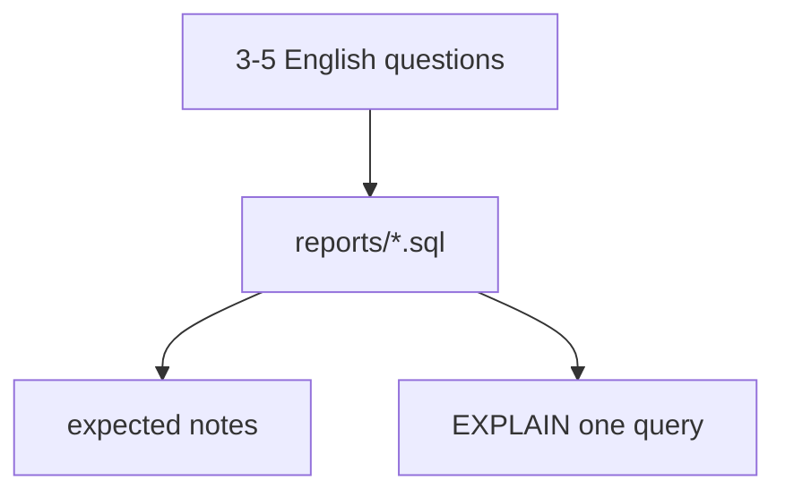

# Month 10 · Week 4 · Day 4
# Lab: Reporting Pack on Your Schema

**Program:** Full-Stack Mastery · 18 months  
**Phase:** 3 — Python and backend  
**Month index:** [../../README.md](../../README.md)  
**Week 4:** [1](day-01.md) · [2](day-02.md) · [3](day-03.md) · Day 4 (today) · [5](day-05.md) · [6](day-06.md) · [7](day-07.md)  
**Week rhythm today:** Lab feature  
**Student state:** You can paginate and avoid N+1 in SQL. Today you ship **3–5 reporting queries** on **your** Stage B schema — JOIN, GROUP, CTE, window.  
**Study time:** 3–4 focused hours

Work in `~/ops-api/sql/reports/` or `~\fullstack-lab\month-10\week-04\day-04\`. This textbook will **not** write your reports. No SQLAlchemy. No finished API. No blog. No paste of `w2_` or `w4_tickets` renamed as the product.

If Week 2 Day 6 reports already exist, **raise the bar**: EXPLAIN one of them, add a window if missing, add expected notes if missing. Do not rest on a copy.

---

## How to use this textbook

1. English questions first.  
2. Type SQL. Run it. Write expected grain.  
3. EXPLAIN ANALYZE at least **one** query in sentences.  
4. Optional review links are for later rechecking.

---

## How to read this chapter

Month 10’s project requirement is **raw SQL reporting** before the ORM. A pack is how you prove it. Each file is one question. The pack uses the vocabulary of Weeks 2–4: joins, aggregates, CTE, `ROW_NUMBER` or `RANK`, maybe keyset — not a dashboard product.



**Wrong belief:** “Five SELECTs from one table is a reporting pack.”  
**Correct:** the pack must **join** and **group**. A window or CTE is required in the set.

**Wrong belief:** “I’ll export CSV from pgAdmin and call it reporting.”  
**Correct:** git holds `.sql` files a reviewer can run.

---

## Today's contract

By the end of this day you will be able to:

1. Write **three to five** reports on **your** tables.  
2. Include INNER or LEFT JOIN, GROUP BY, a **CTE**, and a **window** across the pack.  
3. Include zeros for a parent-with-no-children if that question exists.  
4. Write expected notes (grain, invariants).  
5. EXPLAIN ANALYZE **one** report in at least four sentences.  
6. Use placeholders if Python passes user search text.

**Today's gate.** Closed-book:

> I have a reporting pack on my Stage B schema with JOIN, GROUP, CTE, and a window. Expected notes exist. I can read one EXPLAIN in sentences. I did not paste the ticket lab.

---

## Time box

| Block | Minutes | Work |
|---|---|---|
| A | 25 | QUESTIONS.md |
| B | 90 | Implement 3–5 reports |
| C | 50 | Expected notes + one EXPLAIN |
| D | 20 | Git |
| E | 15 | Recall |

---

# Block A — Questions

Open SCHEMA.md. Write 3–5 questions. Size hints (adapt nouns):

1. Children per parent including zeros (LEFT JOIN, COUNT(child.id))  
2. Latest child per parent (ROW_NUMBER)  
3. Busy parents (HAVING)  
4. Search ILIKE on a name  
5. Unassigned / IS NULL list  
6. Junction: distinct members per parent  

Forbidden: blog; `SELECT *`; only `w4_tickets`.

---

# Block B — Implement

You write the files. Seed zeros if needed (Week 2 Day 6 Block B).

Must appear in the pack as a whole:

- JOIN  
- GROUP BY  
- HAVING **or** FILTER **or** a documented skip with a CTE doing the same job  
- `WITH` CTE  
- `ROW_NUMBER()` or `RANK()`  
- Named columns, ORDER BY  

`reports/README.md` table.

If a query is N+1 in disguise (comment says “run per id”), rewrite.

---

# Block C — Expected + EXPLAIN

`expected/` as Week 2 Day 5: grain, invariants, not frozen timestamps.

Pick the count-including-zeros query or the latest-per-parent:

```powershell
psql -U postgres -d ops_api -c "EXPLAIN ANALYZE /* your sql */"
```

`EXPLAIN.md` **four or more sentences**: scan type, join type if any, whether an index you created was used, whether Seq Scan is honest.

If no index on the FK yet, you may `CREATE INDEX` on **your** child FK and rerun EXPLAIN. Justify in EXPLAIN.md. Week 4 Day 6 will ask for a fuller index budget.

---

# Block D — Git

```powershell
cd ~\ops-api
git add sql/reports sql/expected EXPLAIN.md QUESTIONS.md
git commit -m "Month 10 Week 4 Day 4: Stage B reporting pack."
```

---

# Block E — Recall

1. Why COUNT(child.id).  
2. PARTITION BY.  
3. What EXPLAIN.md claimed.  
4. Why this is not w4_tickets.  
5. Placeholders for ILIKE user input.

## Office hours

**Only two tables, cannot window.** Latest child per parent **is** the window. You have it if you have 1–n.

**EXPLAIN says Seq Scan.** Small table or low selectivity. Say so honestly. Do not fake Index Scan by copying a blog plan.

**Fan-out double join.** CTE per grain, then join summaries.

---

## Definition of done

- [ ] 3–5 reports on **your** schema  
- [ ] CTE + window in the pack  
- [ ] expected notes  
- [ ] EXPLAIN.md four sentences  
- [ ] Commit exists  

---

## Tomorrow

Docs: **indexes** you chose + **connection pool CONCEPT** (SQLAlchemy/pool is Month 11). No session code required.

---

# Extra theory — grain, FILTER, and honest zeros

## Grain is the whole report

If you cannot finish the sentence “one row per ___,” you do not have a report yet. “One row per project” is a grain. “One row per project per status” is a different grain. Mixing them in one SELECT without GROUP BY is how PostgreSQL errors — or how a looser engine lies.

When you JOIN a 1–n child, the grain becomes **one row per child** unless you aggregate. That is fan-out. It is correct for a detail listing. It is wrong for a budget column that lives on the parent: you would multiply the budget by the number of children. The repair is a CTE that aggregates children **first**, then JOIN the summary to the parent.

```sql
WITH child_counts AS (
  SELECT project_id, COUNT(*) AS n
  FROM issues  -- your child table name will differ
  GROUP BY project_id
)
SELECT p.title, COALESCE(c.n, 0) AS n
FROM projects p
LEFT JOIN child_counts c ON c.project_id = p.id;
```

That pattern is the same as LEFT JOIN + COUNT(child.id) GROUP BY parent. Use whichever you can explain. If you cannot explain it, you cannot defend it tomorrow.

## FILTER

```sql
SELECT
  project_id,
  COUNT(*) FILTER (WHERE status = 'open') AS open_n,
  COUNT(*) FILTER (WHERE status = 'done') AS done_n
FROM tasks
GROUP BY project_id;
```

`FILTER` is a WHERE that applies **inside** one aggregate. It keeps grain “one row per project” while splitting counts. Two queries UNION ALL would be a worse shape for this question.

If your PostgreSQL version is old enough to lack FILTER (it is not, on a 2026 install), the fallback is `COUNT(CASE WHEN status = 'open' THEN 1 END)`. Prefer FILTER when it runs.

## Window vs GROUP BY

GROUP BY **collapses**. After GROUP BY project_id you cannot also SELECT each task title in the same result without an extra aggregate (string_agg) or a second query. A window **keeps** task rows and adds `rn`. Use a window when the audience still wants the row plus a rank. Use GROUP BY when the audience wants a summary only.

`RANK()` vs `ROW_NUMBER()`: ties in RANK share a number and skip the next; ROW_NUMBER always unique in the partition. For “pick one latest row,” ROW_NUMBER + `id` tie-breaker is unambiguous.

## Expected notes that survive identity drift

Do not write “project id 7 has 3 tasks.” Write “the project titled Northline has 3 tasks in this seed” or “Empty Harbor analog has 0.” If you reset from a script in git, titles are stable. Ids are not, after a week of labs.

## EXPLAIN sentences you can reuse

1. Name the **node** (Seq Scan, Index Scan, Hash Join, GroupAggregate).  
2. Name the **table** it read.  
3. Say whether a **filter** ran in the index or after.  
4. Say whether **actual rows** matched the story (zeros present? one row per parent?).  
5. If Seq Scan, say **small table** or **low selectivity** — do not apologize for honesty.

Write those five into EXPLAIN.md even if the numbers differ from a classmate’s laptop.

## Anti-patterns for this lab

- `SELECT *` in a committed report file  
- Comma joins  
- DISTINCT to hide fan-out you have not named  
- Window `OVER ()` with no PARTITION and no product meaning  
- Copying Empty Harbor as a title in **your** ops-api seed without that being your domain  
- Python that builds SQL with f-strings for an ILIKE parameter  

## Stretch if the pack is already green

Add `COUNT(*) FILTER` as report 5, **or** a keyset page of the latest-events listing using `(created_at, id)`. Stretch is not a substitute for the required CTE and window.

Write `GRAIN-TABLE.md`: one line per report file, grain filled in. If two files share a grain, that is allowed; if any line is blank, that file is not done.

---

# Warm-up on w4_tickets (optional rehearsal — not the product pack)

If your Stage B schema is ready, skip this and stay on ops-api. If you need to feel JOIN+window once more **before** transferring, type this against `month10` `w4_*` tables from Week 4 Day 1, then close it and write **your** reports.

```sql
-- W.1 zeros
SELECT p.title, COUNT(t.id) AS n
FROM w4_projects p
LEFT JOIN w4_tickets t ON t.project_id = p.id
GROUP BY p.id, p.title
ORDER BY n, p.title
LIMIT 15;

-- W.2 CTE open
WITH open_t AS (
  SELECT id, project_id FROM w4_tickets WHERE status = 'open'
)
SELECT p.title, COUNT(o.id) AS open_n
FROM w4_projects p
LEFT JOIN open_t o ON o.project_id = p.id
GROUP BY p.id, p.title
HAVING COUNT(o.id) = 0 OR COUNT(o.id) >= 2
ORDER BY open_n, p.title;

-- W.3 window
WITH ranked AS (
  SELECT
    project_id,
    id,
    title,
    ROW_NUMBER() OVER (
      PARTITION BY project_id
      ORDER BY created_at DESC, id DESC
    ) AS rn
  FROM w4_tickets
)
SELECT * FROM ranked WHERE rn = 1;
```

Write `WARMUP.md` only if you ran it: three row-count observations. Then **do not** copy these files into ops-api. Change nouns.

## Comment headers required on product reports

```sql
-- Question: ...
-- Grain: one row per ...
-- Join: LEFT/INNER ...
-- Invariant: ...
```

If a file lacks this header, it is not done. Reviewers (and tomorrow’s you) should not reverse-engineer English from aliases `t` and `p`.

## Parameterized ILIKE (Python optional)

```python
cur.execute(
    "SELECT id, title FROM your_table WHERE title ILIKE %s ORDER BY id LIMIT 50",
    ('%' + q + '%',),
)
```

The `%` wildcards are **inside the value**, still a placeholder. Do not `ILIKE '%" + q + "%'`. If `q` contains `%`, decide whether that is a wildcard; document the choice in SECURITY.md (one paragraph).

## HAVING without losing zeros

`HAVING COUNT(t.id) >= 2` **drops** zeros (0 is not >= 2). That is correct for “busy parents.” It is incorrect if you thought HAVING was a WHERE on the parent list including quiet ones. Two reports, two grains. Do not merge them to save a file.

Write `BUSY-VS-ZERO.md` if both questions exist in your pack: how they differ.

## Definition of done recap (tick again)

- [ ] Warm-up skipped **or** not copied into ops-api  
- [ ] Headers on every product report  
- [ ] GRAIN-TABLE.md complete  
- [ ] EXPLAIN.md four sentences on **your** SQL  

---

# Warm-up is not the pack

If WARMUP.md exists and reports/ is still w4_ tickets, you failed the gate. Product files use **your** table names. Delete copied w4 SQL from ops-api if you put it there.

Write `NOT-W4.md`: “reports query … (list tables).”

## FILTER extra

If you add FILTER, it can live in report 03 or 05. It does not replace the window. Window is still required in the pack.

---

Write `PACK-TABLES.md`: list of tables touched by reports (must not be only w4_tickets).

---

# Report headers audit

Open each product SQL file and confirm the four comment lines (question, grain, join, invariant). If one file lacks them, add them before git. This is the lab’s documentation, not decoration.

Write `HEADERS.md`: N files, all have headers yes/no.

## EXPLAIN on zeros query

The zeros query is the one that teaches LEFT JOIN. EXPLAIN it even if it seq-scans. Four sentences. If you only EXPLAINed an inner listing, add this one.

---

# Product report count

You need three at minimum, five at most for the day. If you have two, write a third even if it is ILIKE. If you have six, move extras to Day 6.

Write `N-REPORTS.md`: the number.

## Zeros query filename

Name it so README can say “this file must show n=0.” If zeros are buried in a HAVING file, they will be dropped. Separate files.

---

Write `CTE-FILE.md`: which report file has WITH.

Write `NOT-W4-TABLES.md`: first table name in report 01 FROM clause.

---

## Closing note

The pack is your schema. Warm-up on w4_tickets stays in this lab folder, not in ops-api.

Headers are required.

---

## Optional review links

Reporting and plans are explained in this month’s chapters. These pages are for later checking, not for first learning.

- [PostgreSQL: SELECT](https://www.postgresql.org/docs/current/sql-select.html)
- [PostgreSQL: Window functions](https://www.postgresql.org/docs/current/tutorial-window.html)
- [PostgreSQL: Using EXPLAIN](https://www.postgresql.org/docs/current/using-explain.html)
- [PostgreSQL: Aggregate FILTER](https://www.postgresql.org/docs/current/sql-expressions.html#SYNTAX-AGGREGATES)
