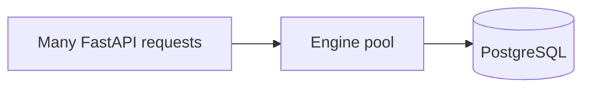

# Month 10 · Week 4 · Day 5
# Index Docs, Pools as a Concept, Hygiene

**Program:** Full-Stack Mastery · 18 months  
**Phase:** 3 — Python and backend  
**Month index:** [../../README.md](../../README.md)  
**Week 4:** [1](day-01.md) · [2](day-02.md) · [3](day-03.md) · [4](day-04.md) · Day 5 (today) · [6](day-06.md) · [7](day-07.md)  
**Week rhythm today:** Tests + refactor + documentation  
**Study time:** 3–4 focused hours

Labs: `~\fullstack-lab\month-10\week-04\day-05\` plus your report SQL.

---

## How to read this chapter

Indexes you cannot justify in a sentence are clutter. A **connection pool** is a set of already-open database connections your app reuses so each HTTP request does not pay a full connect.

**Wrong belief:** “I need to configure PgBouncer today.”  
**Correct:** Month 11’s SQLAlchemy engine **has a pool**. Month 15/16 may add more. Today you **name** the idea: connections are not free; do not connect-per-row.

**Wrong belief:** “I’ll open a new `psycopg.connect` inside a loop of tasks.”  
**Correct:** that is a pool (or a session) problem and an N+1 cousin.

---

## Today's contract

1. `INDEXES.md`: each index, the query it serves, leftmost prefix if composite.  
2. `CREATE INDEX` files in git (not only undocumented psql history).  
3. A paragraph: what a pool prevents (connect storms).  
4. Re-run report pack; expected counts still hold.  
5. No secrets in files.

**Gate:** I can justify indexes and explain a connection pool without building one from scratch.

---

## Time box

| Block | Minutes | Work |
|---|---|---|
| A | 35 | Pool + index recap |
| B | 70 | INDEXES.md + SQL |
| C | 40 | Re-run reports |
| D | 15 | Git |
| E | 15 | Recall |

---

# Block A — Pool, in working English

A PostgreSQL connection is a backend process (roughly). Creating it costs time. A web app handles many short requests. The engine keeps N connections warm (`pool_size` later). Too many connections exhaust the server. Too few, requests wait.

You will not tune numbers today. You will **not** connect in an inner loop.

SQLAlchemy `create_engine` (Month 11) is where the pool lives in this program. Raw psycopg scripts can use a single connection for the whole script.

---

# Block B

Write `INDEXES.md` and `010_indexes.sql`. If Day 4 reports filter `project_id`, that FK column is the usual first index after PKs.

---

## Definition of done

- [ ] INDEXES.md  
- [ ] Indexes in git  
- [ ] Pool paragraph  
- [ ] Reports still run  
- [ ] Commit  

---

## Tomorrow

Finish the reporting pack independently; then Day 7 is the Month 10 exam.

---

## Optional review links

Pools and indexes are explained in this chapter. These pages are for later checking, not for first learning.

- [PostgreSQL: Connections and authentication](https://www.postgresql.org/docs/current/client-authentication.html)
- [SQLAlchemy: Engine (preview)](https://docs.sqlalchemy.org/en/20/core/engines.html)
