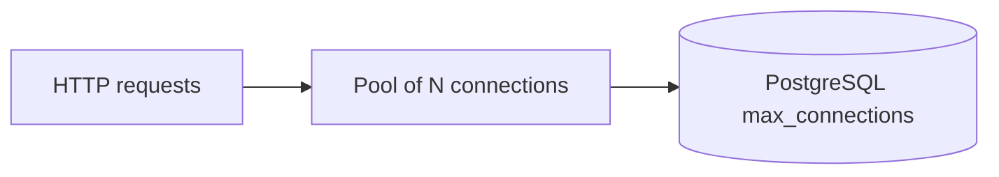

# Month 10 · Week 4 · Day 5
# Index Docs and Connection Pool Concept

**Program:** Full-Stack Mastery · 18 months  
**Phase:** 3 — Python and backend  
**Month index:** [../../README.md](../../README.md)  
**Week 4:** [1](day-01.md) · [2](day-02.md) · [3](day-03.md) · [4](day-04.md) · Day 5 (today) · [6](day-06.md) · [7](day-07.md)  
**Week rhythm today:** Tests, refactor, docs  
**Student state:** You have a reporting pack. Today you document **indexes** and learn what a **connection pool** is — without SQLAlchemy.  
**Study time:** 3–4 focused hours

Labs: `~/ops-api/sql/` plus `~\fullstack-lab\month-10\week-04\day-05\` for the pool essay. No SQLAlchemy engine. No `create_engine(pool_size=)`. Month 11 will attach the pool to the ORM. Docker is not the gate.

---

## How to use this textbook

1. INDEXES.md is a budget, not a wish list.  
2. The pool section is **concept**: you will not build PgBouncer today.  
3. Optional review links are for later rechecking.

---

## How to read this chapter

An **index budget** lists each index, its purpose, and the write cost you accept. A **connection** is a session to PostgreSQL (TCP, authentication, memory). Opening a connection **per HTTP request** is slow. A **pool** keeps a few live connections and **lends** them. SQLAlchemy and many drivers implement a client-side pool. **PgBouncer** is a server-side pooler — Month 15/ops later. Today you must **explain** why FastAPI should not `psycopg.connect()` with no reuse on every click.



**Wrong belief:** “I’ll open a new connection for every query; PostgreSQL is a server, it is fine.”  
**Correct:** each connect is handshake + memory. Under load you exhaust `max_connections` and wait.

**Wrong belief:** “A pool is a second PostgreSQL.”  
**Correct:** a pool is a **set of already-open sessions** (or a proxy that multiplexes). One database.

---

## Today's contract

By the end of this day you will be able to:

1. Write **INDEXES.md** for your Stage B schema (PK/UNIQUE included).  
2. Justify or reject indexes on FK columns and reporting WHERE/ORDER BY.  
3. Explain **connection**, **max_connections**, and **pool** in sentences.  
4. Explain why a transaction should not sit in the pool **checked out** while you call a slow HTTP API.  
5. Not implement SQLAlchemy.

**Today's gate.** Closed-book:

> Indexes are a budget. PK/UNIQUE already count. I can name why a pool exists: reuse sessions, cap concurrency. I do not hold a connection across unrelated work. SQLAlchemy pool settings are Month 11.

---

## Time box

| Block | Minutes | Work |
|---|---|---|
| A | 45 | Theory: pools and index docs |
| B | 70 | INDEXES.md + `\d` vs file |
| C | 50 | POOL.md essay + checkout story |
| D | 15 | Git |
| E | 15 | Recall |

---

# Block A — Theory

## 1. Index documentation

For each index:

- Name  
- Table and columns (order)  
- UNIQUE or not  
- Query it serves  
- Write-path cost (every insert to that table)  
- How you checked (EXPLAIN, or “PK default”)  

If EXPLAIN never uses it, **drop or justify “for FK delete checks.”** PostgreSQL uses indexes on `tickets.project_id` when validating RESTRICT/CASCADE lookups.

## 2. What a connection is

Month 1: client/server. `psql` opens a connection. PostgreSQL creates a **backend process** (classic model) for that session. `SHOW max_connections;` — a ceiling. Each FastAPI worker **times** connections if you connect naively.

## 3. Pool concept

A **pool** of size 5 means up to 5 simultaneous SQL sessions from that process. Request A borrows conn 2, runs queries, **returns** it. Request B reuses conn 2. If all 5 are busy, wait or error — better than 5000 connections.

**Client pool:** inside the app process (psycopg pool, SQLAlchemy later).  
**External pool:** PgBouncer between apps and Postgres.

You do not configure PgBouncer today. You write: “many app instances × pool_size must stay under max_connections.”

## 4. Checkout lifetime

Borrow connection → BEGIN → queries → COMMIT → **return to pool**. If you borrow, then call Stripe for 3 seconds, then COMMIT, you **held a PostgreSQL session idle in transaction** — locks, slot, pool starvation. Month 11: keep transactions **short**. Today: write that story in POOL.md.

## 5. Autocommit vs pool

A pooled connection may still have an aborted transaction if you forgot rollback (Week 3). Returning a dirty connection poisons the next request. Drivers reset; you still **rollback on error**.

---

# Block B — INDEXES.md

```powershell
mkdir ~\fullstack-lab\month-10\week-04\day-05 -Force
```

From **your** database:

```powershell
psql -U postgres -d ops_api -c "\d"
```

`\d` each table. List indexes. Write `INDEXES.md` in ops-api (or lab). Include:

- All PK/UNIQUE  
- All extra CREATE INDEX  
- At least one **rejected** index (low selectivity or ILIKE %x%) with a sentence  

If FK columns on children are unindexed, **either** add `CREATE INDEX` in a new `03-indexes.sql` **or** write “table small, postpone.” Honesty.

Align with Day 4 EXPLAIN.md. If you claimed an index and the plan seq-scanned, fix the doc or the index.

---

# Block C — POOL.md

Write 400–800 words (your words) covering:

1. Connection vs pool vs database  
2. Why per-request connect is costly  
3. max_connections arithmetic (example numbers: 3 uvicorn workers × pool 10 = 30)  
4. Short transactions; do not hold checkout during external HTTP  
5. SQLAlchemy/QueuePool is **Month 11** — you are not copying `pool_size=20` as cargo cult  
6. Optional: PgBouncer exists for many-app fan-in  

No code required. A tiny `SHOW max_connections;` paste is welcome.

`CHECKOUT.md`: one bad story (hold during `time.sleep`), one good story (query, commit, return).

---

# Block D — Git

```powershell
cd ~\ops-api
git add sql INDEXES.md
git commit -m "Month 10 Week 4 Day 5: index budget."
```

Commit POOL.md in fullstack-lab if it lives there.

---

# Block E — Recall

1. Why PK is already an index.  
2. Pool vs max_connections.  
3. Idle in transaction.  
4. Rejected index.  
5. Month 11 vs today.

## Office hours

**I built SQLAlchemy to “feel the pool.”** Undo. Essay only.

**I indexed everything after INDEXES.md guilt.** Drop unused. Budget.

---

## Definition of done

- [ ] INDEXES.md matches `\d`  
- [ ] One rejected index named  
- [ ] POOL.md + CHECKOUT.md  
- [ ] No SQLAlchemy engine  
- [ ] Commit exists  

---

## Tomorrow

Finish the reporting pack and **justify indexes** against real EXPLAIN on **your** queries. Pack complete for the exam.

---

# Pool arithmetic you must actually write

Pick numbers and put them in POOL.md. Example:

- PostgreSQL `max_connections` on your laptop: paste `SHOW max_connections;`  
- You plan 1 Uvicorn worker in dev: pool 5 is plenty  
- You imagine 4 workers in a small deploy: 4 × 10 = 40; if max_connections is 100 and other apps share the instance, you are already negotiating  

If you cannot paste SHOW, write “I did not connect; typical default 100” and still do the multiply. The gate is the **multiply**, not a production config.

## Idle in transaction — story with SQL

Session borrows a connection, `BEGIN`, `UPDATE …`, then the Python code calls an external HTTP API for 2 seconds, then `COMMIT`. During those 2 seconds:

- The row lock from UPDATE may still be held  
- The pool has one fewer free connection  
- Other requests wait  

Good story: `BEGIN`, `UPDATE`, `COMMIT`, return connection, **then** HTTP call (or do HTTP first with no open tx). Write both stories in CHECKOUT.md with **your** Project 6 nouns (issue status, inventory).

## What you will see in Month 11 (preview only)

`create_engine("postgresql+psycopg://…", pool_size=5, max_overflow=5)` is a client pool. You are not typing it today. You are refusing to cargo-cult `pool_size=100`. Overflow exists; it is not infinite.

PgBouncer transaction pooling changes session features (temp tables, prepared statements). That is why it is not “just turn it on” in a lab. Mention it exists; do not install it for the gate.

## INDEXES.md example row

```markdown
| Name | Table | Columns | Serves | Keep? |
|---|---|---|---|---|
| issues_pkey | issues | id | PK | yes, default |
| issues_project_id_idx | issues | project_id | JOIN, FK checks, list-by-project | yes / EXPLAIN on report 01 |
| issues_status_idx | issues | status | rejected | no, 80% open |
```

Fill with **your** names. If the table is empty, the doc is fiction.

Write `REJECTED.md`: the index you did not create, in five sentences.

---

# Held lock story with Week 3 words

FOR UPDATE plus a slow HTTP call is idle-in-transaction **and** a row lock. Pool starvation plus lost-update-adjacent blocking. The fix is the same: short transactions. POOL.md and Day 2’s FOR UPDATE notes are one topic.

Write `LOCK-AND-POOL.md`: five sentences connecting them. This is how Week 3 and Week 4 meet without SQLAlchemy.

## max_connections on Windows

```powershell
psql -U postgres -d month10 -c "SHOW max_connections;"
```

Paste the number. Multiply. If you cannot connect, still multiply hypothetical 100.

## Index budget vs reporting pack

Day 4’s EXPLAIN.md should be cited in INDEXES.md. If you promised `issues_project_id_idx` and the plan seq-scanned 30 rows, write “tiny table, index kept for growth.” That is honest. Writing “Index Scan” when you did not run EXPLAIN is not.

---

# Worker arithmetic example to copy and replace

“If `max_connections` is 100 and I run 2 app processes with `pool_size` 8 and `max_overflow` 4, peak is 2×(8+4)=24, leaving headroom for `psql` and backups.” Replace 100 with your SHOW. Replace 2/8/4 with numbers you would actually choose in **dev** (small).

Write `ARITH.md`: one equation.

## INDEXES.md must include PK rows

A budget that lists only extras hides the indexes you already pay for. Start with pkeys and unique constraints from `\d`.

---

# SHOW max_connections paste

Without a paste or an honest skip, POOL.md is a vibe. Run the SHOW. If password fails, write that — still multiply 100 as hypothetical and label it hypothetical.

Write `SHOW.md`: the number or “hypothetical 100.”

## Rejected index paragraph

Five sentences: column, selectivity guess, why B-tree would not help or would not be used, what you would measure in EXPLAIN, that you did not create it.

REJECTED.md is required even if INDEXES.md already has a no row.

---

Write `INDEX-ROWS.md`: how many rows in INDEXES.md (including PK).

---

Write `POOL-EQ.md`: workers × (pool_size + overflow) = your peak.

---

Write `SHOW-N.md`: max_connections number.

---

## Closing note

Paste `SHOW max_connections`. Multiply workers by pool size. Do not invent SQLAlchemy tonight.

---

## Optional review links

Pools and indexes are explained in this chapter. These pages are for later checking, not for first learning.

- [PostgreSQL: Resource consumption / connections](https://www.postgresql.org/docs/current/runtime-config-connection.html)
- [PostgreSQL: Indexes](https://www.postgresql.org/docs/current/indexes.html)
- [psycopg 3: Connection pools](https://www.psycopg.org/psycopg3/docs/advanced/pool.html)
