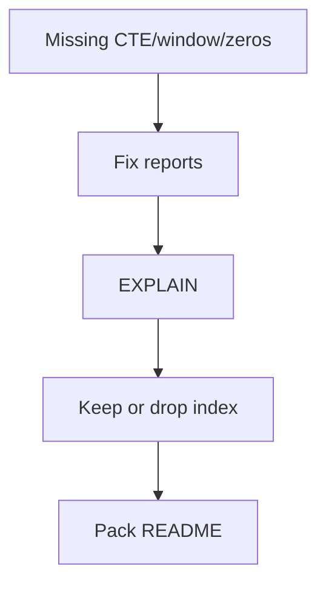

# Month 10 · Week 4 · Day 6
# Finish the Reporting Pack and Justify Indexes

**Program:** Full-Stack Mastery · 18 months  
**Phase:** 3 — Python and backend  
**Month index:** [../../README.md](../../README.md)  
**Week 4:** [1](day-01.md) · [2](day-02.md) · [3](day-03.md) · [4](day-04.md) · [5](day-05.md) · Day 6 (today) · [7](day-07.md)  
**Week rhythm today:** Independent implementation  
**Student state:** Reports exist; indexes are documented. Today the pack is **finished** and every extra index has an EXPLAIN sentence.  
**Study time:** 3–4 focused hours

This textbook will **not** finish Project 6. No API. No SQLAlchemy. No blog. Exam is tomorrow — do not start the exam file early as a cheat.

---

## How to use this textbook

1. Close gaps in Day 4 reports first.  
2. EXPLAIN the ones that matter.  
3. Drop indexes you cannot justify.  
4. Optional review links are for later rechecking.

---

## How to read this chapter

“Finish” means: README complete, 3–5 queries runnable from a cold `psql`, expected notes true, INDEXES.md matches reality, one keyset **or** honest OFFSET-with-warning if you paginate a report. The Month 10 gate asks for reporting queries **you** wrote.



**Wrong belief:** “I’ll add ten indexes the night before the exam.”  
**Correct:** unjustified indexes are a gate fail in spirit. Budget.

**Wrong belief:** “The pack must match a tutorial analytics schema.”  
**Correct:** it must match **your** SCHEMA.md.

---

## Today's contract

By the end of this day you will be able to:

1. Run the full pack from README instructions.  
2. Confirm CTE + window + JOIN + GROUP are present.  
3. Attach EXPLAIN sentences to **at least two** reports.  
4. Finalize INDEXES.md (keep/drop).  
5. Write `PACK-STATUS.md`: what is done, what is explicitly out of scope (FastAPI).

**Today's gate.** Closed-book:

> My reporting pack runs on my schema. Indexes I keep have a reason and, where it matters, a plan. I did not ship SQLAlchemy. I am ready for a closed-book schema design exam tomorrow.

---

## Time box

| Block | Minutes | Work |
|---|---|---|
| A | 20 | Inventory gaps |
| B | 90 | Finish SQL + expected |
| C | 50 | EXPLAIN + index keep/drop |
| D | 20 | PACK-STATUS + git |
| E | 15 | Recall |

---

# Block A — Inventory

Checklist (copy into `PACK-STATUS.md` and tick):

- [ ] 3–5 files  
- [ ] JOIN  
- [ ] GROUP BY  
- [ ] CTE  
- [ ] Window  
- [ ] Zero-child parent visible if claimed  
- [ ] expected notes  
- [ ] INDEXES.md  
- [ ] No passwords  
- [ ] No w4_tickets as the product pack  

---

# Block B — Finish SQL

Fill holes. If window was fake (`OVER ()` without PARTITION), fix it. If LEFT JOIN was INNER, zeros die — fix.

Seed script documented. `psql -f` order in README.

Optional: one keyset example on **your** time-ordered table. If you skip, write “reports are full scans / LIMITed samples, pagination later.”

---

# Block C — Justify indexes

For each **non-PK** index:

1. Which report or FK action uses it  
2. EXPLAIN snippet or honest “small table, planner seq scans anyway — keeping for production size”  
3. Drop if neither

`JUSTIFY.md` table.

Create missing FK indexes if Day 5 postponed and a join report seq-scans a large child table. If the table is tiny, say tiny.

`ANALYZE your_table;` then EXPLAIN again.

---

# Block D — Git

```powershell
cd ~\ops-api
git add sql INDEXES.md PACK-STATUS.md JUSTIFY.md
git commit -m "Month 10 Week 4 Day 6: reporting pack complete, indexes justified."
```

---

# Block E — Recall

1. Two reports by English name.  
2. One index you dropped or refused.  
3. Seq Scan that is honest.  
4. What tomorrow’s exam will close (textbook days).  
5. Why Month 11 still waits.

## Office hours

**Pack is only lab w4_.** Today is **your** schema. If 6B schema is empty, you cannot pass Month 10 gate — finish Week 1 Day 6.

**I started FastAPI+SQLAlchemy.** Stop. Exam is SQL and modeling.

---

## Definition of done

- [ ] PACK-STATUS.md all required ticks  
- [ ] JUSTIFY.md  
- [ ] Reports rerun this session  
- [ ] Commit exists  

---

## Tomorrow

**Month 10 exam + gate.** Synthesis in that file. Closed-book schema design. Link to Month 11 only if the gate is true.

---

# What “finished” means in sentences

A finished pack is not “I have files.” It is:

1. A stranger can `psql -f` the README order on a machine that has your seed.  
2. Each expected note names grain and at least one invariant that can fail.  
3. INDEXES.md lists PK/UNIQUE plus extras; extras have JUSTIFY.md rows.  
4. At least one EXPLAIN is written in **sentences**, not only a paste.  
5. You can name the CTE and the window without opening the SQL.

If (5) fails, the pack is still a copy you have not learned. Rewrite the comments in English until you can speak them.

## Index keep/drop rubric

Keep if **any** of these is true and you can show it:

- EXPLAIN uses it on a report you ship  
- It is PK or UNIQUE (already required)  
- It is a child FK column you expect to grow, even if today’s 40 rows seq-scan — write “for production size / ON DELETE checks”  

Drop if:

- Duplicate of another index’s leftmost prefix **and** no extra ORDER BY it uniquely serves  
- Single-column boolean/status with ~50% selectivity and no partial-index story  
- Created “because the exam might ask for indexes” with no query  

Write the drop as SQL in `99-drop-unused.sql` **or** never create it. Leaving unused indexes “for later” is how write amplification starts.

## Reporting pack README shape

```markdown
# Reports

Reset: psql -U postgres -d ops_api -f sql/00-reset.sql && ...
Then: psql -U postgres -d ops_api -f sql/reports/01_....sql

| File | Question | Grain |
|---|---|---|
| 01_... | ... | one row per ... |
```

If the README lies, the pack is not finished.

## Month 11 boundary (write this in PACK-STATUS.md)

You will map these SQL files to SQLAlchemy queries later. If a report cannot be expressed without a window, do not pretend `group_by` in Python is enough. Paste the SQL into a comment in Month 11 if you must — do not lose it. Today, the `.sql` file **is** the artifact.

You will not: add Redis, Dockerize Postgres, or open Alembic tonight.

## Oral rehearsal for tomorrow

Without files: draw three boxes for a **new** domain (not clinics yet — that is the exam’s surprise, so practice on **libraries** or **warehouses**). Speak PK, FK RESTRICT, one UNIQUE, one CHECK, one LEFT JOIN count, one BEGIN pair. If you freeze, reread Week 1 Day 7 and Week 3 Day 7 syntheses **today**, not during the exam.

Write `ORAL.md`: five sentences you will say in Block 0 tomorrow. Then do not open it during the exam; the exam file repeats the synthesis.

---

# Cold run procedure

1. Connect to the database named in WHERE.md / SCHEMA.md.  
2. Run reset+schema+seed from Week 1 Day 6 files (or your current 00/01/02).  
3. Run report 01 … N in README order.  
4. Compare to expected notes.  
5. Run EXPLAIN on two reports. Update JUSTIFY.md.  

If step 4 needs a screenshot of ids, you wrote brittle notes. Fix the notes, not the ids.

## Out of scope list (paste into PACK-STATUS.md)

- FastAPI routes talking to Postgres  
- SQLAlchemy models  
- Alembic migrations  
- Redis  
- Docker Compose for Postgres  
- Connection pool implementation  
- Partial unique indexes you cannot explain  

If any of those landed in git this week, move them off the gate path or delete.

## Oral five sentences (ORAL.md)

1. My three tables are …  
2. Orphans are impossible because …  
3. One report uses LEFT JOIN so that …  
4. One transaction wraps …  
5. I did not start Month 11 because …

If you cannot fill (2) or (3), the gate is false before tomorrow’s table.

---

# Two EXPLAIN files

`EXPLAIN-01.md` and `EXPLAIN-02.md` (or sections in EXPLAIN.md): count query and latest-per-parent (or your two hardest). Four sentences each. If both say only “Seq Scan because small,” that can be honest — then JUSTIFY.md should not claim Index Scan.

Write `HONEST.md`: “I did not invent an Index Scan.”

## Git paths

Reports in `sql/reports/`. Expected in `sql/expected/` or `expected/`. INDEXES.md at repo root or `sql/`. PACK-STATUS.md where a reviewer finds it in 10 seconds. If files are scattered without README links, the pack is not finished.

---

# README must include database name

`ops_api` vs `month10` vs schema `ops`. If a classmate runs reports against the wrong database, empty results look like SQL bugs. PACK-STATUS.md line 0: database name.

Write `DBNAME.md`: one line.

## Index drop is a commit

If you DROP INDEX, the SQL lives in git (`99-drop-unused.sql`) so the environment is reproducible. Dropping only in a session is a ghost.

---

# PACK-STATUS ticks recopied

If any required tick is empty, the day is not done. Fill them this session after the cold run, not from memory of Day 4.

Write `TICKS.md`: copy of the checklist with x marks.

## Justified index count

Count extra (non-PK) indexes you keep. If more than four on a three-table schema, reread “when not to index.” Write the count.

---

Write `KEEP-DROP.md`: how many extra indexes kept vs dropped.

---

Write `COLD-RUN.md`: cold run completed this session yes/no.

---

## Closing note

Cold-run the pack. Tick PACK-STATUS.md from evidence, not hope. Exam is tomorrow.

---

## Optional review links

These pages are for later checking, not for first learning.

- [PostgreSQL: Using EXPLAIN](https://www.postgresql.org/docs/current/using-explain.html)
- [PostgreSQL: Indexes](https://www.postgresql.org/docs/current/indexes.html)
- Month 10 index: [../../README.md](../../README.md)
