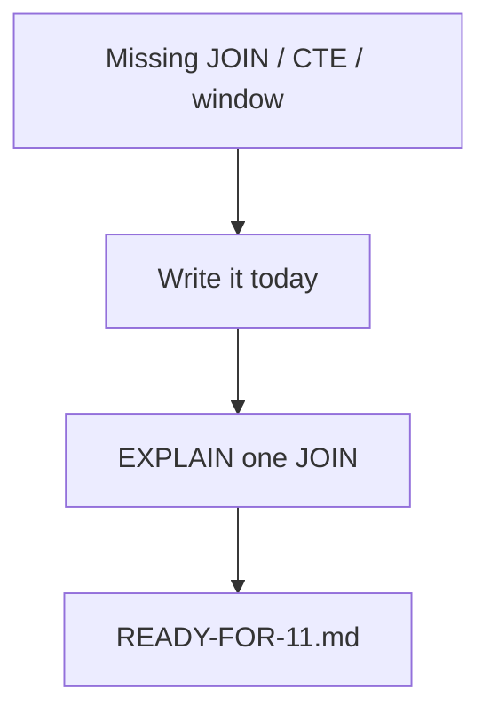

# Month 10 · Week 4 · Day 6
# Independent: Finish the Reporting Pack

**Program:** Full-Stack Mastery · 18 months  
**Phase:** 3 — Python and backend  
**Month index:** [../../README.md](../../README.md)  
**Week 4:** [1](day-01.md) · [2](day-02.md) · [3](day-03.md) · [4](day-04.md) · [5](day-05.md) · Day 6 (today) · [7](day-07.md)  
**Week rhythm today:** Independent  
**Study time:** 3–4 focused hours

Your reports, your schema. This file is a **gate rehearsal**, not a solution. Work in `~/ops-api/sql/` or `~\fullstack-lab\month-10\week-04\day-06\`.

---

## How to use this textbook

1. Run every report on a seed you control. Zero rows usually means seed, not genius SQL.  
2. AI may review EXPLAIN English; it may not replace your pack.  
3. Optional review links are for later rechecking.

---

## How to read this chapter

Month 11 will hide SQL in Python. If the pack is empty, you will debug ORM SQL you never learned to ask for.

**Wrong belief:** “The exam mini-schema tomorrow replaces Project 6 reports.”  
**Correct:** the exam is extra evidence. Gate item 8 wants **your** reporting work too.

---

## Today's contract

1. Reporting pack complete (Day 4 envelope).  
2. SCHEMA.md still matches the tables you query.  
3. One keyset pagination query on a list you will later expose as HTTP.  
4. One EXPLAIN of a JOIN translated into three sentences.  
5. Short `READY-FOR-11.md`: what SQLAlchemy will map; what you refuse to forget.

**Gate:** Given a feature, I can show tables, keys, and a report query without a tutorial.

**Wrong belief:** “Day 7 will save me if the pack is empty.”  
**Correct:** the exam assumes you have a schema. Empty pack → stay in Week 4.

---

## Time box

| Block | Minutes | Work |
|---|---|---|
| A | 20 | Gap list vs Day 4 |
| B | 100 | Fill gaps |
| C | 30 | EXPLAIN + READY-FOR-11 |
| D | 15 | Git |
| E | 15 | Recall |

---

## READY-FOR-11.md prompts (answer in sentences)

1. Which classes will map to which tables?  
2. Which query must stay raw SQL in your head even after the ORM (a report)?  
3. What will you set `echo=True` for in the first week of Month 11?  
4. What must never become f-string SQL in a handler?

## Recall

1. Keyset vs OFFSET in one product sentence.  
2. Leftmost prefix.  
3. Why ANALYZE the table is not EXPLAIN ANALYZE.  
4. N+1 count for 10 parents.  
5. Pool in one sentence.

## Office hours

**EXPLAIN is a wall of numbers.** Translate **one** node. Cost units are not milliseconds until ANALYZE. Tiny tables seq-scan.

**Window function errors.** `ROW_NUMBER() OVER (PARTITION BY parent_id ORDER BY id)` — both clauses needed for “latest per parent” if you order by a timestamp, include id as tie-break.

---

## Definition of done

- [ ] Pack + README  
- [ ] Keyset query  
- [ ] READY-FOR-11.md  
- [ ] Commit in ops-api or lab  

---

## Tomorrow

Month 10 exam + gate. Textbook files stay closed except Day 7.

---

## Optional review links

Your pack is the lesson. These pages are for later checking, not for first learning.

- [PostgreSQL: EXPLAIN](https://www.postgresql.org/docs/current/sql-explain.html)
