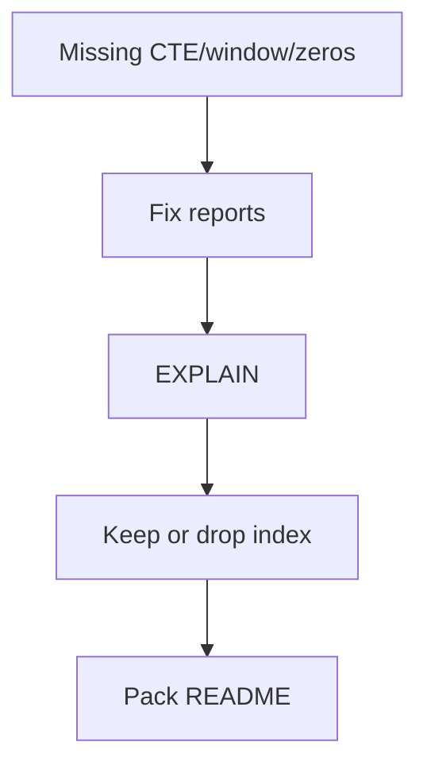

# Month 10 · Week 4 · Day 6
# Finish the Reporting Pack and Justify Indexes

**Program:** Full-Stack Mastery · 18 months  
**Phase:** 3 — Python and backend  
**Month index:** [../../README.md](../../README.md)  
**Week 4:** [1](day-01.md) · [2](day-02.md) · [3](day-03.md) · [4](day-04.md) · [5](day-05.md) · Day 6 (today) · [7](day-07.md)  
**Week rhythm today:** Independent implementation  
**Student state:** Reports exist; indexes are documented. Today the pack is **finished** and every extra index has an EXPLAIN sentence.  
**Study time:** 3–4 focused hours

This textbook will **not** finish Project 6. No API. No SQLAlchemy. No blog. Exam is tomorrow — do not start the exam file early as a cheat.

---

## How to use this textbook

1. Close gaps in Day 4 reports first.  
2. EXPLAIN the ones that matter.  
3. Drop indexes you cannot justify.  
4. Optional review links are for later rechecking.

---

## How to read this chapter

“Finish” means: README complete, 3–5 queries runnable from a cold `psql`, expected notes true, INDEXES.md matches reality, one keyset **or** honest OFFSET-with-warning if you paginate a report. The Month 10 gate asks for reporting queries **you** wrote.



**Wrong belief:** “I’ll add ten indexes the night before the exam.”  
**Correct:** unjustified indexes are a gate fail in spirit. Budget.

**Wrong belief:** “The pack must match a tutorial analytics schema.”  
**Correct:** it must match **your** SCHEMA.md.

---

## Today's contract

By the end of this day you will be able to:

1. Run the full pack from README instructions.  
2. Confirm CTE + window + JOIN + GROUP are present.  
3. Attach EXPLAIN sentences to **at least two** reports.  
4. Finalize INDEXES.md (keep/drop).  
5. Write `PACK-STATUS.md`: what is done, what is explicitly out of scope (FastAPI).

**Today's gate.** Closed-book:

> My reporting pack runs on my schema. Indexes I keep have a reason and, where it matters, a plan. I did not ship SQLAlchemy. I am ready for a closed-book schema design exam tomorrow.

---

## Time box

| Block | Minutes | Work |
|---|---|---|
| A | 20 | Inventory gaps |
| B | 90 | Finish SQL + expected |
| C | 50 | EXPLAIN + index keep/drop |
| D | 20 | PACK-STATUS + git |
| E | 15 | Recall |

---

# Block A — Inventory

Checklist (copy into `PACK-STATUS.md` and tick):

- [ ] 3–5 files  
- [ ] JOIN  
- [ ] GROUP BY  
- [ ] CTE  
- [ ] Window  
- [ ] Zero-child parent visible if claimed  
- [ ] expected notes  
- [ ] INDEXES.md  
- [ ] No passwords  
- [ ] No w4_tickets as the product pack  

---

# Block B — Finish SQL

Fill holes. If window was fake (`OVER ()` without PARTITION), fix it. If LEFT JOIN was INNER, zeros die — fix.

Seed script documented. `psql -f` order in README.

Optional: one keyset example on **your** time-ordered table. If you skip, write “reports are full scans / LIMITed samples, pagination later.”

---

# Block C — Justify indexes

For each **non-PK** index:

1. Which report or FK action uses it  
2. EXPLAIN snippet or honest “small table, planner seq scans anyway — keeping for production size”  
3. Drop if neither

`JUSTIFY.md` table.

Create missing FK indexes if Day 5 postponed and a join report seq-scans a large child table. If the table is tiny, say tiny.

`ANALYZE your_table;` then EXPLAIN again.

---

# Block D — Git

```powershell
cd ~\ops-api
git add sql INDEXES.md PACK-STATUS.md JUSTIFY.md
git commit -m "Month 10 Week 4 Day 6: reporting pack complete, indexes justified."
```

---

# Block E — Recall

1. Two reports by English name.  
2. One index you dropped or refused.  
3. Seq Scan that is honest.  
4. What tomorrow’s exam will close (textbook days).  
5. Why Month 11 still waits.

## Office hours

**Pack is only lab w4_.** Today is **your** schema. If 6B schema is empty, you cannot pass Month 10 gate — finish Week 1 Day 6.

**I started FastAPI+SQLAlchemy.** Stop. Exam is SQL and modeling.

---

## Definition of done

- [ ] PACK-STATUS.md all required ticks  
- [ ] JUSTIFY.md  
- [ ] Reports rerun this session  
- [ ] Commit exists  

---

## Tomorrow

**Month 10 exam + gate.** Synthesis in that file. Closed-book schema design. Link to Month 11 only if the gate is true.

---

## Optional review links

- [PostgreSQL: Using EXPLAIN](https://www.postgresql.org/docs/current/using-explain.html)
- [PostgreSQL: Indexes](https://www.postgresql.org/docs/current/indexes.html)
- Month 10 index: [../../README.md](../../README.md)
