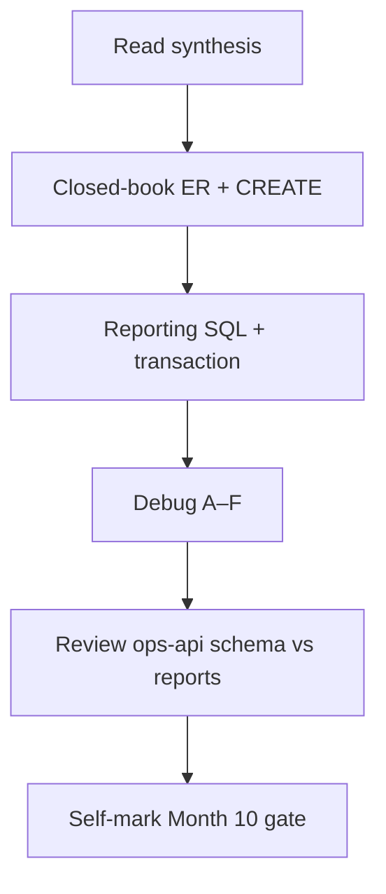
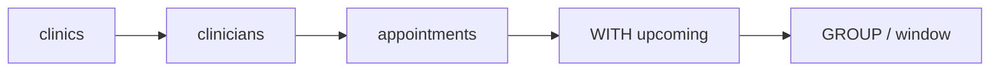

# Month 10 · Week 4 · Day 7
# Month 10 Exam + Gate

**Program:** Full-Stack Mastery · 18 months  
**Phase:** 3 — Python and backend  
**Month index:** [../../README.md](../../README.md)  
**Week 4:** [1](day-01.md) · [2](day-02.md) · [3](day-03.md) · [4](day-04.md) · [5](day-05.md) · [6](day-06.md) · Day 7 (today)  
**Week rhythm today:** Monthly exam  
**Study time:** 3–4 focused hours (Project 6 Stage B continues **after** if the gate is still false)

Textbook files stay **closed** except:

- **this file** (synthesis + exam blocks + self-mark table),
- Stage B **headings** in `full_stack_project_requirements_2026/project_06_production_style_backend_system.md` if you need to remember **what 6B schema/reporting must contain** — not as a source to paste,
- your **own** `~/ops-api` SCHEMA.md / reports only in Block 4 (review), not during Blocks 1–3.

Repair forgotten facts from **this synthesis**, not from Weeks 1–4 day files and not from a SQL tutorial dump.

Work in `~\fullstack-lab\month-10-exam\` for exam evidence. Do **not** implement the exam mini-schema inside `~/ops-api`. Do **not** start Month 11 because the calendar moved. Do **not** paste Project 6 complete source.

---

## How to read this chapter

This file is the **exam and the teacher**. The synthesis is written so a student whose Weeks 1–4 notes are foggy can still re-learn the month from **today’s pages**, then prove it with the blocks and the gate.



During Blocks 1–3, other day files stay closed. If you go blank, re-read **this synthesis**. AI may not write exam-01, the mini-schema, or the debug answers.

---

## Today's contract

By the end of this day you will be able to teach Month 10 aloud from this synthesis, design a schema closed-book, write reporting SQL and a transaction, debug classic failures, and **honestly** mark the Month 10 gate.

**Today's gate** is the Month 10 Gate table below — not “I attended four weeks.” If any required row is false, **do not start Month 11**. Continue Stage B SQL.

---

## Time box

| Block | Minutes | Work |
|---|---|---|
| 0 | 25 | Read the complete explanation; speak it |
| 1 | 40 | Closed-book schema design (`exam-01-er.md` + CREATE) |
| 2 | 50 | Mini reporting + transaction (`mini/`) |
| 3 | 30 | Debug A–F |
| 4 | 20 | Review `~/ops-api` SCHEMA vs reports (if they exist) |
| 5 | 15 | Break one proof; restore |
| 6 | 15 | Design: raw SQL vs ORM (why 10 before 11) |
| 7 | 20 | Retro + self-mark |

---

## Month 10 synthesis (the lesson, in this book)

PostgreSQL is a **process** that stores **relations** on disk and answers **SQL**. FastAPI is a **client**. Month 9 dicts died with Uvicorn. Tables survive.

A **table** has typed columns. A **row** is one entity. **NULL** is unknown, not `0`, not `''`. `WHERE col = NULL` is never true; use `IS NULL`. Three-valued logic: WHERE keeps **true**, not unknown. **ILIKE** `'%x%'` is case-insensitive substring; leading `%` is not a B-tree poster child.

**PRIMARY KEY** is stable identity (prefer `GENERATED … AS IDENTITY`). **UNIQUE** is a business rule (email) and is not automatically the PK. **CHECK** (`title <> ''`) is a predicate; NOT NULL still allows `''`. **FOREIGN KEY** rejects orphans. **ON DELETE RESTRICT** (this course’s default) refuses to delete a parent with children. **CASCADE** wipes children — a product decision, not a convenience. **SET NULL** is optional parents. **1–n:** FK on the many side. **1–1:** unique FK / PK=FK. **n–n:** junction table; relationship attributes live there.

**1NF:** atomic cells, no lists in a cell. **2NF:** no partial dependency on a composite key (`user_email` off the junction). **3NF:** no transitive copy (`owner_email` off `projects`).

**SELECT** names columns. **ORDER BY** makes **LIMIT** meaningful. **INSERT/UPDATE/DELETE** mutate; **UPDATE/DELETE without WHERE** is a wipe; **UPDATE 0** is not HTTP 404 unless you check. **RETURNING** is how you get new ids — not `max(id)`. **ON CONFLICT** is upsert; POST+409 is insert-or-fail.

**INNER JOIN** matches. **LEFT JOIN** keeps the left side; **COUNT(child.id)** after LEFT JOIN yields zeros; **COUNT(*)** counts padded rows. **WHERE** on the right table after LEFT JOIN can drop unmatched parents. **GROUP BY** sets grain; **HAVING** filters groups. **NOT EXISTS** / `LEFT JOIN … IS NULL` for unmatched; `NOT IN` + NULL is a trap. **CTE (`WITH`)** names a step. **ROW_NUMBER() OVER (PARTITION BY … ORDER BY …)** ranks; `rn = 1` is latest-per-parent.

**Transaction:** BEGIN/COMMIT/ROLLBACK. Autocommit in `psql` is per statement. **ACID:** atomicity all-or-nothing; consistency = declared rules; isolation default **Read Committed** (no dirty reads; later statements can see new committed rows); durability = commit survives crash. Errors **abort** the transaction until ROLLBACK. **Lost update:** stale absolute writes; prefer `qty = qty - n`. **SELECT FOR UPDATE** is a concept for read-think-write, not a lock cookbook. Sequences gap after ROLLBACK.

**B-tree indexes** extra structure on writes. PK/UNIQUE already indexed. Child **FK columns** are not auto-indexed. Composite **leftmost prefix**. Low selectivity → Seq Scan is honest. **EXPLAIN** is a plan; **EXPLAIN ANALYZE** runs it; cost is not milliseconds; actual time is. **OFFSET** pagination skips/drifts; **keyset** uses WHERE on the sort key. **N+1** is a loop of SQL; fix with JOIN or `= ANY` / IN, parameterized.

**Connection pool:** reuse sessions; cap vs `max_connections`; do not hold a checkout idle across slow HTTP. SQLAlchemy pool is **Month 11**.

**Security:** `%s` placeholders from the first user-shaped value. No concatenated SQL. No passwords in git.

**Wrong belief:** “The API will remember.”  
**Correct:** constraints are the last honest process.

**Wrong belief:** “The ORM will teach me SQL.”  
**Correct:** the ORM emits SQL. If you cannot read EXPLAIN, you cannot debug Month 11.

The sections below unpack those sentences so the exam is not a vocabulary quiz against a ghost month.

---

# Complete explanation — SQL you must still own

## 1. Modeling (Week 1)

Surrogate PK, UNIQUE natural keys, FK RESTRICT, CHECK blanks, junction for n–n, 1NF–3NF repair of a dump table with comma-separated members and copied owner_email.

## 2. DML and querying (Week 2)

Projection, WHERE/NULL, ILIKE, RETURNING, upsert vs 409, INNER/LEFT, GROUP/HAVING, CTE, window, subquery vs JOIN.

## 3. Transactions (Week 3)

BEGIN bundles. Abort on constraint. Lost update story. Conservation of qty as an invariant the DB will not invent unless you wrap it.

## 4. Plans and access (Week 4)

Indexes as budget. Seq Scan vs Index Scan in sentences. OFFSET vs keyset. N+1. Pool concept.

## 5. Project 6 Stage B

Your ER, CREATE TABLE, reporting pack — not a blog, not Atlas paste.

---

# Block 0 — Speak the synthesis

Out loud, no other files: PK vs UNIQUE vs FK; RESTRICT story; `IS NULL`; LEFT JOIN zeros; BEGIN abort; lost update; Seq Scan honesty; keyset vs OFFSET. Then start Block 1.

---

# Block 1 — Closed-book schema (40 min)

Create `~\fullstack-lab\month-10-exam\exam-01-er.md` and `exam-01-schema.sql`.

**Domain (imposed so you cannot paste 6A/6B):** **clinics**, **clinicians**, **appointments**.

Rules:

- Clinic has unique `code`, non-blank name.  
- Clinician belongs to **one** clinic (1–n), unique email.  
- Appointment: one clinician, `starts_at TIMESTAMPTZ`, `duration_min INTEGER CHECK > 0`, `patient_label TEXT NOT NULL CHECK <> ''`.  
- Same clinician cannot have two appointments with the same `starts_at` (UNIQUE pair).  
- All FKs **ON DELETE RESTRICT**.  
- No `clinic_name` copied onto appointments (3NF).  
- No `patient_ids TEXT` list (1NF).  
- Optional: `clinic_services` n–n if you have time — not required.

The ER **must** include cardinalities and a 3NF sentence. CREATE TABLE must run on `month10` with `exam_` prefixes.

If you cannot fill it without opening Week files, re-read the synthesis. Do not open ops-api SCHEMA.md.

This block is **design + CREATE**. Queries are Block 2.

---

# Block 2 — Mini reporting + transaction (50 min)

Textbook closed except this file’s spec reminders.

```powershell
cd ~\fullstack-lab
mkdir month-10-exam\mini -Force
cd ~\fullstack-lab\month-10-exam\mini
```

Seed: two clinics, three clinicians (at least one clinic with **zero** appointments after seed), four appointments.

**Must:**

1. LEFT JOIN count of appointments **per clinic**, zeros included (`COUNT(a.id)`).  
2. CTE of appointments in the future **or** `starts_at >= now() - interval '1 year'` (lab-friendly) plus a GROUP.  
3. `ROW_NUMBER() OVER (PARTITION BY clinician_id ORDER BY starts_at DESC)` latest appointment per clinician.  
4. One transaction: insert a clinician and a first appointment **together**; a second experiment where appointment CHECK fails (`duration_min = 0`) and the clinician insert **does not remain**.  
5. `EXPLAIN` (ANALYZE optional) on the count query — **four sentences** in `exam-02-explain.md`.

**Must not:** SQLAlchemy, Atlas tickets, `ON DELETE CASCADE` on clinicians, `SELECT *` as the submitted style, concatenated SQL if you use Python.

```powershell
psql -U postgres -d month10 -f ..\exam-01-schema.sql
psql -U postgres -d month10 -f 02-seed-and-reports.sql
```

You split files as you like. Evidence in `mini/`.

---

# Block 3 — Debug (30 min)

Write `exam-03-debug.md`. For each: **what happens**, **root cause**, **fix in one or two sentences**. No need to run broken code.

**A.** `WHERE clinician_id = NULL` to find unassigned (if the column were nullable). Result? Correct predicate?

**B.** LEFT JOIN appointments, `WHERE appointments.duration_min > 10`, clinic with zero appointments vanishes.

**C.** `SELECT clinic_id, patient_label, COUNT(*) FROM exam_appointments GROUP BY clinic_id` — PostgreSQL error. Why?

**D.** Two sessions: both `SELECT` slots = 1 remaining, both `UPDATE SET slots = 0`. Lost update. SQL shape that computes on the server?

**E.** `DELETE FROM exam_clinics` while appointments exist, RESTRICT. What if someone “fixed” it with CASCADE?

**F.** `EXPLAIN` shows Seq Scan on `WHERE email = 'a@b.c'`. Table has 8 rows. Is this a missing index emergency?

**G.** OFFSET 100000 LIMIT 20 on appointments ordered by `starts_at`. Two problems. Keyset sketch.

---

# Block 4 — Review Project 6 Stage B

If `~/ops-api` exists: compare SCHEMA.md + reports to the Month 10 gate (open **only** those). One mismatch: file it in `exam-04-6b.md` or fix **after** the exam mini. If Stage B is only a drawing, write that the month gate is **false** until Day 6 work happens.

Do not start SQLAlchemy “while you’re here.”

---

# Block 5 — Break a proof

In mini: temporarily drop the appointment FK (or comment it), insert `clinician_id = 99999`, observe success, restore FK (rebuild), prove insert fails. Paste the fail into `exam-05-fail.txt`. That is Week 1’s orphan lesson on exam day.

---

# Block 6 — Design

`exam-06-design.md` (10–20 lines): why raw SQL and constraints **before** SQLAlchemy. What sloppy HTTP the ORM would hide. Why 6A repo method names should survive Month 11. Why a pool is not an ORM.

---

# Block 7 — Retro + self-mark

`exam-07-retro.md`: weakest JOIN vs transaction vs EXPLAIN; remaining Stage B work.

---

## Month 10 Gate (self-mark)

True **without a tutorial**. Evidence paths are yours.

| # | Claim | Evidence | Pass? |
|---|---|---|---|
| 1 | Given a feature, **draw** tables, keys, relationships; justify in sentences | exam-01-er.md, ops-api ER | |
| 2 | `CREATE TABLE` with PK, FK, NOT NULL, UNIQUE where it belongs | exam-01-schema.sql, ops-api schema | |
| 3 | `SELECT` with JOIN, WHERE, GROUP BY/HAVING, and at least one **CTE** | mini reports, ops-api reports | |
| 4 | Explain **ACID** and one isolation anomaly as a story | exam-03 D, SYNTHESIS | |
| 5 | **Transaction** for a multi-row change that must not half-apply | mini Block 2 item 4 | |
| 6 | Read **EXPLAIN** and say whether an index is doing work (or Seq Scan is honest) | exam-02-explain.md | |
| 7 | **OFFSET vs keyset** and N+1 as a SQL loop | exam-03 G; notes | |
| 8 | **Reporting queries** on a realistic schema **you** designed — not a copied blog | ops-api reports, not tickets lab | |

If any **required** row is false, **do not start Month 11**. Finish Stage B SQL.

```powershell
cd ~\fullstack-lab
git add month-10-exam
git commit -m "Complete Month 10 exam evidence."
```

---

## If you passed

Month 11 is **SQLAlchemy, Alembic, Redis, backend integration**. Open it only when this gate is true. Your raw SQL and constraints remain the truth the ORM must not violate.

## If you did not pass

Stay on Month 10. The exam synthesis remains the teacher. Project 6 Stage B remains SQL files you own.

---

If the gate table has a false row, the honest action is more schema and reports, not Month 11.

---

## Optional review links

Repair from this synthesis first.

- [PostgreSQL: Constraints](https://www.postgresql.org/docs/current/ddl-constraints.html)
- [PostgreSQL: SELECT](https://www.postgresql.org/docs/current/sql-select.html)
- [PostgreSQL: Transactions](https://www.postgresql.org/docs/current/tutorial-transactions.html)
- [PostgreSQL: Using EXPLAIN](https://www.postgresql.org/docs/current/using-explain.html)
- [PostgreSQL: Indexes](https://www.postgresql.org/docs/current/indexes.html)

---

# Scoring the mini (you, not a grader bot)

| Piece | Honest pass |
|---|---|
| exam-01 ER | Three nouns, RESTRICT, 3NF sentence, no blog |
| Schema | Named FKs, UNIQUE email, UNIQUE (clinician_id, starts_at) |
| Counts | Clinic with zero appointments shows 0 |
| Window | PARTITION BY clinician_id |
| Transaction | Failed duration does not leave a clinician |
| EXPLAIN | Full sentences, not a screenshot only |
| Debug B | LEFT JOIN + WHERE trap named |
| Debug D | Lost update; `col = col - 1` or equivalent |

If the mini used `SELECT *` and no JOIN, Block 2 is a fail even if tables exist. Green `psql` on a blob table does not prove Week 2.

---

## Worked answers you should not need — check after you write debug

**A.** `= NULL` is unknown; 0 rows. `IS NULL`.

**B.** WHERE on the right table rejects NULL padded rows; left join becomes inner. Filter in ON or CTE, then LEFT JOIN clinics.

**C.** `patient_label` is not aggregated and not in GROUP BY.

**D.** Lost update. `UPDATE … SET slots = slots - 1 WHERE slots >= 1` (or equivalent) in one statement; check UPDATE 0.

**E.** RESTRICT refuses. CASCADE deletes appointments with the clinic — a wipe. Prefer RESTRICT.

**F.** Eight rows: Seq Scan is honest. Not an emergency.

**G.** OFFSET cost and row drift. Keyset: `WHERE (starts_at, id) < ($t, $id) ORDER BY starts_at DESC, id DESC LIMIT 20`.

If your written answers disagree, fix them from this box **only after** you attempted A–G alone.



---

## Month 11 is not a reward for finishing the calendar

SQLAlchemy will map classes to tables. It will not teach you RESTRICT vs CASCADE, or why `COUNT(*)` after LEFT JOIN is not a zero. Students who skip Stage B SQL produce `query.all()` loops (N+1) and models that skip FKs. The gate exists to stop that.

Continue `~/ops-api` SQL until every gate row is true. Do not begin Month 11 on a false self-mark.

## Closed-book cards (write answers in exam-07-retro or cards.md)

1. PK vs UNIQUE for email.  
2. Where the FK lives in 1–n.  
3. `CHECK (title <> '')` vs NOT NULL.  
4. `IS NULL` vs `= NULL`.  
5. COUNT(child.id) after LEFT JOIN.  
6. HAVING vs WHERE.  
7. BEGIN after a constraint error — what do you issue?  
8. Lost update in four steps.  
9. Seq Scan vs Index Scan — one honest Seq Scan.  
10. OFFSET vs keyset — one sentence each.  
11. N+1 without saying “ORM.”  
12. Why a connection pool exists.  
13. Placeholders vs f-string SQL.  
14. Why Stage B forbids SQLAlchemy this month.  
15. 3NF: owner_email on projects.

If you miss more than three, re-read the synthesis, then the gate table. Missing these and starting Month 11 is how ORMs hide relational mistakes.

**Mini psql** (after reports run):

```powershell
psql -U postgres -d month10 -c "\d exam_appointments"
```

You want FKs and UNIQUE visible. That is Week 1 in a terminal.

Do not put the mini inside `~/ops-api`. Do not start Month 11 tonight on a false self-mark.

## Definition of done (exam day)

- [ ] exam-01 ER is implementable (three resources, RESTRICT, 3NF)  
- [ ] Mini reports: zeros, CTE, window  
- [ ] Mini transaction abort proved  
- [ ] Debug A–F (and G) written, then checked against the worked box  
- [ ] Self-mark table is honest  
- [ ] Month 11 not started on a false row  

The gate table is the course’s definition of done for the month. Attendance is not.
