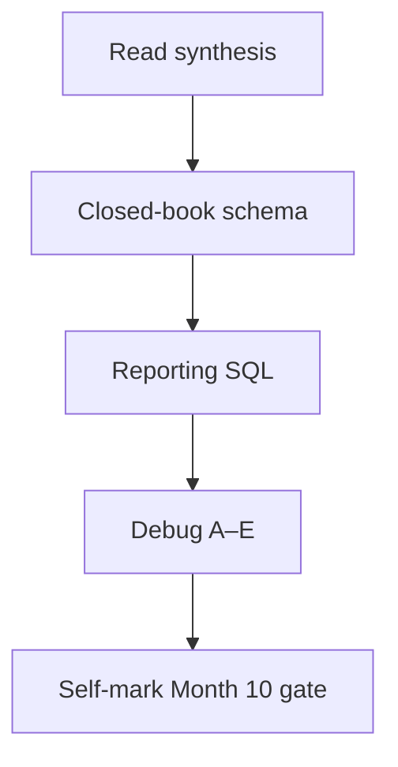

# Month 10 · Week 4 · Day 7
# Month 10 Exam + Gate

**Program:** Full-Stack Mastery · 18 months  
**Phase:** 3 — Python and backend  
**Month index:** [../../README.md](../../README.md)  
**Week 4:** [1](day-01.md) · [2](day-02.md) · [3](day-03.md) · [4](day-04.md) · [5](day-05.md) · [6](day-06.md) · Day 7 (today)  
**Week rhythm today:** Monthly exam  
**Study time:** 3–4 focused hours (schema work continues **after** if the gate is still false)

Textbook files stay **closed** except:

- **this file** (synthesis + exam blocks + self-mark table),
- Stage B **headings** in `full_stack_project_requirements_2026/project_06_production_style_backend_system.md` if you need to remember **what** reporting is for — not as a schema to paste,
- your **own** SCHEMA.md only in Block 4 (review), not during Blocks 1–3.

Repair forgotten facts from **this synthesis**, not from Weeks 1–4 day files and not from a SQL blog.

Work in `~\fullstack-lab\month-10-exam\` for exam evidence. Do **not** implement the exam mini-schema inside `~/ops-api`. Do **not** start Month 11 because the calendar moved.

---

## How to read this chapter

This file is the **exam and the teacher**. The synthesis is written so a student whose weeks are foggy can still re-learn the month from **today’s pages**, then prove it.

During Blocks 1–3, other day files stay closed. AI may not write the exam schema or the debug answers.

---

## Month synthesis (the lesson, in this book)

PostgreSQL stores **relations**: typed columns, rows that survive the FastAPI process. `NULL` is unknown; `''` is a string; `WHERE col = NULL` never matches. Money uses `NUMERIC`, not `FLOAT`. `TIMESTAMPTZ` for moments.

**Primary key** = stable identity (`IDENTITY` + `UNIQUE` on email). **Foreign key** = this id exists there; name it; `ON DELETE RESTRICT` by default in this course. **UNIQUE** ≠ PK. **CHECK** for closed rules. **n-n** needs a junction table. **1NF** no lists in cells; **3NF** no copied `owner_email` on children.

**SELECT** filters with WHERE, sorts with ORDER BY, slices with LIMIT. **JOIN** inner vs left. **GROUP BY** + aggregates; **HAVING** after groups. **CTE** names a subquery. **Window** (`ROW_NUMBER`) keeps detail rows. **INSERT/UPDATE/DELETE** plus **RETURNING**. Writes need WHERE. **ON CONFLICT** needs a unique target.

**Transaction:** BEGIN/COMMIT/ROLLBACK. **ACID.** Default isolation **Read Committed**. **Lost update** = two read-modify-writes. Defense: one `UPDATE SET col = col + n`, or `SELECT FOR UPDATE` in the same txn. After an error, ROLLBACK. Multi-row INSERT is statement-atomic.

**Index:** B-tree, write cost, composite leftmost prefix, do not index everything. **EXPLAIN:** Seq Scan vs Index Scan; ANALYZE **runs** the query; tiny tables seq-scan honestly. **OFFSET** vs **keyset** pagination. **N+1** = 1+N round trips; JOIN or `IN` list. **Pool:** reuse connections; do not connect per row. SQLAlchemy is **Month 11**. Parameterize user values **now**.

**Wrong belief:** “The ORM will design my keys.”  
**Correct:** you designed them this month. The ORM will speak them.

**Wrong belief:** “I’ll learn EXPLAIN when it is slow in production.”  
**Correct:** you learned the words on a laptop so production is not a foreign language.

---

## Today's contract

By the end of this day you will be able to teach Month 10 aloud from this synthesis, design a schema closed-book, write reporting SQL, debug five defects, and **honestly** mark the Month 10 gate.

**Today's gate** is the Month 10 Gate table below — not “I attended four weeks.” If any required row is false, **do not start Month 11**.

---

## Time box

| Block | Minutes | Work |
|---|---|---|
| 1 | 40 | Read synthesis; speak it |
| 2 | 70 | Closed-book mini schema + proofs |
| 3 | 45 | Reporting queries on that mini |
| 4 | 25 | Debug A–E on paper |
| 5 | 20 | Self-mark gate; review own SCHEMA.md |

---

# Block 1 — Speak

`SYNTHESIS.md` in the exam folder: PK/FK, JOIN vs WHERE vs HAVING, ACID in four sentences, OFFSET vs keyset, N+1, parameterized SQL.

---

# Block 2 — Mini schema (not Project 6)

**Work orders** domain:

- `customers (id, email UNIQUE, name)`  
- `work_orders (id, customer_id FK RESTRICT, title CHECK <> '', status CHECK IN ('open','closed'))`  
- `parts` n-n with work_orders via `work_order_parts (work_order_id, part_id, qty CHECK > 0)`  
- `parts (id, sku UNIQUE, name)`

Proofs: orphan work order, duplicate email, blank title, delete customer with orders (RESTRICT). Seed two customers, three orders, two parts, two junction rows.

No solution SQL in this file.

---

# Block 3 — Reports

1. Count of orders per customer including zeros (LEFT JOIN).  
2. CTE: customers with `count >= 1`.  
3. `ROW_NUMBER` parts per order.  
4. Keyset: next 2 work_orders after a given id.  
5. EXPLAIN the count query in two sentences (Seq vs nested loop — whatever you got).

---

# Block 4 — Debug (write answers; do not run exploits)

**A.** `WHERE status = NULL` to find unknown status  
**B.** `SELECT customer_id, title, count(*) FROM work_orders GROUP BY customer_id`  
**C.** Python `f"SELECT * FROM work_orders WHERE title = '{user}'"`  
**D.** OFFSET 100000 on a busy table as the only pagination  
**E.** Two tabs: both read qty=1, both set qty=2, last commit wins on inventory — name the pattern and one defense

---

# Block 5 — Month 10 Gate (self-mark)

| # | Claim | true / false |
|---|---|---|
| 1 | Given a feature, I can draw tables, keys, and relationships and justify them. | |
| 2 | I can write CREATE TABLE with PK, FK, NOT NULL, UNIQUE where it belongs. | |
| 3 | I can write SELECT with JOIN, WHERE, GROUP BY/HAVING, and a CTE. | |
| 4 | I can explain ACID and one isolation anomaly as a story. | |
| 5 | I can wrap a multi-row change in a transaction. | |
| 6 | I can read EXPLAIN enough to say whether an index is doing work (or honestly say Seq Scan is fine on a tiny table). | |
| 7 | I can explain OFFSET vs keyset and N+1 as SQL round trips. | |
| 8 | I delivered reporting queries on a realistic schema I designed (Project 6 and/or this exam mini). | |

All eight **true** without a tutorial open. Else stay in Month 10.

When all eight are true, continue with [Month 11](../../../month-11/README.md).

---

## Definition of done

- [ ] SYNTHESIS.md  
- [ ] Mini schema + proofs  
- [ ] Four reports + EXPLAIN sentences  
- [ ] Debug A–E  
- [ ] Gate table honest  
- [ ] Commit in exam folder  

---

## Optional review links

This exam file is the lesson. These pages are for later checking, not for first learning.

- [PostgreSQL: Data definition](https://www.postgresql.org/docs/current/ddl.html)
- [PostgreSQL: Queries](https://www.postgresql.org/docs/current/queries.html)
