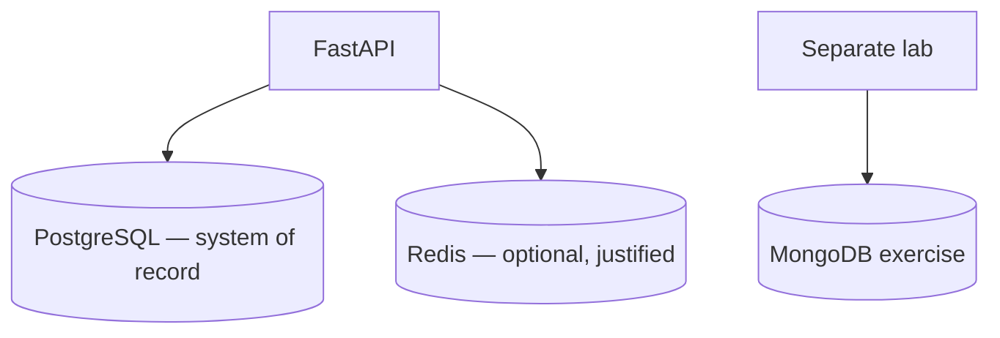

# Month 11 — SQLAlchemy, Alembic, Redis, Backend Integration

**Program:** Full-Stack Mastery Textbook  
**Phase:** 3 — Python and backend engineering  
**Length:** 4 weeks · 7 days each · 3–4 focused hours/day  
**Prereq:** Month 10 gate passed (you can design a schema and justify SQL)  
**This month’s job:** Put **PostgreSQL** behind **SQLAlchemy** and **Alembic**, add **Redis only where it earns its keep**, and upgrade **Project 6B**. MongoDB is a **small separate exercise**, not the product database.

**Project 6 Stage B/C:** `full_stack_project_requirements_2026/project_06_production_style_backend_system.md`. This textbook will **not** give you `~/ops-api/` source.

**This textbook is the lesson.** Sessions, migrations, cache keys, and request IDs are explained in the day files.

---

## How this textbook is organized

```
month-11/
  README.md     ← you are here
  week-01/      SQLAlchemy models, sessions, relationships, query, eager/lazy
  week-02/      Alembic, upgrade/downgrade, evolution, test databases
  week-03/      Redis: cache, TTL, counters, invalidation, ephemeral state
  week-04/      logging, config, health, timeouts, idempotency
                + MongoDB exercise + Project 6B + exam
```

Labs: `~\fullstack-lab\month-11\`.  
Product: **`~/ops-api/`** — their repo.

---

## Three stores, three jobs



**Wrong belief:** “I need Postgres, Redis, and Mongo in the résumé app.”  
**Correct:** Postgres holds the truth. Redis is a **tool for a named problem**. Mongo is a **lab** unless the data model truly wants documents.

---

## Month 11 Gate

True **without a tutorial**:

1. Map tables to SQLAlchemy models; explain **session** and **transaction** boundaries.  
2. Show one **N+1** and the eager load that removes it.  
3. Use **Alembic** for init + a later column/index; upgrade and downgrade in development.  
4. Name **why Redis** exists in *your* 6B (cache, rate limit, or ephemeral state) with key + TTL + invalidation.  
5. Structured logs with a **request id**; no secrets in logs or git.  
6. Health endpoint; config from environment.  
7. Integration tests against a **test database**.  
8. One page: would MongoDB improve the **main** model? “No” is allowed.

If any item is false, do not start Month 12.

---

## Tools

| Tool | Why |
|---|---|
| SQLAlchemy 2.x | Models and SQL you can still print. |
| Alembic | Schema history. |
| Redis | Justified speed / ephemeral state. Windows: WSL, Memurai, or Docker **if you already have it**. |
| pymongo (lab only) | Week 4 exercise. |

Windows: `uv`, PowerShell, `psql` from Month 10.

---

## Start

Open [week-01/day-01.md](week-01/day-01.md).

When Month 11’s gate is true, continue with [Month 12](../month-12/README.md).
