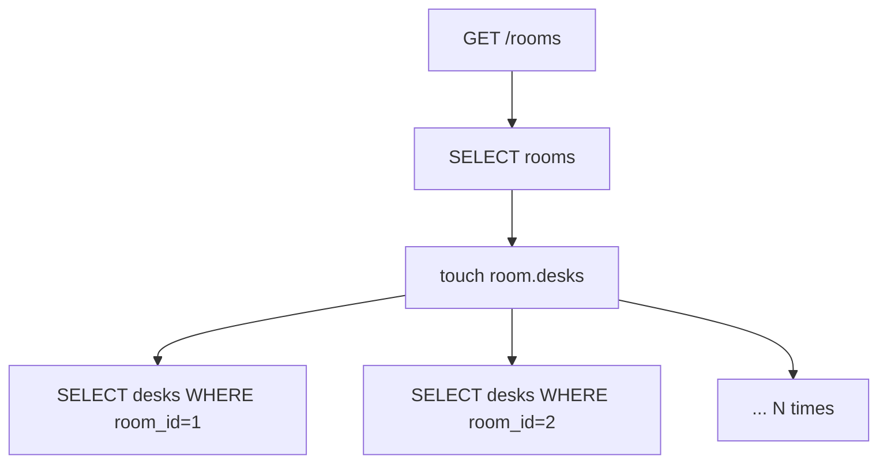

# Month 11 · Week 1 · Day 4
# Lab: list/get with select(), then kill an N+1

**Program:** Full-Stack Mastery · 18 months  
**Phase:** 3 — Python and backend  
**Month index:** [../../README.md](../../README.md)  
**Week 1:** [1](day-01.md) · [2](day-02.md) · [3](day-03.md) · Day 4 (today) · [5](day-05.md) · [6](day-06.md) · [7](day-07.md)  
**Week rhythm today:** Lab  
**Student state:** You can map two tables and `select()` in a script. Today that Session sits behind **FastAPI** list/get, you **watch N+1 in echo**, and you fix it with **`selectinload` / `joinedload`**.  
**Study time:** 3–4 focused hours

Labs: `~\fullstack-lab\month-11\week-01\day-04\`. Do **not** implement this lab inside `~/ops-api/`. **Reading rooms** and **desks** are the noun (Month 9 exam energy, now with Postgres).

---

## How to use this textbook

1. Build the slow path **on purpose**. If you eager-load first, you never see N+1.  
2. Type HTTP tests tomorrow; today `curl.exe` + echo counts are the proof.  
3. Return Pydantic **Out** models. **`model_dump()`** if you need dicts. Never `.dict()`. Never return a live ORM object and pray.

---

## How to read this chapter

**N+1** means: one query to load N parents, then **one query per parent** when you touch a collection (lazy load). Ten rooms → 1 + 10 SELECTs for desks. SQLAlchemy did what you asked. You asked badly.



**Eager load** means: ask for rooms **and** desks in a strategy SQLAlchemy can batch.

- **`selectinload(Room.desks)`**: one SELECT for rooms, one `WHERE room_id IN (...)` for desks. Usually the default fix for collections.  
- **`joinedload(Room.desks)`**: JOIN in the same statement. Can **duplicate parent rows** in the raw result; the ORM uniquifies. Fine for many-to-one (`desk.room`). For collections, `selectinload` is the usual first tool.

**Wrong belief:** “I’ll set `lazy='joined'` on every relationship and never think again.”  
**Correct:** global joined-load makes **every** `select(Room)` a join, including the ones that should not load desks. Put options on the **statement** that needs them.

**Wrong belief:** “N+1 is a Python for-loop problem only.”  
**Correct:** Month 10 already named N+1 in SQL. Today the loop is `for room in rooms: room.desks`. Same disease, ORM symptoms in echo.

---

## Today's contract

By the end of this day you will be able to:

1. Wire FastAPI `Depends` to a Session that **commits/rollbacks/closes**.  
2. Implement **GET list** and **GET one** with `select()`.  
3. Capture **N+1** in echo (count SELECTs).  
4. Remove it with `selectinload` (and try `joinedload` once so you know the difference).  
5. Raise **`HTTPException` 404** when get-one misses.  
6. Keep Out schemas separate from ORM models.

**Today's gate.** Closed-book:

> List/get use `select()`. A Session is per request. N+1 is lazy collection loads. `selectinload` batches the children. I proved it by counting echo lines, not by hoping.

---

## Time box

| Block | Minutes | Work |
|---|---|---|
| A | 40 | Theory: Session in FastAPI + load options |
| B | 80 | Lab part 1: API with lazy N+1 shown |
| C | 55 | Lab part 2: selectinload / joinedload + notes |
| D | 15 | Git |
| E | 15 | Recall |

---

# Block A — Theory

## 1. Session per request

```python
from collections.abc import Generator
from fastapi import Depends, FastAPI, HTTPException
from sqlalchemy import create_engine, select
from sqlalchemy.orm import Session, selectinload

engine = create_engine(url, echo=True)


def get_session() -> Generator[Session, None, None]:
    with Session(engine) as session:
        yield session
        session.commit()
```

This sketch is **incomplete on purpose**. If the path operation **raises**, you must **rollback**, not commit. A pattern that works:

```python
def get_session() -> Generator[Session, None, None]:
    session = Session(engine)
    try:
        yield session
        session.commit()
    except Exception:
        session.rollback()
        raise
    finally:
        session.close()
```

GET-only handlers that never change data still close the Session. Commit on a read-only request is cheap (empty transaction) or you can skip commit if you only queried — **but still close**. Pick one policy; write it in `SESSION.md`. Do not leak.

**Wrong belief:** “I’ll attach `request.state.db` and close it in middleware later.”  
**Correct:** `Depends(get_session)` is the course default. Middleware comes Week 4 for request ids, not as a way to hide Session bugs.

---

## 2. Path operations use select()

```python
@app.get("/rooms/{room_id}")
def get_room(room_id: int, session: Session = Depends(get_session)) -> RoomOut:
    stmt = select(Room).where(Room.id == room_id)
    room = session.scalars(stmt).first()
    if room is None:
        raise HTTPException(status_code=404, detail="room not found")
    return RoomOut.model_validate(room)  # or explicit fields
```

If `RoomOut` is a Pydantic v2 model with `from_attributes=True` (`model_config = ConfigDict(from_attributes=True)`), you can build Out from the ORM instance **while the Session is open**. Then FastAPI encodes JSON. Do not return `room` raw if it has extra columns or a live collection you did not mean to serialize.

**404** is still **your** `HTTPException`. `None` encoded as 200 is the Month 9 bug with a database accent.

List:

```python
stmt = select(Room).order_by(Room.id)
rooms = session.scalars(stmt).all()
```

If the Out includes `desks: list[DeskOut]`, touching `room.desks` during serialization **is** the N+1.

---

## 3. selectinload and joinedload

```python
from sqlalchemy.orm import joinedload, selectinload

stmt = (
    select(Room)
    .options(selectinload(Room.desks))
    .order_by(Room.id)
)
```

Get-one with parent on the child:

```python
stmt = (
    select(Desk)
    .options(joinedload(Desk.room))
    .where(Desk.id == desk_id)
)
desk = session.scalars(stmt).unique().first()
```

`.unique()` is often required after `joinedload` collections because the JOIN duplicates parent rows. For `selectinload`, you typically do not need `.unique()`. If you forget `.unique()` after a joined collection load, SQLAlchemy may raise. Read the error; do not disable echo.

**Wrong belief:** “`joinedload` is faster because it is one query.”  
**Correct:** one big JOIN can be worse than two SELECTs. `selectinload` is two (or few) queries and stays predictable for 1-n. Measure with echo and, later, `EXPLAIN` from Month 10 — not folklore.

---

## 4. What you must not do

- `Query()` / `.filter_by` as the main API.  
- `relationship(..., lazy="joined")` on the class to “fix the lab” for all statements.  
- `create_engine` inside `get_session`.  
- Committing after you already returned a generator error — use try/except/finally.  
- Logging passwords from the URL.

---

# Block B — Lab part 1 (show N+1)

```powershell
cd ~\fullstack-lab
mkdir month-11\week-01\day-04 -Force
cd ~\fullstack-lab\month-11\week-01\day-04
uv init --name lab-rooms
uv add fastapi uvicorn sqlalchemy "psycopg[binary]" pydantic
psql -U postgres -c "CREATE DATABASE month11_w1d4;"
```

**Models:** `Room` (`id`, `name`), `Desk` (`id`, `label`, `room_id` FK). `back_populates`. `create_all` + a seed script: **at least 3 rooms, 2 desks each**.

**Schemas:** `DeskOut`, `RoomOut` (includes `desks: list[DeskOut]` on list **or** on get-one — at least on **GET /rooms** so N+1 is visible). Pydantic v2, `ConfigDict(from_attributes=True)`. No `.dict()`.

**Routes:**

| Method | Path | Success | Notes |
|---|---|---|---|
| GET | `/health` | 200 | `{"status":"ok"}` |
| GET | `/rooms` | 200 | array of rooms **with desks** |
| GET | `/rooms/{room_id}` | 200 / 404 | one room with desks |

First implementation: `select(Room)` **without** options. Serialize Out including desks.

```powershell
uv run uvicorn main:app --reload --host 127.0.0.1 --port 8000
```

Another terminal:

```powershell
curl.exe -s http://127.0.0.1:8000/rooms
```

Count **SELECT** lines in the Uvicorn/echo terminal for that one GET. Write `NPLUS1.txt`: number of rooms, number of SELECTs, why it is N+1 (or 1+N). If you only see one SELECT, you did not include desks in the response, or you accidentally eager-loaded.

POST is not required. Do not build 6B CRUD. Bind **127.0.0.1**.

---

# Block C — Lab part 2 (fix)

1. Change list `select` to `.options(selectinload(Room.desks))`.  
2. `curl.exe` GET `/rooms` again. Count SELECTs. Write `SELECTIN.txt`. You want **two** SELECTs-ish (rooms + desks IN), not 1+N.  
3. Try get-one with `joinedload(Room.desks)` **or** `selectinload`. Note whether you needed `.unique()`. `JOINED.txt`.  
4. `GET /rooms/999` → 404 with `detail`. `curl.exe -D -`.  
5. `SESSION.md`: how `get_session` commits, rollbacks, closes.

If list is still N+1, FastAPI is accessing `room.desks` **before** you applied options, or you have two code paths. Grep for `select(Room)`.

Stretch: GET `/desks/{id}` with `joinedload(Desk.room)` returning room name. Still not ops-api.

```powershell
cd ~\fullstack-lab
git add month-11
git commit -m "Month 11 Day 4: FastAPI select() list/get and N+1 fix."
```

---

# Block E — Recall

1. Why serialize-with-children causes N+1.  
2. `selectinload` vs `joinedload` in one sentence each.  
3. Why `.unique()` appears.  
4. Why 404 is still `HTTPException`.  
5. When the Session must still be open.

## Office hours

**Pydantic error `not fully defined` / relationship loop.** Out models should not nest infinitely (`RoomOut` → `DeskOut` → `RoomOut` → …). `DeskOut` has `room_id` or a small nested `RoomBrief`, not full `RoomOut` on every desk if `RoomOut` already has desks.

**`DetachedInstanceError` during response.** You closed the Session before FastAPI encoded the collection. Commit/close **after** the response is built, or copy to Pydantic first inside the handler and return Out. The `yield` pattern keeps the Session open until the path operation finishes — that is usually enough if you return Out built inside the handler.

**Echo in pytest tomorrow will differ.** Today is curl + a human count. Do not start fakeredis. Do not start Mongo.

**I returned `list[Room]` ORM.** JSON may recurse or leak. Out allowlist.

**`unique()` InvalidRequestError.** You joined a collection. Call `.unique()` on the result.

---

## Lecture: counting queries is a lab skill, not a vibe

“It felt fast on three rows” is not a fix. N+1 on three rooms is 4 queries; on 300 rooms it is 301. Your 6B list endpoints that embed children **must** use an eager strategy or **must not embed** (list rooms without desks; get-one loads desks). Both are valid API designs. Pick one in CONTRACT.md later. Today you **measure**.

Month 10 `EXPLAIN` still matters: `selectinload`’s `IN (...)` wants an index on `desks.room_id`. You probably already have that as a FK index. If you do not, say so in `INDEX.txt`.

HTTP statuses do not change because you used an ORM. GET 200, missing 404, bad id `abc` → 422 from FastAPI. Do not map IntegrityError to 200.

---

## Worked session — rooms, curl.exe, two loaders

`uv init` in day-04. FastAPI + SQLAlchemy + Pydantic. Rooms and desks. Seed 3×2. `get_session` try/commit/rollback/finally close. GET list **lazy** — count SELECTs in `NPLUS1.txt`. Then `selectinload` — `SELECTIN.txt`. 404 on missing id. Out models with `from_attributes`. `model_dump` only if you need a dict. No `Query()`. No `~/ops-api/`.

```powershell
uv run uvicorn main:app --reload --host 127.0.0.1 --port 8000
curl.exe -s http://127.0.0.1:8000/rooms
curl.exe -s -D - http://127.0.0.1:8000/rooms/999 -o NUL
```

Windows: `curl.exe`, not `curl`. Database `month11_w1d4`. Echo on.

---

## Definition of done

- [ ] GET list and GET one work  
- [ ] `NPLUS1.txt` shows the bad count  
- [ ] `SELECTIN.txt` shows the fix  
- [ ] 404 via `HTTPException`  
- [ ] Session closes; engine is process-wide  
- [ ] No ops-api paste  
- [ ] Commit exists  

---

## Optional review links

- [SQLAlchemy relationship loading](https://docs.sqlalchemy.org/en/20/orm/queryguide/relationships.html)  
- [selectinload](https://docs.sqlalchemy.org/en/20/orm/queryguide/relationships.html#select-in-loading)  
- [FastAPI SQL databases](https://fastapi.tiangolo.com/tutorial/sql-databases/) — compare to **this** 2.x style; ignore 1.x `Query` snippets if you find them.

---

## Tomorrow

**Tests** against a **test database** or a **transactional rollback** fixture. Today’s curl counts become assertions — carefully, because echo is not an API.

---

# Closing lecture — prove N+1, then load on purpose

The lab has two halves. Half one is a **bug you can see**. Half two is an **option on the select**. If you only ship half two, Week 1 Day 7 cannot ask you what N+1 looked like.

`select()`. `Depends`. Out models. `HTTPException` 404. `selectinload` for collections. `joinedload` you tried once. `.unique()` when joins duplicate. Session per request, engine once.

Reading rooms are the noun. Project 6B waits for Day 6, written by you against **your** Month 10 tables.

Count SELECTs. Write the files. Then git.
