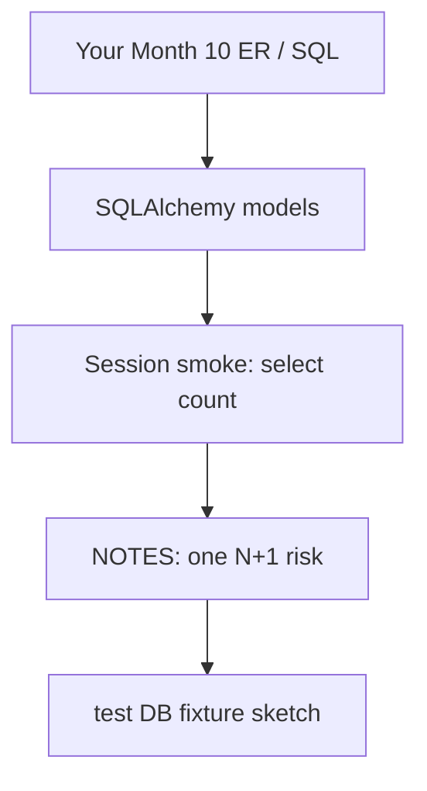
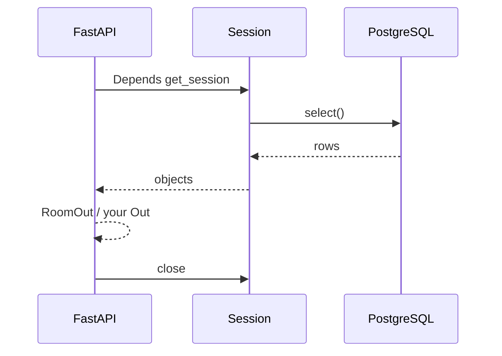

# Month 11 · Week 1 · Day 6
# Independent: Map Your Project 6 Tables to Models

**Program:** Full-Stack Mastery · 18 months  
**Phase:** 3 — Python and backend  
**Month index:** [../../README.md](../../README.md)  
**Week 1:** [1](day-01.md) · [2](day-02.md) · [3](day-03.md) · [4](day-04.md) · [5](day-05.md) · Day 6 (today) · [7](day-07.md)  
**Week rhythm today:** Independent implementation  
**Student state:** You can declare 2.x models, Sessions, FKs, `select()`, and a test database habit. Today you apply that to **your** Project 6 schema — **you** write the mapping.  
**Study time:** 3–4 focused hours

Work in **`~/ops-api/`** (your repo from Months 9–10). Lab notes may go in `~\fullstack-lab\month-11\week-01\day-06\` (checklist, lookups). This textbook will **not** give you the finished ops-api app, models package, or a copy-paste schema.

---

## How to use this textbook

1. Open **your** Month 10 SQL / ER notes first. Empty models that do not match your tables are a fail.  
2. AI may review; it may not ship your domain.  
3. `create_all` is allowed only on a **scratch** database, not as the 6B production story — Week 2 is Alembic. Prefer: models that **describe** tables you already created in Month 10.  
4. Optional review links are for later rechecking.

---

## How to read this chapter

Week 1’s independent day is not “invent a new tutorial schema.” It is **align Python with the database you already justified**.



**Wrong belief:** “I’ll generate models from a public cookiecutter users/projects/tasks and replace my schema.”  
**Correct:** Project 6 is **your** three related resources. The mapping must match **your** `CREATE TABLE` names, FKs, and nullability.

**Wrong belief:** “I’ll paste models from this textbook’s shelves and rename.”  
**Correct:** shelves were a lab noun so you could not paste 6B. Today 6B is the noun, and **you** are the author.

---

## Today's contract

By the end of this day you will be able to:

1. Point at **your** tables (from Month 10) and write one SQLAlchemy 2.x model per primary table.  
2. Declare `ForeignKey` + `back_populates` for the relationships you actually have.  
3. Open a Session against a **dev** database and `select()` at least one resource (count or list ids).  
4. Write `NPLUS1.md` naming one list endpoint that **would** N+1 if you nested children.  
5. Sketch (or start) `TEST_DATABASE_URL` in `.env.example` without real secrets.  
6. Leave FastAPI working: do not smash Month 9 routes until models compile — a branch or a `models/` package that is imported by a smoke script is enough if full swap is too large **today**. Honest `PROGRESS.md` if HTTP still hits RAM — but models must exist.

**Today's gate.** Closed-book:

> My 6B tables are mapped with Mapped/mapped_column, real FKs, and select(). I did not paste a finished ops-api from a tutorial. I know which list would N+1.

---

## Time box

| Block | Minutes | Work |
|---|---|---|
| A | 25 | Inventory your schema + CONTRACT headings |
| B | 40 | Models compile; smoke select() |
| C | 90 | Relationships + one query that joins or loads children |
| D | 30 | N+1 note + test URL + README pointer |
| E | 15 | Recall + PROGRESS.md |

---

# Block A — Inventory (no coding yet)

Open only:

- your `~/ops-api/` schema SQL / ER markdown from Month 10  
- `full_stack_project_requirements_2026/project_06_production_style_backend_system.md` **headings** for Stage B (database, SQLAlchemy, transactions, N+1) — not as a source of tables  
- this file  

Write `~\fullstack-lab\month-11\week-01\day-06\INVENTORY.md`:

1. Table names (yours).  
2. Primary keys.  
3. Foreign keys (child → parent).  
4. Unique constraints you care about.  
5. Which FastAPI resources they back.

If you cannot fill that from **your** repo, stop. Month 10 gate was schema. Repair schema before ORM. Do not invent a second domain.

**Forbidden today:** Mongo collections as 6B storage. Redis. Copying Day 4 `Room`/`Desk` into ops-api as the product.

---

# Complete explanation (keep this open; Days 1–5 closed except this recap)

**2.x mapping:** `DeclarativeBase`, `Mapped`, `mapped_column`, `ForeignKey("table.column")`, `relationship(back_populates=...)`. No `Query()`.

**Session:** one engine from `DATABASE_URL`. `with Session(engine) as session:` / per-request `Depends` when you wire HTTP. begin/commit/rollback/close. Flush is not durable.

**select():** `session.scalars(select(Model).where(...)).first()`. Missing → `None` → HTTP 404 later.

**Eager load:** `selectinload` for collections when the JSON includes children. `joinedload` for many-to-one. Prove with echo before you claim victory.

**Pydantic:** HTTP Out stays Pydantic. ORM is not OpenAPI. `ConfigDict(from_attributes=True)`. Export dicts with **`model_dump()`**.

**create_all vs existing tables:** If Month 10 already created tables, `create_all` may no-op when names match — or **fight** you if types differ. Prefer a smoke script that **only selects**. Do not `drop_all` on a database that has data you care about.

**Tests:** `TEST_DATABASE_URL`, rollback fixture, dependency override. If you only sketch this today, the sketch lives in `TESTS.md`. Day 5 was the lab; 6B must not “wait until Week 4.”

**Windows:** PowerShell, `uv`, `py -3` / `uv run`, `psql`. Connection `127.0.0.1`. Passwords in gitignored `.env`.



---

# Block B — Models must import

In `~/ops-api/` (your layout — `app/models.py` or `src/...`; **you** choose consistently):

- One `Base`.  
- One class per inventoried table you will use this month (at least the three related resources).  
- `__tablename__` **matches** PostgreSQL (watch pluralization).  

Smoke:

```powershell
cd ~\ops-api
uv run py -3 -c "from YOURPACKAGE.models import Base; print(Base.metadata.tables.keys())"
```

Use your real import path. If `uv` is not how 6A was built, keep **your** tool — but SQLAlchemy 2.x still applies.

Then a `scripts/smoke_select.py` (name yours) that opens a Session and prints `len(list(session.scalars(select(YourModel))))`. Read-only. `echo=True` once.

If the table is empty, that is still success: you connected. If `relation does not exist`, names diverged — fix the model or the SQL, do not `create_all` over a mystery.

---

# Block C — Relationships and one real query

Declare FKs and `back_populates` for **your** 1-n (and association tables if you have n-n).

Write one query that would power a list or a report:

- `select(Child).where(Child.parent_id == ...)` or  
- `select(Parent).options(selectinload(Parent.children))`

Save echo in `~\fullstack-lab\month-11\week-01\day-06\ECHO.txt` (SQL only).

If you wire a FastAPI route today, keep CONTRACT.md in charge of statuses. If you **do not** wire HTTP yet, `PROGRESS.md` must say “models + smoke only; RAM still serves HTTP” **or** “Session behind GET list.” Lying on progress is a gate problem.

Multi-row atomic operation (project spec heading **Transaction**) can wait until the Session is on the write path — but name in `PROGRESS.md` which write will need one `begin`.

---

# Block D — N+1 and test URL

`NPLUS1.md` (in ops-api or the lab folder, linked from ops-api README):

- Endpoint or function that nests children.  
- Lazy symptom (1+N).  
- Intended fix (`selectinload` / split endpoints / not embedding).

`.env.example`: `DATABASE_URL` and `TEST_DATABASE_URL` placeholders.

Do not commit `.env`.

README: one paragraph how to run the smoke script. Not a novel.

---

# Block E — Recall

1. Why lab shelves were the wrong tables to copy.  
2. Where `ForeignKey` lives.  
3. Why Out is not the model class.  
4. What smoke `select` proved.  
5. Which list is your N+1 candidate.

## Quality bar (concrete)

Your mapping is too thin if you have one `class Item` and JSONB for the rest. Month 10 forbade “one blob.” Models should show **typed columns** you already declared.

Your mapping is too thick if you copied a generic `User/Role/Permission/OAuth` kit you do not have tables for.

**Forbidden rescue:** do not copy this textbook’s `Room`/`Desk` into 6B as the product domain.

If PostgreSQL names are `"User"` quoted mixed case, your `__tablename__` must match. Month 10 preferred lowercase unquoted names. Fix one side.

**Stretch (only if models + smoke + NPLUS1.md are done):**

- `get_session` Depends on one GET.  
- pytest rollback fixture on `TEST_DATABASE_URL` for one 404 test.  

Do not start Alembic today (tomorrow’s week). Do not add Redis.

---

## Predicted failures

| Symptom | Likely cause |
|---|---|
| `relation "x" does not exist` | tablename vs Month 10 SQL |
| Mapper init error | `back_populates` mismatch |
| Smoke works, HTTP still RAM | not wired; OK if PROGRESS says so |
| `create_all` created parallel tables `users` vs `user` | you did not match names; drop the accident on a **dev** DB only |
| Echo `Query` | you used 1.x API |

```powershell
cd ~\ops-api
# your commit — you write the message; example:
# git add -A
# git commit -m "Map Project 6 tables to SQLAlchemy 2.x models."
```

Lab checklist commit in fullstack-lab is fine too.

---

## Definition of done

- [ ] `INVENTORY.md` matches **your** schema  
- [ ] Models import; `mapped_column` + FKs  
- [ ] Smoke `select()` against PostgreSQL  
- [ ] `NPLUS1.md` names a real risk  
- [ ] `.env.example` has test URL placeholder  
- [ ] No tutorial ops-api paste  
- [ ] `PROGRESS.md` is honest  

---

## Check yourself before you stop

Closed-book: engine vs Session; `select()` vs `Query()`; FK vs relationship; why `create_all` on production is not Week 2; why Pydantic Out still exists.

If HTTP still uses dicts, you are not “done with 6B,” you are done with **Day 6’s** mapping. Week 2–4 continue the upgrade.

Uvicorn still: `uv run uvicorn ... --host 127.0.0.1` when you serve. `curl.exe` for a GET if wired.

---

## Optional review links

Week 1 mechanics are in Days 1–5 of this textbook. Recheck only if the recap is not enough.

- [SQLAlchemy 2.0 declarative](https://docs.sqlalchemy.org/en/20/orm/quickstart.html)  
- Project 6 Stage B headings in `full_stack_project_requirements_2026/project_06_production_style_backend_system.md`

---

## Security reminder

No passwords in models files. No `echo` of connection URLs in committed logs. Smoke scripts should not print row payloads that include secrets (there should be no password hashes in Out — Month 9).

Bind 127.0.0.1. Parameterized `select()` only.

---

## Tomorrow

**Week 1 review** — identity map, expire, N+1 synthesis, mini-build in **fullstack-lab**, not a rewrite of ops-api during the exam block.

---

# Closing lecture — your tables, your classes

Independent day is alignment. The ORM is a **view** of the schema you already argued for in Month 10. If the view is prettier than the schema, you started a second product.

`Mapped`, `mapped_column`, `ForeignKey`, `back_populates`, `select()`, Session close. Pydantic for HTTP. Test URL named even if the fixture is still a sketch.

This file contains **zero** of your table names on purpose. If an AI filled them in, delete that and write yours.

PROGRESS.md tells the truth. Week 2 will not migrate fiction.

---

## Worked session — inventory first, then classes

`INVENTORY.md` in the lab folder: every table, PK, FK, unique, which HTTP resource it backs. Then in `~/ops-api/`, one `Base`, one class per table you will actually use. `__tablename__` copied from SQL, not from a blog’s pluralizer. Smoke script: engine from env, Session, `select` count, echo once, print a number. `ECHO.txt` without passwords. `NPLUS1.md` names a nested list. `.env.example` placeholders for app URL and test URL.

If `metadata.tables.keys()` is empty, you imported `Base` but not the model modules. Import the classes in `models/__init__.py` or in the smoke script.

If you still serve Month 9 dicts, write that sentence. Then pick the first GET list you will switch next week — one resource, not all three in a panic.

**Do not** `drop_all` on a database that has Month 10 seed data you still need. If names collided because `create_all` built `user` beside `users`, drop **only** the accident after `\dt` in `psql` confirms which is which.

**Pydantic vs ORM:** keep Create/Out. Mapping a table does not retire validation. A `Mapped[str]` column will still accept `""` unless you have a `CHECK` or you validate in Pydantic. Both layers can be right together.

---

## Recite-back checklist (close the editor, then tick)

Write `RECITE.txt` in the lab folder.

- [ ] Inventory came from **my** Month 10 SQL  
- [ ] `Mapped` / `mapped_column` / `ForeignKey`  
- [ ] smoke `select()` ran  
- [ ] N+1 risk named for a real list  
- [ ] test URL placeholder exists  
- [ ] no shelves/rooms pasted as the product  
- [ ] no `Query()`  
- [ ] PROGRESS.md is honest about HTTP vs models

If a line is mush, re-read Block A of **this** file only. Do not open a SQLAlchemy tutorial to fetch someone else’s schema.
