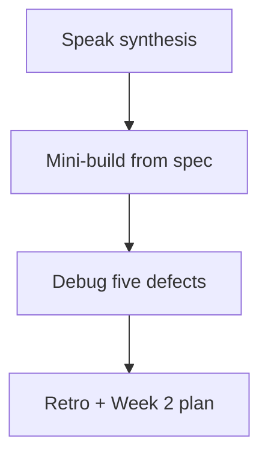

# Month 11 · Week 1 · Day 7
# Week Review — Session Identity Map, Expire, and N+1

**Program:** Full-Stack Mastery · 18 months  
**Phase:** 3 — Python and backend  
**Month index:** [../../README.md](../../README.md)  
**Week 1:** [1](day-01.md) · [2](day-02.md) · [3](day-03.md) · [4](day-04.md) · [5](day-05.md) · [6](day-06.md) · Day 7 (today)  
**Week rhythm today:** Review, repair, plan Week 2  
**Student state:** You mapped tables, opened Sessions, declared FKs, listed with `select()`, saw N+1, and started 6B models. Today those ideas must still live in your head — from **this file**.  
**Study time:** 3–4 focused hours

Do not start Week 2 because the calendar moved. Alembic on models that still use `Query()` is two problems.

Work in `~\fullstack-lab\month-11\week-01\day-07\`. Do not implement the mini-build inside `~/ops-api/`.

---

## How to read this chapter

This is a **closed-book teaching day**. The synthesis **is** the Week 1 lesson.



Days 1–6 closed during mini-build. Repair from **this** recap.

---

## Week synthesis (the lesson, in this book)

**SQLAlchemy 2.x** maps classes to tables with **`DeclarativeBase`**, **`Mapped`**, **`mapped_column`**. **`ForeignKey`** is the constraint on the child column. **`relationship(..., back_populates=...)`** is navigation both ways. Queries are **`select()`** + `session.scalars(...)`. Not `session.query(...)`. Not 1.x `Column=` as your new style.

**Engine** = URL + pool, **one per process**. **Session** = unit of work: identity map, pending INSERT/UPDATE/DELETE, transaction. **`with Session(engine)`** closes. **`begin` / `commit` / `rollback`**. **Flush** emits SQL; **commit** is durable. HTTP: `Depends(get_session)` try/commit/rollback/finally close. Never a global Session.

**Identity map:** inside **one** Session, the same primary key returns the **same Python object** (`is` True). Two Sessions → two objects for one row. That is not a bug.

**Expire:** default `expire_on_commit=True` means after commit, attributes are expired; next access may **SELECT** again. Echo “surprise SELECT” after commit is this. After **close**, instances are detached; collection access may raise `DetachedInstanceError`. Copy to Pydantic Out **while the Session is open**. v2 export is **`model_dump()`**, not `.dict()`.

**N+1:** `select(Parent)` then touch `parent.children` per row → 1+N SELECTs. **`selectinload(Parent.children)`** batches children (`IN (...)`). **`joinedload`** JOINs; collections may need **`.unique()`**. Do not set `lazy='joined'` globally to hide the lab. Count echo lines. FK indexes still matter (Month 10).

**HTTP still true:** GET 200, missing **`HTTPException` 404**, bad path type 422. Out models are allowlists. ORM is not the contract.

**Tests:** `TEST_DATABASE_URL`, rollback fixture (watch `commit()` from the app), `dependency_overrides` + **clear**. Do not pytest against the database you seed for demos.

**6B:** **your** tables, **your** models. This course never pastes `~/ops-api/`. `create_all` is a lab door; **Alembic is Week 2**.

**Wrong belief:** “The Session is a cache I can pass to React.”  
**Correct:** it is a database conversation. JSON is Out.

**Wrong belief:** “I’ll keep the Session open for the process so expire goes away.”  
**Correct:** that leaks connections and mixes transactions across requests.

**Wrong belief:** “N+1 is fixed because I have a foreign key.”  
**Correct:** FKs prevent orphans. They do not eager-load collections.

The sections below unpack that so you can mini-build without Days 1–6.

---

## Today's contract

**Today's gate.** Closed-book:

> I can explain identity map, expire/close, flush vs commit, select() vs Query(), N+1 vs selectinload, and I built a tiny mapped API from this file’s spec with a visible N+1 then a fix.

---

## Time box

| Block | Minutes | Work |
|---|---|---|
| 1 | 40 | Speak the synthesis |
| 2 | 55 | Mini-build `cabinet` + `drawer` |
| 3 | 30 | Debug A–E |
| 4 | 20 | Review Day 6 inventory vs models — one fix |
| 5 | 20 | Re-run pytest if you have it; else curl + echo |
| 6 | 20 | Design: identity map vs HTTP request |
| 7 | 20 | Retro + Week 2 plan |

---

# Complete explanation — Session you must still own

## 1. Mapping

`__tablename__` matches PostgreSQL. `Mapped[str | None]` nullable. `ForeignKey("cabinets.id")` table.column string. `back_populates` names must match attributes.

## 2. Unit of work

Pending objects sit in the Session. `commit` one transaction. Two related inserts that must not half-apply share `session.begin()`. Orphan child → `IntegrityError`. Rollback.

## 3. Identity map

```python
a = session.get(Cabinet, 1)
b = session.get(Cabinet, 1)
assert a is b
```

`session.get` is allowed 2.x (PK load). `select` also hits the map. Another Session: `is` False.

## 4. Expire and close

After commit, `cab.name` may emit SELECT. After close, do not walk `cab.drawers`. Build `CabinetOut` first.

## 5. Loading

Lazy is the default for `relationship`. List endpoints that embed drawers **must** `selectinload` (or not embed). Get-one can load what list refuses to.

## 6. FastAPI

Engine at import. Session per request. TestClient + override. 404 you raise.

---

# Block 1 — Speak

No notes. Cover: Mapped vs mapped_column; FK vs relationship; engine vs Session; identity map; expire; N+1; selectinload vs joinedload; test DB.

Write `exam-01.md` after speaking — same content, 15–25 lines, your words.

---

# Block 2 — Mini-build (Days 1–6 closed)

```powershell
cd ~\fullstack-lab
mkdir month-11\week-01\day-07\mini -Force
cd ~\fullstack-lab\month-11\week-01\day-07\mini
uv init --name lab-cabinets
uv add fastapi uvicorn sqlalchemy "psycopg[binary]" pydantic
uv add --dev pytest httpx
psql -U postgres -c "CREATE DATABASE month11_w1d7;"
```

**Spec: filing cabinets and drawers** — not Project 6B, not rooms from Day 4.

| Method | Path | Rules |
|---|---|---|
| GET | `/health` | 200 `{"status":"ok"}` |
| GET | `/cabinets` | 200 array. Each cabinet includes `drawers` list. **First** commit: **no** eager load. Save SELECT count in `NPLUS1.txt`. **Then** `selectinload`. Save `SELECTIN.txt`. |
| GET | `/cabinets/{cabinet_id}` | 200 or 404; include drawers |
| POST | optional | skip if time; seed script instead |

Seed: 3 cabinets, 2 drawers each. `create_all` allowed. `get_session` commits/rollbacks/closes. Out models `from_attributes`. `select()` only.

Tests (minimum): get missing 404; list 200 after seed (seed in test via Session fixture **or** a documented seed script plus test DB — prefer fixture on `month11_w1d7_test` if you have time). If tests are too heavy, `curl.exe` + the two count files **and** `WHY-NO-PYTEST.txt` — still implement 404.

No Mongo. No Redis. No `Query()`.

```powershell
uv run uvicorn main:app --reload --host 127.0.0.1 --port 8000
curl.exe -s http://127.0.0.1:8000/cabinets
```

---

# Block 3 — Debug

Write `exam-03-debug.md`. For each, **name the SQL/HTTP you should see** and **the fix in one sentence**.

**A.** Two `select`s for cabinet id 1 in **one** Session; developer prints `id()` and is shocked they match.  
**B.** After `commit`, echo shows SELECT when printing `cabinet.name`. Developer “the INSERT failed so it selected.”  
**C.** `GET /cabinets` echo: 1 SELECT + 3 SELECTs for drawers. Developer “Postgres is slow.”  
**D.** TestClient GET works; after tests, demo database lost all rows.  
**E.** `GET /cabinets/abc` — developer says 404 not found.

---

# Block 4 — Review

Open **only** your Day 6 `INVENTORY.md` and model **filenames/headers** (not to paste into mini). One mismatch table vs class: file it in `exam-04-6b.md`. If they match, write `MATCH.txt`.

---

# Block 5 — Prove the loader

Re-run list **without** then **with** `selectinload`. Counts in the two txt files. Break 404 assert if you have pytest; restore.

---

# Block 6 — Design

`design.md`: 10–15 lines. Why identity map must not outlive the HTTP request. What would leak if you stored Sessions in a module dict keyed by user id.

---

# Block 7 — Retro

`retro.md`: weakest of (expire, N+1, FK, tests). Week 2 question about migrations. Do not start Alembic if mini N+1 files are empty.

## Debug keys (after you write A–E)

**A.** Identity map. Same Session, same PK, same instance. Not a ghost cache for the whole app.

**B.** `expire_on_commit`. Refresh SELECT. INSERT already committed.

**C.** N+1 lazy collection. `selectinload`. Not “buy more RAM.”

**D.** Tests used `DATABASE_URL` or committed on the demo DB. `TEST_DATABASE_URL` + rollback.

**E.** Path `int` parse → **422**. 404 is missing **int** id.

If you wrote “SQLAlchemy bug” for any of these, rewrite from the synthesis.

---

```powershell
cd ~\fullstack-lab
git add month-11
git commit -m "Month 11 Week 1 review: cabinets mini-build and Session notes."
```

---

# Lecture: identity map is a correctness feature, not a CDN

The map exists so `cabinet.drawers[0].cabinet is cabinet` and so updates collide in memory instead of silently forking two objects. It is **not** Redis (Week 3). It is **not** HTTP caching. When the request ends, the map dies with the Session — that is what you want.

Expire exists so you do not keep **stale** attribute values after commit (another transaction might have changed the row — Month 10 isolation). Paying a SELECT is honest. Turning off expire globally to make echo pretty will hide stale reads. Do not.

N+1 is the cost of **convenient** `cabinet.drawers` in a loop. Convenience is not free. Options on **that** `select` are the adult version.

---

## Definition of done

- [ ] `exam-01.md` written from memory  
- [ ] Mini-build list/get works  
- [ ] `NPLUS1.txt` and `SELECTIN.txt` exist  
- [ ] Debug A–E answered  
- [ ] Retro exists  
- [ ] I will not start Alembic with `Query()` models  

---

# Worked session — cabinets mini + counts

`uv init` in `day-07/mini`. Models Cabinet/Drawer. Seed 3×2. GET list lazy, count SELECTs, then selectinload. GET one 404. Out models. Session per request. Debug A–E after you write them. `design.md` identity map vs request. `retro.md` Alembic next.

`curl.exe`, `127.0.0.1`, `psql` database `month11_w1d7`. Not ops-api.

If list JSON has no drawers, you never triggered N+1 — nest drawers on purpose for the lab, then you may un-nest in 6B if that is your contract.

---

## Optional review links

Repair from this synthesis first.

- [Session state](https://docs.sqlalchemy.org/en/20/orm/session_state_management.html)  
- [Relationship loading](https://docs.sqlalchemy.org/en/20/orm/queryguide/relationships.html)

---

## Next week

[Week 2 Day 1 — Alembic: what a migration is](../week-02/day-01.md). Schema history you can upgrade and downgrade. `create_all` retires as the 6B path.

---

# Closing lecture — objects, maps, and too many SELECTs

The Session remembers instances by PK. Commit expires them. Close detaches them. None of that is HTTP caching.

N+1 is lazy loads in a loop. `selectinload` is the usual collection fix. `joinedload` is a JOIN with `.unique()` when needed.

`select()` is 2.x. Tests use a different database. 6B models are yours.

Mini is cabinets in fullstack-lab. Identity map is per Session. Expire is not a failed INSERT. `/cabinets/abc` is 422.

Write A–E in full sentences. Retro names Week 2 migrations, not Mongo.

---

## Recite-back checklist (close the editor, then tick)

Write `RECITE.txt` with one honest sentence per line.

- [ ] Identity map is per Session  
- [ ] expire_on_commit can SELECT after commit  
- [ ] close → detached  
- [ ] flush ≠ commit  
- [ ] N+1 = 1+N lazy loads  
- [ ] selectinload batches children  
- [ ] `select()` not `Query()`  
- [ ] test URL ≠ demo URL  
- [ ] mini not inside `~/ops-api/`

If any debug answer says "ORM bug," rewrite it from the synthesis in this file.
Do not start Week 2 until NPLUS1.txt and SELECTIN.txt are real counts.

---

## Isolation and expire — one more picture

```mermaid
sequenceDiagram
  participant R as Request
  participant S as Session
  participant M as Identity map
  participant P as PostgreSQL
  R->>S: open
  S->>P: SELECT cabinet id=1
  P-->>S: row
  S->>M: store instance
  S->>P: SELECT same id
  M-->>S: same instance, maybe no SQL
  S->>P: COMMIT
  Note over S: attributes expire
  S->>P: read name
  P-->>S: refresh SELECT
  R->>S: close
  Note over S: detached; do not walk drawers
```

Write four sentences in `exam-01.md` that match this diagram in your words. If you cannot, re-read the synthesis — not Day 4.

**`session.get` vs `select`.** `get` is PK + identity map. `select` is a statement. Both are 2.x. Mini-build list cannot use `get` for the whole collection. Use `select(Cabinet).options(selectinload(Cabinet.drawers))` after you have shown N+1.

**Tests if you add them:** `month11_w1d7_test`, rollback, override `get_session`, `dependency_overrides.clear()`. If a test commits into `month11_w1d7` and your curl list shrinks, you used one URL. That is debug D in real life.

**6B review is not a rewrite.** Block 4 is a mismatch note. Do not spend the review day migrating 6B. Week 2 is migrations.

Windows: `$env:DATABASE_URL`, `uv run uvicorn main:app --reload --host 127.0.0.1 --port 8000`, `curl.exe -s http://127.0.0.1:8000/cabinets`. `psql -U postgres -d month11_w1d7 -c "\dt"`.

If echo is off, you cannot count N+1. Turn it on for the lab even if it is noisy.

**Wrong belief:** “Week review is optional if Day 4 already used selectinload.”  
**Correct:** Day 4 was guided. Today you **explain** identity map and expire without that file open, then prove N+1 again on a **new** noun.
