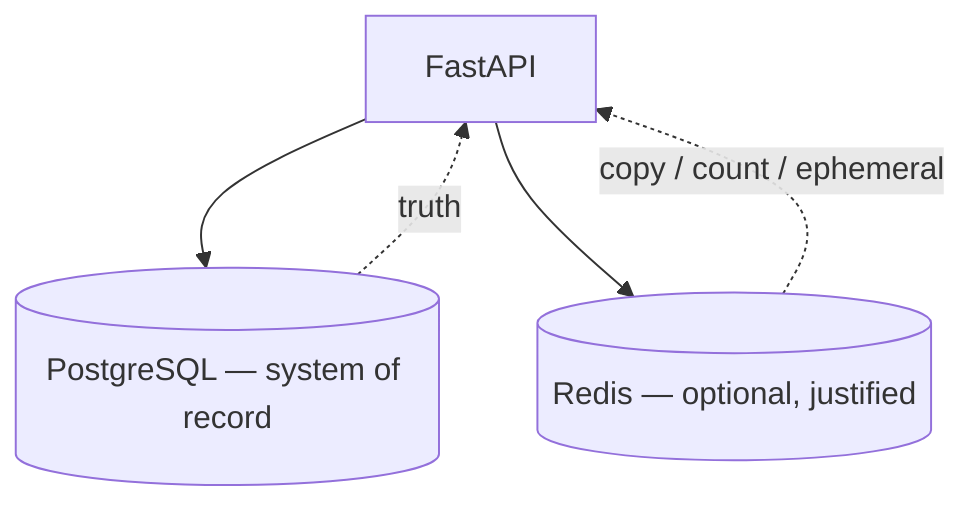

# Month 11 · Week 3 · Day 1
# Redis Data Types — and When You Are Allowed to Use It

**Program:** Full-Stack Mastery · 18 months  
**Phase:** 3 — Python and backend  
**Month index:** [../../README.md](../../README.md)  
**Week 3:** Day 1 (today) · [2](day-02.md) · [3](day-03.md) · [4](day-04.md) · [5](day-05.md) · [6](day-06.md) · [7](day-07.md)  
**Week rhythm today:** Learn + type-along  
**Student state:** Week 2 gate in spirit: you can migrate PostgreSQL. Today you meet **Redis** as a **tool for a named problem**, not as a second system of record.  
**Study time:** 3–4 focused hours

**This week covers:** Redis types, when it is allowed, TTL, cache keys, stampede awareness, invalidation, counters / rate-limit **concepts** (defense), tests with fakeredis, a justified 6B paragraph.

Today: **data types**, **GET/SET**, and the rule **PostgreSQL remains the system of record**. TTL and invalidation deepen tomorrow. Project 6B is **not** a paste. Mongo is **not** this week.

Labs: `~\fullstack-lab\month-11\week-03\day-01\`.

---

## How to use this textbook

1. Read a section. Close it. Say **why** Redis is allowed or forbidden for that job.  
2. Type commands. If Redis is **not** running on this machine, use the **no-Redis path** below — you still write the explanations.  
3. Optional review links are for later rechecking.

---

## How to read this chapter

Redis is an in-memory data structure server. You talk to it with commands: `SET`, `GET`, `INCR`, `EXPIRE`, `DEL`, `HSET`, `RPUSH`. It is fast because it is **memory** and a simple protocol. It is **not** durable in the way PostgreSQL is (you may enable AOF/RDB later; this course still does not treat Redis as the record of issues, inventory, or users).



**Wrong belief:** “I need Postgres, Redis, and Mongo in the résumé app.”  
**Correct:** Postgres holds the truth. Redis is a **tool for a named problem**. Mongo is a Week 4 **lab**.

**Wrong belief:** “If I SET the user JSON in Redis, I can stop using SQLAlchemy.”  
**Correct:** then a crash, a flush, or a TTL will **invent** a new product: data that vanishes. 6B forbids that as the primary store.

---

## Today's contract

By the end of this day you will be able to:

1. Name **when Redis is allowed**: cache, counter, ephemeral state — each with a sentence.  
2. Name **when it is forbidden**: source of truth for business rows.  
3. List core **types**: string, hash, list, set, sorted set (you will **use** string + INCR most).  
4. Run **one** GET/SET round-trip **or** complete the no-Redis path with fakeredis / skip-run notes.  
5. Write `WHY-NOT-SOR.md`: why PostgreSQL stays the system of record.  
6. Avoid Docker-as-the-course: only use Docker if **already** installed; otherwise WSL `redis-server`, **Memurai**, or the no-Redis path.

**Today's gate.** Closed-book:

> Redis is optional. I may cache, count, or store ephemeral keys. PostgreSQL remains the record. I can SET/GET a string (or explain the same with fakeredis). I did not put 6B rows only in Redis.

---

## Time box

| Block | Minutes | Work |
|---|---|---|
| A | 50 | Theory |
| B | 70 | Install/connect **or** no-Redis path + SET/GET |
| C | 50 | Independent: types table + forbidden uses |
| D | 15 | Git |
| E | 15 | Recall |

---

# Block A — Theory

## 1. System of record

A **system of record** is where a fact **must** survive process restarts, cache flushes, and “I deleted the Redis key.” For 6B, that is **PostgreSQL** (Month 10–11). SQLAlchemy and Alembic already speak to it.

Redis is allowed when the worst case of **losing the key** is acceptable:

| Use | Worst case if Redis is empty | Allowed? |
|---|---|---|
| Cache of GET `/items` JSON | Extra Postgres load; **same** answers after refill | Yes, if you invalidate |
| Rate-limit counter | Limits reset; users are **less** restricted until Redis returns | Yes, as **defense** (you accept fail-open or fail-closed — say which) |
| Job/ephemeral “wizard step 2” | User starts over | Maybe |
| `SET user:1` as the only copy of the user | **User gone** | **No** |
| Session login as the **only** auth record with no DB | Lockout / free-for-all on flush | Not this month’s 6B core |

**Wrong belief:** “Fail-open rate limits are always fine.”  
**Correct:** fail-open means a Redis outage **removes** the limit (availability over protection). Fail-closed means outage **rejects** (protection over availability). Name your choice. Do not build an **attack tool**; this is **reliability/defense** for **your** API.

---

## 2. Data types (the ones you will actually mention)

| Type | Mental model | Example commands | 6B-shaped use |
|---|---|---|---|
| **String** | One value per key (including numbers as strings) | `SET`, `GET`, `INCR`, `EXPIRE` | Cache blob; counter |
| **Hash** | Field map | `HSET`, `HGET` | Small object cache (still not SoR) |
| **List** | Ordered list | `LPUSH`, `LRANGE` | Recent ids (ephemeral) |
| **Set** | Unique members | `SADD`, `SISMEMBER` | Flags, uniqueness that may vanish |
| **Sorted set** | Members with score | `ZADD`, `ZRANGE` | Leaderboards, time scores |

Streams, Geo, Bloom: know they exist; do not collect them today.

Keys are **strings**. You design **key names** tomorrow. Today: `lab:hello` is better than `hello` (prefix your lab).

---

## 3. A first string

```text
SET lab:hello "ok"
GET lab:hello
DEL lab:hello
```

In Python (`redis` package):

```python
import redis

r = redis.Redis(host="127.0.0.1", port=6379, decode_responses=True)
r.set("lab:hello", "ok")
print(r.get("lab:hello"))
```

`decode_responses=True` gives `str` instead of `bytes`. Fine for this course.

**Wrong belief:** “Redis JSON module is required to cache a list.”  
**Correct:** you may `SET` a JSON **string** you serialized with `json.dumps`. Invalidate as a whole key. Nested JSON in Redis does not make it PostgreSQL.

---

## 4. Windows: where Redis actually runs

This is **not** Month 15 Docker. Choose **one**:

1. **WSL:** `wsl` then `redis-server` if you installed Redis in the distro. Connect from Windows Python to `127.0.0.1:6379` **if** WSL publishes the port (often it does on modern Windows).  
2. **Memurai** (Redis-compatible on Windows) if you already use it.  
3. **Docker** `redis` image **only if Docker is already installed** and you already know `docker run`. This course will not teach Docker here.  
4. **No Redis process:** **fakeredis** in Python (in-memory implementation for tests and labs) **or** skip-run notes: you write the commands and the explanations; you mark `SKIPPED-REDIS.txt` with why, and you still complete Block C.

If you skip the process, **fakeredis** is preferred over doing nothing:

```powershell
uv add redis fakeredis
```

```python
import fakeredis

r = fakeredis.FakeRedis(decode_responses=True)
r.set("lab:hello", "ok")
assert r.get("lab:hello") == "ok"
```

Fakeredis is **not** a production server. It is a **lab double**. You must still **explain** real Redis types and the SoR rule. Day 5 will use fakeredis in pytest on purpose.

---

## 5. Security start

- Bind Redis to **localhost** in development. Do not expose 6379 to the LAN “to test.”  
- No passwords in git. If you set a Redis password later, it is a secret.  
- Do not cache **tokens or passwords** in keys you print.  
- Cache keys should not embed secrets (API keys in the key name).  
- Rate-limit concepts protect **your** service. This textbook will not teach you to **defeat** someone else’s limits.

---

# Block B — Type-along

```powershell
cd ~\fullstack-lab
mkdir month-11\week-03\day-01 -Force
cd ~\fullstack-lab\month-11\week-03\day-01
uv init --name lab-redis-types
uv add redis fakeredis
```

### Path A — real Redis

Confirm something listens on 6379 (Memurai, WSL, Docker-if-already). Then `hello.py` with `redis.Redis(...)`. `SET`/`GET`. Write `PING.txt` with `r.ping()`.

### Path B — fakeredis

`hello.py` uses `FakeRedis`. Same SET/GET. Write `FAKEREDIS.txt`: one paragraph — what is real, what is fake, why 6B production would still need a process if you choose Redis.

### Path C — skip-run

If even fakeredis is blocked, write `SKIPPED-REDIS.txt` (why) **and** `COMMANDS.txt` with the Redis commands you **would** run, plus answers to Block C. You cannot skip Block C.

Everyone writes `WHY-NOT-SOR.md` (15–20 lines): cache miss behavior; crash behavior; Alembic does not migrate Redis.

---

# Block C — Independent

`TYPES.md` table: five types, one sentence each, one **allowed** 6B-shaped example, one **forbidden** example.

`FORBIDDEN.md`: three product ideas that must **not** live only in Redis (pick from: unpaid invoice, inventory on-hand, user email, foreign key relationship).

Do not start FastAPI cache middleware yet (Day 3). Do not install Mongo.

```powershell
cd ~\fullstack-lab
git add month-11
git commit -m "Month 11 Week 3 Day 1: Redis types and system-of-record rule."
```

---

# Block E — Recall

1. System of record vs cache.  
2. String vs hash in one sentence.  
3. Why TTL-less SET of business rows is a trap (TTL is tomorrow; still say “key lives forever until DEL or flush”).  
4. fakeredis vs Redis process.  
5. Docker rule this month.

## Office hours

**`Connection refused`.** No process on 6379. Use WSL/Memurai/existing Docker **or** fakeredis. Do not spend the day installing Docker from zero.

**`redis-cli` not found on Windows.** Use Python `r.execute_command("PING")` or Memurai CLI if you have it. `redis-cli` in WSL is fine.

**I SET JSON and felt done with SQLAlchemy.** Undo the architecture. Write FORBIDDEN.md first.

**fakeredis behaves differently than Redis.** Possible for edge commands. Stick to SET/GET/INCR/EXPIRE/DEL.

---

## Lecture: speed is not a data model

Redis wins microbenchmarks. PostgreSQL wins “who owns this row after a reboot.” 6B is a **backend**, not a cache demo. If your only Redis use is “I SET the whole database as one key,” you failed the month gate even if it is fast.

Week 1 identity map is **per Session**. Redis is **cross-process**. Do not confuse them. The identity map dies at `close()`. Redis keys die at TTL, DEL, or flush — unless you never set TTL (then they die at flush or memory policy). Tomorrow TTL is required thinking for caches.

INCR is a **counter**. It is not an accounting ledger. Money stays in PostgreSQL `NUMERIC`.

---

## Worked session — ping, set, explain

`uv init` day-01. Add redis + fakeredis. Path A or B (or C with COMMANDS.txt). `lab:hello`. `WHY-NOT-SOR.md`. `TYPES.md`. `FORBIDDEN.md`. No ops-api. No Alembic today. No Mongo.

Windows PowerShell: `uv run py -3 hello.py`. If you use WSL Redis, still run **Python on Windows** against `127.0.0.1` if that is how you connect — write the host in `CONNECT.txt`.

---

## Definition of done

- [ ] I can name three allowed jobs and the SoR rule  
- [ ] SET/GET proven **or** skip-run + fakeredis notes complete  
- [ ] `WHY-NOT-SOR.md` exists  
- [ ] `TYPES.md` and `FORBIDDEN.md` exist  
- [ ] No 6B rows stored only in Redis  
- [ ] Commit exists  

---

## Optional review links

Redis types and the SoR rule are explained in this chapter.

- [Redis data types](https://redis.io/docs/data-types/)  
- [redis-py](https://redis-py.readthedocs.io/)  
- [fakeredis](https://fakeredis.readthedocs.io/)

---

## Tomorrow

**TTL**, **cache key design**, **stampede awareness**, **invalidation on write**. Postgres still wins on truth.

---

# Closing lecture — a tool with a name

You are allowed to use Redis when you can **name the problem**: cache, counter, ephemeral. You are not allowed to use it as a cooler PostgreSQL.

Strings will carry most of this week. INCR will carry Day 4’s defense concept. Hashes and lists are vocabulary.

fakeredis keeps Windows labs honest when 6379 is empty. A skip-run still writes COMMANDS.txt. Docker is optional **if already present**. Month 15 is the Docker course.

PostgreSQL + Alembic + SQLAlchemy remain the spine of 6B. Redis is a rib, or it is absent with a paragraph saying why.

---

## Recite-back checklist

Write `RECITE.txt` with one honest sentence per line.

- [ ] Postgres is the system of record  
- [ ] Redis is allowed for cache, counter, or ephemeral state  
- [ ] Losing Redis must not lose users/projects/tasks (or **your** nouns)  
- [ ] SET/GET is a string; INCR is still a string-shaped number  
- [ ] fakeredis is a lab double, not production  
- [ ] skip-run still writes COMMANDS.txt and WHY-NOT-SOR.md  
- [ ] Docker is not this month’s course  
- [ ] I did not store 6B rows only in Redis  

---

## More office hours

**Python connects, `redis-cli` does not exist.** That is fine. The lab is the client you have. Write PING via `r.ping()`.

**WSL Redis, Windows Python, connection refused.** WSL2 sometimes binds Redis on a different interface. In WSL `redis-server` and `ss -lntp | grep 6379`. If Windows cannot see it, stay on fakeredis and write the network fact in `CONNECT.txt`. Do not spend three hours on hypervisor networking; the SoR essay is the point.

**`decode_responses=False` and I got `b'ok'`.** Bytes. Set `decode_responses=True` or `.decode()`. Pick one.

**I INCR a key that held JSON.** Redis will error or corrupt the value. Types are per key. Do not reuse `lab:hello` as a counter.

**Memurai vs Redis.** Commands this week use are the common subset. If a command is missing, write it and use fakeredis for the lab.

---

## Lecture: eviction is not a schema

If Redis runs out of memory, it **evicts** keys according to a policy (`allkeys-lru` and friends). That is another way a cache disappears. It is **not** Alembic. It is **not** `ON DELETE CASCADE`. If you stored the only copy of an invoice in Redis, eviction is deletion. That sentence belongs in `WHY-NOT-SOR.md`.

Persistence options (RDB snapshots, AOF) make Redis **more** durable and still **not** your 6B SoR. You would take backups, run migrations-that-are-not-Alembic, and give up constraints. Postgres already does that job.

**Key naming today, TTL tomorrow.** A key without a prefix (`hello`) will collide with a tutorial and with your next lab. `lab:hello` is a namespace. 6B will use `ops:` or your product prefix — you choose in ARCHITECTURE.md on Day 6.

**INCR preview (do not build the 429 lab yet):** `INCR lab:count` returns 1, then 2. The value is a string Redis treats as an integer. Day 4 adds EXPIRE and a limit. Today, if you try INCR once, write the return value in `INCR.txt`. Optional.

**Hash preview:** `HSET lab:item name "hook" qty 3` then `HGET lab:item name`. Still not SoR. A hash is convenient for a **cached** object with fields. Invalidation still deletes the whole key unless you HDEL a field on purpose.

---

## Worked extras — prove the rule, not the résumé

Open `WHY-NOT-SOR.md` and add a table:

| Event | Postgres | Redis cache of a list |
|---|---|---|
| Uvicorn reload | rows remain | fakeredis **empty**; real Redis **keeps** keys |
| `FLUSHALL` | rows remain | keys gone |
| `alembic upgrade` | schema may change | Redis unaware |
| laptop sleep | DB still there | Redis may have gone away |

Fill the table with what you **observed** or **predict**. Predictions must say they are predictions.

If Path C skip-run: you still fill the table as predictions. That is allowed. Empty WHY-NOT-SOR.md is not.

Bind Redis to localhost. Do not `CONFIG SET` anything you do not understand. Do not expose 6379.

Windows PowerShell: `uv run py -3 hello.py`. Commit TYPES.md and FORBIDDEN.md. Do not commit a Redis password.

---

## Predicted commands (fill before you run)

| Command | You expect |
|---|---|
| `PING` | `True` / `PONG` |
| `SET lab:hello ok` | `True` |
| `GET lab:hello` | `ok` |
| `DEL lab:hello` | 1 then GET None |
| `INCR lab:count` (optional) | 1 |

If fakeredis: same table. If skip-run: this table **is** the lab, plus WHY-NOT-SOR.md.

**Wrong belief:** “I’ll use Mongo this week because Redis felt optional.”  
**Correct:** Mongo is Week 4 Day 5, separate, not 6B. Optional is not “pick a different extra database.”

The month gate will ask you to **name** Redis. Naming starts with TYPES.md and FORBIDDEN.md, not with a cluster.

**One more wrong belief:** “I’ll run Redis in Docker Compose because that is how tutorials look.”  
**Correct:** Compose is Month 15. Today: process you already have, Memurai, WSL, fakeredis, or skip-run notes. A résumé line that you cannot PING is a lie.

Day 2 is TTL and invalidation. Do not skip it because SET felt complete. A key without EX is how “cache” becomes an accidental SoR.

Leave `echo` of SQLAlchemy on in Week 1 labs, not in Redis MONITOR against a shared server. You do not need MONITOR today.
