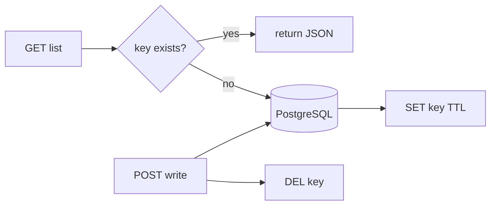

# Month 11 · Week 3 · Day 2
# TTL, Cache Keys, Stampede Awareness, Invalidation on Write

**Program:** Full-Stack Mastery · 18 months  
**Phase:** 3 — Python and backend  
**Month index:** [../../README.md](../../README.md)  
**Week 3:** [1](day-01.md) · Day 2 (today) · [3](day-03.md) · [4](day-04.md) · [5](day-05.md) · [6](day-06.md) · [7](day-07.md)  
**Week rhythm today:** Exercises  
**Student state:** Day 1 gate passed. You know types and the system-of-record rule. Today a cache is **keys + TTL + invalidation**, not “SET forever.”  
**Study time:** 3–4 focused hours

Labs: `~\fullstack-lab\month-11\week-03\day-02\`. Noun: **menu specials** (a list you might cache). Not 6B.

---

## How to use this textbook

1. Do the exercises in order. A cache without invalidation is a **stale product**.  
2. Real Redis **or** fakeredis **or** skip-run with written commands — same as Day 1. You still **explain** stampede.  
3. Optional review links are for later rechecking.

---

## How to read this chapter

A **cache** is a copy. **TTL** (time to live) is when the copy **expires**. A **cache key** names the copy. **Invalidation** deletes or updates the copy when the **record** changes (a POST/PATCH/DELETE that hit PostgreSQL). A **stampede** (cache stampede / dogpile) is many requests missing at once and all hitting Postgres together.



**Wrong belief:** “TTL 24h means I do not need invalidation.”  
**Correct:** then writes are **wrong for up to 24h**. Use **short TTL plus delete on write**, or a version in the key.

**Wrong belief:** “I’ll cache every GET with the raw URL including cookies.”  
**Correct:** keys must be **explicit** (`menu:specials:v1` or `menu:specials:{date}`). Cookies in keys leak sessions into the cache.

---

## Today's contract

By the end of this day you will be able to:

1. `SET key value EX seconds` (or `setex` / `set(..., ex=)`).  
2. Design a **key namespace** (`app:resource:params`).  
3. **DEL** the key after a simulated write.  
4. Explain stampede in six sentences and one mitigation you might use later (lock, slightly random TTL, singleflight). You need **not** implement a production locker today.  
5. Write what happens if invalidation **misses** a key spelling.

**Today's gate.** Closed-book:

> A cache key is a name I own. TTL bounds staleness. Writes must invalidate (or version) the keys they affect. Stampede is N misses at once. Postgres is still truth.

---

## Time box

| Block | Minutes | Work |
|---|---|---|
| A | 30 | Recap |
| B | 75 | Exercises 1–5 |
| C | 50 | Stampede writeup + mismatch keys |
| D | 15 | Git |
| E | 15 | Recall |

---

# Complete explanation

## 1. TTL

```python
r.set("menu:specials", payload, ex=30)
# or SET menu:specials payload EX 30
```

After 30 seconds, GET returns `None`. The next GET rebuilds from Postgres (Day 3).

**TTL 0 / missing EX:** key lives until DEL or eviction. For a cache, that is usually a **bug**. Counters with TTL (Day 4) are a different pattern.

`TTL key` command returns remaining seconds (`-1` no expire, `-2` missing — remember which your client uses).

## 2. Key design

| Piece | Example |
|---|---|
| Prefix | `lab:` or `ops:` |
| Resource | `specials` |
| Version | `v1` when JSON shape changes |
| Params | `limit=20` if the list is parameterized |

`ops:specials:v1` is enough for an unfiltered list. If you cache `?q=soup`, the key **must** include `q` or you serve soup to everyone.

**Wrong belief:** “I’ll hash the whole request including auth headers.”  
**Correct:** then you cache per user accidentally or leak. List caches are usually **public-shaped** data. User-private data needs keys that include **user id** and a policy. Do not cache another user’s private GET under a shared key.

Never put passwords in keys or values you print.

## 3. Invalidation on write

After PostgreSQL **commit** of a write that changes the list:

```python
r.delete("menu:specials:v1")
```

Order: **commit first**, then DEL. If you DEL then commit fails, you only caused extra misses (acceptable). If you commit then forget DEL, you serve **stale** until TTL. That is the bug.

If many keys (`specials:q=soup`, `specials:q=salad`), either:

- delete a **known set**,  
- use a **version number** (`menu:specials:ver` INCR, keys include ver),  
- or keep TTL short and accept a window.

Do not `FLUSHALL` to invalidate. That is a crime against every other key.

## 4. Stampede awareness

Story: key expires at T=30s. 200 requests arrive at T=30.1s. All miss. All query Postgres. Postgres CPU spikes. Keys get SET 200 times.

Mitigations (know the names; implement **none** or a **toy** lock if early):

- **Singleflight:** one request rebuilds; others wait (in-process only helps one Uvicorn worker).  
- **Lock in Redis:** `SET lock:... NX EX 5` then rebuild.  
- **Soft TTL / random jitter:** expire 30–45s so not all keys align.  
- **Never expire; only invalidate on write** — stampede at expiry goes away; stampede at **flush** remains.

Write `STAMPEDE.md`. You are not required to implement a lock today. You **are** required not to pretend TTL-only is complete.

## 5. No-Redis path

fakeredis supports SET with `ex=`, GET, DELETE, TTL. Use it. Skip-run: write Redis CLI equivalents in `COMMANDS.txt` and still write STAMPEDE.md and KEYS.md.

---

# Block B — Exercises

```powershell
cd ~\fullstack-lab
mkdir month-11\week-03\day-02 -Force
cd ~\fullstack-lab\month-11\week-03\day-02
uv init --name lab-cache-keys
uv add redis fakeredis
```

Use `FakeRedis` unless 6379 is up.

### Exercise 1 — SET with TTL

Set `menu:specials:v1` to a JSON string of two specials. `ex=10`. GET. Sleep 11 seconds (or set `ex=2` if you hate waiting). GET empty. Write `TTL.txt`.

### Exercise 2 — Key catalog

`KEYS.md`: five keys you **would** use for a filtered list, a get-one, a count, a lock, a version. No `KEYS *` in production as a strategy — it is O(N) and a trap. The file is a **design** catalog, not a command to run `KEYS *` on a shared server.

### Exercise 3 — Invalidate

SET the list key. Simulate POST: change the JSON in a Python dict (stand-in for Postgres). DEL the key. GET miss. SET new. Write `INVALIDATE.txt` with the **commit then DEL** order.

### Exercise 4 — Wrong key

Invalidate `menu:specials` but cache `menu:specials:v1`. Prove GET still hits. `MISMATCH.txt`. This is the classic bug.

### Exercise 5 — Private vs public

Write why `menu:specials:v1` must not hold another user’s **private** notes. Five lines. `PRIVACY.txt`.

---

# Block C

`STAMPEDE.md` (15–25 lines): story, why TTL alignment hurts, one mitigation, why one Uvicorn `--reload` process is not a fleet.

`POLICY.md`: for a 6B-shaped list, pick TTL **and** invalidation (not TTL-only) in one paragraph. You are not implementing 6B today.

Do not FLUSHALL. Do not cache passwords.

```powershell
cd ~\fullstack-lab
git add month-11
git commit -m "Month 11 Week 3 Day 2: cache keys, TTL, invalidation notes."
```

---

# Block E — Recall

1. Why TTL-only is stale-on-write.  
2. commit then DEL.  
3. Key mismatch bug.  
4. Stampede in one sentence.  
5. Why `KEYS *` is not invalidation.

## Office hours

**fakeredis TTL feels instant.** Use `ex=2` and `time.sleep(3)`. Do not mock sleep.

**I used `KEYS menu:*` to delete.** Lab only, small. Write why production uses explicit names or SCAN with a prefix you own — still not a substitute for known keys.

**Negative cache:** caching “404 empty” to avoid repeats. Allowed if you TTL it **short** and invalidate on create. Mention in POLICY.md if you want; do not require it.

---

## Lecture: the key is part of the contract

HTTP CONTRACT.md names paths. Cache KEYS.md names keys. If POST `/specials` does not list which keys die, you will forget one filter variant. Day 3 implements GET list cache + POST invalidate. Today the catalog is the design.

Version `v1` in the key lets you **abandon** old shape without DEL of every variant — old keys TTL out. Invalidation still needed for **current** keys on write.

Redis memory is finite. Unbounded key growth (`q=` every random string) is a bill. Cap what you cache.

---

## Worked session — setex, del, mismatch

fakeredis or Redis. SET EX. Expire proof. KEYS.md catalog. DEL after fake write. Mismatch names. STAMPEDE.md. POLICY.md. No ops-api. No Mongo. No Docker course.

Windows: `uv run py -3`. Sleep is fine. `curl.exe` not required until Day 3 HTTP.

---

## Definition of done

- [ ] TTL proven (or skip-run COMMANDS.txt equivalent)  
- [ ] KEYS.md catalog  
- [ ] Invalidation order written  
- [ ] Mismatch bug demonstrated  
- [ ] STAMPEDE.md exists  
- [ ] Commit exists  

---

## Optional review links

- [Redis EXPIRE](https://redis.io/commands/expire/)  
- [Cache stampede](https://en.wikipedia.org/wiki/Cache_stampede)

---

## Tomorrow

**From memory:** cache a GET list with TTL; invalidate on POST. FastAPI + Postgres or a stand-in store **plus** Redis/fakeredis. Days 1–2 closed during the build.

---

# Closing lecture — copies need names, clocks, and deletes

TTL is a clock. The key is a name. DEL is a promise you make on write. Stampede is what happens when the clock hits zero for everyone.

Postgres commits truth. Redis holds a copy. If the names do not match, the copy lives.

fakeredis is allowed. Skip-run still explains. FLUSHALL is not invalidation. `KEYS *` is not a strategy.

Specials are the noun. 6B waits for Day 6’s architecture paragraph.
