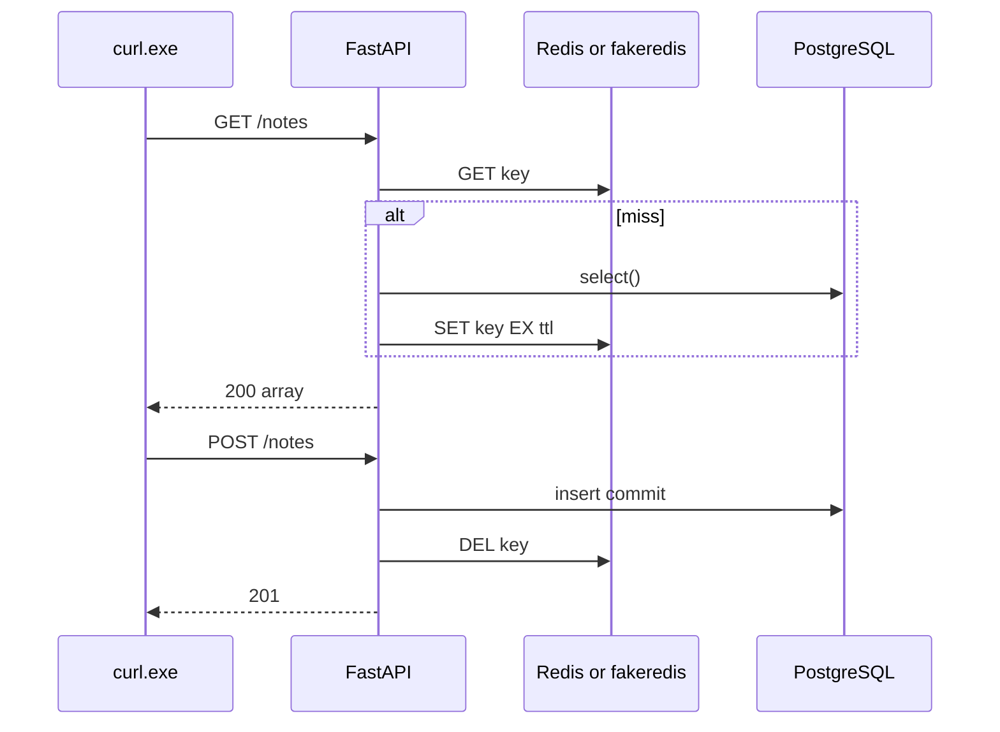

# Month 11 · Week 3 · Day 3
# From Memory: Cache GET List (TTL) and Invalidate on POST

**Program:** Full-Stack Mastery · 18 months  
**Phase:** 3 — Python and backend  
**Month index:** [../../README.md](../../README.md)  
**Week 3:** [1](day-01.md) · [2](day-02.md) · Day 3 (today) · [4](day-04.md) · [5](day-05.md) · [6](day-06.md) · [7](day-07.md)  
**Week rhythm today:** Implement from memory  
**Student state:** Day 2 gate passed. You have types, TTL, keys, invalidation order, stampede as a story. Today you **wire** GET list cache + POST delete.  
**Study time:** 3–4 focused hours  
**Prereq:** Day 2 gate passed.

Labs: `~\fullstack-lab\month-11\week-03\day-03\`. Noun: **whiteboard notes**. Do **not** copy Day 2 scripts. Do **not** paste `~/ops-api/`.

---

## How Day 3 works

Days 1–2 stay **closed** during the build. This recap is the teacher.

Allowed: this file, your notes, curl.exe, pytest later.  
Not allowed: pasting a cache middleware empire, storing notes **only** in Redis, Mongo.

Stuck **> 25 minutes**: open only the matching Day 1–2 section, close, continue. `lookups.txt`.

No complete `main.py` in this chapter.

---

## How to read this chapter

GET list: look up a key; on miss, load **system of record**, `SET` with **TTL**, return JSON. POST: write **Postgres** (or a Week-1-style DB table you create), **commit**, **DEL** the list key.



**Wrong belief:** “Memory day means Redis is the store.”  
**Correct:** Redis is the **copy**. The table is the record.

---

## Complete explanation (cache you must still own)

**SoR:** PostgreSQL. SQLAlchemy 2.x `Mapped`, `mapped_column`, `select()`, Session commit then DEL. `create_all` allowed in this **lab** if you skip Alembic to save time — write `SCHEMA.txt` “lab shortcut.” 6B still uses Alembic.

**Redis client:** `redis.Redis(decode_responses=True)` or `fakeredis.FakeRedis(decode_responses=True)`. Inject via FastAPI `Depends` so tests can swap (Day 5). If **no** Redis and **no** fakeredis: skip-run is **not** enough for Block C today — **fakeredis is required** for the HTTP lab unless you write a 15-line `InMemoryCache` **dict with ttl you do not really implement** — forbidden cop-out. Use fakeredis.

**Key:** `lab:notes:list:v1`. TTL e.g. 30 seconds. JSON string: `json.dumps([n.model_dump() for n in outs])`. Pydantic v2 **`model_dump()`**, not `.dict()`.

**GET:** if `r.get(key)`: `json.loads` and return (status 200). Else `select(Note)`, build Out list, `r.set(key, json.dumps(...), ex=30)`, return.

**POST:** validate Create model, `session.add`, `commit`, `r.delete(key)`, return 201 Out. If commit fails, **do not** pretend to invalidate.

**404** GET one is optional stretch. List + create is the exam.

**Stampede:** you need not lock. `STAMPEDE.txt` two sentences: what would happen if 100 GET misses aligned.

**Windows:** `uv`, PowerShell, `psql`, `curl.exe`. Redis: WSL/Memurai/existing Docker **or fakeredis**. Not a Docker course.

**Security:** bind `127.0.0.1`. Do not cache secrets. Do not log Redis URLs with passwords.

**Wrong belief:** “I’ll invalidate before commit to be safe.”  
**Correct:** commit first. Extra miss is fine. Stale after successful write is not.

---

## Today's contract

**Today's gate.** Closed-book:

> GET list is cached with TTL. POST writes Postgres then DELs the key. A second GET misses and sees the new row. I used model_dump. I did not make Redis the database.

---

## Time box

| Block | Minutes | Work |
|---|---|---|
| A | 20 | Oral |
| B | 40 | Paper: key, GET flow, POST flow |
| C | 90 | Build spec |
| D | 35 | curl traces |
| E | 15 | lookups |

---

# Block A — Speak

1. SoR vs cache.  
2. SET EX.  
3. commit then DEL.  
4. Key mismatch bug.  
5. `model_dump`.  
6. fakeredis vs process.

---

# Block B — Paper

`DRILLS.txt`: key name; GET pseudocode; POST pseudocode; what GET returns after POST without DEL (stale); with DEL (fresh).

---

# Block C — Spec

```powershell
cd ~\fullstack-lab
mkdir month-11\week-03\day-03 -Force
cd ~\fullstack-lab\month-11\week-03\day-03
uv init --name lab-notes-cache
uv add fastapi uvicorn sqlalchemy "psycopg[binary]" pydantic redis fakeredis
psql -U postgres -c "CREATE DATABASE month11_w3d3;"
```

| Method | Path | Rules |
|---|---|---|
| GET | `/health` | 200 |
| GET | `/notes` | 200 array. Cache key + TTL. Header `X-Cache: HIT` or `MISS` **required** so curl can see it |
| POST | `/notes` | 201. Body `{text: str}`. Persist in Postgres. Invalidate list key |

`Note` model: `id`, `text`. Out with `id`, `text`. `select()`. Session per request. Engine from `DATABASE_URL`. Redis from env `REDIS_URL` **or** fakeredis if `REDIS_URL` unset — document in `REDIS.md`.

```powershell
uv run uvicorn main:app --reload --host 127.0.0.1 --port 8000
```

Do not add Mongo. Do not FLUSHALL.

---

# Block D — Traces

`CURL.txt`:

1. GET `/notes` → MISS (or empty list miss).  
2. GET again → HIT (unless you waited past TTL).  
3. POST a note.  
4. GET → MISS then list contains the note. If HIT with **old** empty list, invalidation failed.

Windows POST:

```powershell
curl.exe -s -D - -X POST http://127.0.0.1:8000/notes -H "Content-Type: application/json" --data-binary "@body.json"
```

`body.json`: `{"text":"cache me"}`.

Header `X-Cache` on GET. If you cannot set headers, write why and print HIT/MISS in a log — prefer the header.

---

# Block E

`lookups.txt`.

```powershell
cd ~\fullstack-lab
git add month-11
git commit -m "Month 11 Week 3 Day 3: cached GET list, invalidate on POST."
```

---

# Lecture: HIT is not correctness

A HIT of a **stale** list is a **wrong** 200. Tests tomorrow will POST then GET and assert the new `text` is present. Headers are for humans today.

`json.loads` of a cache value is not Pydantic validation of **writes**. Writes still go through Create models. Cached GET may skip re-validating each field; the Out was already public. If you change Out shape, bump key `v2` or you will deserialize old JSON into the new handler and crash — catch and treat as miss.

SQLAlchemy Session: do not store ORM objects in Redis. Store JSON. After GET HIT, you never opened a Session — that is the point of the cache. After POST, you did.

---

## Definition of done

- [ ] Spoke Block A  
- [ ] Postgres persists notes  
- [ ] X-Cache HIT/MISS  
- [ ] POST then GET shows new row  
- [ ] `model_dump` not `.dict()`  
- [ ] fakeredis or Redis documented  
- [ ] Commit exists  

---

# Worked session — notes, header, invalidate

`uv init`. FastAPI + SQLAlchemy + redis/fakeredis. `Note` table. GET cache. POST commit + DEL. curl traces. `REDIS.md`. `STAMPEDE.txt`. No ops-api. Bind 127.0.0.1. `select()`.

If GET after POST is empty, you committed to another database than you selected, or you deleted the wrong key, or you returned cached JSON parsed from a previous process — `--reload` resets fakeredis **in memory** (process-local). **That is a teaching moment:** fakeredis is **not** shared across reloads. Write `RELOAD.txt`. Real Redis **would** keep the key across reload. If you need HIT across reload today, use a real process **or** do not reload between steps.

---

## Optional review links

- [redis-py set](https://redis-py.readthedocs.io/en/stable/commands.html)  
- [FastAPI response headers](https://fastapi.tiangolo.com/advanced/response-headers/)

---

## Tomorrow

**Lab:** rate-limit / counter **concept** with `INCR` + TTL — **defense/reliability** for **your** API, not an attack tool.

---

# Closing lecture — copy on read, delete on write

Miss → SQL → SET EX. Hit → JSON. POST → SQL commit → DEL.

fakeredis dies on reload. Real Redis does not. Headers show HIT/MISS. Stale HIT is a bug.

Notes are the noun. PostgreSQL is the record. `model_dump` is v2.

`lookups.txt` honesty. No Mongo. No 6B paste.

---

## Recite-back checklist

- [ ] SoR is Postgres  
- [ ] TTL on SET  
- [ ] commit then DEL  
- [ ] X-Cache header  
- [ ] key version  
- [ ] fakeredis reload caveat  
- [ ] not ops-api

If a line is mush, re-read the recap in **this** file only.

---

## Office hours (memory day)

**X-Cache always MISS.** You SET after return, or FastAPI created two redis clients, or `--reload` restarted fakeredis between curls. Hold the server still. Print the key in a debug log **without** printing payloads that might be secret — `text` is fine here.

**X-Cache always HIT empty after POST.** Wrong key on DEL, or GET builds JSON from cache before POST returns, or you GET a different path (`/note` vs `/notes`). Grep the key string. There should be **one**.

**JSON decode error on HIT.** You SET Python `str(list)` instead of `json.dumps`. Use `model_dump()` then dumps. Bump `v2` if you change Out.

**IntegrityError on POST, then empty cache.** You deleted the key **before** commit. Commit first; on failure skip DEL.

Windows: `curl.exe`, `body.json`, `$env:DATABASE_URL`. `psql -d month11_w3d3 -c "SELECT id, text FROM notes;"`. Bind 127.0.0.1. `select()` not `Query()`.

If Postgres insert works and cache never HIT, you may be reconstructing the list from SQL every time because `get` returns None — FakeRedis not shared with the app. Depends injection, same object.

---

## Predicted curl statuses

| Step | X-Cache | Body |
|---|---|---|
| GET empty first | MISS | `[]` |
| GET empty second (same process) | HIT | `[]` |
| POST valid | — | 201 + id |
| GET after POST | MISS then list with text | 200 |

If step 4 is HIT `[]`, invalidation failed. If POST is 200, `status_code=201`.

`STAMPEDE.txt` two sentences. `REDIS.md` fakeredis vs process. `RELOAD.txt` if you reloaded.

Windows: `uv run uvicorn main:app --reload --host 127.0.0.1 --port 8000` then **stop reload experiments** during the HIT sequence, or accept fakeredis reset.

Notes are the noun. No Mongo. No `Query()`. `model_dump` for the cached payload.
