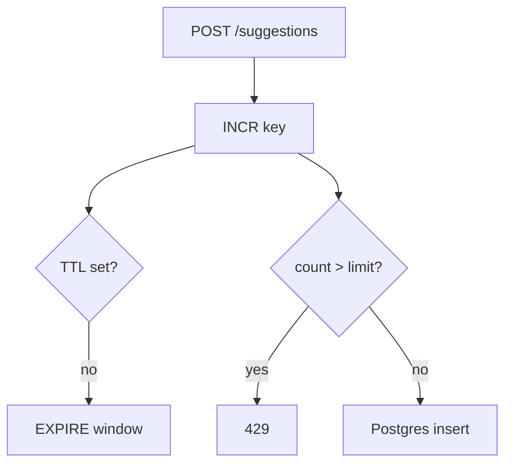

# Month 11 · Week 3 · Day 4
# Lab: INCR + TTL as a Counter / Rate-Limit Concept (Defense)

**Program:** Full-Stack Mastery · 18 months  
**Phase:** 3 — Python and backend  
**Month index:** [../../README.md](../../README.md)  
**Week 3:** [1](day-01.md) · [2](day-02.md) · [3](day-03.md) · Day 4 (today) · [5](day-05.md) · [6](day-06.md) · [7](day-07.md)  
**Week rhythm today:** Lab  
**Student state:** You can cache a GET list and invalidate on POST. Today **INCR** plus **TTL** implements a **reliability/defense** limit on **your** lab API — not a tutorial in attacking anyone else.  
**Study time:** 3–4 focused hours

Labs: `~\fullstack-lab\month-11\week-03\day-04\`. Noun: **suggestion box** POSTs. Not 6B. Not an exploit kit.

---

## How to use this textbook

1. This lab **protects your process** from accidental stampede **of writes** (a loop, a stuck client). It is **not** a course in bypassing limits on other sites.  
2. Use fakeredis if 6379 is down.  
3. Fail-open vs fail-closed: you **choose** and document.

---

## How to read this chapter

**INCR** atomically adds 1 to a string-integer key (creates at 0 then 1). **EXPIRE / TTL** on that key defines a **window**. If count **> N**, you reject with **429**.



**Wrong belief:** “Rate limiting is how I practice taking down APIs.”  
**Correct:** you are learning **defensive** load shedding and fairness for **your** service. This textbook will not teach bypasses, distributed attacks, or evasion.

**Wrong belief:** “I’ll INCR after insert so I only count successes.”  
**Correct:** then a flood of failing requests never increments. Counting **attempts** (before work) is the usual defense. Document which you count.

---

## Today's contract

By the end of this day you will be able to:

1. `INCR` a key `lab:rl:suggest:{bucket}`.  
2. Set **TTL** on first increment (`if incr == 1: expire`).  
3. Return **429** with a Retry-After-ish message when over limit.  
4. Still **insert into PostgreSQL** when allowed. Redis is **not** the suggestion store.  
5. Explain fail-open (Redis down → allow) vs fail-closed (Redis down → 503).  
6. Write why this is **not** production-grade (one box, spoofable identity, no user auth).

**Today's gate.** Closed-book:

> INCR+TTL is a windowed counter. I use it to protect my lab POST. Postgres stores the rows. I can say fail-open vs fail-closed. I did not build an attack tool.

---

## Time box

| Block | Minutes | Work |
|---|---|---|
| A | 35 | Theory |
| B | 80 | Lab: POST + INCR + 429 |
| C | 50 | Fail-open/closed + honesty notes |
| D | 15 | Git |
| E | 15 | Recall |

---

# Block A — Theory

## 1. Window

Key: `lab:rl:ip:127.0.0.1` or simpler for the lab: `lab:rl:suggest` **global** (all clients share one bucket). Global is easier to demo with curl. Per-IP is more realistic and **spoofable** without a trusted proxy — write that in `LIMITS.md`. Do **not** teach how to spoof; just say “IP is a weak identity.”

Window: 60 seconds. Limit: 5 POSTs. Numbers small so you can trip 429 with curl.

```python
key = "lab:rl:suggest"
n = r.incr(key)
if n == 1:
    r.expire(key, 60)
if n > 5:
    raise HTTPException(status_code=429, detail="slow down")
```

Race: two first requests both see `n==1` and both EXPIRE — acceptable in the lab. Production uses `SET NX EX` patterns or Redis 7 features. Mention in `LIMITS.md`; do not implement a thesis.

## 2. 429

HTTP 429 Too Many Requests. Optional `Retry-After` header (seconds). FastAPI `Response` or `HTTPException` with headers if you know how; if not, `detail` string is enough **plus** `RETRY.txt` saying you know the header exists.

## 3. Fail-open vs fail-closed

If `r.incr` raises `ConnectionError`:

- **fail-open:** log, continue to Postgres (availability).  
- **fail-closed:** `503` (protect the DB from a flood when the limiter is dead — or block users when Redis is dead).  

Lab default: **fail-open** with a log line, because fakeredis rarely raises. Still write the other choice.

Do not hide errors with `except Exception: pass`.

## 4. Not an attack tool

You will **not**:

- write a loop that hammers someone else’s host  
- document how to rotate identities to evade limits  
- load-test a URL you do not own  

You **will** trip **your** `127.0.0.1` API with six `curl.exe` POSTs.

## 5. Postgres still SoR

`Suggestion` table: `id`, `body`. `select()` for GET list (cache optional, not required). Session commit for inserts that passed the counter.

---

# Block B — Lab

```powershell
cd ~\fullstack-lab
mkdir month-11\week-03\day-04 -Force
cd ~\fullstack-lab\month-11\week-03\day-04
uv init --name lab-rl-concept
uv add fastapi uvicorn sqlalchemy "psycopg[binary]" pydantic redis fakeredis
psql -U postgres -c "CREATE DATABASE month11_w3d4;"
```

Routes: GET `/health`, POST `/suggestions` 201, GET `/suggestions` 200. Limit POST only.

```powershell
uv run uvicorn main:app --reload --host 127.0.0.1 --port 8000
```

Six POSTs with `curl.exe` and `body.json`. Expect five 201 (or fewer if you already incremented) and at least one **429**. `CURL.txt` statuses.

If fakeredis + `--reload` resets counts, **do not reload** during the six POSTs. `RELOAD.txt` again.

---

# Block C — Honesty

`LIMITS.md`: window, limit, key, identity weakness, race on expire, fail-open/closed, “not production,” “not an attack tool.”

`EXCEPT.txt`: what you do if Redis raises.

Stretch: GET list uses Day 3 cache **and** POST invalidates **and** increments. Only if POST 429 already works.

```powershell
cd ~\fullstack-lab
git add month-11
git commit -m "Month 11 Week 3 Day 4: INCR TTL limit concept on lab POST."
```

---

# Block E — Recall

1. Why INCR then EXPIRE on n==1.  
2. 429 vs 503.  
3. Why IP is weak.  
4. Why rows still go to Postgres.  
5. Why this lab is defense.

## Office hours

**All six POSTs 201.** Limit too high, key changing, reload reset fakeredis, or INCR after the handler returned. Print `n` in a header `X-Count` for the lab.

**429 on GET.** You wrapped the wrong route.

**I used a tight loop in Python against production.** Stop. Only `127.0.0.1` lab.

**`except Exception` swallowed IntegrityError.** Narrow `redis.ConnectionError`.

---

## Lecture: counters are not ledgers

INCR is good enough for “about 5 per minute.” It is not money. It is not inventory. Month 10 `NUMERIC` and transactions remain for facts that must add up.

Rate-limit **concept** ≠ API gateway. 6B may choose this, or a simpler “cache only,” or **no Redis**. Day 6 is the justification paragraph. Today is the mechanism.

Stampede of **GET** was Day 2. Stampede of **POST** is this lab’s motivation: a stuck client retrying create.

---

## Worked session — five 201, one 429

Tiny table. fakeredis or Redis. INCR+EXPIRE. POST insert. curl six times. LIMITS.md. X-Count header stretch. Bind 127.0.0.1. `model_dump` on Out. `select()` on GET. No ops-api. No evasion chapter.

Windows: `curl.exe`, `--data-binary @body.json`. Database `month11_w3d4`.

---

## Definition of done

- [ ] INCR + TTL window works  
- [ ] At least one 429 on **your** lab  
- [ ] Successful POSTs persist in Postgres  
- [ ] LIMITS.md honest  
- [ ] No attack content  
- [ ] Commit exists  

---

## Optional review links

- [Redis INCR](https://redis.io/commands/incr/)  
- [RFC 6585 429](https://www.rfc-editor.org/rfc/rfc6585#section-4)

---

## Tomorrow

**Tests** with **fakeredis** (default) and optional skipped integration against real Redis, **marked clearly**.

---

# Closing lecture — protect your door, do not pick others’

INCR counts. TTL ends the window. 429 tells **your** client to slow down. Postgres stores the suggestion.

Fail-open vs fail-closed is an availability decision. IP is a weak id. fakeredis resets on reload.

This is defense and reliability. It is not a weapon. 6B may skip Redis entirely if you cannot name a problem — Day 6.

Six curls against localhost. Then git.
