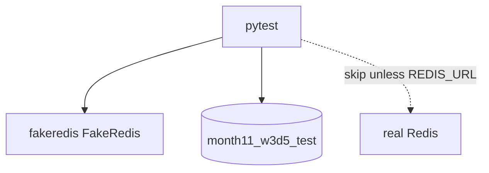

# Month 11 · Week 3 · Day 5
# Tests with fakeredis (and Clearly Marked Redis Integration)

**Program:** Full-Stack Mastery · 18 months  
**Phase:** 3 — Python and backend  
**Month index:** [../../README.md](../../README.md)  
**Week 3:** [1](day-01.md) · [2](day-02.md) · [3](day-03.md) · [4](day-04.md) · Day 5 (today) · [6](day-06.md) · [7](day-07.md)  
**Week rhythm today:** Tests and docs  
**Student state:** You have cache invalidation and an INCR window. Today **pytest** proves them with **fakeredis**, and any real-Redis test is **skipped and marked** so CI without 6379 still means something.  
**Study time:** 3–4 focused hours

Labs: `~\fullstack-lab\month-11\week-03\day-05\`. Thin **announcements** resource (id, message) + cache and/or INCR. Type a small app; do not import Day 4 as a broken package if paths hurt.

---

## How to use this textbook

1. Default tests: **fakeredis**. Always run on Windows with `uv run pytest -q`.  
2. Real Redis tests: `pytest.mark.integration` and **skip** unless `REDIS_URL` is set.  
3. Postgres test DB still exists for the SoR. Redis tests that mock away SQLAlchemy entirely do not prove invalidation-after-commit.

---

## How to read this chapter

You have **two** external systems. Tests must not require both to be production. **fakeredis** stands in for Redis. **TEST_DATABASE_URL** + rollback (or migrate) stands in for Postgres. A third test class talks to 6379 **only when asked**.



**Wrong belief:** “I’ll skip all Redis tests if 6379 is down, including fakeredis.”  
**Correct:** fakeredis tests **must run**. They are the regression net for HIT/MISS and 429.

**Wrong belief:** “I’ll mock `r.get` to return whatever.”  
**Correct:** then you never test INCR+TTL. Use a **real FakeRedis instance**.

---

## Today's contract

By the end of this day you will be able to:

1. Inject Redis via `Depends` / `app.state` so tests pass FakeRedis.  
2. Fixture that **flushes fakeredis** between tests (`flushall` on the fake is OK; not on shared prod).  
3. Test: GET miss then hit; POST invalidates.  
4. Test: sixth POST 429 (if you include the counter).  
5. One `@pytest.mark.integration` test skipped by default with a reason string.  
6. `TESTS.md` explains the skip.

**Today's gate.** Closed-book:

> fakeredis tests always run. Integration against 6379 is marked and skipped unless REDIS_URL is set. I still persist rows in a test Postgres. I did not mock away INCR.

---

## Time box

| Block | Minutes | Work |
|---|---|---|
| A | 40 | Theory |
| B | 70 | Fixtures + cache tests |
| C | 55 | 429 tests + skipped integration |
| D | 15 | Git |
| E | 15 | Recall |

---

# Block A — Theory

## 1. Dependency override

```python
def get_redis() -> redis.Redis:
    return app_redis  # production

# test
app.dependency_overrides[get_redis] = lambda: fake
```

If the handler imports a **module global** `r` and never Depends, tests cannot swap cleanly. Fix the app to Depends. That is part of the day.

## 2. fakeredis fixture

```python
import fakeredis
import pytest

@pytest.fixture
def fake_redis():
    r = fakeredis.FakeRedis(decode_responses=True)
    yield r
    r.flushall()
```

Function-scoped. Do not share a dirty fake across tests.

## 3. Combined with Postgres

Week 1–2 fixtures: test engine, rollback session, override `get_session`. Today **also** override `get_redis`. `create_all` allowed in this lab if you did not bring Alembic; `TESTS.md` says so. 6B should migrate.

Order in a test: flush redis, insert via HTTP or session, GET, assert `X-Cache`.

## 4. Skipped integration

```python
import os
import pytest

pytestmark = pytest.mark.integration

@pytest.mark.skipif(not os.environ.get("REDIS_URL"), reason="REDIS_URL not set; real Redis integration skipped")
def test_real_ping() -> None:
    r = redis.Redis.from_url(os.environ["REDIS_URL"], decode_responses=True)
    assert r.ping() is True
```

Register the marker in `pytest.ini`:

```ini
[pytest]
markers =
    integration: needs real Redis (6379). skipped unless REDIS_URL is set
```

CI without Redis stays green. You **explain** Redis in `TESTS.md` even when skipped — types, TTL, SoR.

**Wrong belief:** “Skipped tests mean I can skip the explanation.”  
**Correct:** the month gate asks you to **name** Redis. `EXPLAIN-REDIS.md` in this folder: 10–15 lines.

## 5. What to assert

| Test | Assert |
|---|---|
| empty GET | 200, `X-Cache: MISS` |
| second GET | `HIT` (same process, no reload) |
| POST then GET | new message present; MISS then list includes it |
| sixth POST | 429 if limiter on |
| skip integration | skip reason visible in `pytest -q` when REDIS_URL unset |

Do not `assert True`. Do not `.json()` on 204 if you add delete.

Pydantic: `model_dump` if comparing.

---

# Block B — Type-along

```powershell
cd ~\fullstack-lab
mkdir month-11\week-03\day-05 -Force
cd ~\fullstack-lab\month-11\week-03\day-05
uv init --name lab-redis-tests
uv add fastapi uvicorn sqlalchemy "psycopg[binary]" pydantic redis fakeredis
uv add --dev pytest httpx
psql -U postgres -c "CREATE DATABASE month11_w3d5_test;"
```

Minimal app: announcements list+POST, cache, optional INCR limit **high enough** that cache tests do not 429 (or disable limiter when `X-Test` — prefer **high limit** in tests via dependency that returns a FakeRedis **and** a limit setting of 100, limiter 5 in prod settings). Cleanest: `get_settings().rate_limit = 100` in tests.

`uv run pytest -q`

---

# Block C — Independent

1. `test_sixth_post_429` with limit 5 injected.  
2. `test_real_redis_ping` skipped without URL. Run `uv run pytest -q -m integration` and capture skip in `SKIP.txt`.  
3. `EXPLAIN-REDIS.md` even if all real tests skipped.  
4. Isolation: two tests both expect empty cache at start — flushall on fake.

Do not point limiter tests at a shared Memurai full of keys — fakeredis only for those.

```powershell
cd ~\fullstack-lab
git add month-11
git commit -m "Month 11 Week 3 Day 5: fakeredis tests and skipped Redis integration."
```

---

# Block E — Recall

1. Why mock `get` is weaker than FakeRedis.  
2. Why flush the fake.  
3. skipif REDIS_URL.  
4. Why Postgres still in the cache test.  
5. Why `--reload` and pytest are different processes.

## Office hours

**HIT never happens in TestClient.** You created two FakeRedis instances. Override must return the **same** fixture object the test inspects.

**pytest hangs on real Redis.** Connection timeout. Skip unless URL set; set `socket_connect_timeout`.

**429 flakes.** Limit shared on a **real** Redis without a test prefix. Use fakeredis or a key prefix `test:`.

**Windows:** `uv run pytest -q`. Markers need pytest.ini.

---

## Lecture: skip is not silence

A skipped integration test is honest. No tests at all is not. fakeredis is the **default proof**. Real Redis is the **optional** confirmation of the protocol.

6B CI should run fakeredis tests always. Optional job for 6379.

Invalidate tests must POST through HTTP so commit+DEL both run. A unit test that only calls `r.delete` does not prove the handler.

---

## Worked session — fake always, real skip

App with Depends get_redis. FakeRedis fixture flushall. TestClient cache HIT/MISS and invalidate. 429 with injected limit. integration skip. EXPLAIN-REDIS.md. TEST_DATABASE_URL. No ops-api. `model_dump`. `select()`.

`uv run pytest -q` green without 6379.

---

## Definition of done

- [ ] pytest green with fakeredis  
- [ ] cache invalidate asserted  
- [ ] 429 asserted **or** documented omission  
- [ ] integration test skipped clearly  
- [ ] EXPLAIN-REDIS.md  
- [ ] Commit exists  

---

## Optional review links

- [pytest skipif](https://docs.pytest.org/en/stable/how-to/skipping.html)  
- [fakeredis](https://fakeredis.readthedocs.io/)

---

## Tomorrow

**Independent:** one **justified** Redis use in 6B, written in **`ARCHITECTURE.md`**. Code optional; the **paragraph** is required. “We skip Redis” is allowed if the paragraph is honest.

---

# Closing lecture — doubles for Redis, truth for SQL

FakeRedis is a double. Postgres test DB is still SQL. Skip marks the real server. EXPLAIN-REDIS.md is the gate language.

Do not mock INCR. Do not flush a shared production Redis from pytest. Prefix keys. Depends for injection.

Windows labs stay green with fakeredis. That is the point of Day 1’s no-Redis path, completed as tests.

---

## Recite-back checklist

Write `RECITE.txt`.

- [ ] FakeRedis fixture flushed between tests  
- [ ] Depends override uses the **same** instance  
- [ ] cache HIT/MISS or invalidate asserted  
- [ ] 429 tested or omission documented  
- [ ] integration skipif REDIS_URL  
- [ ] pytest.ini marker registered  
- [ ] EXPLAIN-REDIS.md exists  
- [ ] Postgres still in the SoR tests  

**pytest.ini** lives next to the uv project. If markers warn `Unknown pytest.mark.integration`, you did not register it. Warnings are noise until CI `-W error`.

**TestClient and fakeredis:** do not start Uvicorn. In-process ASGI. Reload is not running. HIT can happen.

**Clear overrides** after the client fixture. Month 9 still applies.

Windows: `uv run pytest -q` without 6379 must be green. `uv run pytest -q -m integration` should skip, not fail, when REDIS_URL is unset. Paste skip in SKIP.txt.

Do not `flushall` a shared Memurai from a test that forgot the fake. Guard: if `REDIS_URL` is set in the shell, cache tests still use FakeRedis unless marked integration.

---

## Minimum test names

- `test_health`  
- `test_get_list_miss_then_hit`  
- `test_post_invalidates_list`  
- `test_sixth_post_429` (or skip with reason in TESTS.md)  
- `test_real_redis_ping` skipif  

`uv run pytest -q` **without** REDIS_URL is green. That is the Windows contract.

EXPLAIN-REDIS.md: string, TTL, SoR, invalidation, INCR defense — even if 6379 never ran.

Do not mock `incr` to return 1 always. FakeRedis is the double.

`select()` for SQL. `model_dump` if comparing JSON. No `Query()`. No ops-api. Announcements are the noun.
