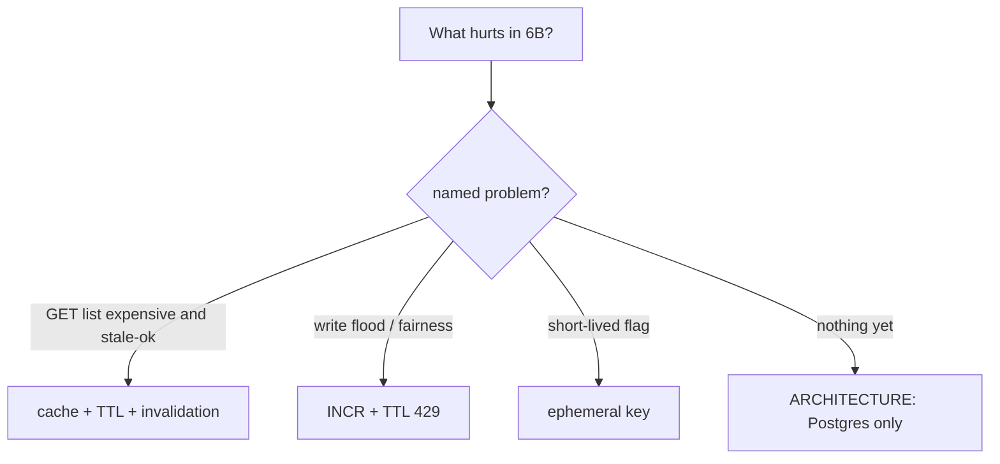

# Month 11 · Week 3 · Day 6
# Independent: One Justified Redis Use in 6B (ARCHITECTURE.md)

**Program:** Full-Stack Mastery · 18 months  
**Phase:** 3 — Python and backend  
**Month index:** [../../README.md](../../README.md)  
**Week 3:** [1](day-01.md) · [2](day-02.md) · [3](day-03.md) · [4](day-04.md) · [5](day-05.md) · Day 6 (today) · [7](day-07.md)  
**Week rhythm today:** Independent implementation  
**Student state:** You can cache, invalidate, INCR a window, and test with fakeredis. Today **your** 6B either **gains one Redis use** or **explicitly declines** — in writing.  
**Study time:** 3–4 focused hours

Work in **`~/ops-api/`**. Notes in `~\fullstack-lab\month-11\week-03\day-06\`. This textbook will **not** paste ops-api source. **“No Redis” is allowed** if the architecture paragraph is honest.

---

## How to use this textbook

1. **ARCHITECTURE.md** (or a `docs/redis.md` linked from it) is the deliverable. Code without the paragraph fails. Code is optional if you decline Redis.  
2. Do not add Mongo to 6B.  
3. Do not use Redis as system of record.  
4. Optional review links are for later rechecking.

---

## How to read this chapter

Project 6 Stage C says: choose **at least one** of cache, rate limit, or shared ephemeral state — **or** you write why none yet, with a date to revisit. The month gate asks you to **name why Redis exists in your 6B**. A named **absence** counts if it is not laziness.



**Wrong belief:** “I’ll SET the whole database in Redis so the résumé has Redis.”  
**Correct:** that fails the SoR rule and the gate.

**Wrong belief:** “Independent day means I must finish production rate limiting.”  
**Correct:** a **justified** design plus a **small** spike (even in fullstack-lab) beats an unjustified cluster.

---

## Today's contract

By the end of this day you will be able to:

1. Write **ARCHITECTURE.md** section **Redis** with: problem, key shape, TTL, invalidation or window, fail-open/closed, SoR sentence.  
2. If implementing: one code path in **your** app **or** a spike folder — not a tutorial dump.  
3. If not implementing: tests still document fakeredis intent **or** explicitly “no Redis client in 6B yet.”  
4. `.env.example` `REDIS_URL` placeholder **or** a sentence that it is omitted on purpose.  
5. Never store passwords in cache values you log.

**Today's gate.** Closed-book:

> I can point at ARCHITECTURE.md and say what Redis does in 6B, or that it does nothing yet and why. PostgreSQL remains the record. I did not paste a cache framework I cannot explain.

---

## Time box

| Block | Minutes | Work |
|---|---|---|
| A | 25 | Choose the problem (or decline) |
| B | 40 | Write ARCHITECTURE.md Redis section |
| C | 90 | Small implementation **or** spike + tests sketch |
| D | 30 | env example + honesty pass |
| E | 15 | Recall |

---

# Block A — Choose

Write `~\fullstack-lab\month-11\week-03\day-06\CHOICE.md` **before** coding:

1. Which 6B endpoint or job is slow / stampede-prone / flood-prone / ephemeral?  
2. What is the worst case if Redis is empty?  
3. Cache vs INCR vs ephemeral vs **none**.  

If you cannot name (1), choose **none** and spend Block C improving **Postgres** (index you already justified in Month 10) plus the architecture paragraph. That is a **valid** 6B.

Forbidden: Redis because Mongo is next week. Forbidden: Redis as session store of record for users you already have in SQL.

---

# Complete explanation (keep open)

**Cache:** key `ops:resource:list:v1`, TTL, DEL after commit of writes that change the list. Stampede: jitter or accept. Header optional.

**INCR limit:** key `ops:rl:{route}:{id}`, window, 429, fail-open/closed, weak identity. Defense of **your** API.

**Ephemeral:** password-reset token **if** you already have that feature — many 6Bs do not. Do not invent auth theater. A `job:status:{id}` is enough **if** you have a job. Otherwise skip.

**SQLAlchemy:** still `select()`. Session commit **before** DEL. Pydantic `model_dump` for JSON cache payloads.

**Tests:** fakeredis default; integration skipped without REDIS_URL.

**Windows:** WSL/Memurai/existing Docker/fakeredis. Not Month 15.

**Alembic:** Redis has no migrations. Schema changes still Alembic.

---

# Block B — ARCHITECTURE.md

Minimum headings (you may merge into an existing architecture file):

```markdown
## Redis

- Decision: use / not use
- Problem (one paragraph)
- Key names
- TTL / window
- Invalidation or INCR policy
- Failure mode (open/closed)
- System of record (Postgres)
- How to run locally (fakeredis tests vs process)
- What we will not put in Redis
```

Fill with **your** resource names. This textbook does not name them.

---

# Block C — Implement or spike

**If use:** one handler or middleware-sized function. Depends injection. `.env.example` `REDIS_URL=redis://127.0.0.1:6379/0`. fakeredis tests for the one behavior.

**If not use:** no client required. ARCHITECTURE.md still has “What would make us add it later” (three bullets). Block C time goes to a **migration/test gap** from Week 2 you still owe — say which in PROGRESS.md.

Do not add a second database vendor.

---

# Block D — Honesty pass

Read ARCHITECTURE.md aloud. If a sentence could apply to any app, rewrite with **your** endpoint.

`PROGRESS.md`: wired or design-only.

---

# Block E — Recall

1. SoR.  
2. Your key or why none.  
3. Invalidation vs TTL-only.  
4. fakeredis in CI.  
5. Why FLUSHALL is not a strategy.

## Quality bar

Too thin: “We use Redis for caching.”  
Enough: names the GET, the key, 30s TTL, DEL on POST/PATCH/DELETE of that resource, fail-open, Postgres truth.

**Forbidden rescue:** copy Day 3 notes API into ops-api as the product.

---

## Predicted failures

| Symptom | Cause |
|---|---|
| Cache never invalidates | wrong key / DEL before failed commit |
| 6B stores users only in Redis | SoR violation |
| ARCHITECTURE copied from a blog | no endpoint names |

Commit in ops-api when you have the file. Lab CHOICE.md in fullstack-lab.

---

## Definition of done

- [ ] CHOICE.md  
- [ ] ARCHITECTURE.md Redis section is specific  
- [ ] Implementation **or** explicit decline + later triggers  
- [ ] No secrets in git  
- [ ] SoR sentence present  
- [ ] Not a tutorial paste  

---

## Optional review links

Project 6 Stage C **Redis** heading in `full_stack_project_requirements_2026/project_06_production_style_backend_system.md`. Week 3 Days 1–5 of this textbook.

---

## Tomorrow

**Week review: cache invalidation** — synthesis, mini-build in fullstack-lab, debug, retro. Week 4 is logging and config, not Mongo-in-6B.

---

# Closing lecture — name the problem or name the absence

Redis is optional. Architecture is not. The gate will ask you **why**. “It was on the stack list” is a fail.

If you cache, you invalidate. If you INCR, you 429 your **own** door. If you skip, Postgres and Alembic still carry 6B.

This file does not contain your keys. Write yours.

fakeredis keeps tests honest on Windows. A process is for production-shaped deploys you do not have to finish today.
