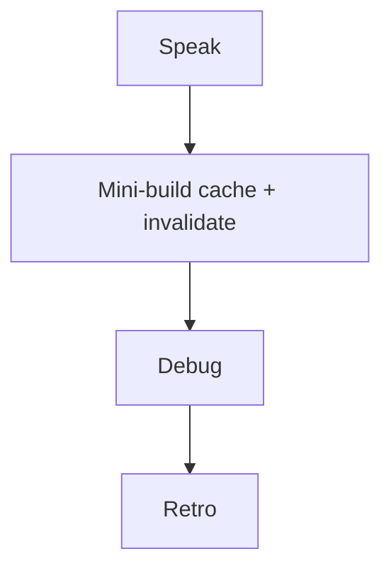

# Month 11 · Week 3 · Day 7
# Week Review — Cache Invalidation

**Program:** Full-Stack Mastery · 18 months  
**Phase:** 3 — Python and backend  
**Month index:** [../../README.md](../../README.md)  
**Week 3:** [1](day-01.md) · [2](day-02.md) · [3](day-03.md) · [4](day-04.md) · [5](day-05.md) · [6](day-06.md) · Day 7 (today)  
**Week rhythm today:** Review, repair, plan Week 4  
**Student state:** You used Redis as a tool (or declined in ARCHITECTURE.md). Today **invalidation** and the SoR rule must still live in your head — from **this file**.  
**Study time:** 3–4 focused hours

Do not start Week 4 because the calendar moved. Logging on a cache you cannot explain is two problems.

Work in `~\fullstack-lab\month-11\week-03\day-07\`. Not inside `~/ops-api/`.

---

## How to read this chapter

Closed-book teaching day. The synthesis **is** the Week 3 lesson.



Days 1–6 closed during mini-build. Repair from **this** recap.

---

## Week synthesis (the lesson, in this book)

**PostgreSQL is the system of record.** Redis is optional: **cache**, **counter**, **ephemeral**. Losing Redis must not lose business rows.

**Types:** string (SET/GET/INCR), hash, list, set, zset. This week used **strings**. JSON in a string is still a copy.

**TTL** bounds staleness. **Keys** are names you design (`app:resource:v1`). Include filter params. Do not put secrets in keys. `KEYS *` is not invalidation. `FLUSHALL` is not a strategy.

**Invalidation:** after **successful commit** of a write, **DEL** (or version bump) keys that contain that data. TTL-only means stale until expiry. **Key mismatch** (DEL `a`, GET `a:v1`) is the classic bug.

**Stampede:** many misses at once; Postgres spike. Jitter, lock, singleflight — know the story; a toy lock is optional.

**INCR + TTL:** windowed counter for **defense** of **your** POST. **429**. Fail-open vs fail-closed. Weak identity (IP). Not an attack tool. Not a money ledger.

**Tests:** **fakeredis always**. Real Redis `@pytest.mark.integration` **skipif** no `REDIS_URL`. Explain Redis even when skipped. Depends injection. Flush fake between tests.

**Windows:** WSL redis-server, Memurai, Docker **if already installed**, else fakeredis. Not Month 15.

**6B:** ARCHITECTURE.md names use or absence. This course never pastes ops-api.

**SQLAlchemy still:** `select()`, Session, `model_dump` for cached JSON. No `Query()`, no `.dict()`.

**Wrong belief:** “HIT means correct.”  
**Correct:** HIT of stale JSON is a **wrong** 200.

**Wrong belief:** “fakeredis is cheating.”  
**Correct:** it is the **default double**. Reload **resets** it; real Redis does not.

The sections below unpack that for the mini-build.

---

## Today's contract

**Today's gate.** Closed-book:

> I can explain SoR, TTL, keys, commit-then-DEL, stampede, INCR 429, fakeredis vs skip, and I built a tiny cached list with POST invalidation from this spec.

---

## Time box

| Block | Minutes | Work |
|---|---|---|
| 1 | 40 | Speak + exam-01.md |
| 2 | 55 | Mini-build `quotes` |
| 3 | 30 | Debug A–E |
| 4 | 20 | Review 6B ARCHITECTURE Redis section |
| 5 | 20 | pytest fakeredis |
| 6 | 20 | Design: fail-open vs closed |
| 7 | 20 | Retro + Week 4 |

---

# Complete explanation — invalidation you must still own

GET list: GET key → HIT return; MISS `select()` → SET EX → return. Header `X-Cache` helps exams.

POST: validate → Session add → **commit** → **DEL** → 201.

Sixth POST in a window: INCR, EXPIRE on 1, 429 if over — **optional** in mini if cache is solid; include if time.

Do not store ORM instances in Redis. JSON strings only.

---

# Block 1 — Speak

SoR; types; TTL; keys; invalidation order; mismatch; stampede; INCR defense; fakeredis reload; skip marker.

`exam-01.md` 15–25 lines.

---

# Block 2 — Mini-build

```powershell
cd ~\fullstack-lab
mkdir month-11\week-03\day-07\mini -Force
cd ~\fullstack-lab\month-11\week-03\day-07\mini
uv init --name lab-quotes-cache
uv add fastapi uvicorn sqlalchemy "psycopg[binary]" pydantic redis fakeredis
uv add --dev pytest httpx
psql -U postgres -c "CREATE DATABASE month11_w3d7;"
```

**Quotes** (`id`, `body`): GET `/quotes` cached; POST `/quotes` 201 invalidates. `X-Cache`. fakeredis if no REDIS_URL. `select()`. Bind 127.0.0.1.

Tests: miss/hit; post then list contains body. Fixture FakeRedis **same instance**.

No Mongo. No ops-api. No `Query()`.

```powershell
uv run uvicorn main:app --reload --host 127.0.0.1 --port 8000
curl.exe -s -D - http://127.0.0.1:8000/quotes
```

Reload resets fakeredis — `RELOAD.txt` one line if you notice.

---

# Block 3 — Debug

`exam-03-debug.md`

**A.** POST 201, GET HIT empty list.  
**B.** Developer FLUSHALL in the handler to “be sure.”  
**C.** Tests mock `get` to always miss; production never invalidates and nobody knows.  
**D.** Rate-limit lab used to hammer a public API.  
**E.** 6B SET `user:{id}` as only copy of email.

---

# Block 4 — Review 6B

ARCHITECTURE.md Redis section only. Gap → `exam-04-6b.md`. Else `MATCH.txt`.

---

# Block 5 — pytest

`uv run pytest -q` mini. Break invalidate test; restore.

---

# Block 6 — Design

`design.md`: 10 lines fail-open vs fail-closed for **your** 6B choice (even if Redis absent: write hypothetically).

---

# Block 7 — Retro

`retro.md`: stale HIT vs 429 vs skip tests; Week 4 logging question.

## Debug keys (after you write)

**A.** Wrong key or DEL before commit failed or HIT served pre-POST JSON. Commit then DEL; same key.

**B.** FLUSHALL deletes unrelated keys. DEL the names you own.

**C.** Use FakeRedis; assert POST then GET body.

**D.** Stop. Defense of localhost only. This course does not teach attacks.

**E.** SoR violation. Email in Postgres.

If you wrote “Redis bug,” rewrite.

---

```powershell
cd ~\fullstack-lab
git add month-11
git commit -m "Month 11 Week 3 review: quotes cache invalidation mini."
```

---

# Lecture: invalidation is the cache’s honesty

TTL is a backstop. DEL is the **write path’s** honesty. Architecture is the **name** of the keys. Tests are how DEL stays wired when someone refactors POST.

fakeredis is not a production cluster. It is how Windows CI stays green. Explain real Redis anyway.

Week 4 will log request ids. A stale cache will look like “the API is haunted.” Logs without invalidation literacy waste your week.

---

## Definition of done

- [ ] exam-01.md  
- [ ] Mini GET cache + POST DEL  
- [ ] Debug A–E  
- [ ] 6B architecture note  
- [ ] pytest fakeredis  
- [ ] Retro  

---

# Worked session — quotes mini

uv init. Quote model. GET cache X-Cache. POST commit DEL. TestClient + FakeRedis. Debug A–E. design.md. retro.md Week 4.

`curl.exe`, `127.0.0.1`, `month11_w3d7`. `model_dump`. Not ops-api.

If HIT after POST, fix the key. If fakeredis empty after reload, that is expected.

---

## Optional review links

Repair from this synthesis first.

- [Redis SET](https://redis.io/commands/set/)  
- [HTTP 429](https://developer.mozilla.org/en-US/docs/Web/HTTP/Status/429)

---

## Next week

[Week 4 Day 1 — Structured logging and request ids](../week-04/day-01.md). Then config, health, timeouts, idempotency, a **separate** Mongo exercise, 6B checklist, exam.

---

# Closing lecture — copies lie until you delete them

SoR is Postgres. Redis is a copy, a count, or a short-lived flag. Invalidation is DEL after commit. Stampede is N misses. INCR is defense. fakeredis always; real Redis skipif.

Mini is quotes. 6B is your paragraph. No attack labs. No Mongo in the app.

Write A–E in sentences. Retro names logging, not a third database.

---

## Recite-back checklist

- [ ] SoR is Postgres  
- [ ] TTL + DEL  
- [ ] commit then DEL  
- [ ] key mismatch is a bug  
- [ ] INCR 429 is defense  
- [ ] fakeredis default  
- [ ] FLUSHALL is not invalidation  
- [ ] mini not in ops-api

Do not start Week 4 until the mini invalidates and A–E are sentences.
